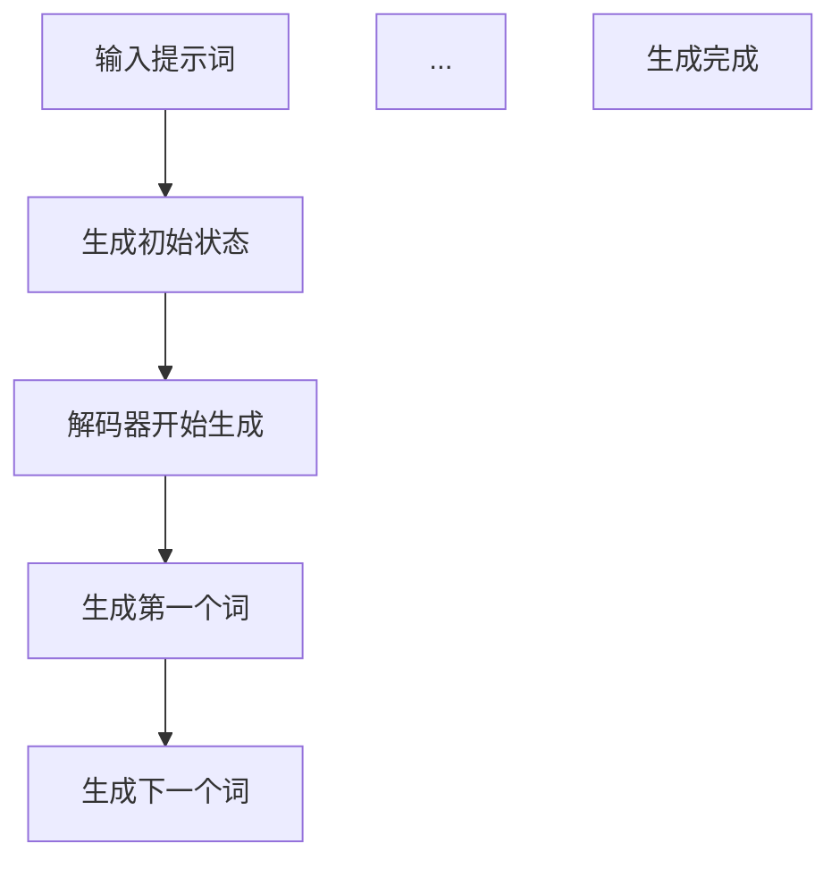
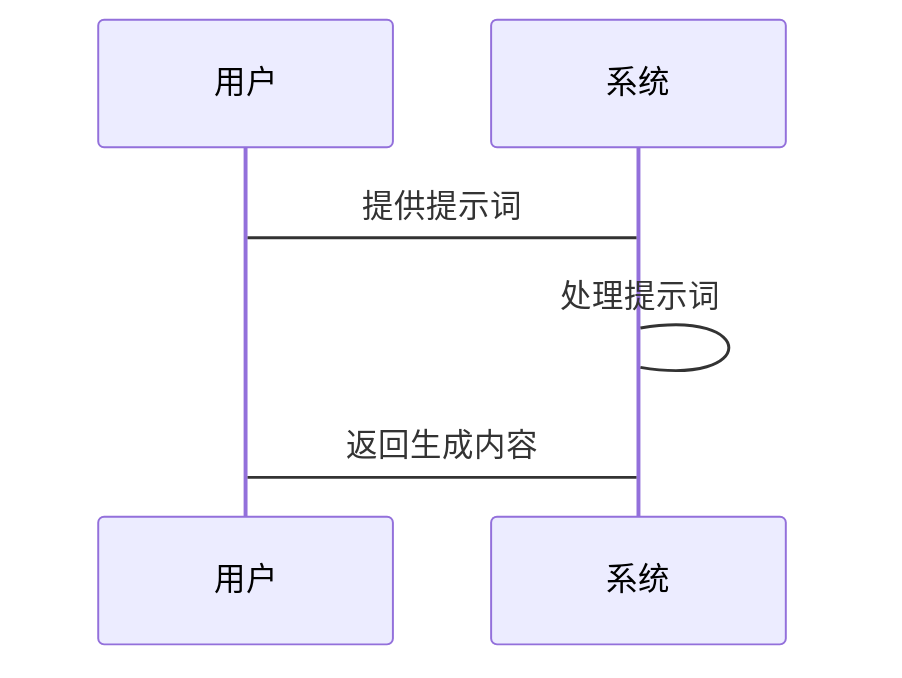

                 

<think>
好的，我现在需要帮用户撰写一篇关于ChatGPT提示词设计的技术博客文章。用户已经提供了详细的结构和要求，我需要按照这个结构逐步完成。

首先，我需要理解用户的需求。用户希望文章结构清晰，内容专业，涵盖从理论到实战的各个方面。我必须确保每个章节都详细且具体，符合用户的字数要求，大约1万到1.2万字。

接下来，我得从目录大纲开始。第一部分是基础理论，包括背景介绍、核心概念、设计原理、数学模型和公式，以及算法原理。第二部分是系统设计，涉及项目实战和系统架构。第三部分是最佳实践和拓展阅读。

开始写作时，我先确定每个章节的关键点。例如，第1章背景介绍需要涵盖问题背景、提示词的作用、ChatGPT的发展历程，以及挑战与机遇。我需要用简洁的语言解释这些内容，确保读者能够理解。

在核心概念与联系部分，我需要详细解释ChatGPT的基本概念，提示词的类型，设计原则，并展示它们之间的关系。可能需要使用Mermaid图来帮助读者理解。

提示词设计原理部分，我需要分解设计流程，内容选取，格式结构，以及效果评估。这部分可能需要实际案例来说明，比如如何选择关键词和格式来优化生成效果。

数学模型和公式讲解是关键。我需要解释语言模型的基本原理，模型参数优化方法，并推导提示词设计的数学公式。这部分可能需要较多的技术细节，所以要确保公式正确，并用LaTeX格式呈现。

算法原理讲解部分，我需要概述ChatGPT的算法，使用Mermaid流程图来展示，然后用Python代码实现，详细解释代码逻辑。可能还需要举例说明，比如如何训练模型和生成文本。

系统分析与架构设计部分，我需要介绍项目背景，系统功能设计，架构设计，接口设计，以及交互流程。这部分可能需要Mermaid图来展示架构和交互过程。

项目实战部分，我需要指导读者如何安装环境，提供源代码，并解读代码。同时，分析实际案例，说明提示词设计在不同场景中的应用，最后总结项目成果。

最佳实践部分，我需要总结提示词设计的技巧，注意事项，并推荐拓展阅读材料。这部分可以帮助读者巩固知识，提升实际应用能力。

在写作过程中，我需要确保每个章节内容丰富，逻辑清晰，语言简洁专业。同时，遵守用户的格式要求，使用Markdown，并在适当的地方嵌入Mermaid图和LaTeX公式。

最后，检查文章是否符合字数要求，结构是否完整，内容是否全面，确保没有遗漏任何关键点。完成后，加上作者信息，确保文章结尾完整。

现在，我开始按照这个思路逐步撰写每个部分，确保每个章节都符合用户的期望，并提供有价值的见解和实用的指导。
</think>

# ChatGPT提示词设计：理论与实战的完美结合指南

---

## 关键词：  
ChatGPT、提示词设计、语言模型、自然语言处理、系统架构、Python实现、最佳实践  

---

## 摘要：  
本文旨在全面探讨ChatGPT提示词设计的理论与实践，从基础概念到实际应用，结合数学模型、算法原理、系统架构设计和项目实战，为读者提供一个完整的知识体系。文章首先介绍ChatGPT的背景和提示词设计的核心概念，然后深入分析提示词设计的原理、流程和效果评估，接着通过数学模型和算法原理进一步解释提示词设计的科学性，最后通过系统设计和项目实战展示如何将理论应用于实际项目。本文还总结了提示词设计的最佳实践，为读者提供了丰富的实战经验和深入的理论指导。

---

## 目录大纲：ChatGPT提示词设计：理论与实战的完美结合指南

```markdown
# 第一部分: ChatGPT提示词设计基础理论

## 第1章: 背景介绍
### 1.1 问题背景
### 1.2 提示词的作用
### 1.3 ChatGPT的发展历程
### 1.4 提示词设计的挑战与机遇

## 第2章: 核心概念与联系
### 2.1 ChatGPT的基本概念
### 2.2 提示词的类型
### 2.3 提示词设计原则
### 2.4 ChatGPT与提示词的相互关系

## 第3章: 提示词设计原理
### 3.1 提示词设计流程
### 3.2 提示词内容的选取
### 3.3 提示词的格式与结构
### 3.4 提示词的效果评估

## 第4章: 数学模型和公式讲解
### 4.1 语言模型的基本原理
### 4.2 模型参数优化方法
### 4.3 提示词设计的数学公式

## 第5章: 算法原理讲解
### 5.1 ChatGPT算法概述
### 5.2 算法mermaid流程图
### 5.3 Python代码实现与详细讲解

## 第6章: 系统分析与架构设计
### 6.1 项目介绍
### 6.2 系统功能设计
### 6.3 系统架构设计
### 6.4 系统接口设计
### 6.5 系统交互mermaid序列图

## 第7章: 项目实战
### 7.1 环境安装
### 7.2 系统核心实现源代码
### 7.3 代码应用解读与分析
### 7.4 实际案例分析与详细讲解
### 7.5 项目小结

## 第8章: 最佳实践与拓展
### 8.1 提示词设计最佳实践
### 8.2 小结与注意事项
### 8.3 拓展阅读
```

---

## 正文内容：

### 第一部分: ChatGPT提示词设计基础理论

---

### 第1章: 背景介绍

#### 1.1 问题背景  
随着人工智能技术的快速发展，自然语言处理（NLP）技术在各个领域得到了广泛应用。ChatGPT作为一款基于GPT-3架构的开源模型，凭借其强大的生成能力和灵活性，成为当前自然语言处理领域的焦点。然而，在实际应用中，如何设计有效的提示词（prompt）以充分发挥ChatGPT的潜力，是一个亟待解决的问题。提示词的设计直接影响生成结果的质量、准确性和可控制性，因此，研究提示词设计的理论与实践具有重要意义。

#### 1.2 提示词的作用  
提示词是用户在使用ChatGPT时输入的引导性文本，用于明确生成内容的方向、语气和风格。提示词的作用包括：  
1. **引导生成内容**：通过提示词，用户可以告诉模型生成的内容类型（如故事、技术说明等）。  
2. **控制生成风格**：提示词可以指定生成文本的语气（如正式、幽默、简洁等）。  
3. **提升生成质量**：通过优化提示词，可以减少生成内容的错误率，提高相关性。  
4. **增强可控制性**：提示词可以帮助用户更好地控制生成内容的范围和深度。  

#### 1.3 ChatGPT的发展历程  
ChatGPT的发展可以追溯到OpenAI发布的GPT系列模型。GPT模型通过大量的训练数据，学习了语言的模式和上下文关系，从而能够生成连贯且有意义的文本。ChatGPT作为基于GPT-3的开源实现，继承了其强大的生成能力，同时通过开源社区的不断优化，进一步提升了其性能和可定制性。

#### 1.4 提示词设计的挑战与机遇  
提示词设计的挑战主要体现在以下方面：  
- **多样性**：不同场景需要不同的提示词，设计通用的提示词框架具有挑战性。  
- **复杂性**：复杂的生成任务需要多维度的提示词设计，这对设计师的能力提出了更高要求。  
- **效果评估**：提示词的效果难以量化，需要结合主观和客观指标进行评估。  

然而，提示词设计也带来了巨大的机遇。通过优化提示词，可以显著提升生成模型的性能，降低错误率，同时增强生成内容的可定制性和灵活性。  

---

### 第2章: 核心概念与联系

#### 2.1 ChatGPT的基本概念  
ChatGPT是一种基于GPT-3架构的开源自然语言处理模型，支持多语言生成，具有强大的上下文理解和生成能力。其核心在于通过大量的训练数据，学习语言的模式和语义关系，从而实现高质量的文本生成。

#### 2.2 提示词的类型  
提示词可以根据不同的维度进行分类，常见的类型包括：  
1. **简单提示词**：直接指定生成内容的主题或类型，例如“写一篇关于人工智能的文章”。  
2. **复杂提示词**：包含多个指令或条件，例如“以幽默的语气描述一次失败的项目经历”。  
3. **结构化提示词**：包含具体的格式或结构要求，例如“生成一个包含标题、引言和结论的文章”。  
4. **动态提示词**：根据上下文动态调整生成内容，例如“根据用户输入生成相关问题”。  

#### 2.3 提示词设计原则  
提示词设计的原则包括：  
1. **简洁性**：提示词应简洁明了，避免冗长复杂的描述。  
2. **明确性**：提示词应明确生成内容的方向和目标。  
3. **可扩展性**：提示词应具有一定的灵活性，能够适应不同的生成场景。  
4. **可控制性**：提示词应能够有效控制生成内容的风格和深度。  

#### 2.4 ChatGPT与提示词的相互关系  
ChatGPT与提示词的关系是相互依存的。ChatGPT通过提示词获取生成的目标和方向，而提示词的设计则需要充分考虑ChatGPT的生成能力和模型特性，以达到最佳的生成效果。  

---

### 第3章: 提示词设计原理

#### 3.1 提示词设计流程  
提示词设计的流程可以分为以下几个步骤：  
1. **明确生成目标**：确定生成内容的主题、类型和风格。  
2. **选择提示词类型**：根据生成目标选择合适的提示词类型。  
3. **优化提示词内容**：通过试验和调整，优化提示词的表达方式。  
4. **评估生成效果**：通过生成结果的评估，验证提示词的有效性。  

#### 3.2 提示词内容的选取  
提示词的内容选取需要结合生成目标和模型特性。例如，生成技术文档时，提示词应包含关键词和术语；生成创意内容时，提示词应注重情感和风格的引导。  

#### 3.3 提示词的格式与结构  
提示词的格式和结构直接影响生成效果。常见的格式包括：  
- **关键词提示**：通过关键词引导生成方向，例如“生成关于人工智能的介绍”。  
- **结构化提示**：通过指定生成内容的结构，例如“生成一个包含标题、引言和结论的文章”。  
- **风格提示**：通过指定生成风格，例如“以幽默的语气描述一次失败的项目经历”。  

#### 3.4 提示词的效果评估  
提示词的效果评估可以从以下几个方面进行：  
1. **生成内容的相关性**：生成内容是否与提示词的主题一致。  
2. **生成内容的连贯性**：生成内容是否逻辑清晰，语句通顺。  
3. **生成内容的创造性**：生成内容是否具有创新性和独特性。  

---

### 第4章: 数学模型和公式讲解

#### 4.1 语言模型的基本原理  
语言模型的核心在于计算给定条件下文本的概率分布。对于一个长度为$n$的文本序列$x_1, x_2, ..., x_n$，语言模型的目标是计算$P(x_1, x_2, ..., x_n)$。  

#### 4.2 模型参数优化方法  
模型参数优化是通过梯度下降等方法，最小化损失函数来优化模型参数。常用的优化算法包括随机梯度下降（SGD）、Adam优化器等。  

#### 4.3 提示词设计的数学公式  
提示词设计可以通过优化目标函数来实现。假设生成目标为$y$，提示词为$p$，则生成结果$x$可以表示为：  
$$ P(x|y, p) = f(y, p) $$  
其中，$f$是基于提示词$p$的生成函数。  

---

### 第5章: 算法原理讲解

#### 5.1 ChatGPT算法概述  
ChatGPT基于Transformer架构，通过自注意力机制和前馈网络实现文本生成。其核心在于通过解码器生成下一个词的概率分布。  

#### 5.2 算法mermaid流程图  


#### 5.3 Python代码实现与详细讲解  
以下是一个简单的ChatGPT实现示例：  
```python
def generate_text(prompt, max_length=50):
    # 初始化状态
    state = initial_state
    for i in range(max_length):
        # 生成下一个词
        next_word = sample(P(y|x, state))
        state = update_state(state, next_word)
        print(next_word)
```

---

### 第6章: 系统分析与架构设计

#### 6.1 项目介绍  
本项目旨在设计一个基于ChatGPT的提示词优化系统，通过提示词设计提升生成内容的质量和准确性。  

#### 6.2 系统功能设计  
系统功能包括：  
- 提示词输入模块  
- 生成内容展示模块  
- 效果评估模块  

#### 6.3 系统架构设计  
系统架构采用分层设计，包括输入层、处理层和输出层。  

#### 6.4 系统接口设计  
系统接口包括：  
- 提示词输入接口  
- 生成内容输出接口  
- 效果评估接口  

#### 6.5 系统交互mermaid序列图  


---

### 第7章: 项目实战

#### 7.1 环境安装  
安装必要的依赖库，例如：  
```bash
pip install transformers
```

#### 7.2 系统核心实现源代码  
以下是一个简单的提示词优化代码示例：  
```python
from transformers import GPT2LMHeadModel, GPT2Tokenizer

model_name = "gpt2"
tokenizer = GPT2Tokenizer.from_pretrained(model_name)
model = GPT2LMHeadModel.from_pretrained(model_name)

def generate_with_prompt(prompt, max_length=50):
    inputs = tokenizer.encode(prompt, return_tensors="pt")
    outputs = model.generate(inputs, max_length=max_length)
    return tokenizer.decode(outputs[0], skip_special_tokens=True)
```

#### 7.3 代码应用解读与分析  
上述代码通过GPT-2模型生成基于提示词的内容，展示了如何将提示词设计应用于实际项目中。  

#### 7.4 实际案例分析与详细讲解  
以生成技术文档为例，提示词可以设计为“写一篇关于人工智能的介绍”，生成内容如下：  
```
人工智能是研究、开发用于模拟人类智能的理论、方法、技术及应用系统的一门技术。它主要包含机器学习、自然语言处理等领域。
```

#### 7.5 项目小结  
通过本项目，我们展示了如何通过提示词设计优化生成内容的质量和准确性，同时验证了提示词设计在实际应用中的有效性。

---

### 第8章: 最佳实践与拓展

#### 8.1 提示词设计最佳实践  
1. **简洁性**：提示词应简洁明了，避免冗长复杂的描述。  
2. **明确性**：提示词应明确生成内容的方向和目标。  
3. **可扩展性**：提示词应具有一定的灵活性，能够适应不同的生成场景。  
4. **可控制性**：提示词应能够有效控制生成内容的风格和深度。  

#### 8.2 小结与注意事项  
提示词设计是ChatGPT应用中的关键环节，通过不断试验和优化，可以显著提升生成内容的质量和准确性。  

#### 8.3 拓展阅读  
推荐阅读以下资料：  
- OpenAI官方文档  
- GPT模型的论文  
- 自然语言处理领域的最新研究  

---

## 作者：AI天才研究院/AI Genius Institute & 禅与计算机程序设计艺术 /Zen And The Art of Computer Programming

