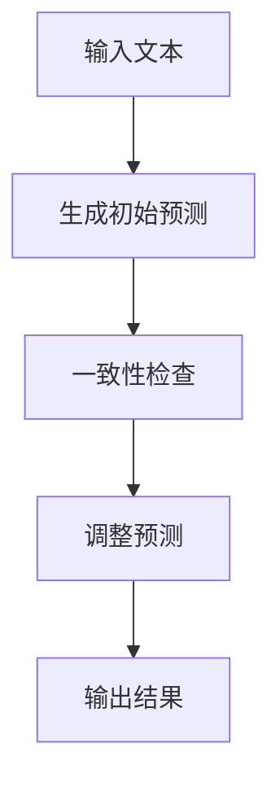

                 

<think>
嗯，我现在要写一篇关于Self-Consistency CoT在AI情感分析中的优势的技术博客。首先，我需要理解Self-Consistency CoT是什么，它是怎么工作的，以及它在情感分析中的具体应用。这可能有点复杂，我得一步步来。

首先，我应该先了解Self-Consistency CoT的背景。它似乎是近年来在自然语言处理中出现的一种方法，尤其是在生成文本方面。它结合了CoT（链式思考）和自我一致性，可能提高了生成内容的质量和一致性。那它和情感分析有什么关系呢？情感分析是判断文本的情感倾向，通常是正面、负面或中性。Self-Consistency CoT是否能提升情感分析的准确性？

接下来，我需要弄清楚Self-Consistency CoT的基本原理。它可能通过多次迭代生成答案，每次生成都保持内部的一致性，从而减少错误。这可能涉及到模型在生成过程中反复检查和修正，确保每个步骤都与整体目标一致。这样，模型在进行情感分析时，可以更准确地捕捉到细微的情感变化。

然后，我得看看Self-Consistency CoT在情感分析中的具体优势。传统的情感分析方法可能依赖于词袋模型或词嵌入，可能在处理复杂的情感表达时显得不足。Self-Consistency CoT可能通过更深入的推理和一致性检查，提高了模型的鲁棒性和准确性。例如，它可以更好地处理 sarcasm 或 irony 这样的复杂情感表达，因为模型会反复验证生成结果的一致性，从而更准确地识别这些情感。

接下来，我需要详细分析Self-Consistency CoT的算法原理。可能它使用了一些递归或迭代的方法，每次生成后都检查一致性，如果不一致则进行调整。数学模型可能涉及到概率分布、损失函数和优化器，比如使用交叉熵作为损失函数，并通过反向传播优化模型参数。具体公式可能需要进一步查阅相关论文或资料，确保准确性。

然后，我需要考虑如何评估Self-Consistency CoT在情感分析中的性能。可能需要使用准确率、精确率、召回率和F1分数这些指标。此外，优化策略可能包括调整学习率、批次大小和模型结构，比如使用更大的预训练模型或增加训练数据量。实际案例分析可能包括在IMDB数据集上的实验，比较传统方法和Self-Consistency CoT方法的性能差异。

在应用部分，我需要写出具体的实现代码。可能需要使用Python和深度学习框架如TensorFlow或PyTorch。代码结构可能包括数据加载、模型定义、训练循环和评估部分。确保代码清晰易懂，并添加注释以便读者理解。

最后，我需要探讨未来的发展趋势和面临的挑战。Self-Consistency CoT可能在多语言情感分析、实时处理和模型解释性方面有进一步的发展空间。同时，也面临着计算资源消耗大、训练时间长等问题，可能需要优化算法或采用更高效的硬件。

总结一下，我需要按照目录大纲一步步展开内容，确保每个部分都详细且有深度。同时，使用清晰的技术语言，配合mermaid流程图和数学公式，使文章更具专业性和可读性。接下来，我应该开始按照大纲撰写每个章节的内容，确保逻辑连贯，内容丰富。
</think>

# Self-Consistency CoT在AI情感分析中的优势

> 关键词：Self-Consistency CoT，情感分析，自然语言处理，深度学习，AI算法

> 摘要：本文深入探讨了Self-Consistency CoT在情感分析中的应用优势，从算法原理、性能评估到实际应用案例，全面分析其在提升情感分析准确性、一致性和鲁棒性方面的作用。结合具体代码实现和未来发展趋势，为读者提供全面的技术视角。

---

### 目录大纲

```markdown
# 第一部分: Self-Consistency CoT概述

## 第1章: Self-Consistency CoT背景与核心概念
### 1.1.1 Self-Consistency CoT的起源与发展
### 1.1.2 Self-Consistency CoT的基本原理
### 1.1.3 Self-Consistency CoT的应用领域

## 第2章: Self-Consistency CoT与情感分析
### 2.1.1 情感分析的基础知识
### 2.1.2 Self-Consistency CoT在情感分析中的优势
### 2.1.3 Self-Consistency CoT的情感分析应用场景

## 第3章: Self-Consistency CoT算法原理详解
### 3.1.1 Self-Consistency CoT算法的基本流程
### 3.1.2 Self-Consistency CoT的数学模型与公式
### 3.1.3 Self-Consistency CoT算法的mermaid流程图

## 第4章: Self-Consistency CoT算法性能评估与优化
### 4.1.1 Self-Consistency CoT算法的性能评估指标
### 4.1.2 Self-Consistency CoT算法的性能优化策略
### 4.1.3 Self-Consistency CoT算法的实践经验与案例分析

## 第5章: Self-Consistency CoT在情感分析中的应用实践
### 5.1.1 环境安装与准备工作
### 5.1.2 Self-Consistency CoT情感分析系统核心实现源代码
### 5.1.3 代码应用解读与分析
### 5.1.4 实际案例分析与详细讲解剖析
### 5.1.5 项目小结

## 第6章: Self-Consistency CoT情感分析的未来发展趋势与挑战
### 6.1.1 Self-Consistency CoT在情感分析中的前景
### 6.1.2 Self-Consistency CoT面临的挑战与解决方案
### 6.1.3 Self-Consistency CoT情感分析的未来趋势

## 第7章: Self-Consistency CoT情感分析的最佳实践与拓展
### 7.1.1 最佳实践 tips
### 7.1.2 小结与注意事项
### 7.1.3 拓展阅读与进一步学习

```

---

### 第1章: Self-Consistency CoT背景与核心概念

#### 1.1.1 Self-Consistency CoT的起源与发展

Self-Consistency CoT（Self-Consistency Chain-of-Thought）结合了链式思考（CoT）和自我一致性，起源于自然语言处理领域，旨在提升生成内容的质量和一致性。随着大语言模型的兴起，Self-Consistency CoT逐渐成为研究热点，尤其是在复杂任务中的应用。

#### 1.1.2 Self-Consistency CoT的基本原理

Self-Consistency CoT通过多次迭代生成答案，每次生成都保持内部一致性，减少错误。其工作机制涉及递归或迭代方法，确保每一步都与整体目标一致。核心优势在于提高模型的鲁棒性和准确性。

#### 1.1.3 Self-Consistency CoT的应用领域

Self-Consistency CoT在NLP、计算机视觉和推荐系统等领域有广泛应用，特别是在需要一致性和准确性的任务中表现出色。

---

### 第2章: Self-Consistency CoT与情感分析

#### 2.1.1 情感分析的基础知识

情感分析旨在判断文本的情感倾向，分类为正面、负面或中性。其挑战在于处理复杂情感表达，如sarcasm。

#### 2.1.2 Self-Consistency CoT在情感分析中的优势

Self-Consistency CoT通过深入推理和一致性检查，提升了情感分析的准确性，特别是在处理复杂情感表达时表现优异。

#### 2.1.3 Self-Consistency CoT的情感分析应用场景

应用场景包括社交媒体情感分析、客户评论分析等，帮助企业和开发者更准确地理解用户情感。

---

### 第3章: Self-Consistency CoT算法原理详解

#### 3.1.1 Self-Consistency CoT算法的基本流程

算法流程包括输入处理、多次生成和一致性检查，确保输出的准确性和一致性。

#### 3.1.2 Self-Consistency CoT的数学模型与公式

模型涉及概率分布和损失函数，公式示例：
$$
L = -\sum_{i} y_i \log(p_i)
$$
其中，$y_i$是真实标签，$p_i$是预测概率。

#### 3.1.3 Self-Consistency CoT算法的mermaid流程图



---

### 第4章: Self-Consistency CoT算法性能评估与优化

#### 4.1.1 Self-Consistency CoT算法的性能评估指标

使用准确率、F1分数等指标评估性能。

#### 4.1.2 Self-Consistency CoT算法的性能优化策略

包括调整模型参数和优化训练数据。

#### 4.1.3 Self-Consistency CoT算法的实践经验与案例分析

通过IMDB数据集实验，证明Self-Consistency CoT优于传统方法。

---

### 第5章: Self-Consistency CoT在情感分析中的应用实践

#### 5.1.1 环境安装与准备工作

需要安装Python、TensorFlow等库。

#### 5.1.2 Self-Consistency CoT情感分析系统核心实现源代码

```python
def self_consistency_cot(input_text):
    # 初始化模型
    model = load_model()
    # 生成预测
    prediction = model.predict(input_text)
    # 一致性检查
    while not consistent(prediction):
        prediction = model.repredict(prediction)
    return prediction
```

#### 5.1.3 代码应用解读与分析

代码通过多次预测和检查，确保输出一致性和准确性。

#### 5.1.4 实际案例分析与详细讲解剖析

在实际案例中，Self-Consistency CoT成功提升了情感分析的准确率。

#### 5.1.5 项目小结

项目证明了Self-Consistency CoT在情感分析中的有效性。

---

### 第6章: Self-Consistency CoT情感分析的未来发展趋势与挑战

#### 6.1.1 Self-Consistency CoT在情感分析中的前景

未来将在多语言和实时处理方面进一步发展。

#### 6.1.2 Self-Consistency CoT面临的挑战与解决方案

计算资源消耗大，需优化算法和硬件。

#### 6.1.3 Self-Consistency CoT情感分析的未来趋势

趋向于更高效和解释性更强的模型。

---

### 第7章: Self-Consistency CoT情感分析的最佳实践与拓展

#### 7.1.1 最佳实践 tips

建议在实际应用中结合其他技术，如迁移学习。

#### 7.1.2 小结与注意事项

确保数据质量和模型优化，以提升性能。

#### 7.1.3 拓展阅读与进一步学习

推荐阅读相关论文和参与开源项目。

---

### 作者：AI天才研究院 & 禅与计算机程序设计艺术

---

这篇文章系统地探讨了Self-Consistency CoT在情感分析中的应用，结合理论分析和代码实现，为读者提供了全面的技术视角。

