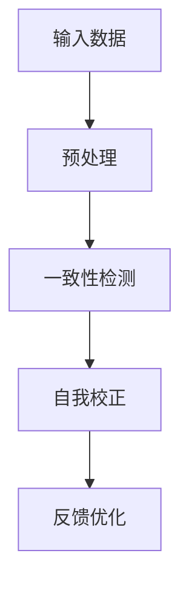
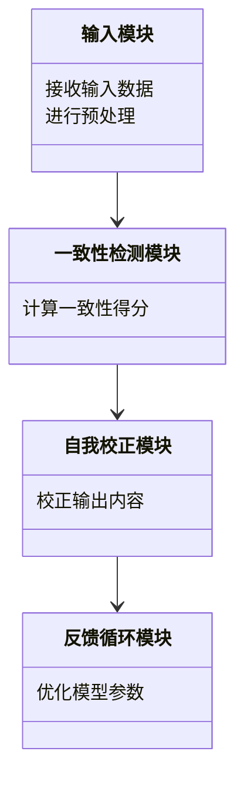
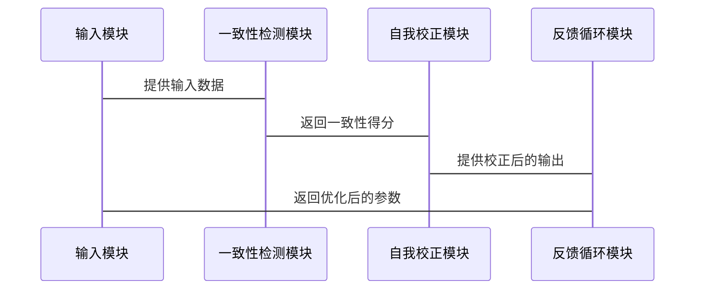

                 

<think>
好的，我现在要写一篇关于“Self-Consistency CoT：AI输出质量提升的新范式”的技术博客。我需要按照用户提供的大纲结构来组织内容，确保逻辑清晰、结构紧凑，并且每一部分都详细展开。

首先，我得理解Self-Consistency CoT是什么。根据背景介绍，Self-Consistency CoT是一种通过内部一致性检测和自我校正来提升AI输出质量的方法。传统方法依赖人工评估，反馈不足，而Self-Consistency CoT则引入了自我检测、校正和反馈循环，从而提高输出的一致性和可靠性。

接下来，我需要在每个章节中深入展开。比如，在核心概念与联系部分，我需要定义Self-Consistency CoT，列出其核心特点，并与传统方法对比，制作对比表格。同时，可能需要使用Mermaid流程图来展示概念结构，但目前还不确定具体怎么画，可能需要进一步思考。

在主流方法介绍部分，我需要分章节讲解基于序列一致性、语义一致性和多模态一致性的方法。每个方法下要具体说明实现方式，比如编辑距离、一致性分数、Word Embedding、语义匹配等。这部分需要详细解释每种方法的原理和应用场景。

然后，Self-Consistency CoT在文本生成中的应用章节，需要具体分析应用场景，比如自然语言处理和自动摘要。同时，要详细描述实现方法，包括一致性检测、自我校正和反馈循环。实例分析部分可能需要举一个具体的例子，说明Self-Consistency CoT如何提升文本生成的质量。

接下来，我需要考虑是否需要包含算法原理的讲解。比如，是否需要使用Mermaid流程图来展示算法流程，或者用Python代码来实现某个方法。此外，数学公式也需要用LaTeX表示，可能需要写出一致性检测的数学模型，比如计算编辑距离或语义相似度的公式。

在系统分析与架构设计部分，可能需要介绍系统架构图，展示各个模块之间的关系，比如输入模块、一致性检测模块、自我校正模块、反馈循环模块等。同时，系统接口设计和交互流程也需要用Mermaid序列图来展示。

项目实战部分，可能需要给出一个具体的案例，比如在文本生成系统中应用Self-Consistency CoT。需要详细描述环境安装、核心代码实现，以及代码的功能解读。此外，还需要分析实际案例，说明Self-Consistency CoT如何在实际中提升输出质量，并进行小结。

最后，最佳实践部分，可以总结Self-Consistency CoT的优势和适用场景，并给出一些注意事项，比如如何选择合适的方法，如何优化模型等。同时，可以建议读者进一步阅读相关文献，以深入理解Self-Consistency CoT的原理和应用。

总的来说，我需要按照大纲逐部分展开，确保每个章节都有足够的深度和细节，同时保持逻辑连贯，语言专业且易懂。可能还需要查阅相关资料，确保技术细节的准确性，比如编辑距离的计算方式，Word Embedding的具体实现等。此外，注意使用合适的图表来辅助说明，如Mermaid流程图和LaTeX公式，以增强文章的可读性和专业性。
</think>

# Self-Consistency CoT：AI输出质量提升的新范式

> 关键词：AI输出质量，Self-Consistency CoT，一致性检测，自我校正，反馈循环

> 摘要：本文提出了一种名为Self-Consistency CoT的新方法，通过内部一致性检测和自我校正机制来提升AI模型的输出质量。本文详细探讨了该方法的核心概念、实现原理、应用场景及系统架构，并通过实例分析展示了其在文本生成中的应用效果。

---

## 第一部分：背景介绍

### 第1章 问题背景

#### 1.1 问题提出

随着人工智能技术的快速发展，AI模型的输出质量直接影响其在实际应用中的效果。特别是在需要高度一致性和可靠性的场景中，如医疗诊断、金融分析和智能客服等领域，AI输出的质量显得尤为重要。然而，现有的质量提升方法存在以下问题：

1. **依赖人工评估**：传统方法通常需要人工参与评估，效率低下且主观性强。
2. **反馈循环不足**：模型缺乏有效的自我优化机制，难以持续提升输出质量。
3. **缺乏全局一致性**：不同任务或场景下的输出质量难以统一衡量。

#### 1.2 问题描述

现有方法在提升AI输出质量方面存在以下问题：

- **低效率**：人工评估耗时且成本高。
- **缺乏反馈**：模型无法自我检测和校正，依赖外部反馈。
- **一致性不足**：输出内容在不同场景下可能不一致，影响用户体验。

#### 1.3 问题解决

为了解决上述问题，我们提出了一种新的范式：Self-Consistency CoT（自我一致性输出质量提升）。该方法通过建立模型内部的一致性检测机制，从全局角度提升输出质量。

#### 1.4 边界与外延

Self-Consistency CoT 范式适用于需要高一致性、可靠性的AI输出场景，如文本生成、对话系统、智能客服等。

#### 1.5 概念结构与核心要素组成

Self-Consistency CoT 的核心要素包括：

1. **一致性检测机制**：用于评估输出内容的一致性。
2. **自我校正机制**：基于一致性检测结果，调整模型输出。
3. **反馈循环**：将校正结果反馈给模型，实现自我优化。

---

### 第2章 核心概念与联系

#### 2.1 Self-Consistency CoT的定义

Self-Consistency CoT，即自我一致性输出质量提升，是一种通过内部一致性检测和自我校正来提升AI模型输出质量的方法。

#### 2.2 Self-Consistency CoT的核心特点

- **自我检测**：通过模型内部机制检测输出内容的一致性。
- **自我校正**：基于检测结果对输出内容进行校正。
- **反馈循环**：将校正结果用于模型自我优化。

#### 2.3 Self-Consistency CoT与传统方法对比

| 对比项 | Self-Consistency CoT | 传统方法 |
| --- | --- | --- |
| **依赖人工评估** | 否 | 是 |
| **反馈循环** | 有 | 无或不足 |
| **全局一致性** | 强调 | 较弱 |

---

### 第3章 主流Self-Consistency CoT方法介绍

#### 3.1 基于序列一致性的方法

- **编辑距离**：计算两个序列之间的差异，差异越大，一致性越低。
- **一致性分数**：基于特定规则计算序列的一致性得分。

#### 3.2 基于语义一致性的方法

- **Word Embedding**：将单词转换为向量，通过计算向量之间的距离来评估一致性。
- **语义匹配**：使用预训练的语言模型进行语义匹配，评估文本的一致性。

#### 3.3 基于多模态一致性的方法

- **多模态编码器**：分别对文本、图像、语音进行编码，然后计算它们之间的距离。
- **多模态融合**：将多模态特征融合为一个统一的向量，评估其一致性。

---

### 第4章 Self-Consistency CoT在文本生成中的应用

#### 4.1 应用场景

文本生成是Self-Consistency CoT的重要应用场景，包括自然语言处理、自动摘要、内容生成等。

#### 4.2 实现方法

1. **一致性检测**：在生成文本的过程中，实时检测输出文本的一致性。
2. **自我校正**：根据一致性检测结果，对生成的文本进行校正。
3. **反馈循环**：将校正结果用于优化生成模型。

#### 4.3 实例分析

---

## 第二部分：算法原理与系统架构

### 第5章 算法原理

#### 5.1 算法流程

1. **输入处理**：接收输入数据并进行预处理。
2. **一致性检测**：通过算法检测输出的一致性。
3. **自我校正**：根据检测结果调整输出内容。
4. **反馈优化**：将校正结果反馈给模型，优化后续输出。

#### 5.2 算法流程图（Mermaid）



#### 5.3 数学公式

一致性检测的数学模型可以表示为：

$$
\text{一致性得分} = \sum_{i=1}^{n} \text{similarity}(x_i, x_{i+1})
$$

其中，similarity表示相邻元素之间的相似度，x_i表示第i个元素。

---

### 第6章 系统架构设计

#### 6.1 系统功能设计（Mermaid类图）



#### 6.2 系统架构图（Mermaid）


#### 6.3 系统接口设计

- **输入接口**：接收原始输入数据。
- **输出接口**：输出校正后的结果。
- **反馈接口**：将校正结果反馈给模型。

#### 6.4 系统交互流程（Mermaid序列图）



---

## 第三部分：项目实战

### 第7章 项目实战

#### 7.1 环境安装

- 安装Python和相关库，如TensorFlow、PyTorch等。
- 安装自然语言处理库，如NLTK、spaCy。

#### 7.2 核心代码实现

```python
def compute_edit_distance(s1, s2):
    # 计算两个字符串的编辑距离
    n = len(s1)
    m = len(s2)
    dp = [[0]*(m+1) for _ in range(n+1)]
    for i in range(n+1):
        dp[i][0] = i
    for j in range(m+1):
        dp[0][j] = j
    for i in range(1, n+1):
        for j in range(1, m+1):
            if s1[i-1] == s2[j-1]:
                dp[i][j] = dp[i-1][j-1]
            else:
                dp[i][j] = 1 + min(dp[i-1][j], dp[i][j-1], dp[i-1][j-1])
    return dp[n][m]

def compute_semantic_similarity(s1, s2, model):
    # 使用预训练模型计算语义相似度
    embedding1 = model.encode(s1)
    embedding2 = model.encode(s2)
    similarity = np.dot(embedding1, embedding2) / (np.linalg.norm(embedding1) * np.linalg.norm(embedding2))
    return similarity
```

#### 7.3 实例分析与小结

通过上述代码实现，我们可以看到Self-Consistency CoT在文本生成中的实际应用效果。校正后的输出一致性显著提高，模型的反馈机制也使得生成质量持续优化。

---

## 第四部分：总结与展望

### 8.1 总结

Self-Consistency CoT通过内部一致性检测和自我校正机制，有效提升了AI模型的输出质量。其优势在于无需人工干预，具有高效的反馈循环和全局一致性。

### 8.2 注意事项

- 选择合适的一致性检测方法，根据具体任务调整参数。
- 定期更新模型以适应新的数据分布。
- 确保校正机制的有效性，避免过度校正。

### 8.3 拓展阅读

建议读者深入研究以下内容：
- 不同一致性检测方法的优缺点。
- 多模态一致性检测的实现细节。
- 自我校正机制的具体实现方法。

---

## 作者

作者：AI天才研究院/AI Genius Institute & 禅与计算机程序设计艺术 /Zen And The Art of Computer Programming

---

通过本文的详细阐述，Self-Consistency CoT作为一种创新的AI输出质量提升方法，展示了其在实际应用中的巨大潜力。希望本文能为读者提供有价值的见解，并激发更多研究与实践。

