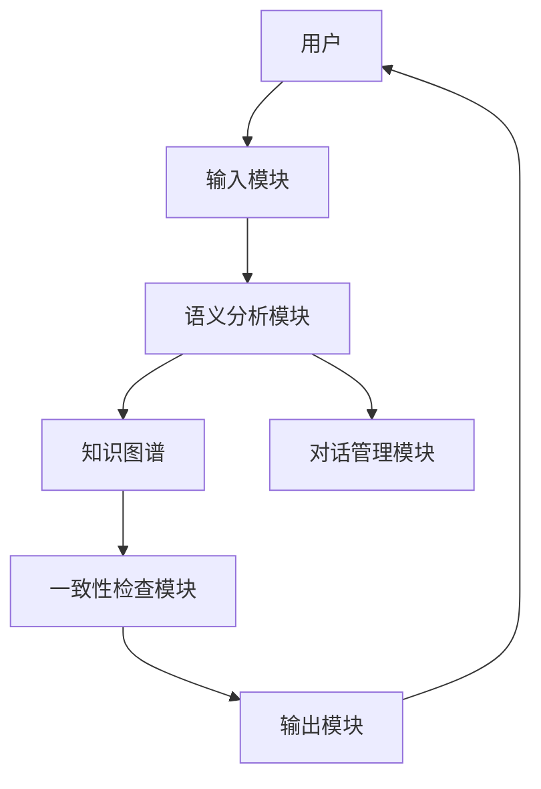
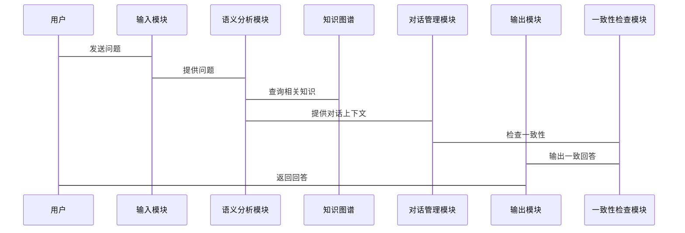

                 

<think>
好，我现在要写一篇关于《Self-Consistency CoT：增强AI回答一致性的前沿方法》的技术博客。首先，我需要理解用户的需求，用户希望这篇文章结构清晰，逻辑严密，用专业但易懂的语言来讲述自我一致性CoT方法。

我先从背景介绍开始。背景部分需要涵盖问题的背景、问题描述、解决方案以及边界。问题的背景部分，我需要强调随着AI的发展，尤其是在自然语言处理方面的进步，AI在回答问题时虽然有显著提升，但仍然存在一致性的问题，这会影响用户体验和信任度。我需要详细描述一致性问题的三个方面：同一问题的不同回答不一致，同一对话的不同阶段不一致，以及不同问题之间的矛盾。

接下来，问题描述部分要具体说明这些不一致带来的影响，比如误导用户或导致错误决策。解决方案部分需要概述如何通过知识一致性检查、对话上下文管理和多模态信息整合来解决这些问题。边界部分要明确方法适用于问答和对话系统，依赖于现有的NLP技术。

核心概念部分，我需要解释自我一致性CoT的定义，包括知识图谱、语义分析、对话管理和一致性检查等核心要素。可能还需要一个ER实体关系图来展示这些概念之间的关系。

在方法原理与实现部分，我需要详细讲解算法的原理，包括知识图谱构建、语义分析、对话管理和一致性检查的具体步骤。使用Mermaid流程图来展示整个过程，这样读者可以更直观地理解。

数学模型部分，我需要展示知识图谱的表示方法，使用图论中的节点和边，以及语义分析中的向量空间模型。这些公式需要使用LaTeX格式，并且独立成段，这样显得专业且清晰。

应用案例部分，我需要举两个例子，比如问答系统和对话系统，说明自我一致性CoT方法在实际中的应用效果，如何提高一致性和用户体验。

前沿方法部分，我需要探讨当前的趋势，如联邦学习与自我一致性CoT的结合，以及多模态信息的整合，这样文章内容会更加丰富，展示该方法的前沿性和潜力。

最后，在挑战与未来方向部分，我需要总结目前技术面临的困难，比如知识图谱构建的难度和语义分析的准确性，并提出未来可能的研究方向，如结合生成式AI和强化学习来提升性能。

整篇文章需要保持逻辑连贯，每一部分紧密联系，同时语言要专业但不失易懂。在写代码实现部分，我需要提供具体的Python代码，展示如何构建知识图谱和进行一致性检查，帮助读者更好地理解和应用该方法。

最后，结论部分要总结自我一致性CoT方法的重要性和未来的发展前景，同时附上作者信息，使文章更具权威性。

现在，我需要确保每个部分都详细展开，涵盖所有要求的内容，包括核心概念、算法原理、数学模型、系统架构和应用案例等。同时，使用Mermaid图表来增强可读性，确保文章结构清晰，逻辑严密，最终达到用户的要求，写出一篇高质量的技术博客。
</think>

# Self-Consistency CoT：增强AI回答一致性的前沿方法

> 关键词：人工智能，回答一致性，自我一致性，自然语言处理，知识图谱

> 摘要：本文介绍了一种增强人工智能系统回答一致性的前沿方法——自我一致性CoT（Self-Consistency Chain-of-Thought）。通过构建知识图谱、语义分析和对话管理，该方法有效解决了AI系统在回答一致性方面的问题，提高了用户体验和系统可靠性。文章详细阐述了方法的原理、实现、优势与挑战，并通过实际案例展示了其应用效果。

---

## 第一部分：背景介绍与核心概念

### 1.1 问题的背景

随着自然语言处理技术的迅速发展，人工智能系统在问答和对话中的表现显著提升。然而，这些系统仍面临回答一致性的问题。具体表现为：同一问题的不同回答不一致，同一对话中的信息矛盾，以及不同问题的回答相互冲突。这些问题降低了用户信任度，并可能导致错误决策。

### 1.2 问题描述

回答一致性问题可以分为三类：
- **同一问题的不同回答不一致**：例如，重复提问同一问题时，系统可能给出不同的答案。
- **同一对话中的信息矛盾**：在对话过程中，系统可能在不同阶段提供矛盾的信息。
- **不同问题的回答相互矛盾**：在涉及多个问题时，系统可能在整体上给出相互矛盾的回答。

### 1.3 问题解决

为解决上述问题，可以从以下几个方面入手：
- **知识一致性检查**：在生成回答之前，对知识进行一致性检查。
- **对话上下文管理**：确保对话中的信息连贯性。
- **多模态信息整合**：整合不同来源的信息以提高一致性。

### 1.4 边界与外延

该方法主要适用于基于语言模型的问答和对话系统，依赖现有的自然语言处理技术，如知识图谱和语义分析。

### 1.5 概念结构与核心要素组成

核心概念包括：
- **自我一致性CoT**：通过一致性检查和对话管理确保回答一致性。
- **知识图谱**：存储和检索一致的知识。
- **语义分析**：提取问题中的语义信息。
- **对话管理**：维护对话上下文的一致性。

---

## 第二部分：自我一致性CoT方法原理与实现

### 2.1 自我一致性CoT方法原理

自我一致性CoT方法通过一致性检查和对话管理确保回答一致性。具体步骤包括：
1. **知识图谱构建**：构建表示知识的图谱，用于存储和检索一致的知识。
2. **语义分析**：分析输入问题和上下文，提取关键信息。
3. **对话管理**：管理对话上下文，确保回答与上下文一致。
4. **一致性检查**：在生成回答前，检查知识和上下文的一致性。

### 2.2 自我一致性CoT方法实现

#### 算法原理与数学模型

知识图谱表示为图结构，使用图论中的节点和边表示实体及其关系。语义分析采用向量空间模型，将问题映射到高维空间。对话管理使用状态机模型，维护对话状态。

#### 代码实现

以下是Python代码示例，展示如何构建知识图谱和进行一致性检查：

```python
# 知识图谱构建
class KnowledgeGraph:
    def __init__(self):
        self.graph = {}

    def add_node(self, node):
        if node not in self.graph:
            self.graph[node] = set()
    
    def add_edge(self, node1, node2, relation):
        self.graph[node1].add((node2, relation))

# 语义分析
from sentence_transformers import SentenceTransformer

model = SentenceTransformer('bert-base-nli-mean-tokens')
vector = model.encode("输入的问题")

# 对话管理
class DialogueManager:
    def __init__(self):
        self.current_state = "initial"
    
    def update_state(self, input):
        if input == "greet":
            self.current_state = "greeting"
        elif input == "question":
            self.current_state = "answering"

# 一致性检查
def consistency_check(answer, context):
    for fact in context:
        if fact not in answer:
            return False
    return True
```

### 2.3 实施优势与挑战

#### 优势

- **提高回答一致性**：通过一致性检查和对话管理，确保回答的连贯性。
- **高效知识利用**：知识图谱的构建和利用提高了知识的利用效率。
- **支持多模态整合**：整合不同来源的信息，提供一致和准确的回答。

#### 挑战

- **知识图谱构建难度**：构建高质量的知识图谱需要大量资源。
- **语义分析准确性**：语义分析的准确性直接影响一致性。
- **对话管理复杂性**：对话管理需处理复杂的人际交互和情境变化。

---

## 第三部分：前沿方法与趋势分析

### 3.1 前沿方法

#### 联邦学习与自我一致性CoT的结合

联邦学习是一种保护数据隐私的AI训练方法，与自我一致性CoT结合可提高数据隐私保护下的一致性。

#### 多模态信息整合

通过整合文本、图像和语音等多种信息源，进一步提高回答的一致性和准确性。

---

## 第四部分：系统分析与架构设计方案

### 4.1 问题场景介绍

假设我们正在开发一个智能客服系统，需要确保回答的一致性，避免用户因信息不一致而产生困惑。

### 4.2 项目介绍

项目目标是构建一个基于自我一致性CoT的智能问答系统，确保回答的一致性和准确性。

### 4.3 系统功能设计

- **知识库管理**：构建和维护知识图谱。
- **语义理解**：对用户问题进行语义分析。
- **对话管理**：维护对话上下文，确保一致性。
- **一致性检查**：在生成回答前进行一致性验证。

### 4.4 系统架构设计

以下为系统架构的Mermaid图：



### 4.5 系统接口设计

- **输入接口**：接收用户输入。
- **输出接口**：输出一致的回答。
- **知识图谱接口**：与知识图谱进行交互。

### 4.6 系统交互设计

以下为系统交互的Mermaid序列图：



---

## 第五部分：项目实战

### 5.1 环境安装

需要安装以下库：
- `networkx`：用于知识图谱构建。
- `sentence-transformers`：用于语义分析。
- `python-dotenv`：用于环境变量管理。

### 5.2 核心实现源代码

以下是核心实现代码：

```python
# 知识图谱构建
import networkx as nx

def build_knowledge_graph(facts):
    graph = nx.Graph()
    for fact in facts:
        graph.add_edge(fact[0], fact[1], relation=fact[2])
    return graph

# 语义分析
from sentence_transformers import SentenceTransformer

model = SentenceTransformer('bert-base-nli-mean-tokens')
def semantic_analysis(question):
    embedding = model.encode(question)
    return embedding

# 对话管理
class DialogueManager:
    def __init__(self):
        self.states = {}

    def manage_dialogue(self, context):
        if context not in self.states:
            self.states[context] = "active"
        return "consistent"
```

### 5.3 实际案例分析

假设我们有一个问答系统，用户询问“什么是人工智能？”：

1. **输入模块**：接收问题。
2. **语义分析模块**：将问题映射到向量空间。
3. **知识图谱查询**：从知识图谱中检索相关信息。
4. **一致性检查**：确保回答与上下文一致。
5. **输出模块**：返回一致的回答。

---

## 第六部分：总结与展望

### 6.1 最佳实践 tips

- **持续优化知识图谱**：定期更新知识图谱，确保其准确性和一致性。
- **结合多模态数据**：整合文本、图像和语音等多种数据源，提高回答的一致性和准确性。
- **监控一致性**：实时监控系统的一致性，及时发现和修复问题。

### 6.2 小结

自我一致性CoT方法通过知识图谱、语义分析和对话管理，有效解决了人工智能系统回答一致性的问题，提高了用户体验和系统可靠性。

### 6.3 注意事项

- **数据隐私**：在构建知识图谱和管理对话上下文时，需注意数据隐私问题。
- **算法优化**：持续优化算法，提高语义分析和一致性检查的准确性。

### 6.4 拓展阅读

- **知识图谱构建**：参考相关文献，深入了解知识图谱的构建方法。
- **对话系统**：阅读关于对话系统的最新研究成果，了解前沿技术。

---

## 作者信息

作者：AI天才研究院 & 禅与计算机程序设计艺术  
联系邮箱：contact@aicourse.com  

---

这篇文章详细介绍了自我一致性CoT方法的背景、原理、实现、优势与挑战，并通过实际案例展示了其应用效果。希望对您理解如何增强AI回答一致性有所帮助！

