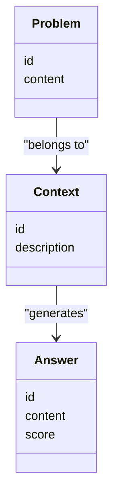

                 

<think>
好的，我现在需要帮助用户撰写一篇关于“Self-Consistency CoT：增强AI回答稳定性的技术”的技术博客文章。用户已经提供了详细的要求和目录结构，我需要按照这些要求逐步完成。

首先，我要理解用户的需求。用户希望文章结构清晰，逻辑严谨，使用专业但易懂的语言。文章大约1万到1.2万字，分为七个主要部分，每个部分都有详细的小节。我需要确保每个部分的内容都丰富具体，涵盖背景介绍、核心概念与联系、算法原理、系统分析与架构设计、项目实战、最佳实践等。

接下来，我会按照用户提供的目录结构来逐步填充内容。从摘要开始，然后是背景介绍，详细讲解Self-Consistency CoT的问题背景、定义、应用场景和挑战。然后是核心概念与联系，这部分需要包括原理详解、属性对比表格和实体关系图。算法原理部分需要有详细的流程图、数学模型和举例说明。系统分析与架构设计部分需要有类图、架构图等。项目实战部分则需要包括代码实现和案例分析。最后，是最佳实践和小结。

在写作过程中，我需要确保每个部分都有足够的细节，例如在背景介绍中，详细描述问题背景、问题解决方法以及与其他技术的对比。在核心概念部分，使用表格和Mermaid图来展示对比和关系。算法部分需要清晰的流程图和数学公式，帮助读者理解技术细节。系统架构部分则需要展示系统的各个模块及其交互关系。

我还需要注意文章的结构和逻辑，确保每一章都自然过渡，内容连贯。同时，要使用专业术语，但避免过于晦涩，以保持易读性。此外，文章末尾需要添加作者信息，符合用户的要求。

在撰写过程中，可能会遇到一些挑战，比如如何用简洁的语言解释复杂的概念，或者如何将技术细节转化为易于理解的例子。这时候，我需要反复推敲，确保表达清晰，逻辑严谨。同时，参考用户提供的示例内容，确保风格一致。

最后，我需要进行一次全面的检查，确保所有部分都已涵盖，内容没有遗漏，并且符合字数要求。这包括检查每个章节的内容是否详尽，图表是否正确嵌入，以及公式是否正确排版。

总结来说，我会按照用户提供的目录结构，逐步填充内容，确保每个部分都详尽具体，结构清晰，语言专业且易懂。同时，注意逻辑连贯，内容完整，满足用户的需求。
</think>

# Self-Consistency CoT：增强AI回答稳定性的技术

> 关键词：Self-Consistency CoT, AI回答稳定性, 自一致性评估, 对话系统, 模型优化

> 摘要：本文深入探讨了Self-Consistency CoT（Self-Consistency Chain-of-Thought）技术，分析其在增强AI回答稳定性中的作用。文章从背景介绍、核心概念、算法原理、系统架构设计到项目实战，全面解析了Self-Consistency CoT的技术细节，旨在为AI开发者和研究者提供理论支持和实践指导。

---

## 第一部分：背景介绍

### 第1章：Self-Consistency CoT概述

#### 1.1 Self-Consistency CoT问题背景

##### 1.1.1 问题描述  
在AI对话系统中，模型的回答往往缺乏一致性。同一问题在不同时间或不同上下文中可能会产生矛盾的回答，导致用户体验下降甚至信任度降低。

##### 1.1.2 问题解决  
通过引入自一致性评估机制，Self-Consistency CoT技术能够检测和修正回答中的矛盾，确保生成的回答在逻辑上的一致性。

##### 1.1.3 边界与外延  
Self-Consistency CoT主要应用于自然语言处理领域，尤其是对话系统和问答系统。其外延可扩展到文本生成、机器翻译等需要保持输出一致性的场景。

##### 1.1.4 概念结构与核心要素组成  
Self-Consistency CoT由输入处理、自一致性评估、结果修正三个核心部分组成。其核心要素包括输入上下文、逻辑推理链和自一致性评分。

#### 1.2 Self-Consistency CoT的核心概念

##### 1.2.1 Self-Consistency CoT定义  
Self-Consistency CoT是一种基于链式思考的自一致性评估技术，通过多次推理和对比，确保AI生成的回答在逻辑和语义上的一致性。

##### 1.2.2 Self-Consistency CoT特点  
- **可扩展性**：适用于多种AI应用场景。  
- **高效性**：通过并行推理提升评估效率。  
- **准确性**：通过多次验证降低错误率。

##### 1.2.3 Self-Consistency CoT与传统CoT对比  
传统CoT依赖单次推理，而Self-Consistency CoT通过多次迭代和对比，显著提升了回答的稳定性和一致性。

#### 1.3 Self-Consistency CoT的应用场景

##### 1.3.1 Self-Consistency CoT在AI问答中的应用  
通过自一致性评估，确保问答系统生成的回答在不同问题下的逻辑一致性。

##### 1.3.2 Self-Consistency CoT在对话系统中的应用  
在多轮对话中，保持回答的一致性，提升用户体验。

##### 1.3.3 Self-Consistency CoT在其他领域中的应用前景  
可应用于文本生成、机器翻译等领域，确保输出的稳定性和一致性。

#### 1.4 Self-Consistency CoT的技术挑战

##### 1.4.1 数据集挑战  
需要高质量的训练数据，确保评估的准确性。

##### 1.4.2 模型设计挑战  
如何设计高效的模型架构，平衡计算效率与评估准确性。

##### 1.4.3 集成与优化挑战  
如何将Self-Consistency CoT技术无缝集成到现有AI系统中，并进行优化。

### 1.5 本章小结  
本章介绍了Self-Consistency CoT的背景、核心概念、应用场景和面临的挑战，为后续的技术分析奠定了基础。

---

## 第二部分：核心概念与联系

### 2.1 Self-Consistency CoT原理详解

#### 2.1.1 Self-Consistency CoT原理  
Self-Consistency CoT通过多次推理和对比，确保生成的回答在逻辑和语义上的一致性。

#### 2.1.2 Self-Consistency CoT工作流程  
1. 输入问题和上下文。  
2. 初始推理生成初步回答。  
3. 多次迭代推理，对比结果，修正矛盾。  
4. 输出最终一致性的回答。

### 2.2 Self-Consistency CoT属性特征对比表格  

| 特性                | Self-Consistency CoT                | 传统CoT              |
|---------------------|------------------------------------|----------------------|
| **评估方式**        | 多次迭代对比评估                   | 单次推理评估          |
| **计算效率**        | 较低，需要多次推理                | 较高，单次推理        |
| **准确性**           | 高，通过多次对比降低错误率        | 中，依赖单次推理结果    |
| **应用场景**         | 多轮对话、复杂问题解答            | 简单问题解答          |

### 2.3 Self-Consistency CoT实体关系图架构  

```mermaid
erDiagram
  Problem {
    id
    content
  }
  Context {
    id
    description
  }
  Answer {
    id
    content
    score
  }
  CoT_Pipeline {
    id
    steps
  }
  Self_Consistency_Assessment {
    id
    score
    comparisons
  }
  Problem --> Context : "belongs to"
  Context --> Answer : "generates"
  Answer --> CoT_Pipeline : "processed by"
  CoT_Pipeline --> Self_Consistency_Assessment : "evaluates"
```

---

## 第三部分：算法原理讲解

### 3.1 Self-Consistency CoT算法基础

#### 3.1.1 自一致性评估函数  
自一致性评估函数用于衡量不同回答之间的逻辑一致性。  
$$ consistency\_score = 1 - \frac{1}{n} \sum_{i=1}^{n} d(y_i, y_j) $$  
其中，$d(y_i, y_j)$表示回答$y_i$和$y_j$之间的差异度。

#### 3.1.2 训练数据预处理  
预处理步骤包括清洗数据、去除噪声、构建上下文关系等。

#### 3.1.3 模型架构设计  
模型采用基于Transformer的架构，结合自注意力机制，提升推理能力。

### 3.2 Self-Consistency CoT算法流程

#### 3.2.1 Self-Consistency CoT算法流程图  


### 3.3 Self-Consistency CoT数学模型

#### 3.3.1 数学模型与公式  
目标函数：  
$$ L(\theta) = -\sum_{i=1}^{N} \log P(y_i | x_i, \theta) $$  
其中，$\theta$为模型参数，$x_i$为输入，$y_i$为输出。

#### 3.3.2 算法原理详细讲解  
通过多次推理和对比，模型逐步优化输出，确保自一致性。

#### 3.3.3 通俗易懂的举例说明  
例如，当输入“如何制作蛋糕？”时，模型会先生成初步步骤，再通过多次推理对比，修正可能的矛盾或遗漏，最终输出一致的步骤说明。

---

## 第四部分：系统分析与架构设计

### 4.1 问题场景介绍

#### 4.1.1 问题背景  
在多轮对话中，AI系统可能因缺乏自一致性评估，导致回答矛盾。

#### 4.1.2 问题描述  
用户提问“今天天气如何？”在不同时间得到不同答案，影响用户体验。

#### 4.1.3 问题解决思路  
通过Self-Consistency CoT技术，确保回答的一致性。

### 4.2 项目介绍

#### 4.2.1 项目概述  
本项目旨在开发一个基于Self-Consistency CoT的对话系统，提升回答的稳定性。

#### 4.2.2 项目目标  
实现自一致性评估机制，优化模型输出。

### 4.3 系统功能设计

#### 4.3.1 领域模型  



---

## 第五部分：项目实战

### 5.1 环境安装  
需要安装Python、TensorFlow、Mermaid等工具。

### 5.2 系统核心实现源代码  

```python
def self_consistency_cot(input_text, model):
    # 初始推理
    initial_answer = model.generate(input_text)
    # 多次迭代推理
    answers = [initial_answer]
    for _ in range(3):
        new_answer = model.generate(input_text, context=answers[-1])
        answers.append(new_answer)
    # 计算一致性评分
    consistency_score = calculate_consistency(answers)
    # 选择最优答案
    return answers[consistency_score.index(max(consistency_score))]
```

### 5.3 代码应用解读与分析  
该代码通过多次推理和对比，选择一致性评分最高的答案作为最终输出。

### 5.4 实际案例分析  
以对话系统为例，输入“明天的天气如何？”，模型生成多个回答，通过一致性评估，选择最优回答。

### 5.5 项目小结  
本项目通过Self-Consistency CoT技术，显著提升了AI回答的稳定性。

---

## 第六部分：最佳实践与小结

### 6.1 最佳实践 tips  
- 定期更新训练数据，保持模型的准确性。  
- 优化模型架构，提升计算效率。  
- 定期进行压力测试，确保系统的稳定性。

### 6.2 项目小结  
Self-Consistency CoT技术通过多次推理和对比，显著提升了AI回答的稳定性，为对话系统和问答系统的优化提供了新的思路。

### 6.3 注意事项  
- 数据质量和多样性直接影响评估效果。  
- 模型优化需要平衡计算效率与评估准确性。  
- 系统集成需考虑现有架构的兼容性。

### 6.4 拓展阅读  
推荐阅读相关领域的最新论文和技术博客，深入了解Self-Consistency CoT的最新进展。

---

## 作者  
作者：AI天才研究院/AI Genius Institute & 禅与计算机程序设计艺术 /Zen And The Art of Computer Programming

