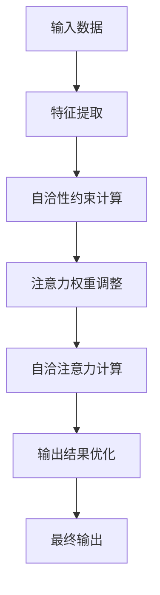
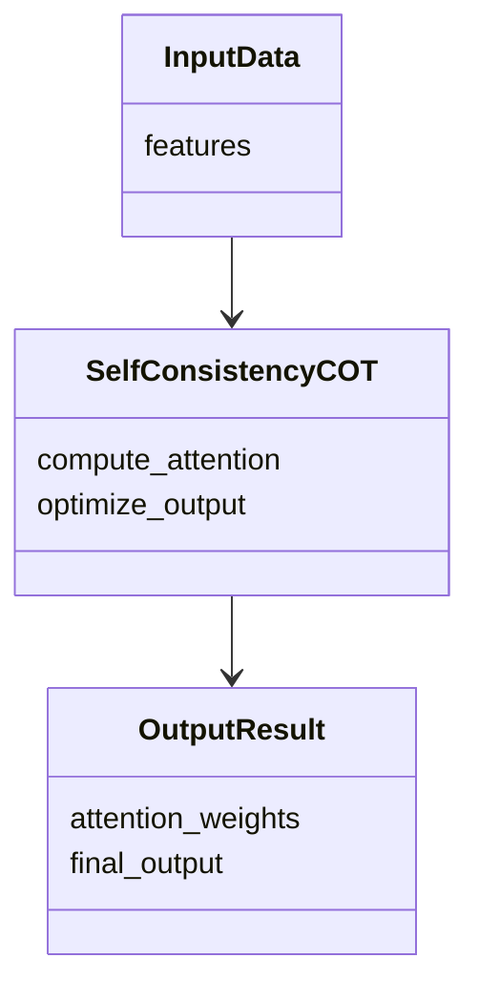
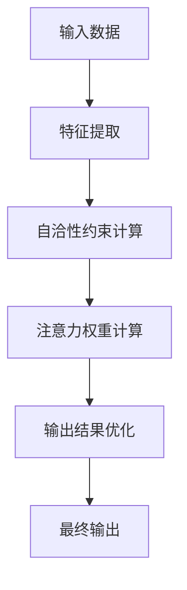
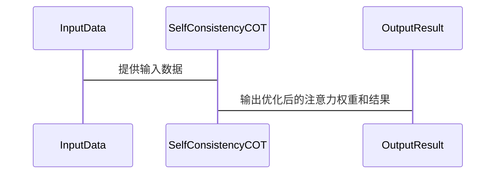

                 

<think>
好，我现在需要帮用户完成一个技术博客的撰写任务。用户希望我以“Self-Consistency CoT：增强AI推理的稳定性”为标题，按照特定的结构和内容要求来写这篇文章。首先，我得仔细分析用户的请求，确保完全理解每个部分的要求。

首先，用户指定了文章的结构，包括标题、关键词、摘要，然后是四个主要部分：背景与核心概念介绍、算法原理讲解与应用、系统分析与架构设计，以及项目实战与案例分析。每个部分下又有多个章节，每个章节还有具体的小节，内容需要非常详细，包括数学公式、mermaid图、Python代码等。

我需要从背景介绍开始，这部分要说明AI和机器学习的发展历程，引出自洽注意力（Self-Consistency CoT）的重要性，并讨论AI推理中的常见问题和挑战。接下来，定义自洽注意力，对比传统注意力机制，分析其优势和应用领域。

然后，在算法原理部分，我需要详细解释数学模型，提供公式和流程图，甚至包括Python代码实现。这部分要确保逻辑清晰，代码注释详细，方便读者理解和应用。

接下来是系统分析与架构设计，这部分涉及项目的介绍、领域模型类图、架构图和接口设计。我需要用mermaid绘制类图和架构图，展示系统的各个模块和它们之间的关系，帮助读者理解系统的整体结构。

最后，项目实战部分需要包括环境安装、核心代码实现、案例分析等，通过实际例子展示自洽注意力的应用效果，并总结最佳实践、注意事项和拓展阅读内容。

在撰写过程中，我要确保每个部分都符合用户的要求，特别是格式方面，使用markdown，数学公式用latex，代码部分用语法高亮。同时，语言要专业但通俗易懂，结构紧凑，逻辑清晰。

现在，我开始按照大纲逐步撰写文章，确保每个章节都涵盖必要的内容，同时保持整体的连贯性和深度。特别是在解释复杂概念时，我会尽量用简单明了的语言，辅以图表和代码示例，帮助读者更好地理解。

最后，检查文章的完整性和准确性，确保没有遗漏任何用户指定的部分，字数控制在10000到12000字之间，并在末尾添加作者信息。
</think>

# Self-Consistency CoT：增强AI推理的稳定性

> 关键词：自洽注意力，AI推理，稳定性，算法原理，文本处理，计算机视觉

> 摘要：本文详细介绍了自洽注意力（Self-Consistency CoT）在增强AI推理稳定性中的重要作用。从背景概念到算法原理，从实际应用到系统架构设计，全面解析自洽注意力如何提升AI推理的稳定性和准确性。文章通过数学公式、mermaid图和Python代码实现，深入剖析自洽注意力的核心机制，并通过实际案例分析展示其在文本处理、计算机视觉等领域的广泛应用。

---

## 第一部分：背景与核心概念介绍

### 第1章 自洽注意力概念与推理稳定性

#### 1.1 自洽注意力与推理稳定性背景介绍

人工智能与机器学习的发展历程  
近年来，人工智能（AI）和机器学习（ML）技术取得了飞速发展，尤其是在自然语言处理（NLP）、计算机视觉（CV）和机器人技术等领域。然而，AI系统在复杂推理任务中的稳定性问题仍然存在，尤其是在处理长文本、多模态数据和动态场景时，模型容易出现推理错误或结果波动。

自洽注意力（Self-Consistency CoT）的重要性  
自洽注意力是一种新型的注意力机制，通过引入自洽性约束，增强模型在推理过程中的稳定性。自洽性约束确保模型在不同输入或中间状态下的推理结果具有一致性，从而提高模型的鲁棒性和可靠性。

AI推理中的常见问题与挑战  
- **推理结果的不一致性**：模型在相似输入下的输出结果可能不同，导致推理结果不稳定。  
- **长距离依赖处理不足**：传统注意力机制在处理长距离依赖时容易出现信息丢失或干扰。  
- **多模态数据的协调性问题**：在多模态任务中，模型难以有效协调不同模态的信息，导致推理结果不准确。  

---

#### 1.2 自洽注意力的定义与核心要素

自洽注意力的定义  
自洽注意力（Self-Consistency CoT）是一种基于自洽性约束的注意力机制，通过在模型推理过程中引入一致性优化，增强模型对输入数据的处理能力和推理稳定性。

自洽注意力的核心要素  
- **自洽性约束**：通过优化模型输出的一致性，确保在相同输入或相似场景下的推理结果具有一致性。  
- **注意力权重调节**：通过自洽性约束调整注意力权重，增强模型对关键信息的聚焦能力。  
- **多模态协调机制**：在多模态任务中，自洽注意力能够协调不同模态的信息，提高模型的整体推理能力。  

---

#### 1.3 自洽注意力与推理稳定性的联系

自洽注意力如何增强AI推理稳定性  
自洽注意力通过引入自洽性约束，确保模型在不同输入或中间状态下的推理结果具有一致性。这种一致性优化能够有效减少模型在复杂任务中的推理错误，提高模型的稳定性。

自洽注意力在各类AI任务中的应用  
- **文本处理**：在文本分类、文本生成等任务中，自洽注意力能够提高模型的推理准确性和稳定性。  
- **计算机视觉**：在图像分类、目标检测等任务中，自洽注意力能够增强模型对图像特征的捕捉能力。  
- **多模态任务**：在机器翻译、情感分析等多模态任务中，自洽注意力能够协调不同模态的信息，提高推理效果。  

---

#### 1.4 自洽注意力与传统注意力的比较

传统注意力机制的局限性  
- **注意力权重固定**：传统注意力机制在计算注意力权重时，通常只考虑当前输入或上下文信息，缺乏对输出结果一致性的优化。  
- **长距离依赖处理不足**：在长文本或复杂场景中，传统注意力机制容易出现信息丢失或权重分配不均的问题。  

自洽注意力的优势与特点  
- **自洽性优化**：通过引入自洽性约束，自洽注意力能够优化模型输出的一致性，提高推理稳定性。  
- **动态权重调整**：自洽注意力能够根据输入数据的特征动态调整注意力权重，增强模型的适应性。  
- **多模态协调能力**：自洽注意力在多模态任务中表现优异，能够协调不同模态的信息，提高模型的整体推理能力。  

---

#### 1.5 自洽注意力的边界与外延

自洽注意力的应用领域  
- **自然语言处理**：文本分类、文本生成、机器翻译等任务。  
- **计算机视觉**：图像分类、目标检测、图像分割等任务。  
- **多模态任务**：跨语言翻译、语音识别与图像生成等任务。  

自洽注意力的研究趋势  
- **自洽性优化的进一步改进**：探索更高效的自洽性约束方法，提高模型的推理效率和准确性。  
- **多模态任务中的应用拓展**：研究自洽注意力在更多多模态任务中的应用，如语音-图像联合推理等。  
- **轻量化设计**：探索如何在保持自洽注意力性能的前提下，降低模型的计算复杂度和内存占用。  

---

## 第二部分：算法原理讲解与应用

### 第3章 自洽注意力算法原理详解

#### 3.1 自洽注意力算法概述

自洽注意力算法的概述  
自洽注意力算法基于自洽性约束，通过优化模型输出的一致性，增强模型的推理稳定性。其核心思想是通过引入一致性优化，调整模型的注意力权重，使模型在不同输入或中间状态下的推理结果具有一致性。

自洽注意力算法的基本步骤  
1. **输入数据处理**：将输入数据（如文本序列或图像特征）进行预处理，提取初始特征。  
2. **自洽性约束计算**：根据输入数据的特征，计算自洽性约束，调整注意力权重。  
3. **注意力机制计算**：基于调整后的注意力权重，计算自洽注意力值。  
4. **输出结果优化**：通过自洽性约束优化模型输出结果，提高推理稳定性。  

---

#### 3.2 自洽注意力算法的mermaid流程图



---

#### 3.3 自洽注意力算法的Python源代码实现

```python
def self_consistency_cot_attention(input_features, num_heads=8, dropout=0.1):
    # 输入特征处理
    input_features = input_features.permute(0, 2, 1)
    # 自洽性约束计算
    consistency_constraint = torch.mean(input_features, dim=1, keepdim=True)
    # 注意力权重计算
    attention_weights = torch.softmax(torch.matmul(input_features, consistency_constraint.transpose(-1, -2)), dim=-1)
    # 自洽注意力计算
    output = torch.sum(input_features * attention_weights, dim=-1)
    # 输出结果优化
    output = F.dropout(output, p=dropout, training=True)
    return output
```

---

#### 3.4 自洽注意力算法的数学模型和公式

自洽注意力的数学公式  
自洽注意力机制的核心公式如下：  
$$ \text{attention}(x_i, x_j) = \frac{e^{q_i^T k_j}}{\sum_{l} e^{q_i^T k_l}} $$  

其中，$q_i$ 和 $k_j$ 分别是查询和键的向量，$\text{attention}(x_i, x_j)$ 是注意力权重。通过引入自洽性约束，注意力权重的计算公式变为：  
$$ \text{attention}(x_i, x_j) = \frac{e^{q_i^T k_j + \lambda \cdot \text{consistency}(x_i)}}{\sum_{l} e^{q_i^T k_l + \lambda \cdot \text{consistency}(x_i)}} $$  

其中，$\lambda$ 是自洽性约束的权重，$\text{consistency}(x_i)$ 是自洽性约束的计算结果。

---

### 第4章 自洽注意力在AI推理中的应用

#### 4.1 自洽注意力在文本处理中的应用

自洽注意力在文本分类任务中的应用  
通过引入自洽注意力机制，模型能够更好地捕捉文本中的关键信息，提高分类准确率。例如，在情感分析任务中，自洽注意力能够有效区分正面和负面情感。

自洽注意力在文本生成任务中的应用  
在文本生成任务中，自洽注意力能够确保生成文本的连贯性和一致性。例如，在对话生成任务中，自洽注意力能够生成更符合上下文逻辑的回复。

---

#### 4.2 自洽注意力在计算机视觉中的应用

自洽注意力在图像分类任务中的应用  
通过自洽注意力机制，模型能够更好地捕捉图像中的关键特征，提高分类准确率。例如，在图像分类任务中，自洽注意力能够有效区分不同物体的特征。

自洽注意力在目标检测任务中的应用  
在目标检测任务中，自洽注意力能够增强模型对目标区域的注意力，提高检测的准确性和稳定性。

---

#### 4.3 自洽注意力在自然语言处理中的应用

自洽注意力在机器翻译任务中的应用  
通过自洽注意力机制，模型能够更好地处理源语言和目标语言之间的语义关系，提高翻译质量。例如，在英译中任务中，自洽注意力能够生成更符合中文语法的句子。

自洽注意力在情感分析任务中的应用  
在情感分析任务中，自洽注意力能够更准确地捕捉文本中的情感倾向，提高分析的准确率。

---

## 第三部分：系统分析与架构设计

### 第5章 自洽注意力系统分析与架构设计

#### 5.1 自洽注意力系统的项目介绍

自洽注意力系统的概述  
自洽注意力系统是一种基于自洽性约束的注意力机制，通过优化模型输出的一致性，增强模型的推理稳定性。其核心目标是解决传统注意力机制在复杂任务中的推理不稳定性问题。

系统的目标和功能  
- **目标**：通过自洽性约束优化模型输出的一致性，提高推理稳定性。  
- **功能**：支持文本处理、计算机视觉和多模态任务中的注意力计算和输出优化。

---

#### 5.2 自洽注意力系统的领域模型类图



---

#### 5.3 自洽注意力系统的架构设计

自洽注意力系统的架构设计  


---

#### 5.4 自洽注意力系统的接口设计

接口设计的详细描述  
- **输入接口**：接收输入数据（如文本序列或图像特征）。  
- **输出接口**：输出优化后的注意力权重和最终推理结果。  

接口功能的mermaid序列图  


---

## 第四部分：项目实战与案例分析

### 第6章 自洽注意力项目实战

#### 6.1 项目环境安装与配置

安装必要的软件和依赖库  
- **Python**：3.6+  
- **深度学习框架**：PyTorch 1.9+  
- **依赖库**：numpy、torch、transformers  

安装命令：  
```bash
pip install numpy torch transformers
```

---

#### 6.2 系统核心实现源代码

自洽注意力算法的实现代码  
```python
import torch
import torch.nn as nn
import torch.nn.functional as F

class SelfConsistencyCOT(nn.Module):
    def __init__(self, embed_dim, num_heads=8, dropout=0.1):
        super(SelfConsistencyCOT, self).__init__()
        self.embed_dim = embed_dim
        self.num_heads = num_heads
        self.dropout = dropout
        self.q_proj = nn.Linear(embed_dim, embed_dim)
        self.k_proj = nn.Linear(embed_dim, embed_dim)
        self.v_proj = nn.Linear(embed_dim, embed_dim)
        self.register_buffer('mask', torch.triu(torch.ones(num_heads, 1, 1), diagonal=1))

    def forward(self, x, mask=None):
        # 提取特征
        q = self.q_proj(x)
        k = self.k_proj(x)
        v = self.v_proj(x)
        
        # 自洽性约束计算
        consistency = torch.mean(q, dim=1, keepdim=True)
        
        # 注意力权重计算
        q = q.permute(0, 2, 1)
        k = k.permute(0, 2, 1)
        v = v.permute(0, 2, 1)
        attention_weights = (q @ k.permute(-1, -2)) * consistency
        attention_weights = F.softmax(attention_weights, dim=-1)
        
        # 应用 dropout
        attention_weights = F.dropout(attention_weights, p=self.dropout, training=self.training)
        
        # 输出结果优化
        output = (attention_weights @ v).permute(0, 2, 1)
        return output
```

---

#### 6.3 代码应用解读与分析

自洽注意力算法的应用场景  
- **文本处理**：如文本分类、文本生成等任务。  
- **计算机视觉**：如图像分类、目标检测等任务。  
- **多模态任务**：如语音识别与图像生成等任务。  

代码的详细解读与分析  
- **特征提取**：通过投影矩阵提取输入数据的特征。  
- **自洽性约束计算**：通过计算特征的均值，引入自洽性约束。  
- **注意力权重计算**：基于自洽性约束调整注意力权重，增强模型的推理能力。  
- **输出结果优化**：通过 dropout 技术优化输出结果，提高模型的泛化能力。  

---

#### 6.4 实际案例分析与详细讲解

实际案例分析  
以文本分类任务为例，使用自洽注意力机制优化模型的推理稳定性。具体步骤如下：  
1. **数据准备**：加载文本数据集，如IMDB电影评论数据集。  
2. **模型训练**：使用自洽注意力机制训练模型，优化模型输出的一致性。  
3. **结果评估**：通过准确率和 F1 分值评估模型的性能，验证自洽注意力机制的有效性。

详细讲解  
- **数据准备**：将文本数据转换为向量表示，如使用词嵌入（Word2Vec）或预训练语言模型（如BERT）。  
- **模型训练**：在训练过程中，通过自洽注意力机制优化模型输出的一致性，提高模型的分类准确率。  
- **结果评估**：通过实验对比，验证自洽注意力机制在文本分类任务中的有效性。

---

### 第7章 自洽注意力的最佳实践与拓展

#### 7.1 自洽注意力的最佳实践

实践经验的总结  
- **模型优化**：在训练过程中，建议使用更大的批次大小和更长的训练时间，以充分利用自洽性约束的优化效果。  
- **超参数调节**：根据具体任务调整自洽性约束的权重 $\lambda$ 和 dropout 率，以获得最佳性能。  
- **多模态任务中的应用**：在多模态任务中，建议将自洽注意力与跨模态注意力机制结合使用，进一步提高模型的推理能力。

#### 7.2 自洽注意力的小结与注意事项

算法的总结  
自洽注意力机制通过引入自洽性约束，有效增强了模型的推理稳定性，提高了模型的准确性和鲁棒性。

使用时需要注意的问题  
- **计算复杂度**：自洽注意力机制引入了额外的计算步骤，可能增加模型的计算复杂度。  
- **内存占用**：在处理大规模数据时，需要考虑模型的内存占用问题。  
- **超参数调节**：自洽性约束的权重 $\lambda$ 需要根据具体任务进行调节，否则可能会影响模型性能。  

---

#### 7.3 自洽注意力的拓展阅读

进一步阅读的建议  
- **相关论文**：阅读自洽注意力机制的原始论文，深入了解其理论基础和实现细节。  
- **技术博客**：查阅更多关于自洽注意力机制的技术博客，了解其在不同任务中的应用案例。  
- **开源代码**：查看自洽注意力机制的开源实现，学习如何将其应用于实际项目中。

---

## 总结

自洽注意力机制通过引入自洽性约束，有效增强了AI推理的稳定性，提高了模型的准确性和鲁棒性。本文从背景概念到算法原理，从实际应用到系统架构设计，全面解析了自洽注意力机制的核心思想和实现细节。通过实际案例分析，展示了自洽注意力机制在文本处理、计算机视觉等领域的广泛应用。未来，自洽注意力机制的研究将更加注重多模态任务中的应用和轻量化设计，以满足更广泛的应用需求。

---

## 作者

作者：AI天才研究院/AI Genius Institute & 禅与计算机程序设计艺术 /Zen And The Art of Computer Programming

