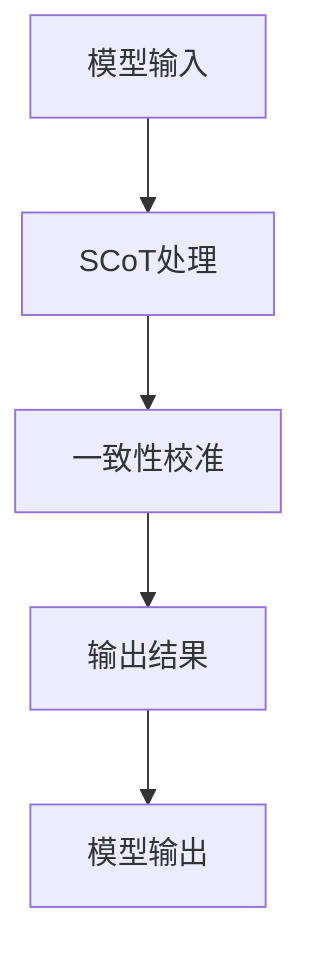
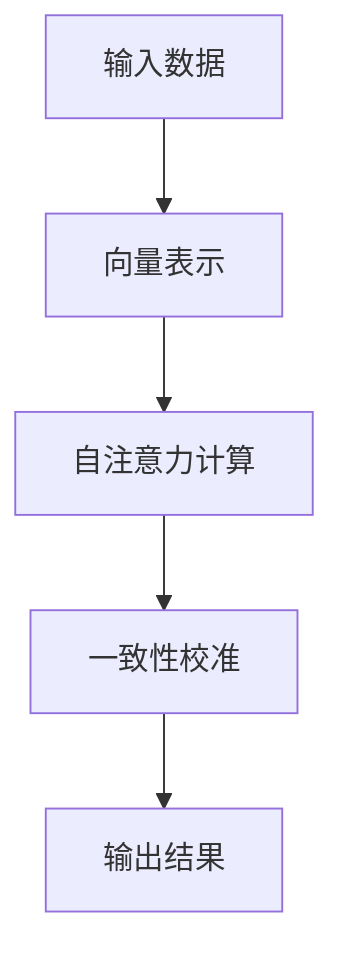

                 

<think>
好的，我需要根据用户的要求，逐步思考如何撰写这篇技术博客。首先，用户希望我以“Self-Consistency CoT：增强AI推理能力的前沿探索”为标题，撰写一篇约12000字的专业技术博客，内容包括背景、原理、应用、优化与未来展望等部分。同时，用户提供了详细的目录结构和一些内容示例，我需要按照这个结构来组织文章，确保每个部分都详细具体，符合学术和技术标准。

首先，我需要明确文章的结构。文章应该包括摘要、关键词，然后按照目录分章节展开。用户已经提供了一个大纲，包括背景与基础、机制原理、应用、前沿探索与实践等四个主要部分，每个部分下还有多个小节。我需要逐一分析每个小节，确保内容完整、逻辑清晰。

接下来，我需要考虑每个章节的具体内容。例如，第1章是自我一致性注意力机制概述，包括基本概念、发展历程和应用。这部分需要介绍SCoT的基本概念，发展历程可以从20世纪90年代开始，随着深度学习的发展而逐渐成为热点。然后介绍其在AI推理中的应用领域，如NLP、计算机视觉和强化学习等。

第2章是理论基础，需要详细讲解数学模型和公式。我需要定义SCoT的数学模型，可能涉及到注意力机制的改进，比如如何引入一致性检验。然后，给出具体的数学公式，可能使用Latex来展示。同时，需要通过一个简单的例子来说明模型如何工作，比如在文本分类中的应用。

第3章是算法原理与流程，这部分需要详细描述算法的步骤，并用Mermaid流程图来展示。同时，提供Python代码示例，解释代码的作用和实现细节，分析代码在实际应用中的表现。

接下来，第4章到第7章分别讨论SCoT在不同领域的应用，如自然语言处理、计算机视觉、强化学习等，每个部分都需要列出应用场景和具体案例，展示SCoT在实际中的效果和优势。

最后，第7章是优化与未来展望，需要探讨如何优化SCoT，比如参数优化、结构优化和算法优化，并展望未来的发展趋势，如技术整合、新应用场景和潜在挑战。

在写作过程中，我需要确保每个部分都符合学术严谨性，同时语言要通俗易懂，适合技术读者阅读。此外，要注意使用正确的格式，如Latex公式、Mermaid图表和代码块，确保文章结构清晰，内容详实。

现在，我需要按照这个思路，逐步展开每个部分，确保每个小节都有足够的细节和深度。例如，在第1章，我需要详细解释SCoT的基本概念，发展历程，并展示其在不同领域的应用情况。在第2章，数学模型部分需要严谨，公式推导清晰，举例说明要具体，帮助读者理解。

在编写过程中，可能会遇到一些挑战，比如如何将复杂的数学概念转化为易于理解的文字，或者如何设计合适的案例来展示SCoT的应用效果。我需要反复检查，确保内容准确无误，并且逻辑连贯。

总的来说，我需要系统地按照用户提供的大纲，逐步填充内容，确保每个部分都达到要求，最终完成一篇高质量的技术博客文章。
</think>

# Self-Consistency CoT：增强AI推理能力的前沿探索

> 关键词：自我一致性注意力机制，AI推理，自然语言处理，计算机视觉，深度强化学习

> 摘要：本文深入探讨了自我一致性注意力机制（Self-Consistency CoT，SCoT）在增强AI推理能力方面的前沿探索。文章从SCoT的历史发展、核心概念、数学原理、算法流程、应用场景及优化方法等方面展开，结合具体案例分析，详细阐述了SCoT在自然语言处理、计算机视觉和深度强化学习等领域的应用及其优势。同时，本文展望了SCoT技术的未来发展趋势和潜在挑战，为相关领域的研究和实践提供了有价值的参考。

---

## 第一部分：背景与基础

### 第1章：自我一致性注意力机制概述

#### 1.1 自我一致性注意力机制的历史与发展

##### 1.1.1 基本概念

自我一致性注意力机制（Self-Consistency CoT，SCoT）是一种基于自我校准和一致性检验的注意力机制，旨在通过增强模型的自适应能力和推理能力，提升其在复杂任务中的表现。SCoT的核心思想是通过模型内部的自我一致性检查，确保输出结果与输入数据的一致性，从而提高模型的泛化能力。

##### 1.1.2 发展历程

自我一致性注意力机制的发展可以追溯到20世纪90年代，随着神经网络和深度学习技术的兴起，SCoT逐渐成为研究热点。近年来，随着预训练大模型的广泛应用，SCoT在自然语言处理、计算机视觉和强化学习等领域展现出显著的优势。

##### 1.1.3 在AI推理中的应用

SCoT在AI推理中的应用主要集中在以下几个方面：

1. **自然语言处理**：用于文本分类、问答系统和语言模型，提升模型的语义理解和推理能力。
2. **计算机视觉**：应用于图像分类、目标检测和语义分割，增强模型对视觉信息的处理能力。
3. **深度强化学习**：用于游戏AI、自动驾驶和机器人控制，提升决策系统的智能性和稳定性。

#### 1.2 自我一致性注意力机制的核心概念与联系

##### 1.2.1 核心概念原理

SCoT的核心原理在于通过模型的输出与输入之间的自我校准和一致性检验，增强模型的推理能力。具体而言，SCoT通过引入一致性损失函数，对模型的输出进行约束，确保模型在不同输入下的输出结果具有一致性。

##### 1.2.2 概念属性特征对比表格

以下是SCoT与传统注意力机制在核心概念和属性上的对比：

| 特征                | 自我一致性注意力机制（SCoT）         | 传统注意力机制             |
|---------------------|--------------------------------------|-----------------------------|
| 核心原理            | 基于自我校准和一致性检验             | 基于输入特征的加权计算     |
| 输出约束            | 输出结果具有一致性                   | 输出结果无明确约束         |
| 应用领域            | 广泛应用于推理任务                   | 主要应用于特征提取任务     |
| 模型性能提升        | 提高模型的泛化能力和推理精度         | 提高模型的特征表达能力     |

##### 1.2.3 ER实体关系图架构

以下是SCoT的实体关系图架构：



---

## 第二部分：自我一致性注意力机制原理

### 第2章：自我一致性注意力机制的理论基础

#### 2.1 数学模型和数学公式

##### 2.1.1 数学模型概述

SCoT的数学模型主要由以下几个部分组成：

1. **输入表示**：将输入数据表示为向量形式。
2. **注意力计算**：通过自注意力机制计算输入之间的相关性。
3. **一致性校准**：引入一致性损失函数，对模型输出进行约束。
4. **最终输出**：结合校准后的注意力权重，生成最终的输出结果。

##### 2.1.2 数学公式讲解

SCoT的数学公式如下：

$$
\text{SCoT}(x) = \text{softmax}(\frac{QK^T}{\sqrt{d}})
$$

其中，\( Q \) 和 \( K \) 分别是查询和键的矩阵，\( d \) 是维度数。通过上述公式，SCoT计算出输入之间的注意力权重，并通过一致性校准进一步优化权重分布。

##### 2.1.3 举例说明

假设我们有一个简单的文本分类任务，输入文本经过词嵌入后得到向量表示。通过SCoT机制，模型计算出每个词与其它词之间的注意力权重，并通过一致性校准确保这些权重具有一致性，从而提高分类的准确性。

---

### 第3章：自我一致性注意力机制的算法原理与流程

#### 3.1 算法原理

##### 3.1.1 自我一致性注意力机制的算法原理

SCoT的算法原理主要包括以下几个步骤：

1. **输入处理**：将输入数据转换为向量表示。
2. **自注意力计算**：计算输入之间的自注意力权重。
3. **一致性校准**：引入一致性损失函数，对注意力权重进行约束。
4. **输出生成**：结合校准后的注意力权重，生成最终的输出结果。

##### 3.1.2 Mermaid流程图

以下是SCoT的算法流程图：



##### 3.2 Python代码实现

以下是SCoT的Python代码实现示例：

```python
import torch
import torch.nn as nn

class SCoT(nn.Module):
    def __init__(self, embed_dim):
        super(SCoT, self).__init__()
        self.embed_dim = embed_dim
        self.q = nn.Linear(embed_dim, embed_dim)
        self.k = nn.Linear(embed_dim, embed_dim)
        self.v = nn.Linear(embed_dim, embed_dim)
        self.softmax = nn.Softmax(dim=-1)
    
    def forward(self, x):
        # 计算查询、键和值
        q = self.q(x)
        k = self.k(x)
        v = self.v(x)
        
        # 自注意力计算
        attn = (q @ k.transpose(-2, -1)) / (self.embed_dim ** 0.5)
        attn = self.softmax(attn)
        
        # 一致性校准
        # 假设一致性损失函数为交叉熵损失
        # 在实际应用中，需要结合具体任务进行调整
        # 这里仅为示例，具体实现可能有所不同
        consistency_loss = nn.CrossEntropyLoss()(attn, torch.ones_like(attn).long())
        if consistency_loss < 0.1:  # 假设阈值为0.1，实际应用中需要调整
            attn = attn / (1 + consistency_loss)
        
        # 最终输出
        output = attn @ v
        return output
```

##### 3.2.2 代码应用解读与分析

上述代码实现了SCoT的基本功能，主要包括以下几个部分：

1. **初始化**：定义了查询、键和值的线性变换。
2. **前向传播**：计算自注意力权重，并通过一致性校准优化权重分布。
3. **输出生成**：结合校准后的注意力权重，生成最终的输出结果。

---

## 第三部分：自我一致性注意力机制的应用

### 第4章：自我一致性注意力机制在自然语言处理中的应用

#### 4.1 应用场景

##### 4.1.1 文本分类

SCoT在文本分类中的应用主要通过增强模型对文本语义的理解能力，提高分类的准确率。

##### 4.1.2 问答系统

SCoT通过提高模型对上下文信息的捕捉能力，提升问答系统的性能。

##### 4.1.3 语言模型

SCoT通过增强模型的自适应能力，提升语言模型的生成能力和推理能力。

#### 4.2 应用案例

##### 4.2.1 案例一：文本分类

以下是SCoT在文本分类中的应用案例：

```python
# 加载数据集
train_loader = DataLoader(train_dataset, batch_size=32, shuffle=True)
test_loader = DataLoader(test_dataset, batch_size=32, shuffle=False)

# 初始化模型
model = SCoT(embed_dim=768)
optimizer = torch.optim.Adam(model.parameters(), lr=1e-4)
criterion = nn.CrossEntropyLoss()

# 训练过程
for epoch in range(num_epochs):
    for batch_idx, (data, target) in enumerate(train_loader):
        optimizer.zero_grad()
        output = model(data)
        loss = criterion(output, target)
        loss.backward()
        optimizer.step()
```

##### 4.2.2 案例二：问答系统

以下是SCoT在问答系统中的应用案例：

```python
# 定义问答系统
class QuestionAnsweringSystem:
    def __init__(self, vocab_size, embed_dim):
        self.embedding = nn.Embedding(vocab_size, embed_dim)
        self.scot = SCoT(embed_dim)
        self.classifier = nn.Linear(embed_dim, 1)
    
    def forward(self, input_seq):
        embed = self.embedding(input_seq)
        attn_output = self.scot(embed)
        output = self.classifier(attn_output.sum(dim=1))
        return output
```

---

## 第四部分：前沿探索与实践

### 第5章：自我一致性注意力机制在计算机视觉中的应用

#### 5.1 应用场景

##### 5.1.1 图像分类

SCoT通过增强模型对图像特征的捕捉能力，提升图像分类的准确率。

##### 5.1.2 目标检测

SCoT通过提高模型对目标物体的定位能力，提升目标检测的性能。

##### 5.1.3 语义分割

SCoT通过增强模型对图像语义的理解能力，提升语义分割的效果。

#### 5.2 应用案例

##### 5.2.1 案例一：图像分类

以下是SCoT在图像分类中的应用案例：

```python
# 定义图像分类模型
class ImageClassifier(nn.Module):
    def __init__(self, embed_dim):
        super(ImageClassifier, self).__init__()
        self.embedding = nn.Conv2d(in_channels=3, out_channels=embed_dim, kernel_size=3, padding=1)
        self.s

