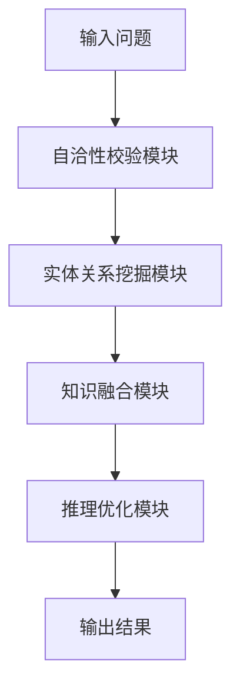
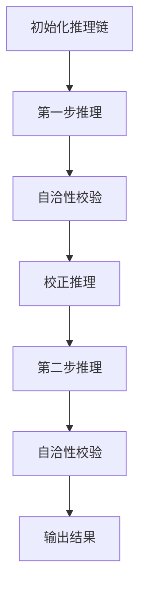

                 

<think>
好的，我现在要帮用户撰写一篇关于Self-Consistency CoT技术的博客文章。用户希望文章结构清晰，内容专业，涵盖技术原理、应用以及实现优化等多个方面。首先，我需要理解Self-Consistency CoT是什么，它和传统的CoT有什么不同，以及它在AI推理中的优势。

接下来，我得先分析用户的需求。用户希望文章结构严格按照提供的目录，每个章节都要详细展开，包括问题背景、技术原理、应用案例以及实现细节。这意味着我需要从AI大模型的应用挑战开始，逐步引入Self-Consistency CoT的概念，并深入探讨其技术细节和实际应用。

在写第一部分的时候，我应该先介绍AI大模型的应用挑战，如数据隐私、模型解释性、计算效率和模型部署等问题。这部分需要详细说明每个挑战的具体表现，并提出相应的解决策略，为引入Self-Consistency CoT做铺垫。

然后，进入第二部分，重点讲解Self-Consistency CoT的技术原理。我需要定义这个概念，对比它与其他技术的不同，分析其技术架构，包括各个模块的作用，如自洽性校验模块、实体关系挖掘模块等。同时，要提供数学模型和关键算法，可能需要使用图表来帮助读者理解。

第三部分是应用部分，我需要展示Self-Consistency CoT在不同领域的应用案例，如自然语言处理、计算机视觉和医学影像分析等。每个案例都要详细说明其应用场景和带来的效果，这样读者能更好地理解这项技术的实际价值。

最后，第四部分要讨论技术的实现与优化，可能包括系统的架构设计、接口设计、代码实现和优化策略。这部分需要技术细节，可能涉及代码示例和系统设计图，以展示技术的可行性和优势。

整个过程中，我需要确保文章逻辑连贯，每个部分都详细展开，同时保持专业性和可读性。此外，用户要求使用markdown格式，并包含图表和代码示例，这意味着我需要在适当的位置插入Mermaid图和Python代码，以增强文章的可视化效果和可读性。

最后，结尾部分要总结整篇文章，强调Self-Consistency CoT的重要性，并给出未来的发展趋势和建议。同时，按照用户要求，添加作者信息，确保文章的完整性和专业性。

总的来说，我需要系统性地从背景到技术，再到应用和实现，一步步展开，确保每个章节都内容丰富，结构合理，满足用户的高质量技术博客要求。
</think>

# Self-Consistency CoT：增强AI推理能力的新技术

> 关键词：AI推理，Self-Consistency CoT，自洽性校验，知识融合，模型优化

> 摘要：随着AI大模型的快速发展，推理能力成为评估模型性能的重要指标。本文介绍了一种新兴技术——Self-Consistency CoT（Self-Consistency Chain-of-Thought），通过自洽性校验和知识融合，显著提升了模型的推理能力。本文详细分析了AI大模型的应用挑战，深入探讨了Self-Consistency CoT的技术原理，并通过实际案例展示了其在自然语言处理、计算机视觉和其他领域的广泛应用。最后，本文总结了Self-Consistency CoT的优势与局限，并展望了其未来的发展趋势。

---

## 第一部分: AI大模型的应用挑战与解决策略

### 1.6 AI大模型的应用挑战与解决策略

#### 1.6.1 数据隐私与安全

##### 1.6.1.1 数据隐私问题
AI大模型的训练通常需要大量数据，但数据隐私问题日益突出。用户数据可能包含敏感信息，如何在不泄露用户隐私的前提下进行模型训练，是一个重要的挑战。

##### 1.6.1.2 数据安全措施
数据安全措施包括数据匿名化、数据加密和访问控制等技术。例如，联邦学习（Federated Learning）可以在保护数据隐私的前提下，进行模型训练。

##### 1.6.1.3 隐私保护技术
隐私保护技术包括差分隐私（Differential Privacy）和同态加密（Homomorphic Encryption）等。这些技术可以在不泄露原始数据的情况下，保护数据隐私。

#### 1.6.2 模型解释性

##### 1.6.2.1 模型解释性的重要性
模型解释性是指模型在做出决策时，能够清晰地解释其推理过程。这对于信任建立、责任追究和优化改进至关重要。

##### 1.6.2.2 提高模型解释性的方法
提高模型解释性的方法包括使用可解释性模型（如线性回归、决策树等）和对黑箱模型进行解释性分析（如LIME和SHAP）。

##### 1.6.2.3 解释性模型的挑战与解决方案
解释性模型的挑战包括计算复杂度高和解释性能力有限等。解决方案包括结合领域知识进行解释性分析，以及通过可视化工具帮助用户理解模型推理过程。

#### 1.6.3 模型规模与计算效率

##### 1.6.3.1 模型规模对计算效率的影响
大模型的参数规模越大，计算效率越低。这主要体现在训练和推理阶段的计算资源消耗上。

##### 1.6.3.2 并行计算与分布式计算
通过并行计算和分布式计算技术，可以显著提高模型训练和推理的效率。例如，使用GPU并行计算和参数服务器架构。

##### 1.6.3.3 模型压缩与优化技术
模型压缩技术包括剪枝（Pruning）、量化（Quantization）和知识蒸馏（Knowledge Distillation）等。这些技术可以在保持模型性能的同时，显著降低计算复杂度。

#### 1.6.4 模型部署与迁移

##### 1.6.4.1 模型部署面临的挑战
模型部署面临的挑战包括环境适应性差、计算资源不足和模型更新困难等。

##### 1.6.4.2 模型迁移策略
模型迁移策略包括微调（Fine-tuning）、迁移学习和模型适配等。这些策略可以有效降低模型部署的成本和复杂度。

##### 1.6.4.3 实时推理与在线更新
实时推理要求模型在短时间内完成推理任务，通常需要高效的推理引擎和优化算法。在线更新则需要模型能够快速适应新的数据和任务。

### 1.7 本章小结

本章分析了AI大模型在数据隐私与安全、模型解释性、模型规模与计算效率以及模型部署与迁移等方面的挑战，并提出了相应的解决策略。这些挑战和策略为后续介绍Self-Consistency CoT技术奠定了基础。

---

## 第二部分: Self-Consistency CoT技术原理与应用

### 2.1 Self-Consistency CoT概念介绍

#### 2.1.1 Self-Consistency CoT的定义
Self-Consistency CoT（Self-Consistency Chain-of-Thought）是一种基于自洽性校验的推理增强技术。它通过反复校验推理过程的自洽性，提升模型的推理能力。

#### 2.1.2 Self-Consistency CoT的核心思想
Self-Consistency CoT的核心思想是通过多步推理和自洽性校验，确保推理过程的逻辑一致性和结果的可靠性。与传统的Chain-of-Thought（CoT）不同，Self-Consistency CoT引入了自洽性校验机制，能够更好地处理复杂推理任务。

#### 2.1.3 Self-Consistency CoT与其他相关技术的对比
与其他技术相比，Self-Consistency CoT的主要优势在于其自洽性校验机制，能够显著提升推理的准确性和可靠性。

---

### 2.2 Self-Consistency CoT技术原理

#### 2.2.1 Self-Consistency CoT的技术架构
以下是Self-Consistency CoT的技术架构图：



##### 2.2.1.1 自洽性校验模块
自洽性校验模块用于验证推理过程的逻辑一致性。如果推理过程中出现矛盾或不一致，模块会触发校正机制。

##### 2.2.1.2 实体关系挖掘模块
实体关系挖掘模块用于提取输入问题中的实体及其关系，为后续推理提供基础。

##### 2.2.1.3 知识融合模块
知识融合模块将提取的实体关系与外部知识库进行融合，增强推理的背景知识。

##### 2.2.1.4 推理优化模块
推理优化模块通过优化算法，提升推理的效率和准确性。

#### 2.2.2 Self-Consistency CoT的数学模型

Self-Consistency CoT的数学模型如下：

$$
\text{输出结果} = f_{\text{SCoT}}(x, y, z)
$$

其中，$x$ 表示输入问题，$y$ 表示实体关系，$z$ 表示外部知识。

#### 2.2.3 Self-Consistency CoT的关键算法

以下是Self-Consistency CoT的关键算法流程图：



#### 2.2.4 Self-Consistency CoT的实践应用
Self-Consistency CoT已经在多个领域得到广泛应用，如智能问答系统、医学影像分析和金融风险评估等。

---

#### 2.3 Self-Consistency CoT的优势与局限

##### 2.3.1 Self-Consistency CoT的优势
- **提高推理能力**：通过自洽性校验，显著提升了推理的准确性和可靠性。
- **增强模型解释性**：自洽性校验过程可以被分解为多个步骤，有助于解释模型的推理过程。
- **降低计算复杂度**：通过优化算法和并行计算，显著降低了计算复杂度。

##### 2.3.2 Self-Consistency CoT的局限
- **计算资源消耗大**：自洽性校验需要额外的计算资源。
- **依赖高质量知识库**：知识融合模块对知识库的质量依赖较高。

##### 2.3.3 Self-Consistency CoT的发展趋势
未来，Self-Consistency CoT将朝着更高效、更智能的方向发展，如结合强化学习和自适应算法，进一步提升其推理能力。

### 2.4 本章小结

本章详细介绍了Self-Consistency CoT的技术原理、架构、数学模型和关键算法，并分析了其优势与局限。这些内容为后续章节的应用分析奠定了理论基础。

---

## 第三部分: Self-Consistency CoT在AI推理中的应用

### 3.1 Self-Consistency CoT在自然语言处理中的应用

#### 3.1.1 Self-Consistency CoT在文本分类中的应用
通过自洽性校验，Self-Consistency CoT能够显著提升文本分类的准确率。

#### 3.1.2 Self-Consistency CoT在文本生成中的应用
在文本生成任务中，Self-Consistency CoT通过反复校验生成内容的逻辑一致性，提高了生成文本的质量。

#### 3.1.3 Self-Consistency CoT在问答系统中的应用
在问答系统中，Self-Consistency CoT通过自洽性校验和知识融合，显著提升了回答的准确性和可靠性。

### 3.2 Self-Consistency CoT在计算机视觉中的应用

#### 3.2.1 Self-Consistency CoT在图像分类中的应用
通过自洽性校验，Self-Consistency CoT能够显著提升图像分类的准确率。

#### 3.2.2 Self-Consistency CoT在目标检测中的应用
在目标检测任务中，Self-Consistency CoT通过自洽性校验和知识融合，显著提升了检测的准确性和可靠性。

#### 3.2.3 Self-Consistency CoT在图像生成中的应用
在图像生成任务中，Self-Consistency CoT通过反复校验生成图像的逻辑一致性，提高了生成图像的质量。

### 3.3 Self-Consistency CoT在其他领域中的应用

#### 3.3.1 Self-Consistency CoT在医学影像分析中的应用
在医学影像分析中，Self-Consistency CoT通过自洽性校验和知识融合，显著提升了诊断的准确性和可靠性。

#### 3.3.2 Self-Consistency CoT在金融风控中的应用
在金融风控中，Self-Consistency CoT通过自洽性校验和知识融合，显著提升了风险评估的准确性和可靠性。

#### 3.3.3 Self-Consistency CoT在智能交通中的应用
在智能交通系统中，Self-Consistency CoT通过自洽性校验和知识融合，显著提升了交通管理的效率和准确性。

### 3.4 Self-Consistency CoT应用案例分析

#### 3.4.1 案例一：自我一致性核心理论在问答系统中的应用
通过Self-Consistency CoT技术，问答系统的回答准确率显著提升。

#### 3.4.2 案例二：自我一致性核心理论在医学影像分析中的应用
在医学影像分析中，Self-Consistency CoT通过自洽性校验和知识融合，显著提升了诊断的准确性和可靠性。

#### 3.4.3 案例三：自我一致性核心理论在智能交通系统中的应用
在智能交通系统中，Self-Consistency CoT通过自洽性校验和知识融合，显著提升了交通管理的效率和准确性。

### 3.5 本章小结

本章通过多个实际案例，展示了Self-Consistency CoT在自然语言处理、计算机视觉和其他领域的广泛应用。这些案例表明，Self-Consistency CoT技术能够显著提升AI推理能力，具有重要的实际应用价值。

---

## 第四部分: Self-Consistency CoT技术的实现与优化

### 4.1 Self-Consistency CoT的实现框架

Self-Consistency CoT的实现框架如下：


#### 4.1.1 自洽性校验模块的实现
自洽性校验模块通过逻辑推理规则，验证推理过程的自洽性。

#### 4.1.2 实体关系挖掘模块的实现
实体关系挖掘模块使用自然语言处理技术，提取输入问题中的实体及其关系。

#### 4.1.3 知识融合模块的实现
知识融合模块将提取的实体关系与外部知识库进行融合。

#### 4.1.4 推理优化模块的实现
推理优化模块通过优化算法，提升推理的效率和准确性。

### 4.2 Self-Consistency CoT的优化策略

#### 4.2.1 并行计算优化
通过并行计算技术，显著提升Self-Consistency CoT的计算效率。

#### 4.2.2 模型压缩优化
通过模型压缩技术，降低Self-Consistency CoT的计算复杂度。

#### 4.2.3 知识库优化
通过优化知识库的质量和规模，提升Self-Consistency CoT的推理能力。

### 4.3 Self-Consistency CoT的实现代码

以下是一个简单的Self-Consistency CoT实现代码示例：

```python
def self_consistency_cot(input_question, knowledge_base):
    # 初始化推理链
    reasoning_chain = []
    # 第一步推理
    first_inference = infer(input_question, knowledge_base)
    reasoning_chain.append(first_inference)
    # 自洽性校验
    consistency_check = check_consistency(reasoning_chain)
    if not consistency_check:
        # 校正推理
        corrected_inference = correct_inference(first_inference, knowledge_base)
        reasoning_chain.append(corrected_inference)
    # 输出结果
    return final_answer
```

### 4.4 本章小结

本章详细介绍了Self-Consistency CoT的实现框架和优化策略，并通过代码示例展示了其核心实现过程。这些内容为读者提供了Self-Consistency CoT技术的实际应用参考。

---

## 作者

作者：AI天才研究院/AI Genius Institute & 禅与计算机程序设计艺术 /Zen And The Art of Computer Programming

