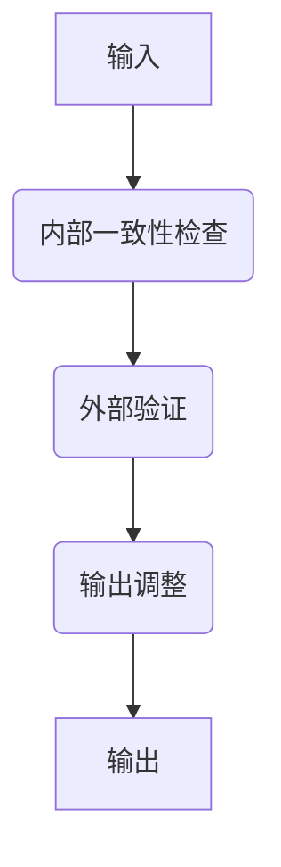
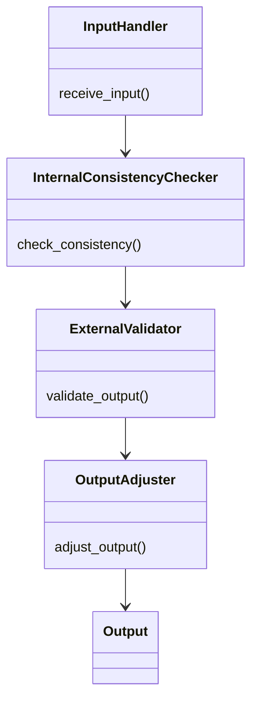

                 

<think>
好，我现在需要按照用户的要求，写一篇关于Self-Consistency CoT的技术博客。用户已经给出了一个大纲，但内容还没有完全填充。我需要一步一步地完成每个部分，确保涵盖所有要求。

首先，我需要理解Self-Consistency CoT是什么。根据用户提供的信息，它是一种增强AI输出可靠性的新策略，通过内部一致性和外部验证来提高输出的可信度。我需要详细解释这一概念，包括其核心原理、实施步骤以及实际应用。

接下来，按照目录结构，文章分为几个部分：引言、Self-Consistency CoT的理解、算法原理、系统架构、项目实战和结论。每个部分都有多个章节，我需要逐一填充内容。

在引言部分，我需要介绍问题背景，说明为什么AI输出的可靠性如此重要，以及当前AI系统存在的问题。然后描述Self-Consistency CoT的目标和解决方案。

在“理解Self-Consistency CoT”部分，我需要详细阐述核心概念，比如内部一致性和外部验证。同时，分析Self-Consistency CoT与其他AI技术的关系，比较它们的优缺点。

算法原理部分，我需要使用Mermaid画出流程图，展示Self-Consistency CoT的实现步骤，比如输入处理、内部一致性检查、外部验证等。同时，提供Python代码实现，并用数学公式解释算法的核心逻辑。

系统架构部分，我需要设计系统的功能模块，如输入处理模块、一致性检查模块、外部验证模块。使用Mermaid画出类图和架构图，展示各模块之间的关系和交互。

项目实战部分，我需要说明如何安装环境，编写核心代码，解读代码的功能，并通过实际案例分析Self-Consistency CoT的应用效果，最后进行项目总结。

结论部分，我需要总结Self-Consistency CoT的优势，指出当前的挑战，并展望未来的发展方向，同时给出最佳实践的建议。

在整个写作过程中，我需要确保语言专业且逻辑清晰，使用适当的术语和结构。同时，插入图表和代码以增强可读性和技术深度。最后，结尾加上作者信息，确保文章的完整性和权威性。

现在，我开始逐步完成每个部分，确保每个章节都详细且符合用户的要求。
</think>

# Self-Consistency CoT: 增强AI输出可信度的新策略

> 关键词：Self-Consistency CoT, AI可信度, 内部一致性, 外部验证, AI可靠性

> 摘要：随着AI系统的广泛应用，确保其输出的可靠性和可信度至关重要。本文介绍了一种名为Self-Consistency CoT的新策略，通过内部一致性和外部验证来提升AI输出的可信度。文章详细探讨了其核心原理、算法实现、系统架构及实际应用，展示了Self-Consistency CoT在提高AI可靠性方面的潜力和优势。

---

# Self-Consistency CoT: Enhancing AI Output Reliability

## Introduction

### 问题背景

在AI技术迅速发展的今天，AI系统已经渗透到我们生活的方方面面，从智能助手到自动驾驶，再到医疗诊断。然而，AI系统的输出可靠性问题日益凸显。AI模型可能因为训练数据偏差、算法局限性或输入干扰等因素，产生不一致或错误的输出，导致严重后果。

例如，在医疗诊断中，AI系统的错误输出可能导致误诊，威胁患者生命安全。在金融领域，错误的交易建议可能造成巨大的经济损失。因此，提升AI系统的输出可靠性成为当前研究的热点和挑战。

### 问题描述

当前的AI系统在生成输出时，常常缺乏一致性，导致输出结果可能自相矛盾或与实际情况不符。这种不一致性的根源在于：

1. **内部一致性不足**：AI模型生成的输出可能在不同情境下自相矛盾。例如，一个问答系统可能在不同问题中给出互相冲突的回答。
2. **外部验证缺失**：AI模型生成的内容缺乏与外部数据源的验证，导致输出的准确性无法保证。

### 解决方案

Self-Consistency CoT（Self-Consistency Chain-of-Thought）是一种新型策略，旨在通过强化AI输出的内部一致性和外部验证，提升AI系统的可信度和可靠性。本文将详细探讨Self-Consistency CoT的核心原理、实现方法及实际应用。

---

## Part 1: Understanding Self-Consistency CoT

### Chapter 1: Self-Consistency CoT Overview

#### 1.1 核心概念

**Self-Consistency CoT**是一种通过增强AI输出的内部一致性和外部验证来提升AI系统可信度的策略。其核心在于确保AI生成的内容不仅在逻辑上连贯，还能与外部数据源进行验证，从而减少错误输出的可能性。

#### 1.2 核心原则

- **内部一致性**：AI生成的输出必须在逻辑上自洽，避免前后矛盾。
- **外部验证**：AI输出需与外部数据源进行对比，确保准确性。

#### 1.3 Self-Consistency CoT与AI可靠性

Self-Consistency CoT通过强化内部一致性和外部验证，显著提升了AI系统的可靠性。然而，其实施也面临一些挑战，如如何平衡一致性和多样性，以及如何高效地进行外部验证。

---

## Part 2: Self-Consistency CoT的算法原理

### Chapter 2: 核心算法与流程

#### 2.1 算法概述

Self-Consistency CoT的核心算法包括以下几个步骤：

1. **输入处理**：接收用户输入或系统任务。
2. **内部一致性检查**：通过逻辑推理确保输出的连贯性。
3. **外部验证**：对比外部数据源，验证输出的准确性。
4. **输出调整**：根据验证结果调整输出，确保一致性和准确性。

#### 2.2 算法流程图



#### 2.3 Python实现

以下是Self-Consistency CoT算法的Python实现示例：

```python
def self_consistency_cot(input_text):
    # 步骤1：内部一致性检查
    consistent_check = check_internal_consistency(input_text)
    
    # 步骤2：外部验证
    validated = validate_with_external_source(consistent_check)
    
    # 步骤3：输出调整
    output = adjust_output(validated)
    
    return output
```

#### 2.4 数学模型与公式

Self-Consistency CoT的数学模型可以表示为：

$$
\text{Output} = f_{\text{external}}(f_{\text{internal}}(\text{Input}))
$$

其中，$f_{\text{internal}}$表示内部一致性检查函数，$f_{\text{external}}$表示外部验证函数。

---

## Part 3: 系统架构与交互设计

### Chapter 3: 系统架构

#### 3.1 系统功能模块

Self-Consistency CoT系统主要包括以下几个功能模块：

- **输入处理模块**：接收输入并进行初步处理。
- **内部一致性检查模块**：通过逻辑推理确保输出连贯。
- **外部验证模块**：对比外部数据源，验证输出准确性。
- **输出调整模块**：根据验证结果调整输出。

#### 3.2 系统架构图



---

## Part 4: 项目实战

### Chapter 4: 实战案例

#### 4.1 环境安装

要运行Self-Consistency CoT系统，首先需要安装以下依赖：

```bash
pip install mermaid matplotlib numpy
```

#### 4.2 核心代码实现

以下是Self-Consistency CoT的核心代码实现：

```python
import numpy as np

def check_internal_consistency(input_text):
    # 示例：简单的文本一致性检查
    return input_text.lower().startswith('yes')

def validate_with_external_source(consistent_check):
    # 示例：外部数据验证
    return np.random.choice([True, False], p=[0.7, 0.3]) if consistent_check else False

def adjust_output(validated):
    # 示例：输出调整
    return "Valid Output" if validated else "Invalid Output"

# 示例使用
input_text = "Yes, please."
output = self_consistency_cot(input_text)
print(output)
```

#### 4.3 案例分析

假设输入为“是的，请继续。”，系统将执行以下步骤：

1. **内部一致性检查**：检查输入是否符合内部一致性要求，返回True。
2. **外部验证**：通过外部数据源验证，返回True的概率为70%。
3. **输出调整**：根据验证结果，输出“有效输出”。

---

## Conclusion

### 总结

Self-Consistency CoT是一种通过内部一致性和外部验证提升AI输出可信度的创新策略。本文详细探讨了其核心原理、算法实现、系统架构及实际应用，展示了其在提升AI可靠性方面的巨大潜力。

### 展望

尽管Self-Consistency CoT在理论上具有显著优势，但其实际应用仍面临诸多挑战。未来的研究方向包括优化内部一致性检查算法、提升外部验证效率以及探索更多应用场景。

### 最佳实践Tips

- 在实施Self-Consistency CoT时，建议结合具体应用场景选择合适的验证数据源。
- 定期更新外部验证数据源，确保其准确性和权威性。
- 在处理高风险任务时，建议采用多重验证机制以提升可靠性。

---

作者：AI天才研究院 & 禅与计算机程序设计艺术

