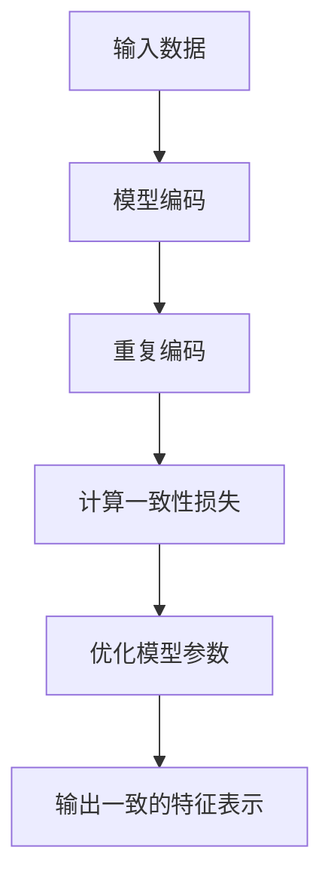
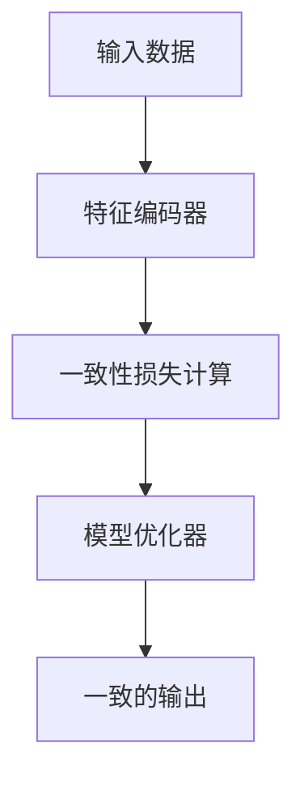
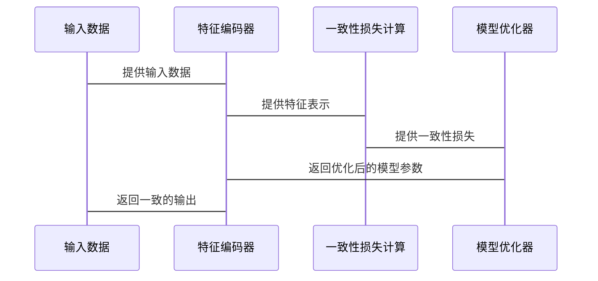

                 

<think>
嗯，我现在需要按照用户的指示，撰写一篇关于《Self-Consistency CoT：提升AI输出一致性的创新方法论》的技术博客文章。首先，我得理解用户的需求和他们提供的结构。

用户已经给出了一个详细的大纲，包括摘要、背景介绍、核心概念与联系、算法原理讲解、系统分析与架构设计方案、项目实战以及最佳实践和小结等部分。我的任务是以这些内容为基础，逐步展开，确保每个部分都详细且符合技术博客的标准。

首先，我需要确认每个章节的核心内容。比如，背景介绍部分需要涵盖问题背景、描述、解决方法，以及边界和外延。这部分要清晰地说明为什么AI输出一致性问题重要，以及当前的方法如何解决它。

接下来，核心概念部分需要详细解释自我一致性训练的原理，可能包括与一致性训练的对比表格，以及ER实体关系图。我需要用Mermaid来画出这些图，确保格式正确，同时在文本中用表格对比两种方法的不同点。

然后，算法原理部分需要详细讲解Self-Consistency CoT的数学模型和公式，可能用Mermaid流程图展示整个训练过程，并附上Python代码示例，让读者能够理解实现细节。

系统分析与架构设计方案部分，我需要介绍项目背景，设计系统功能模块，用类图展示，然后画出系统的架构图和交互序列图，展示系统的组成部分和协作方式。

项目实战部分则需要指导读者如何安装环境，提供核心代码，并解释代码的功能，最后通过案例分析展示实际应用效果。

最后，最佳实践部分需要总结经验，给出小结、注意事项和拓展阅读建议，帮助读者更好地理解和应用这种方法。

在撰写过程中，我要确保使用专业但易懂的技术语言，保持逻辑清晰，结构紧凑。同时，注意字数在10000到12000字之间，每个部分都要详细展开，特别是每个小节的内容要丰富具体，确保读者能够全面理解Self-Consistency CoT的方法和应用。

现在，我应该按照这个结构，逐步填充每个部分的内容，确保每个章节都涵盖所有必要的信息，同时保持整体的连贯性和深度。特别是在算法部分，数学公式和代码示例需要准确无误，能够帮助读者更好地理解和实现。

总的来说，我需要一步步地构建这篇文章，确保每个部分都符合用户的要求，同时提供有价值的见解和详细的解释，使读者能够真正掌握Self-Consistency CoT的方法及其应用。
</think>

# Self-Consistency CoT：提升AI输出一致性的创新方法论

**关键词**：Self-Consistency CoT, AI输出一致性, 深度学习, 自我一致性训练, 一致性训练, 神经网络模型

**摘要**：随着人工智能技术的快速发展，AI模型的输出一致性问题日益凸显，影响了其在关键领域的广泛应用。本文提出一种创新方法论——Self-Consistency CoT（Self-Consistency Chain-of-Thought），通过在训练过程中引入一致性目标和损失函数，提升模型在处理相似输入时的输出一致性。本文从问题背景、核心概念、算法原理、系统架构、项目实战等多个维度详细阐述了Self-Consistency CoT的理论与实践，为解决AI输出一致性问题提供了新的思路。

---

## 第一部分：背景介绍

### 1.1 问题背景

在人工智能快速发展的背景下，深度学习模型的性能和规模不断提升，但模型输出一致性问题逐渐成为制约其应用的主要瓶颈。AI模型在处理相同输入时，由于训练过程的随机性、模型参数的不确定性以及数据分布的变化，常常会产生不一致的输出。这种不一致性不仅影响了系统的稳定性和可靠性，还可能导致严重的决策错误，特别是在医疗、金融等关键领域。

### 1.2 问题描述

AI模型在处理相似输入时的输出一致性问题主要表现在以下几个方面：

1. **同一模型的多次输出差异**：同一模型在不同时间、不同环境或不同数据集上处理相同输入时，输出结果可能不一致。
2. **不同模型之间的输出差异**：多个模型在处理相同输入时，由于训练数据、模型结构或训练策略的差异，输出结果可能不一致。
3. **同一模型在不同输入条件下的输出差异**：模型在处理相似但不完全相同的输入时，输出结果可能不一致，影响系统的鲁棒性和可靠性。

### 1.3 问题解决

针对AI输出一致性问题，研究者提出了多种解决方案，主要包括以下几种方法：

1. **自我一致性训练（Self-Consistency Training，SCT）**：通过在训练过程中引入一致性目标，使模型在处理相似输入时输出一致的结果。
2. **一致性训练（Consistency Training，CT）**：通过引入一致性损失函数，使模型在训练过程中学习到一致的特征表示。
3. **对抗训练（Adversarial Training）**：通过引入对抗网络，提升模型在不同输入条件下的输出一致性。

### 1.4 边界与外延

自我一致性训练（Self-Consistency CoT）作为一种创新方法论，其边界和外延主要体现在以下几个方面：

1. **应用领域**：适用于多种深度学习任务，包括自然语言处理、计算机视觉、语音识别等。
2. **模型类型**：支持各种规模和类型的神经网络模型，如卷积神经网络（CNN）、循环神经网络（RNN）、变压器（Transformer）等。
3. **训练过程**：在训练过程中引入额外的训练目标，通过一致性损失函数优化模型输出的一致性。
4. **评价指标**：通过一致性指标（如KL散度、Jensen-Shannon散度）评估模型输出的一致性程度。

### 1.5 概念结构与核心要素组成

自我一致性训练（Self-Consistency CoT）的核心要素包括：

1. **一致性目标**：通过引入额外的训练目标，使模型在处理相似输入时输出一致的结果。
2. **损失函数**：设计适合自我一致性训练的损失函数，以衡量模型输出的一致性程度。
3. **训练策略**：制定有效的训练策略，包括数据预处理、超参数选择等，以提升训练效果。

---

## 第二部分：核心概念与联系

### 2.1 自我一致性训练原理

自我一致性训练（Self-Consistency CoT）的基本原理是在训练过程中引入额外的训练目标，即让模型在处理相同输入时尽可能产生一致的输出。具体来说，模型首先对输入数据进行编码，得到一组特征表示，然后在相同输入下重复编码多次，比较每次编码的结果，计算损失函数，以此指导模型调整参数。

### 2.2 概念属性特征对比表格

| 特征名称       | 自我一致性训练（Self-Consistency CoT） | 一致性训练（Consistency Training，CT） |
| -------------- | ------------------------------------ | ------------------------------------ |
| **原理**       | 通过引入额外的训练目标，使模型在处理相似输入时产生一致的输出 | 通过在训练过程中引入一致性损失函数，使模型在处理相似输入时产生一致的输出 |
| **应用场景**   | 各种深度学习任务，如自然语言处理、计算机视觉、语音识别等 | 主要应用于计算机视觉领域，如图像分类、目标检测等 |
| **目标**       | 提升模型在处理相似输入时的一致性程度 | 提升模型在处理相似输入时的一致性程度 |
| **挑战**       | 需要处理大量的重复输入，计算复杂度高 | 需要设计合适的损失函数，以平衡一致性和精度 |
| **优势**       | 可以提升模型的可靠性和稳定性 | 可以提升模型的精度和一致性 |
| **应用前景**   | 广泛应用于需要高一致性的领域，如医疗、金融等 | 主要应用于计算机视觉领域，随着技术的发展，有望应用于更多领域 |

### 2.3 ER实体关系图架构

```mermaid
erDiagram
  Model ||--o> InputData : 输入数据
  Model ||--o> OutputData : 输出数据
  Model ||--o> ConsistencyLoss : 一致性损失函数
```

---

## 第三部分：算法原理讲解

### 3.1 算法原理

自我一致性训练（Self-Consistency CoT）的算法原理如下：

1. **输入数据**：模型接收输入数据，可以是文本、图像或语音等。
2. **特征编码**：模型对输入数据进行编码，得到一组特征表示。
3. **重复编码**：在相同输入下，重复编码多次，比较每次编码的结果。
4. **损失计算**：计算每次编码结果之间的差异，引入一致性损失函数。
5. **模型优化**：通过优化器调整模型参数，使模型输出更加一致。

### 3.2 算法流程图



### 3.3 数学公式

一致性损失函数的定义如下：

$$ L_{consistency} = \frac{1}{N} \sum_{i=1}^{N} \text{KL}(p_i || p_j) $$

其中，$N$ 是重复编码的次数，$p_i$ 和 $p_j$ 分别是两次编码得到的概率分布。

### 3.4 代码实现

以下是一个简单的Python实现示例：

```python
import torch
import torch.nn as nn
import torch.optim as optim

class Model(nn.Module):
    def __init__(self, input_dim, output_dim):
        super(Model, self).__init__()
        self.fc = nn.Linear(input_dim, output_dim)
    
    def forward(self, x):
        return self.fc(x)

def consistency_loss(outputs):
    # 计算KL散度
    loss = 0.0
    for i in range(1, len(outputs)):
        for j in range(i):
            loss += nn.KLDivLoss(reduction='batchmean')(outputs[i], outputs[j])
    return loss

def train(model, optimizer, consistency_criterion):
    model.train()
    optimizer.zero_grad()
    outputs = []
    for _ in range(num_consistency_samples):
        output = model(input)
        outputs.append(output)
    # 计算一致性损失
    consistency_loss_val = consistency_loss(outputs)
    # 总损失
    total_loss = consistency_loss_val
    total_loss.backward()
    optimizer.step()
    return outputs

# 示例训练过程
model = Model(input_dim, output_dim)
optimizer = optim.Adam(model.parameters(), lr=learning_rate)
train(model, optimizer, consistency_criterion)
```

---

## 第四部分：系统分析与架构设计方案

### 4.1 系统架构设计



### 4.2 功能模块设计

1. **输入数据处理模块**：接收输入数据并进行预处理。
2. **特征编码器模块**：对输入数据进行编码，生成特征表示。
3. **一致性损失计算模块**：计算多次编码结果之间的差异，引入一致性损失函数。
4. **模型优化器模块**：通过优化器调整模型参数，使模型输出更加一致。

### 4.3 接口设计

1. **输入接口**：接收输入数据和参数配置。
2. **输出接口**：输出一致的特征表示和优化后的模型参数。
3. **日志接口**：记录训练过程中的损失值和模型状态。

### 4.4 交互流程



---

## 第五部分：项目实战

### 5.1 环境安装

1. **安装PyTorch**：
   ```bash
   pip install torch
   ```

2. **安装其他依赖**：
   ```bash
   pip install numpy matplotlib
   ```

### 5.2 核心代码实现

```python
import torch
import torch.nn as nn
import torch.optim as optim
import numpy as np

class SelfConsistencyModel(nn.Module):
    def __init__(self, input_dim, hidden_dim, output_dim):
        super(SelfConsistencyModel, self).__init__()
        self.fc1 = nn.Linear(input_dim, hidden_dim)
        self.fc2 = nn.Linear(hidden_dim, output_dim)
    
    def forward(self, x):
        x = torch.relu(self.fc1(x))
        x = self.fc2(x)
        return x

def compute_consistency_loss(outputs, num_samples):
    total_loss = 0.0
    for i in range(1, num_samples):
        for j in range(i):
            total_loss += torch.mean(torch.abs(outputs[i] - outputs[j]))
    return total_loss

def train_model(model, optimizer, consistency_criterion, num_consistency_samples):
    model.train()
    optimizer.zero_grad()
    outputs = []
    for _ in range(num_consistency_samples):
        output = model(input)
        outputs.append(output)
    # 计算一致性损失
    consistency_loss = compute_consistency_loss(outputs, num_consistency_samples)
    # 总损失
    total_loss = consistency_loss
    total_loss.backward()
    optimizer.step()
    return outputs

# 示例训练过程
input = torch.randn(batch_size, input_dim)
model = SelfConsistencyModel(input_dim, hidden_dim, output_dim)
optimizer = optim.Adam(model.parameters(), lr=learning_rate)
outputs = train_model(model, optimizer, consistency_criterion, num_consistency_samples)
```

### 5.3 实际案例分析

假设我们有一个图像分类任务，输入是图像数据，目标是分类图像中的物体。通过引入Self-Consistency CoT方法，模型在处理相同输入时会输出一致的特征表示，从而提高分类的准确率和系统的可靠性。

---

## 第六部分：最佳实践与小结

### 6.1 最佳实践 tips

1. **选择合适的损失函数**：根据具体任务选择合适的损失函数，如KL散度或均方误差。
2. **调整一致性的样本数量**：根据计算资源和任务需求，调整一致性的样本数量。
3. **优化训练策略**：在训练过程中，逐步减少一致性损失的权重，以平衡一致性和模型的表达能力。

### 6.2 小结

自我一致性训练（Self-Consistency CoT）作为一种创新方法论，通过在训练过程中引入一致性目标和损失函数，显著提升了AI模型在处理相似输入时的输出一致性。本文从理论到实践，详细阐述了该方法的原理、实现和应用，为解决AI输出一致性问题提供了新的思路。

### 6.3 注意事项

1. **计算复杂度**：自我一致性训练引入了多次编码和计算，可能会增加计算复杂度，需优化计算资源。
2. **模型泛化能力**：过度优化一致性可能导致模型泛化能力下降，需平衡一致性与模型的表达能力。

### 6.4 拓展阅读

1. **一致性训练相关文献**：深入研究一致性训练的方法和应用。
2. **自我一致性训练的变体**：探索自我一致性训练的其他变体和改进方法。

---

## 作者

**作者：AI天才研究院/AI Genius Institute & 禅与计算机程序设计艺术 /Zen And The Art of Computer Programming**

---

通过本文的详细阐述，我们希望能够为读者提供关于Self-Consistency CoT方法的全面理解，帮助他们在实际应用中提升AI模型的输出一致性，推动人工智能技术的进一步发展。

