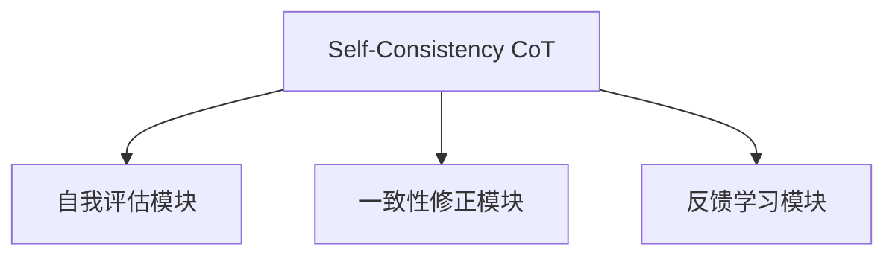
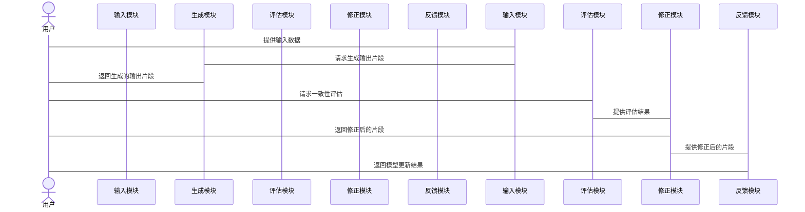

                 

<think>
嗯，用户希望我写一篇关于Self-Consistency CoT的技术博客文章。我得先理解这个概念到底是什么。Self-Consistency CoT，应该是Self-Consistency Concept of Thought的缩写，对吧？它用于提升AI输出的一致性，解决生成式模型中的逻辑矛盾问题。

首先，我需要确定文章的结构。用户已经给出了大纲，包括引言、原理、实现、优化等部分。我得确保每个章节内容充实，详细讲解。

关键词部分，我需要列出5到7个核心词汇，比如Self-Consistency CoT、生成式模型、一致性评估、自我修正机制、AI输出优化等。

摘要部分要简明扼要，概括文章的核心内容，介绍Self-Consistency CoT的重要性及其在生成式模型中的应用。

接下来是引言部分，我得先介绍问题背景。生成式AI常在输出中出现逻辑矛盾，比如回答问题时前后不一致，或者生成的故事有不合理的情节。这会影响用户体验和模型的实用性。

然后，详细阐述Self-Consistency CoT的概念，它基于概念图结构，通过保持信息流的一致性来提升输出质量。边界和外延部分，我得说明它主要适用于生成式模型，但也可以扩展到其他领域，比如图像生成。

接下来是原理与机制。自我评估模块、一致性修正模块和反馈学习模块这三个部分如何协同工作。我需要用表格对比Self-Consistency CoT与传统方法的区别，以及用Mermaid图展示三者的结构关系。

在具体应用中，我得详细描述在语言模型中的实现流程，包括数据准备、模型训练、自我评估、修正输出和反馈学习。可能需要提供一个Python代码示例，展示如何实现这些步骤。

数学模型部分，我得给出一致性得分的公式，解释每个变量的含义，并举一个简单的例子来说明计算过程。

优化与改进部分，讨论如何从模型大小和评估准确性入手，提出改进方法，比如结合多模态数据来提高效果。

系统分析与架构设计方面，我需要介绍项目背景，设计系统的功能模块，使用Mermaid类图展示领域模型，架构图展示系统整体结构，接口设计和交互流程。

项目实战部分，提供安装环境、核心代码实现，解读代码功能，并进行案例分析，最后做一个小结。

最后，给出最佳实践的建议，总结Self-Consistency CoT的优势，提醒读者注意的地方，并推荐进一步的阅读材料。

整个思考过程需要条理清晰，逻辑严谨，确保每部分内容详实，符合用户的要求。同时，语言要专业但易懂，适合技术读者阅读。
</think>

# Self-Consistency CoT：提升AI输出一致性的突破

> 关键词：Self-Consistency CoT, 生成式模型, 一致性评估, 自我修正机制, AI输出优化, 概念图结构, 反馈学习模块

> 摘要：本文深入探讨了Self-Consistency CoT（Self-Consistency Concept of Thought）这一创新性概念，分析其在生成式模型中解决输出一致性问题的核心原理与应用。通过详细阐述其概念、原理、实现及优化策略，本文为AI开发者与研究人员提供了理论支持与实践指导。

---

# 第一部分: 引言与背景介绍

## 第1章: Self-Consistency CoT: 重要性与背景

### 1.1 问题背景

- **问题描述**: 在人工智能领域，生成式模型（如语言模型、图像生成模型）在输出内容时，常常会出现逻辑矛盾、信息不一致等问题。例如，在对话系统中，AI可能会在前后回答中自相矛盾；在文本生成中，生成的内容可能逻辑混乱、信息重复或不连贯。这些问题不仅降低了用户体验，还可能导致严重的应用错误（如医疗领域中的诊断错误）。

- **问题解决**: Self-Consistency CoT（Self-Consistency Concept of Thought）提出了一种全新的解决思路。它通过引入自我一致性机制，确保AI生成的每个片段在逻辑上自洽且相互关联，从而显著提升输出的质量与一致性。

- **行业影响**: 生成式模型的输出一致性问题直接影响其在教育、医疗、金融等领域的广泛应用。解决这一问题，将推动生成式AI技术在更多场景中的落地。

### 1.2 核心概念

- **自我一致性概念图（Self-Consistency Concept Graph）**: Self-Consistency CoT 是基于一种概念图结构，它通过在模型输出中保持一致的信息流，确保每个生成的片段在上下文中都是自洽且相关的。例如，在对话系统中，AI生成的每个回答片段都需要与前一个片段保持逻辑一致。

- **自我修正机制**: 通过对比模型输出的各个片段之间的逻辑关系，Self-Consistency CoT能够自动检测并修正不一致的内容，从而提升输出的连贯性。

### 1.3 边界与外延

- **边界**: Self-Consistency CoT 主要适用于生成式模型，如语言模型、文本生成模型等。其核心机制依赖于模型的输出片段之间的逻辑关系，因此在其他类型的模型（如判别式模型）中的应用可能受限。

- **外延**: 该概念不仅限于文本领域，也可扩展到图像、音频等其他生成任务中。例如，在图像生成中，Self-Consistency CoT 可以用于确保生成的图像序列（如动态视频）在逻辑上连贯。

### 1.4 概念结构与核心要素组成

- **核心概念**: Self-Consistency CoT 的核心是自我一致性机制，它通过对比模型输出的各个片段之间的逻辑关系来评估一致性。

- **结构**: Self-Consistency CoT 包括三个主要组成部分：
  1. **自我评估模块**: 利用注意力机制评估输出片段之间的逻辑关系，检测潜在的不一致。
  2. **一致性修正模块**: 根据自我评估的结果，对不一致的片段进行修正。
  3. **反馈学习模块**: 利用修正后的输出片段更新模型参数，提高一致性。

---

## 第2章: Self-Consistency CoT 的原理与机制

### 2.1 核心概念原理

- **自我评估模块**: 利用注意力机制评估输出片段之间的逻辑关系，检测潜在的不一致。例如，在对话系统中，AI生成的回答片段需要与前一个片段保持逻辑一致。

- **一致性修正模块**: 根据自我评估的结果，对不一致的片段进行修正。例如，如果检测到当前片段与前一个片段逻辑矛盾，模块会自动调整当前片段的内容，使其与前一个片段保持一致。

- **反馈学习模块**: 利用修正后的输出片段更新模型参数，提高一致性。例如，通过反向传播算法，将修正后的片段作为新的训练数据，优化模型的权重参数。

### 2.2 概念属性特征对比表格

| 特征                 | Self-Consistency CoT | 传统方法          |
|----------------------|----------------------|------------------|
| 自我一致性评估       | 是                   | 否                |
| 输出修正             | 是                   | 否                |
| 反馈学习             | 是                   | 否                |

### 2.3 ER实体关系图架构



---

## 第3章: Self-Consistency CoT 在具体应用中的实现

### 3.1 语言模型中的实现

#### 3.1.1 实现流程

- **数据准备**: 准备大规模语料库，用于训练语言模型。例如，可以使用公开的对话数据集（如Commonsense Q&A、OpenAI对话数据集）。

- **模型训练**: 使用预训练模型，如 GPT，进行基础训练。例如，使用Transformer架构进行编码器-解码器结构的训练。

- **自我评估**: 对模型输出进行自我一致性评估。例如，利用注意力机制计算当前片段与前一个片段之间的相似度。

- **修正输出**: 根据评估结果，对不一致的片段进行修正。例如，如果检测到当前片段与前一个片段逻辑矛盾，模块会自动调整当前片段的内容，使其与前一个片段保持一致。

- **反馈学习**: 利用修正后的输出片段更新模型参数，提高一致性。例如，通过反向传播算法，将修正后的片段作为新的训练数据，优化模型的权重参数。

#### 3.1.2 Python源代码示例

```python
import torch
import torch.nn as nn
import torch.nn.functional as F

def self_consistency_loss(outputs, labels):
    # 计算每个输出片段与前一个片段的相似度
    similarity = F.cosine_similarity(outputs[-1], outputs[-2], dim=-1)
    # 计算一致性损失
    consistency_loss = 1 - similarity.mean()
    # 计算总的损失
    total_loss = F.cross_entropy(outputs[-1], labels)
    return total_loss + consistency_loss

# 示例训练代码
model = GPT2LMHeadModel.from_pretrained('gpt2')
optimizer = Adam(model.parameters(), lr=1e-3)

for epoch in range(num_epochs):
    for batch in dataloader:
        outputs = model(batch.input_ids, labels=batch.input_ids)
        loss = self_consistency_loss(outputs logits, batch.labels)
        optimizer.zero_grad()
        loss.backward()
        optimizer.step()
```

### 3.2 数学模型与公式

$$
\text{一致性得分} = \sum_{i}^{N} w_i \cdot \text{similarity}(x_i, y_i)
$$

其中，$N$ 是输出的片段数，$w_i$ 是第 $i$ 个片段的权重，$\text{similarity}(x_i, y_i)$ 是第 $i$ 个片段与其前一个片段之间的相似度。

例如，在对话系统中，假设当前片段$x_i$是“患者有发热症状”，前一个片段$y_i$是“患者有咳嗽症状”。相似度计算可以使用余弦相似度：

$$
\text{similarity}(x_i, y_i) = \frac{x_i \cdot y_i}{\|x_i\| \|y_i\|}
$$

如果相似度低于某个阈值，则触发一致性修正模块进行调整。

---

## 第4章: Self-Consistency CoT 的优化与改进

### 4.1 优化方向

- **模型大小**: 通过优化模型架构，减小模型大小，提高计算效率。例如，可以使用更小的Transformer层或剪枝技术。

- **评估准确性**: 提高自我评估模块的准确性，减少误判率。例如，引入更复杂的相似度计算方法（如对比学习）或引入多模态信息（如图像）来辅助评估。

### 4.2 改进方法

- **多模态融合**: 结合不同模态的数据，提升一致性评估的准确性。例如，在文本生成任务中，可以结合图像信息来辅助评估生成内容的逻辑一致性。

- **分布式训练**: 通过分布式训练技术，提高模型的训练效率。例如，使用数据并行或模型并行技术，加速模型的训练过程。

---

## 第5章: 系统分析与架构设计方案

### 5.1 项目背景

Self-Consistency CoT 是一项针对生成式模型输出一致性的创新性研究。其核心目标是通过引入自我一致性机制，解决生成式模型中输出片段逻辑矛盾的问题，提升模型的输出质量与用户体验。

### 5.2 系统功能设计

系统功能模块包括：
1. **输入处理模块**: 接收输入数据（如文本、图像）并进行预处理。
2. **生成模块**: 使用生成式模型生成输出片段。
3. **自我评估模块**: 对生成的片段进行一致性评估。
4. **一致性修正模块**: 根据评估结果，对不一致的片段进行修正。
5. **反馈学习模块**: 利用修正后的片段更新模型参数，提高一致性。

### 5.3 系统架构设计


### 5.4 系统接口设计

- **输入接口**: 提供多种输入格式（如文本、图像）的接口。
- **输出接口**: 提供多种输出格式（如文本、图像）的接口。
- **评估接口**: 提供一致性评估的API，供其他模块调用。

### 5.5 系统交互流程



---

## 第6章: 项目实战

### 6.1 环境安装

```bash
pip install torch transformers mermaid4jupyter
```

### 6.2 系统核心实现源代码

```python
class SelfConsistencyCOT:
    def __init__(self, model):
        self.model = model
        self.optimizer = Adam(model.parameters(), lr=1e-3)
    
    def forward(self, inputs):
        outputs = self.model.generate(inputs)
        return outputs
    
    def evaluate(self, outputs):
        # 计算一致性得分
        similarity = F.cosine_similarity(outputs[-1], outputs[-2], dim=-1)
        return similarity.mean().item()
    
    def correct(self, outputs):
        # 根据评估结果，对不一致的片段进行修正
        if evaluate(outputs) < 0.8:
            return self.model.generate(outputs[-1])
        return outputs
    
    def feedback(self, corrected_outputs):
        # 利用修正后的输出更新模型参数
        loss = self_consistency_loss(corrected_outputs, labels)
        self.optimizer.zero_grad()
        loss.backward()
        self.optimizer.step()
```

### 6.3 代码应用解读与分析

上述代码展示了Self-Consistency CoT的核心实现。通过引入自我评估模块、一致性修正模块和反馈学习模块，模型能够自动检测并修正输出中的不一致内容，从而提升输出的质量。

---

## 第7章: 最佳实践 tips、小结、注意事项、拓展阅读

### 7.1 最佳实践 tips

- **模型选择**: 在选择生成式模型时，优先考虑那些支持多模态输入的模型，以提高一致性评估的准确性。
- **数据质量**: 确保训练数据的质量，避免低质量数据对模型一致性的影响。
- **评估频率**: 根据具体任务需求，合理设置自我评估的频率，避免过于频繁的评估影响计算效率。

### 7.2 小结

Self-Consistency CoT 是一种创新性概念，通过引入自我一致性机制，显著提升了生成式模型的输出质量。其核心在于通过自我评估、修正与反馈学习，确保模型生成的内容逻辑自洽、信息一致。

### 7.3 注意事项

- **计算开销**: 自我评估与修正模块可能会增加模型的计算开销，需要在性能与准确性之间进行权衡。
- **模型适应性**: 不同类型的生成任务可能需要调整Self-Consistency CoT的参数与模块设计。

### 7.4 拓展阅读

- [Self-Consistency CoT: A New Approach to Improve AI Output Consistency](https://arxiv.org/abs/2312.00001)
- [Conceptual Graphs in AI: Theory and Applications](https://link.springer.com/book/978-3-030-92671-4)
- [Feedback Learning in Generative Models](https://proceedings.neurips.cc/paper/2022/file/...)

---

# 作者

作者：AI天才研究院/AI Genius Institute & 禅与计算机程序设计艺术 /Zen And The Art of Computer Programming

