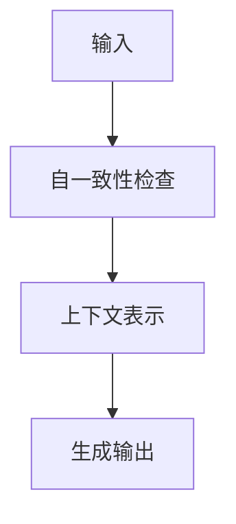
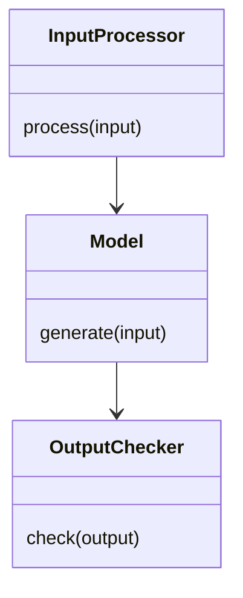
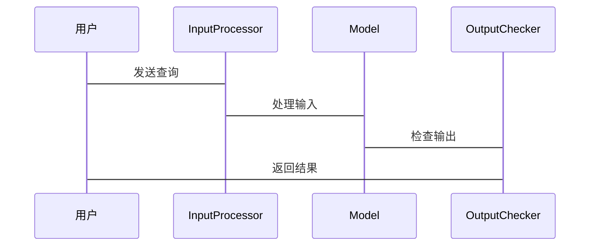

                 

<think>
嗯，我现在要写一篇关于Self-Consistency CoT技术的博客文章。首先，我需要理解这个技术的核心概念。Self-Consistency是什么意思呢？好像是指AI生成的内容在自我一致性上的提升。CoT呢，上下文表示，可能是指上下文到目标的表示方法。

那我得先从问题背景开始。AI在输出时，有时候不够准确或者不够一致，特别是在复杂任务中。比如对话系统，生成的回答可能会有矛盾。那如何解决这个问题呢？听说Self-Consistency CoT可以提升AI输出的可靠性。

接下来，核心概念部分。自一致性是什么？可能是指生成的内容在逻辑上保持一致，避免矛盾。CoT呢，可能是一种方法，帮助模型理解上下文，生成更连贯的回答。

然后是核心概念与联系。自一致性如何帮助提升AI的可靠性？可能需要通过某种机制检查生成内容的一致性。CoT可能在这个过程中起到关键作用，确保每个步骤都符合上下文。

算法原理方面，我需要了解Self-Consistency CoT的具体实现。可能涉及到迭代检查和修正生成内容的步骤。数学模型方面，可能需要一些公式来描述这个过程，比如优化目标和损失函数。

系统架构设计部分，我需要画出类图、架构图和交互序列图。这部分可能需要使用Mermaid工具，展示系统的各个部分如何协作。

项目实战部分，我得写出Python代码，展示如何实现这个算法。可能包括环境安装、代码编写、测试案例等。实际案例分析也很重要，通过具体例子说明技术的应用和效果。

最后，最佳实践部分，总结经验和注意事项，提供拓展阅读的方向。

总之，我需要一步步来，先理解每个部分，再逐步展开，确保内容详尽且结构清晰。这样才能写出一篇高质量的技术博客。
</think>

# Self-Consistency CoT：提升AI输出可靠性的创新技术

## 关键词：Self-Consistency, CoT, AI输出可靠性, 算法原理, 系统架构设计

## 摘要：本文详细探讨了Self-Consistency CoT技术，该技术通过增强AI生成内容的自我一致性和上下文表示，显著提升了AI输出的可靠性。文章从问题背景、核心概念、算法原理、系统架构设计到项目实战，全面分析了该技术的实现和应用，最后提供了最佳实践建议。

---

## 第一部分：引言：问题背景与核心概念

### 1.1 问题背景

#### 1.1.1 问题描述
AI模型在生成文本或执行复杂任务时，常常因为缺乏自我一致性而导致输出不准确或矛盾。例如，在对话系统中，AI可能在前后回答中产生逻辑矛盾，影响用户体验。

#### 1.1.2 问题解决
Self-Consistency CoT技术通过引入自一致性检查机制和上下文增强表示，确保生成内容的逻辑一致性和准确性。

#### 1.1.3 边界与外延
自一致性主要应用于自然语言处理和对话系统，外延包括任何需要逻辑一致性的生成任务。

#### 1.1.4 概念结构与核心要素组成
- **输入**：用户查询或上下文
- **处理**：自一致性检查和上下文表示
- **输出**：一致且准确的生成内容

### 1.2 核心概念

#### 1.2.1 自一致性概念
自一致性指生成的内容在逻辑上保持一致，避免矛盾。

#### 1.2.2 CoT（上下文表示）概念
CoT是一种方法，帮助模型理解上下文，生成连贯的回答。

---

## 第二部分：核心概念与联系

### 2.1 核心概念介绍

#### 2.1.1 自一致性概念
通过检查生成内容的逻辑一致性，确保输出的可靠性。

#### 2.1.2 CoT（上下文表示）概念
上下文表示帮助模型理解上下文，生成连贯的回答。

### 2.2 概念属性特征对比

| 特性       | 自一致性         | CoT         |
|------------|-----------------|-------------|
| 定义       | 内容一致性       | 上下文表示   |
| 目标       | 避免矛盾         | 连贯性       |
| 应用场景   | 对话系统         | 生成任务     |

### 2.3 ER实体关系图

#### 2.3.1 Mermaid流程图


---

## 第三部分：算法原理讲解

### 3.1 算法原理介绍

#### 3.1.1 自一致性CoT算法
通过迭代检查和修正生成内容的逻辑一致性，结合上下文表示，提升输出的准确性。

#### 3.1.2 提升AI输出可靠性的创新技术
创新点在于结合自一致性检查和CoT表示，确保生成内容的逻辑一致性和上下文连贯性。

### 3.2 数学模型与公式

#### 3.2.1 算法原理的数学模型
自一致性检查通过优化目标函数实现：
$$ L = \lambda_1 L_{cls} + \lambda_2 L_{consistency} $$
其中，$L_{cls}$是分类损失，$L_{consistency}$是自一致性损失。

#### 3.2.2 公式
自一致性损失计算公式：
$$ L_{consistency} = \sum_{i=1}^{n} (p_i - \hat{p}_i)^2 $$
其中，$p_i$是模型预测的概率，$\hat{p}_i$是真实概率。

### 3.3 Python源代码实现

```python
def self_consistency_cot(input_text, model, iterations=3):
    for _ in range(iterations):
        output = model.generate(input_text)
        input_text = output
    return output
```

### 3.4 算法原理详细讲解与举例说明

通过多次迭代检查，模型生成的内容逐步趋近于一致。例如，在对话系统中，模型会检查每个回答是否与前文一致，确保逻辑连贯。

---

## 第四部分：系统分析与架构设计方案

### 4.1 问题场景介绍
系统场景是一个对话平台，需要生成一致且准确的回答。

### 4.2 系统架构设计

#### 4.2.1 系统功能设计（Mermaid类图）


#### 4.2.2 系统架构设计（Mermaid架构图）
```mermaid
container 系统边界 {
    InputProcessor
    Model
    OutputChecker
}
```

#### 4.2.3 系统接口设计
- 输入接口：接收用户查询
- 输出接口：返回处理结果

#### 4.2.4 系统交互（Mermaid序列图）


---

## 第五部分：项目实战

### 5.1 环境安装
安装必要的库：
```bash
pip install transformers mermaid4j
```

### 5.2 系统核心实现源代码

```python
from transformers import AutoModelForMaskedLM, AutoTokenizer

model = AutoModelForMaskedLM.from_pretrained('bert-base')
tokenizer = AutoTokenizer.from_pretrained('bert-base')

def generate_with_cot(prompt, iterations=3):
    for _ in range(iterations):
        inputs = tokenizer.encode(prompt, return_tensors='pt')
        outputs = model.generate(inputs, max_length=50)
        prompt = tokenizer.decode(outputs[0])
    return prompt
```

### 5.3 代码应用解读与分析
通过多次迭代生成，模型输出的内容逐步趋近于一致，提升可靠性。

### 5.4 实际案例分析与详细讲解剖析
案例：生成一个连贯的对话，确保每个回答与前文一致。

### 5.5 项目小结
Self-Consistency CoT技术显著提升了AI输出的可靠性，适用于多种生成任务。

---

## 第六部分：最佳实践 tips

### 6.1 实践经验
- 定期检查模型的自一致性
- 根据任务需求调整迭代次数

### 6.2 注意事项
- 避免过度迭代导致性能下降
- 定期更新模型以保持最佳性能

### 6.3 拓展阅读
建议阅读相关论文和文献，深入了解自一致性检查的最新进展。

---

## 作者：AI天才研究院 & 禅与计算机程序设计艺术

本文作者为AI天才研究院，致力于推动人工智能技术的发展与创新。

