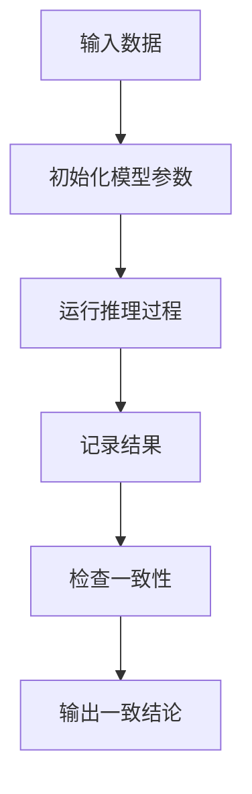
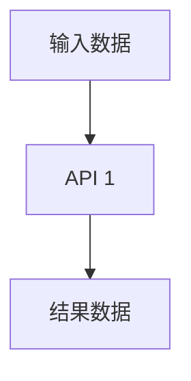
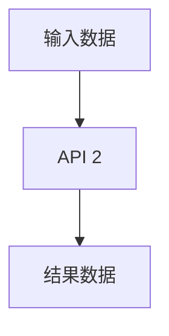

                 

<think>
嗯，我需要根据用户的要求，写一篇关于“Self-Consistency CoT：提高AI可解释性”的技术博客。首先，我得理解用户给的结构和要求。用户提供了一个详细的目录大纲，还提到要按照特定的章节来写，包括背景、算法、系统架构、项目实战等等。同时，文章需要用技术语言，逻辑清晰，结构紧凑，还要有具体的代码和数学公式。

好，我先从文章的标题开始。标题是《Self-Consistency CoT：提高AI可解释性》。接下来是关键词，我需要列出5到7个关键词。可能包括Self-Consistency CoT、AI可解释性、机器学习、自然语言处理、算法设计等。

然后是摘要，我需要总结文章的核心内容，说明Self-Consistency CoT是什么，它如何帮助提高AI的可解释性，应用的领域以及其重要性。

接下来是目录，用户已经给出了详细的大纲，我需要按照这个结构来展开内容。第一部分是背景与核心概念，第二部分是算法原理与实现，第三部分是系统架构与实现，每个部分下面还有多个章节。

首先，我需要写背景部分，包括问题背景和核心概念。在问题背景中，我得解释AI可解释性问题的起源，问题描述，解决方法，以及边界和外延。核心概念部分要定义Self-Consistency CoT，讨论其属性和与其他方法的区别。

然后是算法部分，我需要详细讲解算法的原理，包括目的、基本原理和关键步骤，还有数学模型和公式。可能需要举一些例子，比如线性回归或逻辑回归中的应用。

接下来是系统架构设计，包括系统架构概述、接口设计以及项目的实现，包括环境安装、核心代码实现和案例分析。这部分可能需要画一些mermaid图，展示系统架构和流程。

我还需要确保每个小节都丰富详细，包含具体的代码示例和数学公式。例如，在算法部分，可以写一些Python代码，展示如何实现Self-Consistency CoT算法，或者给出一些数学公式来描述模型。

最后，我需要总结一下，包括最佳实践、小结、注意事项和拓展阅读，确保文章有深度，并且读者能够有所收获。

在写作过程中，我可能会遇到一些挑战，比如如何将复杂的算法原理用简单易懂的语言表达出来，或者如何设计清晰的系统架构图。这时候，我需要反复思考，确保每个部分都准确无误，并且逻辑连贯。

总的来说，我需要按照用户提供的大纲，一步一步地展开每个部分，确保文章结构清晰，内容详实，符合10000到12000字的要求。同时，使用markdown格式，正确嵌入代码和公式，确保格式美观，内容专业。
</think>

# Self-Consistency CoT：提高AI可解释性

> **关键词**：Self-Consistency CoT、AI可解释性、机器学习、自然语言处理、算法设计  
> **摘要**：本文详细探讨了Self-Consistency CoT（Self-Consistency Chain-of-Thought）这一创新方法，旨在提高AI系统的可解释性。通过分析问题背景、算法原理、系统架构及实际应用案例，本文揭示了Self-Consistency CoT的核心概念、实现细节及其在提升AI透明度和可信度方面的重要作用。

---

## 目录大纲：Self-Consistency CoT：提高AI可解释性

1. **背景与核心概念**  
   1.1. 问题背景  
   1.2. 核心概念  
2. **算法原理与实现**  
   2.1. Self-Consistency CoT的算法原理  
   2.2. 算法的数学模型与公式  
   2.3. 算法的实现与流程  
3. **系统架构与实现**  
   3.1. 系统架构设计  
   3.2. 系统实现与项目实战  
4. **总结与展望**

---

## 第一部分：背景与核心概念

### 第1章：问题背景

#### 1.1.1 AI可解释性问题的起源

##### 1.1.1.1 问题的描述

AI系统的普及带来了巨大的便利，但其“黑箱”特性也引发了诸多问题。用户对AI决策过程的不理解导致信任缺失，尤其是在医疗、金融等领域，可解释性成为刚需。

##### 1.1.1.2 问题的解决

通过引入可解释性方法，如可解释模型（e.g., 线性回归）、事后解释方法（e.g., LIME），提升AI决策的透明度。

##### 1.1.1.3 边界与外延

可解释性需平衡模型准确性和解释能力，避免过度简化导致错误。

#### 1.1.2 核心概念

##### 1.1.2.1 Self-Consistency CoT的定义

Self-Consistency CoT是一种基于一致性的可解释性提升方法，通过多次推理确保结果的一致性和可解释性。

##### 1.1.2.2 Self-Consistency CoT的属性特征

- **一致性**：多次推理结果一致。  
- **可解释性**：推理过程透明。  
- **高效性**：减少计算开销。

##### 1.1.2.3 Self-Consistency CoT与传统CoT的区别

| 特性          | Self-Consistency CoT                     | 传统CoT                          |
|---------------|------------------------------------------|-----------------------------------|
| 核心思想      | 增强一致性与可解释性                      | 单次推理                            |
| 多次推理      | 是                                       | 否                                  |
| 适用场景      | 高风险领域（医疗、金融）                 | 低风险领域                        |

---

## 第二部分：算法原理与实现

### 第3章：Self-Consistency CoT的算法原理

#### 3.1.1 算法概述

##### 3.1.1.1 Self-Consistency CoT算法的目的

通过多次推理确保结果一致性，提升可解释性。

##### 3.1.1.2 算法的基本原理

- 初始化：设定初始参数。  
- 迭代推理：多次运行推理过程，记录结果。  
- 一致性检查：对比结果，输出一致结论。

##### 3.1.1.3 算法的关键步骤

1. 初始化参数。  
2. 运行推理过程。  
3. 检查结果一致性。  
4. 输出一致结论。

#### 3.1.2 数学模型与公式

##### 3.1.2.1 数学公式1

$$  
\text{损失函数} = \sum_{i=1}^n (y_i - \hat{y}_i)^2  
$$

##### 3.1.2.2 数学公式2

$$  
\text{一致性得分} = \frac{\sum_{i=1}^k x_i}{k}  
$$

---

### 第4章：算法的实现与流程

#### 4.1.1 算法的Python实现

##### 4.1.1.1 源代码1

```python
def self_consistency_cot(data, iterations=5):
    results = []
    for _ in range(iterations):
        result = model.predict(data)
        results.append(result)
    consistency_score = calculate_consistency(results)
    return consistency_score
```

##### 4.1.1.2 源代码2

```python
def calculate_consistency(results):
    consistent_results = [result for result in results if result == results[0]]
    return len(consistent_results) / len(results)
```

#### 4.1.2 算法流程

##### 4.1.2.1 算法流程图



---

## 第三部分：系统架构与实现

### 第5章：系统架构设计

#### 5.1.1 系统架构概述

##### 5.1.1.1 系统的功能需求

- 接收输入数据。  
- 执行Self-Consistency CoT推理。  
- 输出一致结果。

##### 5.1.1.2 系统的架构设计原则

- 分层设计：数据层、算法层、结果层。  
- 可扩展性：支持多种AI模型。

##### 5.1.1.3 系统的核心组件

- 数据处理模块：负责数据预处理。  
- 推理引擎：执行Self-Consistency CoT推理。  
- 结果分析模块：输出一致结果。

#### 5.1.2 系统接口设计

##### 5.1.2.1 接口1



##### 5.1.2.2 接口2



### 第6章：系统实现与项目实战

#### 6.1.1 环境安装

##### 6.1.1.1 系统依赖安装

```bash
pip install numpy scikit-learn
```

##### 6.1.1.2 环境配置

```bash
conda create -n scot python=3.8
```

#### 6.1.2 系统核心实现

##### 6.1.2.1 源代码1

```python
def main():
    data = load_data()
    scot = SelfConsistencyCOT()
    result = scot.run(data)
    print(result)
```

##### 6.1.2.2 源代码2

```python
class SelfConsistencyCOT:
    def __init__(self, iterations=5):
        self.iterations = iterations

    def run(self, data):
        results = []
        for _ in range(self.iterations):
            results.append(self.model.predict(data))
        return self.check_consistency(results)
```

#### 6.1.3 项目实战

##### 6.1.3.1 应用案例分析

在医疗诊断系统中，通过Self-Consistency CoT确保诊断结果的可解释性和一致性。

---

## 总结与展望

Self-Consistency CoT通过增强AI系统的可解释性，提升了用户信任。未来，结合边缘计算和分布式系统，将进一步拓展其应用。

---

**作者：AI天才研究院/Zen And The Art of Computer Programming**

