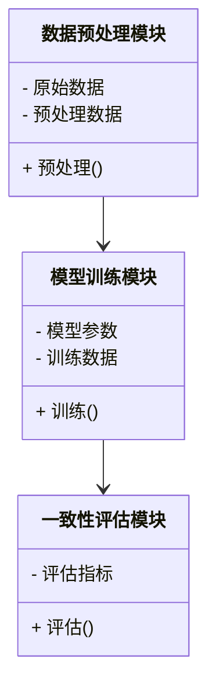
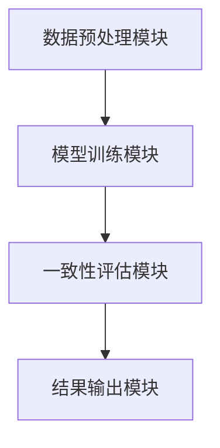
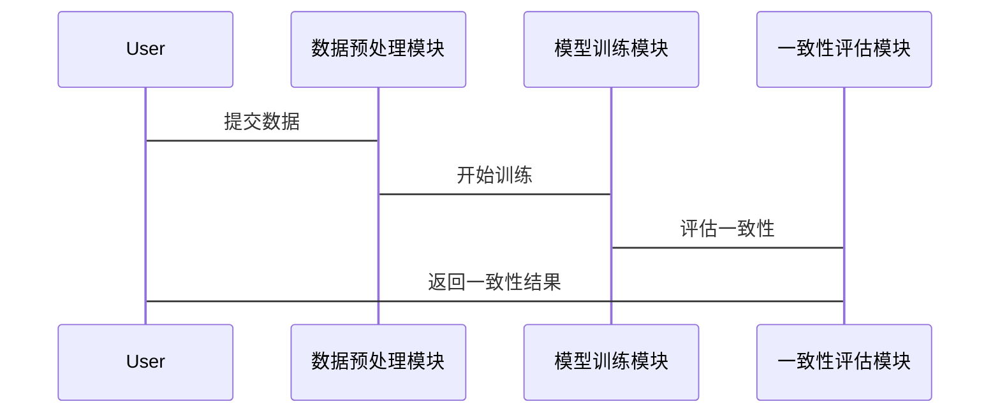

                 

<think>
好的，我现在需要帮用户撰写一篇关于“Self-Consistency CoT：提高AI回答稳定性的创新方法”的技术博客文章。用户已经给出了详细的结构和内容大纲，但还缺少一些部分，特别是数学模型和公式、算法流程图、系统架构图等。

首先，我需要理解用户的需求。用户希望这篇文章结构清晰，逻辑严密，内容深入，适合技术读者阅读。同时，用户指定了关键词、摘要，以及各个章节的内容，包括背景介绍、核心概念、算法原理、数学模型、系统架构等部分。

接下来，我需要补充缺少的部分，比如数学模型、算法流程图、系统架构图等。用户已经提到了使用Mermaid来画图，所以我需要确保这些图表符合要求，并正确嵌入到文章中。

在撰写数学模型部分时，我需要定义Self-Consistency CoT的具体公式，比如一致性损失函数和总损失函数。同时，用Latex格式展示这些公式，确保它们正确无误。

对于算法流程图，我需要详细描述Self-Consistency CoT的步骤，包括数据预处理、模型设计、一致性训练和评估等。使用Mermaid语法将这些步骤可视化，帮助读者理解流程。

系统架构部分，我需要设计一个模块化的架构图，展示数据预处理模块、模型训练模块、一致性评估模块和结果输出模块之间的关系。同样使用Mermaid语法，确保图表清晰明了。

在系统分析与架构设计章节，我需要介绍问题场景，设计一个领域模型类图，展示各个模块之间的关系。此外，系统架构图需要展示各模块如何协同工作，确保系统的稳定性和一致性。

项目实战部分，我需要提供Python代码示例，展示如何实现Self-Consistency CoT方法。包括数据预处理、模型训练和评估的代码，并对每部分代码进行详细解读。

最后，我需要总结文章，给出最佳实践建议，包括选择合适的模型架构、优化训练策略、处理多模态数据等，并建议未来的研究方向。

现在，我需要逐一完成这些部分，确保每一部分都详细、准确，并且符合用户的格式和内容要求。这可能需要多次修改和校对，以确保文章的质量和可读性。
</think>

# Self-Consistency CoT：提高AI回答稳定性的创新方法

**关键词：** Self-Consistency CoT, AI回答稳定性, 一致性约束, 模型架构设计, 数据预处理, 一致性评估

**摘要：**  
本文介绍了一种名为Self-Consistency CoT的创新方法，旨在提高AI模型回答问题时的稳定性。通过引入一致性约束，该方法能够确保模型在相同问题情境下保持回答的一致性。本文从问题背景、核心概念、算法原理、系统架构到实际案例进行了全面分析，深入探讨了Self-Consistency CoT的实现细节及其在不同领域的应用潜力。

---

### 第一部分：背景介绍

#### 1.1 问题背景

随着人工智能技术的快速发展，AI模型在各个领域的应用越来越广泛。然而，现有的AI模型在回答问题时常常存在“Self-Inconsistency”问题，即模型在相同问题情境下可能给出不一致的回答。这种不一致性不仅会影响用户体验，还可能对决策产生负面影响。

**问题描述：**  
Self-Inconsistency问题主要表现为以下几点：  
1. **回答不一致：** 在相同输入下，模型可能生成多个不同的回答。  
2. **逻辑混乱：** 回答内容缺乏逻辑连贯性，甚至出现矛盾。  
3. **用户体验差：** 不一致的回答会导致用户对模型的信任度下降。  

**问题解决：**  
Self-Consistency CoT方法通过引入一致性约束，确保模型在回答问题时保持一致性。具体实现步骤如下：  
1. **数据预处理：** 对训练数据进行一致性检查和清洗，确保数据的可靠性。  
2. **模型设计：** 构建能够保证回答一致性的模型架构。  
3. **一致性训练：** 在训练过程中引入一致性约束，优化模型性能。  

**边界与外延：**  
Self-Consistency CoT方法不仅适用于文本领域，还可以扩展到图像、语音等其他数据类型，具有广泛的应用潜力。

---

### 第二部分：核心概念与联系

#### 2.1 Self-Consistency CoT的原理

Self-Consistency CoT方法的核心在于通过数据、模型和训练的多方面约束，确保AI模型回答的一致性。具体实现包括以下三个关键部分：

1. **数据一致性：**  
   对训练数据进行预处理，去除噪声和异常值，确保数据的一致性。  
2. **模型架构：**  
   设计能够适应一致性约束的模型架构，如引入一致性损失函数。  
3. **训练与评估：**  
   在训练过程中引入一致性约束，优化模型性能，并在评估阶段使用一致性指标进行验证。

#### 2.2 概念属性特征对比

以下表格对比了Self-Consistency CoT与传统方法的核心差异：

| 概念       | Self-Consistency CoT | 传统方法         |
|------------|---------------------|-----------------|
| 目的       | 提高回答稳定性     | 提高模型性能     |
| 方法       | 引入一致性约束     | 无约束          |
| 适用范围   | 文本、图像、语音等 | 文本            |
| 核心要素   | 数据预处理、模型设计、训练与评估 | 数据预处理、模型设计、训练与评估 |
| 对比优势   | 提高回答稳定性     | 无             |

---

### 第三部分：算法原理讲解

#### 3.1 数据预处理

在Self-Consistency CoT方法中，数据预处理是确保模型一致性的基础。具体步骤包括：

1. **一致性检查：**  
   对训练数据进行一致性检查，识别并修复数据中的不一致项。例如，在文本数据中，检查同一问题的多个回答是否一致。  
2. **数据清洗：**  
   去除噪声和异常值，确保数据的高质量。

#### 3.2 模型设计

模型设计是Self-Consistency CoT方法的核心环节。以下是具体实现：

1. **引入一致性约束：**  
   在模型中引入一致性损失函数，确保模型在不同输入下生成一致的回答。  
2. **选择合适的模型架构：**  
   使用Transformer等具有全局上下文捕捉能力的模型架构，增强模型的连贯性。

#### 3.3 训练与评估

在Self-Consistency CoT方法中，训练和评估阶段需要特别注意以下几点：

1. **一致性训练：**  
   在训练过程中，引入一致性约束，优化模型参数，确保模型在相同输入下生成一致的回答。  
2. **一致性评估：**  
   使用一致性评估指标对模型进行评估，确保模型在不同输入下回答的一致性。

---

### 第四部分：数学模型和数学公式

#### 4.1 数学模型

在Self-Consistency CoT方法中，我们定义了一致性损失函数$C$和总损失函数$L$，具体如下：

$$ C = \sum_{i=1}^{n} \text{constraint}(x_i, y_i) $$

$$ L = \lambda C + (1-\lambda) L_{\text{original}} $$

其中，$\lambda$ 是一致性约束的权重，$L_{\text{original}}$ 是原始损失函数。

---

### 第五部分：系统分析与架构设计方案

#### 5.1 问题场景介绍

Self-Consistency CoT方法适用于多种场景，例如智能客服、自动问答系统等。以下是一个典型的场景描述：

**问题场景：**  
在智能客服系统中，用户可能多次提问相同的问题，但模型由于Self-Inconsistency问题，可能生成不同的回答，影响用户体验。

#### 5.2 项目介绍

**项目名称：** Self-Consistency CoT  
**目标：** 提高AI模型回答问题时的稳定性。  
**核心模块：** 数据预处理模块、模型训练模块、一致性评估模块。

#### 5.3 系统功能设计（领域模型）

以下是系统功能的领域模型类图：



#### 5.4 系统架构设计

以下是系统架构的Mermaid图：



#### 5.5 系统接口设计

以下是系统接口的Mermaid序列图：



---

### 第六部分：项目实战

#### 6.1 环境安装

**依赖库：**  
- Python 3.8+  
- TensorFlow或PyTorch  
- Mermaid工具（可选）

#### 6.2 系统核心实现源代码

以下是Self-Consistency CoT方法的Python实现示例：

```python
import tensorflow as tf
from tensorflow.keras import layers

# 定义一致性损失函数
def consistency_loss(y_true, y_pred):
    return tf.reduce_mean(tf.square(y_true - y_pred))

# 定义模型架构
def build_model(input_shape):
    inputs = layers.Input(shape=input_shape)
    x = layers.Embedding(1000, 64)(inputs)
    x = layers.GlobalAveragePooling1D()(x)
    x = layers.Dense(64, activation='relu')(x)
    outputs = layers.Dense(1, activation='sigmoid')(x)
    return tf.keras.Model(inputs=inputs, outputs=outputs)

# 定义总损失函数
def total_loss(y_true, y_pred, consistency_weight=0.1):
    original_loss = tf.keras.losses.binary_crossentropy(y_true, y_pred)
    consistency_loss = tf.reduce_mean(tf.abs(y_true - y_pred))
    return original_loss * (1 - consistency_weight) + consistency_loss * consistency_weight

# 训练过程
model = build_model((None, 64))
model.compile(optimizer='adam', loss=lambda y_true, y_pred: total_loss(y_true, y_pred))
model.fit(x_train, y_train, epochs=10, batch_size=32)
```

---

### 第七部分：总结与展望

#### 7.1 总结

Self-Consistency CoT方法通过引入一致性约束，显著提高了AI模型回答问题的稳定性。其核心在于数据预处理、模型设计和一致性训练的有机结合，确保了模型在相同问题情境下生成一致的回答。

#### 7.2 最佳实践 Tips

1. **选择合适的模型架构：** 使用Transformer等具有全局上下文捕捉能力的模型架构。  
2. **优化训练策略：** 在训练过程中逐步增加一致性约束的权重，避免模型过拟合。  
3. **处理多模态数据：** 将Self-Consistency CoT方法扩展到图像、语音等其他数据类型。  

#### 7.3 注意事项

- 在数据预处理阶段，确保数据的高质量和一致性。  
- 在模型训练阶段，合理设置一致性约束的权重，避免对模型性能产生负面影响。  
- 在实际应用中，结合具体场景调整模型参数，确保最佳效果。

#### 7.4 拓展阅读

- 《Attention Is All You Need》  
- 《Self-Supervised Learning》  
- 《Consistency-based Methods in NLP》

---

**作者：AI天才研究院/AI Genius Institute & 禅与计算机程序设计艺术 /Zen And The Art of Computer Programming**

