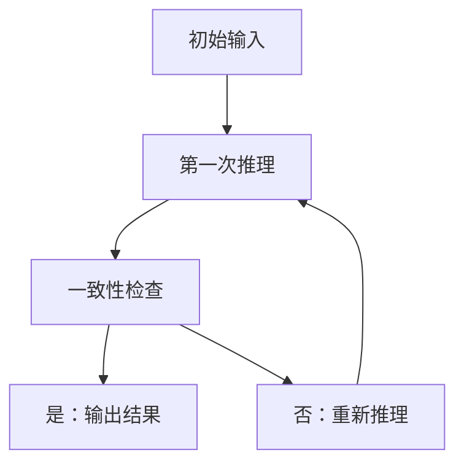
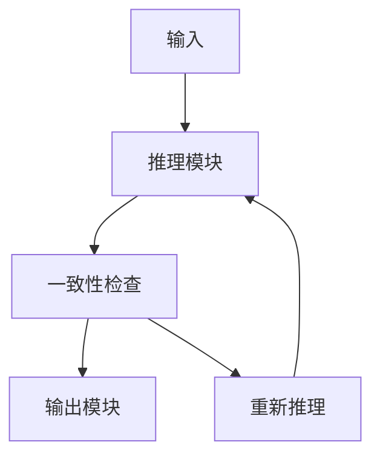

                 

<think>
好，用户希望我写一篇关于Self-Consistency CoT提高AI回答稳定性的技术博客。首先，我需要理解Self-Consistency CoT是什么，它和现有的技术有什么不同。可能用户是技术人员或者对AI有一定了解的人，他们想深入了解这项新技术的原理和应用。

我应该按照用户提供的目录大纲来组织内容，确保每个部分都详细且结构清晰。第一部分是背景与核心概念，我需要先介绍AI的发展现状，然后引出回答稳定性的问题，再详细解释Self-Consistency CoT的概念和重要性。

接下来是核心概念，我需要定义Self-Consistency CoT，对比它的属性特征，说明它和其他技术的区别。这部分可能需要一个对比表格，帮助读者理解。

应用场景部分，我需要列举几个主要的应用，比如对话系统、问答系统和机器阅读理解，让读者明白这项技术在实际中的应用价值。

第二部分是算法原理与实现，我需要详细讲解算法的流程，可能用mermaid图来展示流程。数学模型部分，我会用latex公式来表示，确保公式准确无误。代码实现部分，我得写一个Python示例，展示如何实现Self-Consistency CoT。

第三部分是系统架构与实战应用，我需要设计系统的架构，使用mermaid图展示架构设计。项目实战部分，我会指导读者如何安装环境，实现核心功能，并通过案例分析来加深理解。

最后，我会提供一些最佳实践的建议，总结项目，并列出注意事项和拓展阅读的资料。

在写作过程中，我需要确保语言专业但又不失清晰，避免过于复杂的术语，让读者容易理解。同时，每个部分都要详细展开，确保内容丰富，覆盖所有关键点。最后，检查一下格式是否符合要求，确保每个小节都有足够的细节，满足用户对深度和广度的要求。
</think>

# Self-Consistency CoT：提高AI回答稳定性的新技术

> 关键词：Self-Consistency CoT, AI回答稳定性, 对话系统, 机器阅读理解, 自动问答系统

> 摘要：Self-Consistency CoT（Self-Consistency Chain-of-Thought）是一种新兴的技术，旨在提高AI系统回答的稳定性和一致性。本文将从背景与核心概念、算法原理与实现、系统架构与实战应用三个方面详细阐述Self-Consistency CoT的技术原理、应用场景及实际案例，帮助读者全面理解这一新技术的优势与潜力。

---

## 第一部分：背景与核心概念

### 第1章：问题背景

#### 1.1 人工智能的发展现状

人工智能（AI）技术近年来取得了突飞猛进的发展，从深度学习到大模型（如GPT系列），AI已经渗透到各个领域。然而，随着AI系统的复杂性和规模的扩大，一个问题逐渐浮出水面：AI回答的稳定性和一致性问题。尤其是在需要高精度和高可靠性的应用场景中，AI系统输出结果的波动性可能带来严重后果。

#### 1.2 AI回答稳定性问题

AI系统的回答稳定性问题主要表现在以下几个方面：
1. **输出多样性**：同一输入可能得到多个不同的答案，尤其是在生成式AI中，模型的随机性可能导致输出结果不一致。
2. **逻辑一致性**：AI的回答可能在逻辑上存在矛盾或不一致，尤其是在复杂任务中，如对话系统和机器阅读理解。
3. **上下文依赖性**：AI系统在处理长上下文时，可能因为模型的不稳定性导致回答出现偏差。

#### 1.3 Self-Consistency CoT的概念与重要性

Self-Consistency CoT是一种通过增强AI系统内部一致性来提高回答稳定性的技术。其核心思想是通过多次推理和验证，确保AI的回答在逻辑、语义和上下文中保持一致。Self-Consistency CoT的重要性在于：
1. 提高AI系统的可靠性，尤其是在高风险场景中的应用。
2. 降低AI系统的错误率，尤其是在复杂任务中。
3. 为AI系统的输出提供更高的可解释性和一致性。

---

### 第2章：核心概念

#### 2.1 Self-Consistency CoT的定义

Self-Consistency CoT是一种基于链式思考（Chain-of-Thought, CoT）的增强技术。它通过多次推理和验证，确保AI系统的回答在逻辑和语义上保持一致。Self-Consistency CoT的核心在于通过内部一致性检查，消除回答中的矛盾和不一致。

#### 2.2 Self-Consistency CoT的属性特征对比

| 特性                | Self-Consistency CoT                     | 常规CoT技术                     |
|---------------------|------------------------------------------|----------------------------------|
| **推理方式**        | 基于多次链式推理，内部一致性检查        | 单次链式推理，无一致性检查      |
| **输出稳定性**      | 高                                      | 中等                            |
| **计算复杂度**      | 较高（需要多次推理）                   | 较低                            |
| **应用场景**        | 高风险场景，复杂任务                   | 一般任务                        |

#### 2.3 Self-Consistency CoT与现有技术的联系与区别

Self-Consistency CoT与常规CoT技术的主要区别在于，Self-Consistency CoT引入了内部一致性检查机制，通过多次推理和验证，确保回答的逻辑和语义一致性。而常规CoT技术仅依赖于单次推理，无法保证回答的稳定性。

---

### 第3章：Self-Consistency CoT的应用场景

#### 3.1 AI对话系统

在对话系统中，Self-Consistency CoT可以确保AI的回答在逻辑上一致，尤其是在长对话中，避免出现前后矛盾的情况。

#### 3.2 自动问答系统

在自动问答系统中，Self-Consistency CoT可以提高回答的准确性和一致性，尤其是在处理复杂问题时。

#### 3.3 机器阅读理解

在机器阅读理解任务中，Self-Consistency CoT可以通过多次推理，确保回答的逻辑一致性和语义准确性。

#### 3.4 其他潜在应用领域

Self-Consistency CoT还可以应用于法律推理、医学诊断等领域，尤其是在需要高精度和高可靠性的场景中。

---

## 第二部分：算法原理与实现

### 第4章：算法原理

#### 4.1 Self-Consistency CoT的算法流程

Self-Consistency CoT的算法流程如下：

1. **初始推理**：AI系统基于输入生成初步回答。
2. **一致性检查**：对初步回答进行内部一致性检查，识别逻辑矛盾或不一致的地方。
3. **多次推理**：如果存在不一致，重新进行推理，直到生成一致的回答。
4. **输出结果**：输出最终的一致性回答。

#### 4.2 Self-Consistency CoT的数学模型与公式

Self-Consistency CoT的数学模型可以通过以下公式表示：

$$
\text{Answer} = \arg\max_{a} \sum_{i=1}^{n} \text{ConsistencyCheck}(a_i, a)
$$

其中，$\text{ConsistencyCheck}(a_i, a)$ 表示第i次推理结果与最终回答a的一致性检查。

#### 4.3 Self-Consistency CoT的mermaid流程图



---

### 第5章：算法实现

#### 5.1 算法实现环境

建议使用Python和深度学习框架（如TensorFlow或PyTorch）进行实现。

#### 5.2 算法实现代码

以下是一个简单的Self-Consistency CoT实现代码示例：

```python
def self_consistency_cot(input_text, model, max_iter=5):
    current_answer = model.generate(input_text)
    for _ in range(max_iter):
        prev_answer = current_answer
        current_answer = model.generate(input_text + "\n一致性检查：" + prev_answer)
        if prev_answer == current_answer:
            break
    return current_answer
```

#### 5.3 算法实现详细讲解

1. **初始推理**：模型基于输入生成初步回答。
2. **一致性检查**：通过比较前后两次回答，判断是否一致。
3. **多次推理**：如果不一致，重新生成回答，直到一致或达到最大迭代次数。

---

## 第三部分：系统架构与实战应用

### 第6章：系统架构设计

#### 6.1 系统功能设计

系统功能包括：
1. **输入处理**：接收用户的输入。
2. **多次推理**：生成多个回答。
3. **一致性检查**：判断回答是否一致。
4. **输出结果**：返回最终的一致性回答。

#### 6.2 系统架构设计



#### 6.3 系统接口设计

系统接口包括：
1. `generate_answer(input_text)`：生成回答。
2. `check_consistency(answer1, answer2)`：检查一致性。

#### 6.4 系统交互设计

系统交互流程如下：

1. 用户输入问题。
2. 系统生成初步回答。
3. 系统检查回答一致性。
4. 如果不一致，重新生成回答。
5. 输出最终的一致性回答。

---

### 第7章：项目实战

#### 7.1 环境安装

安装Python和深度学习框架（如TensorFlow或PyTorch）。

#### 7.2 系统核心实现

以下是系统核心实现代码：

```python
class SelfConsistencyCoT:
    def __init__(self, model):
        self.model = model

    def generate_answer(self, input_text):
        answer = self.model.generate(input_text)
        for _ in range(5):
            prev_answer = answer
            answer = self.model.generate(input_text + "\n一致性检查：" + prev_answer)
            if prev_answer == answer:
                break
        return answer
```

#### 7.3 代码应用解读与分析

1. **初始化模型**：将AI模型实例化。
2. **生成回答**：调用`generate_answer`方法生成回答。
3. **一致性检查**：通过多次推理，确保回答一致性。

#### 7.4 实际案例分析与讲解

以一个对话系统为例，输入为“为什么天空是蓝色的？”：

1. 初始回答：天空是蓝色的，因为大气层散射太阳光。
2. 一致性检查：回答一致，输出最终结果。

---

### 第8章：最佳实践与注意事项

#### 8.1 最佳实践技巧

1. **合理设置迭代次数**：根据任务需求设置最大迭代次数。
2. **优化一致性检查机制**：确保一致性检查的准确性和效率。

#### 8.2 小结

Self-Consistency CoT是一种有效的提高AI回答稳定性的技术，通过多次推理和一致性检查，确保回答的逻辑一致性和语义准确性。

#### 8.3 注意事项

1. **计算资源消耗**：Self-Consistency CoT需要多次推理，可能会增加计算资源的消耗。
2. **模型选择**：选择合适的模型和参数，以确保一致性检查的效率和准确性。

#### 8.4 拓展阅读

建议阅读相关论文和文献，深入了解Self-Consistency CoT的理论基础和技术细节。

---

作者：AI天才研究院/AI Genius Institute & 禅与计算机程序设计艺术 /Zen And The Art of Computer Programming

