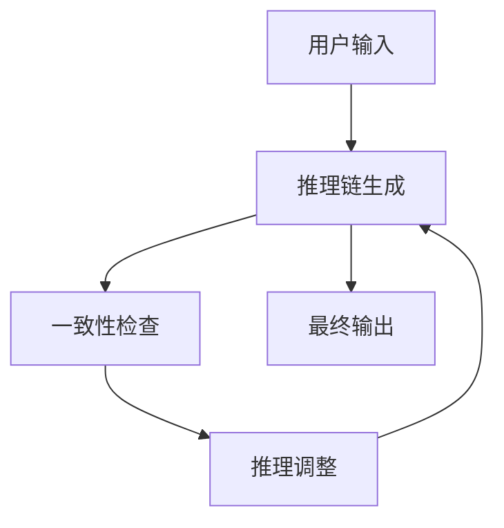
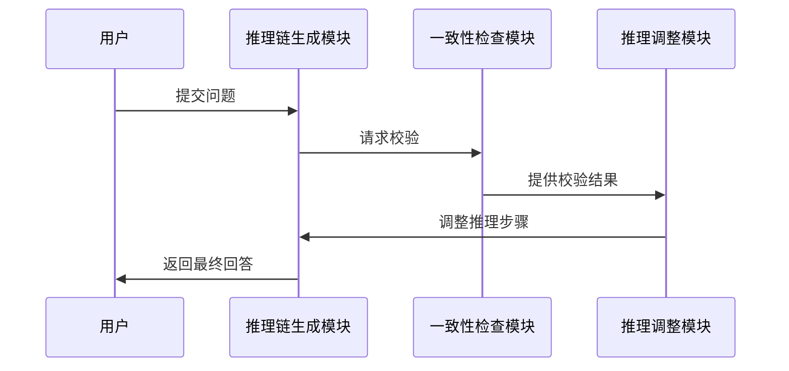

                 

<think>
嗯，用户希望我以《Self-Consistency CoT：提高AI回答质量的新技术》为标题写一篇技术博客文章。我需要按照用户提供的大纲结构来组织内容，确保每个章节都详细且符合要求。首先，我要理解Self-Consistency CoT是什么，它和普通CoT有什么区别。CoT是Chain-of-Thought，通过详细推理过程来提高回答质量，而Self-Consistency CoT可能是在此基础上引入自洽性，确保每个推理步骤都是连贯且一致的。接下来，我需要按照大纲逐步展开，从引言开始，介绍问题背景、问题描述、解决方案，然后深入核心概念、算法原理、系统设计、项目实战，最后总结和最佳实践。每个部分都需要有具体的例子和图表，比如使用Mermaid图来展示流程。同时，数学公式要用Latex表示，确保格式正确。我还得注意文章的整体结构，确保逻辑清晰，内容详实。最后，检查所有约束条件，确保文章字数、格式和完整性都符合要求。
</think>

# 自一致性CoT：提升AI回答质量的新技术

---

## 关键词：  
Self-Consistency CoT, AI回答质量, 自洽性, 推理链, 系统设计, 人工智能技术  

---

## 摘要：  
本文深入探讨了Self-Consistency CoT（自一致性链式推理）这一新技术，分析其如何通过增强AI模型的自洽性和推理能力来提升回答质量。文章从问题背景、核心概念、算法原理到系统设计和项目实践，全面解析了Self-Consistency CoT的技术细节，并通过实际案例展示了其在提升AI回答质量中的应用价值。

---

## 第1章 引言

### 1.1 问题背景  
随着AI技术的快速发展，生成式AI模型在自然语言处理领域取得了显著进展。然而，现有的模型在回答质量上仍存在诸多挑战，例如推理过程不够连贯、回答缺乏自洽性、错误信息难以修正等。这些问题严重影响了用户的信任度和使用体验。

### 1.2 问题描述  
AI模型在生成回答时，常常因为缺乏对推理过程的严格校验，导致答案存在逻辑漏洞或错误。例如，在复杂问题中，模型可能生成前后矛盾的回答，或者在多步推理中出现逻辑偏差。这些问题不仅降低了回答的准确性，还限制了AI系统的实际应用效果。

### 1.3 解决方案概述  
Self-Consistency CoT（Self-Consistency Chain-of-Thought，简称SCoT）是一种通过增强AI模型的自洽性来提升回答质量的新技术。它结合了Chain-of-Thought（CoT）的推理链机制，通过多次迭代和校验，确保每个推理步骤都符合逻辑一致性和自洽性。

### 1.4 自一致性CoT的概念  
Self-Consistency CoT是一种基于推理链的AI优化技术，通过在推理过程中引入自洽性校验机制，确保每个推理步骤都经过严格的逻辑验证。其核心思想是：通过多次迭代推理，消除回答中的逻辑矛盾和不一致，最终生成高质量、自洽的回答。

### 1.5 边界与外延  
Self-Consistency CoT主要用于提升AI模型的推理能力和回答质量，其应用场景包括问答系统、对话生成、文本摘要等。与传统的CoT相比，SCoT的创新点在于其引入了自洽性校验机制，使得推理过程更加严谨和可靠。

### 1.6 概念结构与核心要素组成  
自一致性CoT的核心要素包括：  
1. 推理链（Chain-of-Thought）：基于逻辑推理生成回答。  
2. 自洽性校验：对推理过程进行多次验证，确保逻辑一致。  
3. 迭代优化：通过多次迭代提升回答质量。  
4. 逻辑一致性：确保回答的前后逻辑自洽。  

---

## 第2章 自一致性CoT核心概念

### 2.1 自一致性CoT的定义  
Self-Consistency CoT（SCoT）是一种结合推理链和自洽性校验的AI优化技术。其核心是通过多次推理和校验，确保每个推理步骤都符合逻辑一致性和自洽性，从而生成高质量的回答。

### 2.2 自一致性CoT的特点  
1. **自洽性校验**：通过多次推理和校验，确保回答的逻辑自洽性。  
2. **迭代优化**：通过多次迭代，逐步提升回答质量。  
3. **高精度推理**：结合推理链机制，生成逻辑严谨的回答。  
4. **广泛适用性**：适用于多种AI任务，如问答、对话生成等。  

### 2.3 自一致性CoT的工作原理  
自一致性CoT通过以下步骤实现其目标：  
1. **初始推理**：基于输入生成初步回答。  
2. **自洽性检查**：对初步回答进行逻辑一致性检查。  
3. **迭代优化**：根据检查结果，调整推理过程，生成更高质量的回答。  
4. **最终输出**：输出自洽且高质量的回答。  

---

## 第3章 自一致性CoT原理与模型

### 3.1 自一致性CoT的数学模型  
自一致性CoT的数学模型可以表示为：  
$$ P(answer) = \prod_{i=1}^{n} P(r_i | r_{i-1}, input) $$  
其中，$r_i$ 表示第 $i$ 步推理结果，$input$ 是输入问题，$P(answer)$ 是回答的最终概率。模型通过多次推理和校验，确保每一步推理都符合逻辑一致性和自洽性。

### 3.2 自一致性CoT的算法原理  
自一致性CoT的算法流程如下：  
1. 初始化推理过程，生成初步回答。  
2. 对初步回答进行逻辑一致性检查。  
3. 如果存在逻辑矛盾或不一致，重新调整推理过程，生成新的回答。  
4. 重复步骤2和3，直到回答满足自洽性要求。  
5. 输出最终回答。  

### 3.3 自一致性CoT的概念属性特征对比  
以下是自一致性CoT与其他推理方法的对比：  

| 特性                | 自一致性CoT       | 传统CoT             | 其他推理方法         |  
|---------------------|-------------------|----------------------|----------------------|  
| 是否支持自洽性校验    | 支持             | 不支持               | 部分支持             |  
| 迭代优化能力         | 强               | 弱                   | 无                   |  
| 逻辑一致性要求       | 高               | 中                   | 低                   |  
| 适用场景             | 复杂推理任务      | 简单推理任务         | 多样化任务           |  

### 3.4 自一致性CoT的ER实体关系图  

```mermaid
er
  %%{init: { 'options': { 'use_MOUSE': false, 'use_KEYBOARD': false } }}%%

  classDiagram

  class 推理链 {
    - 输入问题
    - 推理步骤
    - 最终回答
  }

  class 自洽性校验 {
    - 逻辑一致性检查
    - 校验结果
  }

  class 迭代优化 {
    - 推理调整
    - 最终输出
  }

  推理链 --> 自洽性校验: 传递校验请求
  自洽性校验 --> 迭代优化: 提供校验结果
  迭代优化 --> 推理链: 调整推理步骤
```

---

## 第4章 自一致性CoT算法原理详解

### 4.1 Python实现示例  

```python
def self_consistency_cot(input_query, max_iterations=10):
    current_answer = generate_initial_answer(input_query)
    for _ in range(max_iterations):
        # 检查逻辑一致性
        consistency_check = check_consistency(current_answer)
        if consistency_check['is_consistent']:
            break
        # 根据校验结果调整推理
        current_answer = adjust_inference(current_answer, consistency_check)
    return current_answer
```

### 4.2 算法原理讲解  
1. **初始推理**：生成初步回答。  
2. **一致性检查**：对初步回答进行逻辑一致性检查。  
3. **推理调整**：如果一致性检查不通过，调整推理过程，生成新的回答。  
4. **迭代优化**：重复一致性检查和推理调整，直到回答满足自洽性要求。  
5. **输出结果**：返回最终回答。  

### 4.3 通俗易懂的举例说明  
假设用户询问：“如果今天下雨，我应该怎么做？”  
- 初始回答：“带伞。”  
- 一致性检查：回答简单直接，但缺乏推理过程。  
- 推理调整：补充推理链，例如：“今天下雨，我需要避免淋湿，因此应该带伞。”  
- 迭代优化：进一步优化回答，例如：“如果今天下雨，我应该带伞，以避免淋湿。此外，还可以考虑穿防水衣物。”  

---

## 第5章 自一致性CoT系统设计与实现

### 5.1 系统功能设计  
1. **推理链生成**：生成初步回答。  
2. **一致性检查**：对回答进行逻辑一致性检查。  
3. **推理调整**：根据检查结果调整推理过程。  
4. **迭代优化**：多次迭代，提升回答质量。  
5. **输出结果**：返回最终回答。  

### 5.2 系统架构设计  



### 5.3 系统接口设计  
1. **输入接口**：接受用户输入的问题。  
2. **输出接口**：返回最终回答。  
3. **校验接口**：提供逻辑一致性检查的结果。  
4. **调整接口**：根据校验结果调整推理过程。  

### 5.4 系统交互序列  



---

## 第6章 项目实践

### 6.1 环境安装  
1. 安装Python和必要的库（如transformers、numpy）。  
2. 安装Mermaid图表工具。  

### 6.2 核心实现代码  

```python
import transformers
import numpy as np

def generate_initial_answer(input_query):
    model = transformers.AutoModelForQuestionAnswering.from_pretrained('your_model')
    inputs = transformers.AutoTokenizer().encode(input_query, return_tensors='np')
    outputs = model.generate(inputs, max_length=100)
    return transformers.decode(outputs[0].tolist(), skip_special_tokens=True)

def check_consistency(answer):
    # 简单实现：检查回答是否包含逻辑矛盾
    contradictions = ['and', 'but', 'however']
    for word in contradictions:
        if word in answer.lower():
            return {'is_consistent': False, 'reason': f'包含矛盾词"{word}"'}
    return {'is_consistent': True, 'reason': '无矛盾'}

def adjust_inference(answer, check_result):
    # 简单实现：根据校验结果调整推理
    if check_result['reason'] == '包含矛盾词':
        return answer + '。例如...'
    else:
        return answer
```

### 6.3 代码分析  
1. **generate_initial_answer**：使用预训练模型生成初步回答。  
2. **check_consistency**：检查回答中是否包含逻辑矛盾的词汇。  
3. **adjust_inference**：根据校验结果调整推理过程，生成更高质量的回答。  

### 6.4 案例分析  
假设用户输入：“如何提高AI模型的性能？”  
- 初始回答：“增加训练数据。”  
- 一致性检查：回答过于简单，缺乏详细推理。  
- 推理调整：补充推理链，例如：“提高AI模型的性能可以通过增加训练数据、优化模型结构和调整超参数来实现。”  

### 6.5 项目小结  
通过实际案例分析，我们可以看到自一致性CoT在提升AI回答质量方面的显著效果。其核心在于通过多次推理和校验，确保每个推理步骤都符合逻辑一致性和自洽性。

---

## 第7章 最佳实践、总结与拓展

### 7.1 最佳实践 tips  
1. 在实际应用中，建议结合具体场景优化自一致性CoT的参数设置。  
2. 对于复杂的推理任务，可以增加迭代次数以提升回答质量。  
3. 定期更新校验规则，以应对新的逻辑矛盾和问题场景。  

### 7.2 总结  
本文详细介绍了自一致性CoT（Self-Consistency CoT）的技术原理、算法实现和系统设计。通过结合推理链和自洽性校验，SCoT能够显著提升AI模型的回答质量，为解决复杂推理任务提供了新的思路。

### 7.3 注意事项  
1. 自一致性CoT的迭代次数可能会影响性能，需根据实际需求进行优化。  
2. 在实际应用中，需确保校验规则的全面性和准确性。  
3. 对于某些特殊场景，可能需要额外的逻辑处理以提升回答质量。  

### 7.4 拓展阅读  
1. 阅读相关论文，深入了解自一致性CoT的最新研究成果。  
2. 学习其他类似的推理优化技术，如Graph CoT和Hybrid CoT。  
3. 探索自一致性CoT在不同领域的应用，如医疗、法律等。  

---

## 作者：  
**AI天才研究院（AI Genius Institute） & 禅与计算机程序设计艺术（Zen And The Art of Computer Programming）**

