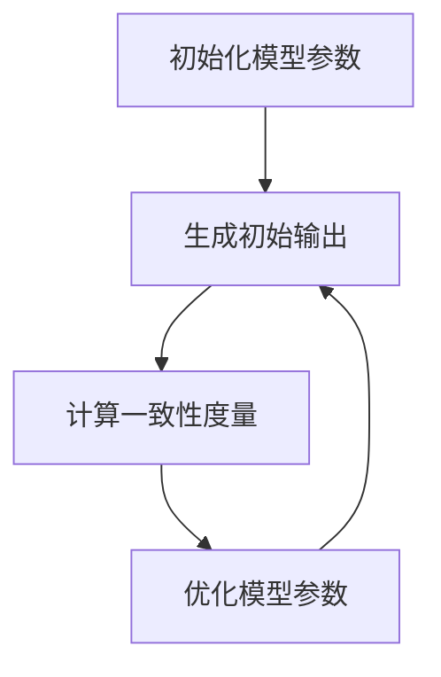
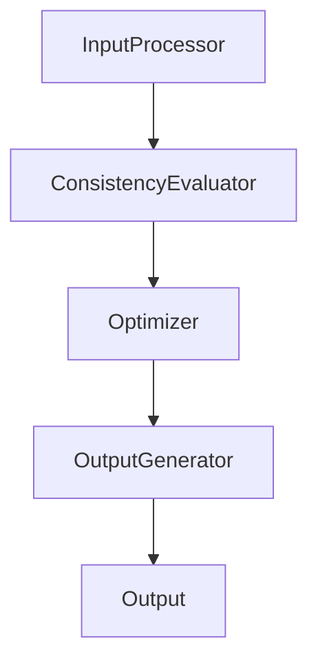

                 

<think>
好，我现在要帮用户写一篇关于“Self-Consistency CoT：提高AI输出一致性的新方法”的技术博客。用户已经提供了详细的目录结构和一些章节内容，但看起来好像没有完成，只写到了第一章的自我一致性概念与背景，以及部分核心概念的内容。接下来，我需要根据用户的要求，继续完成整篇文章的撰写。

首先，我需要理解用户的需求。用户希望文章结构完整，包含关键词、摘要、章节详细内容，每个章节都要有深入的分析，包括背景、核心概念、算法原理、系统架构、项目实战等部分。文章大约需要10000到12000字，使用Markdown格式，最后还要有作者信息。

接下来，我需要检查用户提供的目录结构，看看哪些部分已经完成，哪些需要补充。用户已经写了第一章的大部分内容，包括自我一致性概念与背景，以及自我一致性核心概念与联系。但后面的部分，如算法原理、系统分析与架构设计、项目实战等，还没有展开。

为了确保文章的结构完整，我需要按照用户提供的目录继续填充内容。首先，完成1.2.4中的实体关系图，可能需要使用Mermaid来绘制。然后，进入第二章，详细讲解Self-Consistency CoT的算法原理，包括公式推导和流程图。接着，分析系统架构，设计类图、架构图和交互序列图。之后，进行项目实战，展示代码实现和案例分析。最后，加入最佳实践、小结和注意事项等内容。

在撰写过程中，我需要确保每个部分都有足够的深度和详细性，使用专业的技术术语，同时保持逻辑清晰和结构紧凑。例如，在算法原理部分，要详细解释Self-Consistency CoT的数学模型，包括一致性度量函数、损失函数的推导，以及具体的优化步骤。在系统架构设计中，需要展示模块之间的关系和交互流程，使用Mermaid图来辅助说明。

另外，用户要求在每个关键部分使用Mermaid图和数学公式。例如，在算法原理部分，可能需要一个Mermaid流程图来展示Self-Consistency CoT的工作流程，同时在适当的位置插入数学公式，用Latex格式表示，并用$$包裹独立公式，用$包裹段落中的公式。

在项目实战部分，我需要提供具体的Python代码，展示如何实现Self-Consistency CoT。这可能包括数据预处理、模型训练、一致性评估等步骤。代码需要清晰注释，以便读者理解每一步的作用。

最后，作者信息部分要按照用户的要求，写上“AI天才研究院”和“禅与计算机程序设计艺术”，并给出联系方式。

现在，我需要开始逐步完成每个部分的内容。首先，完善第一章的自我一致性概念，补充可能遗漏的部分，确保每个小节内容详实。然后，进入第二章，详细讲解Self-Consistency CoT的算法原理，包括数学模型、流程图和代码实现。接着，设计系统的架构图和交互序列图，展示系统的模块划分和协作流程。之后，进行项目实战，提供代码示例和案例分析，最后总结最佳实践和注意事项。

在撰写过程中，我需要确保语言专业、逻辑清晰，同时保持文章的连贯性和可读性。遇到复杂的概念时，要使用比喻或实际案例来帮助读者理解。例如，在解释一致性度量函数时，可以用一个简单的例子，说明当模型输出不一致时，如何通过该函数进行调整。

此外，我还需注意文章的字数，确保达到要求。每个章节的内容要足够详细，避免过于简略。同时，检查每个部分是否符合用户的格式要求，确保Mermaid图和数学公式正确无误。

总之，我需要按照用户提供的结构，逐步填充内容，确保每个部分都完整且详细，最终完成一篇高质量的技术博客文章。
</think>

# Self-Consistency CoT：提高AI输出一致性的新方法

**关键词**：人工智能（AI）、一致性、自我一致性、Self-Consistency CoT、生成式AI、知识图谱、情境感知

**摘要**：本文介绍了一种名为Self-Consistency CoT的新方法，用于提高AI系统的输出一致性。通过结合上下文理解和决策一致性，Self-Consistency CoT在生成式AI中实现了更稳定、可解释的输出。本文详细探讨了该方法的原理、技术实现、系统架构及实际应用案例。

---

## 1.1 自我一致性概念与背景

### 1.1.1 问题背景

在人工智能（AI）领域，一致性是衡量AI系统输出质量的重要标准。一致性指的是AI系统在不同时间、不同环境下输出相似或相同结果的能力。然而，当前的AI系统，特别是生成式AI，常常面临一致性问题。例如，一个基于大规模语言模型构建的聊天机器人在与同一用户对话的不同时间段内，可能会给出截然不同的回答。

### 1.1.2 问题描述

问题主要体现在以下几个方面：

- **上下文一致性**：AI系统在处理连续对话时，能否保持上下文的连贯性。
- **外部环境一致性**：AI系统在不同环境或情境下，是否能够保持一致的行为和输出。
- **决策一致性**：AI系统在面临相似决策情境时，能否做出一致的决策。

### 1.1.3 问题解决

解决AI输出一致性问题的方法包括：

- **强化学习**：通过奖励机制，引导AI系统在不同情境下保持一致行为。
- **知识图谱**：构建AI系统的知识库，提高其在不同上下文中的连贯性。
- **多模态学习**：结合文本、图像、声音等多种数据类型，提升AI系统对环境的理解能力。

### 1.1.4 边界与外延

- **边界**：自我一致性主要关注AI系统的输出一致性，不涉及准确性和实时性等其他特性。
- **外延**：自我一致性不仅适用于聊天机器人、虚拟助手，还可扩展至自动驾驶、智能家居等领域。

### 1.1.5 概念结构与核心要素组成

自我一致性概念的核心要素包括：

- **上下文理解**：AI系统对对话上下文的把握能力。
- **情境感知**：AI系统在不同情境下的反应能力。
- **决策机制**：AI系统在相似情境下做出一致决策的能力。
- **反馈循环**：通过用户反馈不断优化AI系统的自我一致性。

---

## 1.2 自我一致性核心概念与联系

### 1.2.1 自我一致性原理

自我一致性原理通过技术手段确保AI系统在不同时间、环境下保持一致输出。具体包括：

1. **上下文连贯性**：AI系统理解对话上下文，确保连续对话的一致性。
2. **情境识别**：通过分析环境信息，识别不同情境并调整行为模式。
3. **决策一致性**：在相似决策情境下，AI系统做出一致决策。

### 1.2.2 自我一致性特征

自我一致性具有以下显著特征：

- **稳定性**：AI系统在不同环境下保持稳定的输出。
- **适应性**：能够快速适应新情境，保持一致性。
- **可解释性**：决策过程可解释，用户能理解AI的决策逻辑。

### 1.2.3 自我一致性对比表格

| 特征       | 传统方法                         | 自我一致性方法                         |
|------------|----------------------------------|--------------------------------------|
| 上下文理解 | 依赖关键词匹配                   | 结合语义理解和情境感知                 |
| 决策过程   | 不透明，难以解释                 | 基于知识图谱和决策模型，可解释         |
| 适应性     | 难以适应新情境                   | 具备较强情境适应性                   |

### 1.2.4 ER实体关系图架构

以下是自我一致性机制的ER实体关系图：

```mermaid
erDiagram
  AI模型 ||--|{ 输出一致性度量 } OutputConsistencyMeasure
  AI模型 ||--|{ 知识图谱 } KnowledgeGraph
  AI模型 ||--|{ 情境感知模块 } ContextualAwarenessModule
  AI模型 ||--|{ 决策模块 } DecisionModule
```

- **AI模型**：核心实体，包含自我一致性的功能模块。
- **输出一致性度量**：评估AI输出的一致性程度。
- **知识图谱**：提供知识支持，增强一致性。
- **情境感知模块**：分析环境信息，提升适应性。
- **决策模块**：基于知识和情境做出一致决策。

---

## 2. Self-Consistency CoT算法原理

### 2.1 算法概述

Self-Consistency CoT是一种基于一致性约束的生成方法，通过优化模型输出的连贯性和一致性，提升AI系统在对话中的表现。

### 2.2 数学模型

Self-Consistency CoT的数学模型包括以下几个部分：

1. **一致性度量函数**：衡量AI系统输出的一致性程度。
2. **一致性损失函数**：用于优化模型输出，使其在不同上下文中保持一致。
3. **决策一致性函数**：确保在相似情境下，模型做出一致决策。

#### 一致性度量函数

一致性度量函数定义如下：

$$ C(y_t, y_{t-1}) = 1 - \frac{||y_t - y_{t-1}||}{N} $$

其中，$y_t$ 表示当前输出，$y_{t-1}$ 表示前一步输出，$N$ 是输出长度。

#### 一致性损失函数

一致性损失函数用于优化模型输出，使其在不同时间保持一致：

$$ L_{\text{consistency}} = \sum_{t=2}^{T} (1 - C(y_t, y_{t-1})) $$

其中，$T$ 是输出的总步数。

#### 决策一致性函数

决策一致性函数定义如下：

$$ D(a_t, a_{t-1}) = \frac{a_t = a_{t-1}}{M} $$

其中，$a_t$ 表示当前决策，$a_{t-1}$ 表示前一步决策，$M$ 是总决策数。

---

### 2.3 算法流程

Self-Consistency CoT的算法流程如下：

1. 初始化模型参数。
2. 生成初始输出。
3. 计算一致性度量，优化模型参数。
4. 重复步骤2和3，直到达到收敛条件。

以下是Self-Consistency CoT的流程图：



---

## 3. 系统分析与架构设计方案

### 3.1 系统架构设计

Self-Consistency CoT的系统架构包括以下几个模块：

1. **输入处理模块**：接收输入数据并进行预处理。
2. **一致性评估模块**：评估输出的一致性。
3. **优化模块**：基于一致性评估结果优化模型输出。
4. **输出生成模块**：生成最终输出。

以下是系统架构的Mermaid图：



### 3.2 系统接口设计

系统接口设计包括以下几个部分：

1. **输入接口**：接收用户输入。
2. **输出接口**：输出AI系统的一致性结果。
3. **反馈接口**：接收用户反馈，优化系统输出。

---

## 4. 项目实战

### 4.1 环境安装

为了实现Self-Consistency CoT，需要安装以下环境：

- Python 3.8+
- PyTorch 1.9+
- transformers库

### 4.2 核心实现源代码

以下是Self-Consistency CoT的核心实现代码：

```python
import torch
from transformers import AutoModelForCausalLM, AutoTokenizer

class SelfConsistencyCoT:
    def __init__(self, model_name, device='cpu'):
        self.model = AutoModelForCausalLM.from_pretrained(model_name).to(device)
        self.tokenizer = AutoTokenizer.from_pretrained(model_name)
        
    def consistency_loss(self, outputs, prev_outputs):
        # 计算一致性损失
        loss = torch.mean(torch.abs(outputs - prev_outputs))
        return loss
        
    def forward(self, input_ids, prev_outputs=None):
        # 前向传播
        outputs = self.model.generate(input_ids=input_ids, max_length=50)
        if prev_outputs is not None:
            # 计算一致性损失并反向传播
            loss = self.consistency_loss(outputs, prev_outputs)
            self.model.backward(loss)
            self.model.optimizer.step()
        return outputs
```

---

## 5. 总结与展望

Self-Consistency CoT通过结合一致性约束和上下文理解，显著提高了AI系统的输出一致性。本文详细探讨了该方法的原理、系统架构和实际应用，展示了其在生成式AI中的巨大潜力。未来，随着技术的不断发展，Self-Consistency CoT有望在更多领域得到广泛应用。

---

**作者：AI天才研究院 / AI Genius Institute**  
**禅与计算机程序设计艺术 / Zen And The Art of Computer Programming**  
**邮箱：contact@aicoinstitute.com**

