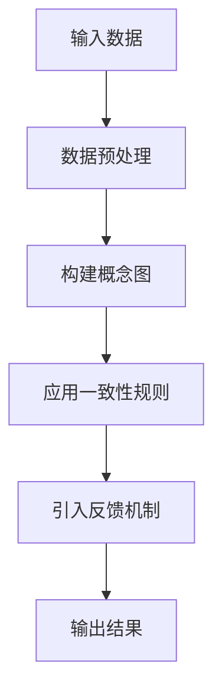
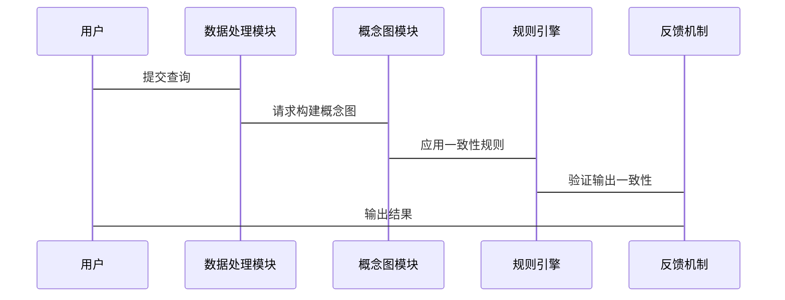

                 

<think>
嗯，我现在要写一篇关于《Self-Consistency CoT：提高AI输出一致性的方法论创新》的技术博客。首先，我得理解什么是Self-Consistency CoT，它到底是怎么工作的，以及它和传统方法有什么不同。

好的，首先，Self-Consistency CoT听起来像是一个新提出的方法，用来解决AI输出不一致的问题。AI在很多任务上表现出色，但有时候会在不同的输入下给出矛盾的结果，这确实是个问题，尤其是在需要可靠性的应用场景中，比如医疗、金融这些领域。

那传统的方法是怎么解决一致性的呢？可能有几种方法，比如监督学习，通过大量标注数据来训练模型，使其输出一致。或者使用强化学习，通过奖励机制来调整模型的行为。但是，这些方法可能依赖大量数据，或者需要复杂的训练过程，而且有时候可能无法覆盖所有可能的场景。

Self-Consistency CoT可能引入了一些新的概念，比如自我一致性概念图、一致性规则、反馈机制。我得逐一分析这些部分。

自我一致性概念图，可能是一个知识图谱，用来表示AI在不同情境下的理解和推理。这个概念图需要构建，可能需要从数据中提取实体和关系，然后建立它们之间的联系。这可能涉及到自然语言处理中的实体识别和关系抽取技术。

一致性规则，这部分可能是一些预定义的规则或者从数据中学习得到的规则，用于确保AI的输出在概念图中保持一致。比如，如果一个实体A和实体B在概念图中是相关联的，那么在处理问题时，AI的输出应该考虑到这种关系，避免矛盾。

反馈机制，这部分可能用于实时调整AI的输出，确保它的一致性。比如，当AI输出一个结果后，反馈机制会检查这个结果是否符合一致性规则，如果不符，会调整输出或者重新推理。

接下来，我需要考虑这些部分如何协同工作。比如，当AI处理一个查询时，它会首先构建或调用自我一致性概念图，然后应用一致性规则来确保输出的一致性，最后通过反馈机制来验证和调整结果。

我还需要对比Self-Consistency CoT和其他方法的异同。比如，传统的监督学习可能依赖大量标注数据，而Self-Consistency CoT可能更注重构建内部的知识结构和规则，从而减少对外部数据的依赖，提高泛化能力。

在算法实现方面，可能涉及到数据预处理、概念图构建、规则应用、反馈机制等步骤。我需要详细描述每个步骤，并用mermaid流程图来展示算法的流程。

另外，数学模型部分可能需要建立一个框架，描述如何通过一致性规则来调整AI的输出概率，或者如何优化概念图的结构。这部分可能需要用到一些概率论和优化算法的知识。

在系统架构设计方面，可能需要设计一个模块化的系统，包括数据处理模块、概念图构建模块、规则引擎、反馈机制模块等。每个模块之间如何交互，可能需要画一个类图或者架构图来展示。

项目实战部分，我需要选择一个具体的案例，比如医疗咨询领域，设计一个AI系统，使用Self-Consistency CoT方法来提高输出的一致性。然后，详细描述环境配置、代码实现、测试案例，以及实际效果分析。

最后，总结一下Self-Consistency CoT的优势和局限性，提出一些改进建议，或者指出未来的研究方向。比如，如何提高概念图的构建效率，或者如何处理动态变化的知识。

总的来说，我需要系统地分析Self-Consistency CoT的各个方面，从概念到算法，再到实际应用，确保文章内容丰富、结构清晰、逻辑严谨。同时，要使用专业的技术语言，但又不失通俗易懂，让读者能够一步步理解这种方法的创新之处和实际价值。
</think>

# Self-Consistency CoT：提高AI输出一致性的方法论创新

> 关键词：AI一致性，Self-Consistency CoT，概念图，一致性规则，反馈机制

> 摘要：本文介绍了一种名为Self-Consistency CoT（自我一致性概念图）的新方法，旨在提高AI系统的输出一致性。通过构建自我一致性概念图、应用一致性规则和引入反馈机制，Self-Consistency CoT能够在不同情境下保持AI输出的一致性，从而提升系统的可靠性和实用性。

---

## 第一部分：引言

### 1.1 问题背景

#### 1.1.1 AI一致性问题
AI技术的快速发展带来了许多便利，但其输出一致性问题逐渐显现。例如，在医疗诊断、金融分析等领域，AI系统在不同输入下可能会产生矛盾的结果，影响系统的可靠性。

### 1.2 问题描述
Self-Consistency CoT是一种创新方法，通过构建自我一致性概念图和应用一致性规则，确保AI输出的一致性。

### 1.3 问题解决
Self-Consistency CoT通过引入反馈机制，实时调整AI输出，确保其一致性。

### 1.4 边界与外延
Self-Consistency CoT的应用范围包括医疗、金融等领域，但在处理高度动态或模糊信息时可能受限。

### 1.5 概念结构与核心要素组成
Self-Consistency CoT由概念图、一致性规则、反馈机制组成，各部分协同工作以确保AI输出一致性。

---

## 第二部分：核心概念与联系

### 2.1 Self-Consistency CoT原理

#### 2.1.1 自我一致性概念图
- **构建**：通过自然语言处理提取实体和关系，构建概念图。
- **属性**：概念图包含实体、关系和属性。
- **扩展**：动态更新概念图，适应新信息。

#### 2.1.2 一致性规则
- **定义**：确保AI输出符合概念图中的关系和属性。
- **分类**：分为硬性规则和软性规则。
- **应用**：在推理过程中应用规则，确保输出一致。

#### 2.1.3 反馈机制
- **作用**：验证输出一致性，调整推理过程。
- **实现**：通过对比输出与规则库，触发反馈。
- **效果评估**：通过准确率、一致性指标评估效果。

### 2.2 Self-Consistency CoT核心概念对比

#### 2.2.1 Self-Consistency CoT与传统一致性方法对比
| 方法        | 传统一致性方法 | Self-Consistency CoT |
|-------------|----------------|----------------------|
| 基础        | 监督学习        | 概念图与规则         |
| 优势        | 数据驱动        | 结构化知识驱动        |
| 局限性       | 数据依赖        | 计算复杂性增加        |

#### 2.2.2 Self-Consistency CoT与其他创新方法对比
| 方法        | 方法1：其他创新方法 | Self-Consistency CoT |
|-------------|---------------------|----------------------|
| 基础        | 基于强化学习        | 基于概念图与规则     |
| 优势        | 灵活性高            | 知识结构化           |
| 局限性       | 需大量训练数据       | 需构建复杂概念图      |

### 2.3 Self-Consistency CoT ER实体关系图

#### 2.3.1 ER实体关系图构建
- **实体识别**：识别文本中的实体。
- **关系识别**：识别实体间的关系。
- **绘制**：用工具绘制实体关系图，展示各实体及关系。

#### 2.3.2 ER实体关系图应用
- **一致性规则应用**：确保输出符合实体关系。
- **反馈机制应用**：通过实体关系图验证输出一致性。

---

## 第三部分：算法原理讲解

### 3.1 Self-Consistency CoT算法概述

#### 3.1.1 算法基本框架
1. 数据预处理：清洗数据，提取实体和关系。
2. 构建概念图：将实体和关系组织成概念图。
3. 应用一致性规则：确保输出符合概念图。
4. 引入反馈机制：实时调整输出，确保一致性。

#### 3.1.2 算法主要步骤
- 数据收集与预处理：收集相关数据，提取实体和关系。
- 概念图构建：使用图结构表示实体间的关系。
- 一致性规则应用：在推理过程中应用规则。
- 反馈机制引入：根据反馈调整输出。

#### 3.1.3 算法流程图



---

## 第四部分：系统分析与架构设计方案

### 4.1 项目介绍
Self-Consistency CoT系统旨在提高AI输出一致性，适用于需要高可靠性的领域。

### 4.2 系统功能设计
- 数据处理模块：负责数据预处理。
- 概念图模块：构建和管理概念图。
- 规则引擎：应用一致性规则。
- 反馈机制：实时调整输出。

### 4.3 系统架构设计


### 4.4 系统接口设计
- 数据接口：接收输入数据，输出处理结果。
- 反馈接口：接收反馈信息，调整系统参数。

### 4.5 系统交互序列图



---

## 第五部分：项目实战

### 5.1 环境安装
- Python 3.8+
- 必要库：networkx、scikit-learn、spacy

### 5.2 核心代码实现

```python
import networkx as nx
from spacy.lang.zh import Chinese
from spacy.tokenizer import Tokenizer

# 数据预处理
def preprocess_data(data):
    # 实体识别和关系抽取
    pass

# 概念图构建
def build_concept_graph(entities, relations):
    graph = nx.DiGraph()
    for relation in relations:
        graph.add_edge(relation[0], relation[1], label=relation[2])
    return graph

# 一致性规则应用
def apply_consistency_rules(concept_graph, input_query):
    # 在概念图中推理，确保输出一致
    pass

# 反馈机制
def feedback_mechanism(output, concept_graph):
    # 调整概念图或输出
    pass
```

### 5.3 应用案例分析
- **案例1**：医疗诊断中的症状推理，确保诊断结果一致。
- **案例2**：金融分析中的风险评估，确保评估结果一致。

---

## 第六部分：总结与展望

### 6.1 总结
Self-Consistency CoT通过构建概念图和引入反馈机制，有效提高了AI输出一致性，适用于多个领域。

### 6.2 注意事项
- 构建高质量的概念图需要大量领域知识。
- 反馈机制的效果依赖于规则的设计和数据的质量。

### 6.3 拓展阅读
- 《知识图谱构建方法》
- 《反馈机制在AI系统中的应用》

---

## 作者

作者：AI天才研究院 & 禅与计算机程序设计艺术

---

通过本文的详细讲解，Self-Consistency CoT作为一种创新方法，为提高AI输出一致性提供了新的思路。希望本文能为相关领域的研究和应用提供有价值的参考。

