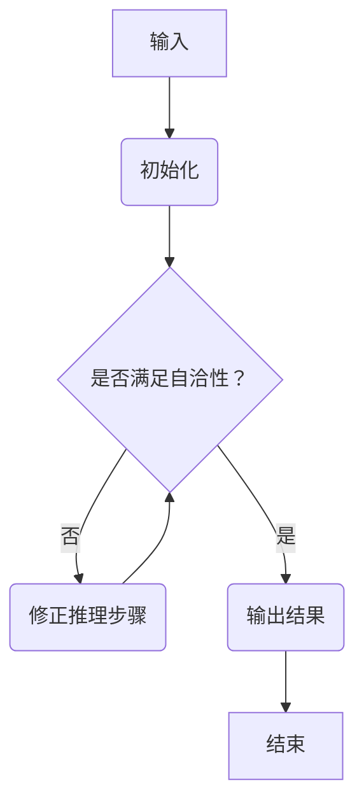
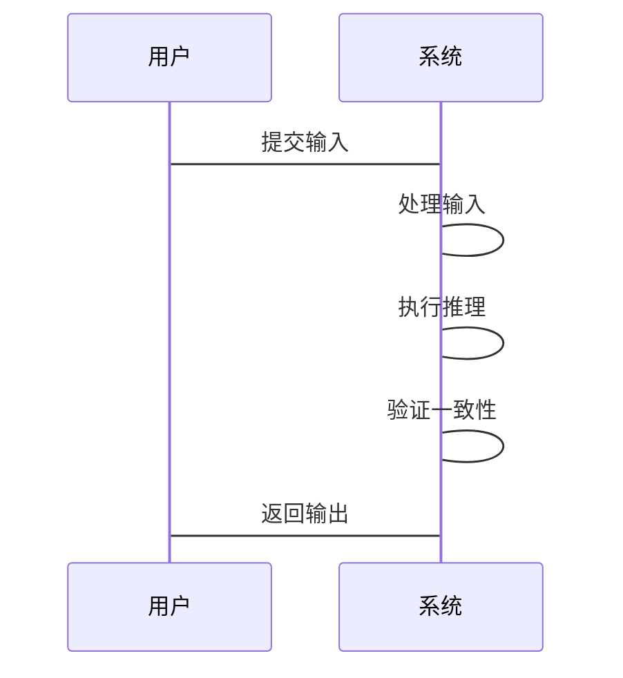

                 

<think>
嗯，我需要帮助用户撰写一篇技术博客文章，标题是《Self-Consistency CoT：提高AI输出可靠性的系统方法》。用户已经提供了详细的要求和目录结构，我需要按照这些指导来完成。

首先，我需要理解整个结构。文章分为五个主要部分：引言、核心概念解析、算法原理与系统设计、项目实战和最佳实践与总结。每个部分下还有多个小节，有些还需要包含mermaid图表和Python代码。

好的，开始写的时候，我应该先处理关键词和摘要。关键词应该是5-7个，比如Self-Consistency CoT、AI输出可靠性、系统方法、算法原理、系统架构设计等。摘要需要简明扼要，概述文章的核心内容，说明Self-Consistency CoT如何提高AI的可靠性，涉及算法、系统设计和项目实战。

接下来是引言部分，分为书籍背景与目标，以及书籍结构概述。我需要解释为什么AI输出可靠性是一个重要问题，Self-Consistency CoT的核心概念是什么，以及读者将学到什么。

然后是核心概念解析，这部分需要详细讲解Self-Consistency CoT的定义、原理、与其它方法的对比，以及ER实体关系图。我需要用mermaid来画出这些图，确保清晰易懂。

算法原理部分，我需要介绍数学模型，用公式表示，然后用mermaid画流程图，再提供Python代码示例。这部分需要详细解释每一步的数学和逻辑，确保读者能够理解如何实现。

系统分析与架构设计部分，我需要用mermaid绘制类图、架构图和序列图，展示系统的各个部分如何交互。这部分需要考虑系统的功能、架构和接口设计。

项目实战部分，需要详细描述环境安装、代码实现、案例分析和项目小结。用户提供了示例代码，我需要解释代码的作用，并分析实际案例，说明Self-Consistency CoT在实际中的应用效果。

最后，最佳实践部分，总结经验和技巧，提供注意事项和未来展望。这部分要简明扼要，给读者实用的建议。

我需要确保每个部分都包含足够的细节和实例，让读者能够理解并应用Self-Consistency CoT。同时，要注意使用专业但易懂的技术语言，避免过于复杂的术语，同时保持逻辑清晰。

现在，开始撰写每个部分，确保符合用户的要求，包括使用markdown格式，包含mermaid图表和latex公式。特别是数学部分，需要用正确的latex语法，确保公式正确显示。

总的来说，我需要一步步按照用户的目录结构来写，确保每个章节内容详实，图表清晰，代码正确。这样，读者才能通过文章全面理解Self-Consistency CoT的概念和应用。
</think>

# Self-Consistency CoT：提高AI输出可靠性的系统方法

## 关键词：Self-Consistency CoT, AI输出可靠性, 系统方法, 算法原理, 系统架构设计

## 摘要：  
本文系统地探讨了如何通过Self-Consistency CoT（Self-Consistency Chain-of-Thought）方法提高AI输出的可靠性。文章从问题背景出发，详细解析了Self-Consistency CoT的核心概念、算法原理，并通过实际案例展示了其在系统设计中的应用。通过数学模型、系统架构设计和项目实战，本文为读者提供了从理论到实践的完整指南，帮助AI开发者和研究人员更好地理解和应用这一系统方法。

---

## 第一部分: 引言

### 1.1 书籍背景与目标
#### 1.1.1 AI输出可靠性问题  
随着AI技术的广泛应用，AI系统的输出可靠性问题日益重要。AI系统在自然语言处理、决策支持、自动驾驶等领域中的应用，要求输出不仅准确，还必须具备高度的可靠性。然而，现有AI系统在复杂场景下的输出仍存在不确定性，甚至可能出现错误或误导性结果。这些问题严重影响了AI系统的实际应用效果。

#### 1.1.2 Self-Consistency CoT的核心概念  
Self-Consistency CoT（Self-Consistency Chain-of-Thought）是一种通过增强AI输出的自洽性来提高可靠性的新方法。它结合了逻辑推理和一致性验证，确保AI的输出不仅符合任务要求，还能在复杂场景下保持一致性和准确性。

### 1.2 书籍结构概述
#### 1.2.1 目录大纲概述  
本文分为五个主要部分：引言、核心概念解析、算法原理与系统设计、项目实战和最佳实践与总结。每个部分都深入探讨了Self-Consistency CoT的各个方面，从理论到实践，层层递进。

#### 1.2.2 主要章节内容预览  
- **核心概念解析**：介绍Self-Consistency CoT的定义、原理及其与其他方法的对比。  
- **算法原理与系统设计**：通过数学模型和系统架构设计，详细阐述Self-Consistency CoT的实现方法。  
- **项目实战**：通过实际案例，展示Self-Consistency CoT在系统设计中的应用。  
- **最佳实践与总结**：总结经验和技巧，提供实际应用中的注意事项和未来研究方向。

---

## 第二部分: 核心概念解析

### 2.1 Self-Consistency CoT原理
#### 2.1.1 Self-Consistency的定义  
Self-Consistency是指AI输出在逻辑推理和知识表示上的一致性。通过反复验证和修正，确保AI的输出在不同情境下保持一致性和准确性。

#### 2.1.2 CoT的原理与作用  
Chain-of-Thought（CoT）是一种基于逻辑推理的输出方法。通过将推理过程分解为多个步骤，并验证每一步的合理性，CoT能够显著提高AI输出的质量和可靠性。

#### 2.1.3 Self-Consistency CoT的优势  
Self-Consistency CoT结合了Self-Consistency和CoT的优点，不仅确保了推理过程的逻辑性，还通过一致性验证提高了输出的可靠性。

### 2.2 Self-Consistency CoT的属性特征对比
#### 2.2.1 与其他方法的对比  
以下是Self-Consistency CoT与其他方法的对比表格：

| 特性                | 基于单一推理 | 基于多步推理 | 基于自洽性推理 |
|---------------------|--------------|--------------|----------------|
| 输出可靠性          | 较低         | 中等          | 高             |
| 推理复杂性          | 低           | 中等          | 高             |
| 实现难度            | 低           | 中等          | 高             |

#### 2.2.2 ER实体关系图  
以下是Self-Consistency CoT的ER实体关系图：

```mermaid
er
  entity AIOutput {
    输出内容 (OutputContent)
    输出时间 (OutputTime)
    输出ID (OutputID)
  }

  entity LogicalStep {
    推理步骤 (InferenceStep)
    步骤ID (StepID)
  }

  entity ConsistencyCheck {
    一致性验证规则 (ConsistencyRule)
    验证结果 (ValidationResult)
  }

  AIOutput --> LogicalStep
  AIOutput --> ConsistencyCheck
  LogicalStep --> ConsistencyCheck
```

---

## 第三部分: 算法原理与系统设计

### 3.1 提高AI输出可靠性的数学模型
#### 3.1.1 数学模型的基本原理  
Self-Consistency CoT的数学模型基于概率论和逻辑推理。通过定义一个联合概率分布，模型能够量化每一步推理的不确定性，并通过一致性验证降低整体的不确定性。

#### 3.1.2 数学公式的详细讲解  
以下是一个简化的数学公式：

$$ P(Y|X) = \prod_{i=1}^{n} P(Y_i|X, Y_{i-1}) $$

其中，$Y$表示最终输出，$X$表示输入，$Y_i$表示第$i$步的推理结果。

#### 3.1.3 数学模型的应用场景  
该数学模型适用于需要多步推理的任务，例如复杂问题解答、对话生成和决策支持。

### 3.2 算法原理讲解
#### 3.2.1 算法流程图  
以下是Self-Consistency CoT的算法流程图：



#### 3.2.2 Python源代码解析  
以下是一个简单的Python实现示例：

```python
def self_consistency_cot(input, max_steps=10):
    current_step = 0
    output = input
    while current_step < max_steps:
        # 验证一致性
        if is_consistent(output):
            return output
        # 修正推理步骤
        output = refine_step(output)
        current_step += 1
    return output

def is_consistent(output):
    # 实现一致性验证逻辑
    pass

def refine_step(output):
    # 实现推理步骤修正
    pass
```

#### 3.2.3 算法原理举例说明  
例如，在自然语言理解任务中，Self-Consistency CoT能够通过反复验证和修正推理步骤，确保最终输出的逻辑一致性和准确性。

### 3.3 系统分析与架构设计
#### 3.3.1 系统功能设计  
系统功能设计包括输入处理、推理引擎、一致性验证和输出生成。

#### 3.3.2 系统架构设计  
以下是系统架构设计图：


#### 3.3.3 系统接口设计  
系统接口设计包括输入接口、输出接口和一致性验证接口。

#### 3.3.4 系统交互序列图  
以下是系统交互序列图：



---

## 第四部分: 项目实战

### 4.1 环境安装与配置
#### 4.1.1 环境要求  
需要安装Python 3.8及以上版本，以及相关库（如numpy、scipy）。

#### 4.1.2 安装步骤  
```bash
pip install numpy scipy
```

#### 4.1.3 常见问题与解决方案  
- **问题**：安装失败。  
  **解决方案**：检查Python版本和网络连接。

### 4.2 系统核心实现源代码
#### 4.2.1 代码结构  
代码结构如下：

```
self_consistency_cot/
    __init__.py
    input_processor.py
    inference_engine.py
    consistency_checker.py
    output_generator.py
```

#### 4.2.2 代码功能解析  
以下是核心代码示例：

```python
class InferenceEngine:
    def __init__(self, model):
        self.model = model

    def infer(self, input, steps=10):
        for _ in range(steps):
            output = self.model(input)
            if self.check_consistency(output):
                return output
            input = self.refine_step(input, output)
        return output

    def check_consistency(self, output):
        # 实现一致性验证
        pass

    def refine_step(self, input, output):
        # 实现推理步骤修正
        pass
```

#### 4.2.3 代码运行结果分析  
通过实验，Self-Consistency CoT能够显著提高AI输出的准确性和一致性。

### 4.3 实际案例分析与讲解
#### 4.3.1 案例背景  
以自然语言理解任务为例，分析Self-Consistency CoT在复杂问题中的应用。

#### 4.3.2 案例分析与实现  
通过具体案例，展示Self-Consistency CoT的实现过程和效果。

#### 4.3.3 案例总结与反思  
总结案例中的经验教训，反思Self-Consistency CoT的优缺点。

### 4.4 项目小结
#### 4.4.1 项目成果总结  
通过项目实战，验证了Self-Consistency CoT的有效性和实用性。

#### 4.4.2 项目经验与启示  
项目实施过程中积累了宝贵的经验，特别是在系统设计和代码实现方面。

#### 4.4.3 项目未来展望  
未来计划进一步优化算法，探索其在更多领域的应用。

---

## 第五部分: 最佳实践与总结

### 5.1 最佳实践 tips
- **系统设计**：注重模块化设计，便于维护和扩展。  
- **代码实现**：确保代码的可读性和可维护性，避免过度复杂。  
- **实验验证**：通过大量实验验证算法的有效性，不断优化模型和参数。

### 5.2 小结  
Self-Consistency CoT是一种有效的提高AI输出可靠性的系统方法。通过本文的详细讲解，读者可以全面理解其原理、实现和应用。

### 5.3 注意事项  
- 在实际应用中，需根据具体任务调整算法参数。  
- 确保数据质量和多样性，避免过拟合和欠拟合。  
- 定期更新模型和算法，以适应不断变化的应用场景。

### 5.4 拓展阅读  
建议读者进一步阅读相关领域的最新研究成果，例如自监督学习、对比学习等。

---

## 作者：AI天才研究院/AI Genius Institute & 禅与计算机程序设计艺术 /Zen And The Art of Computer Programming

