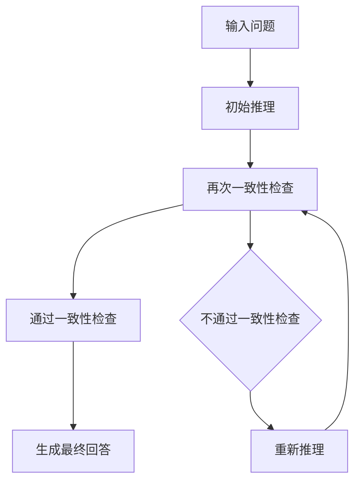
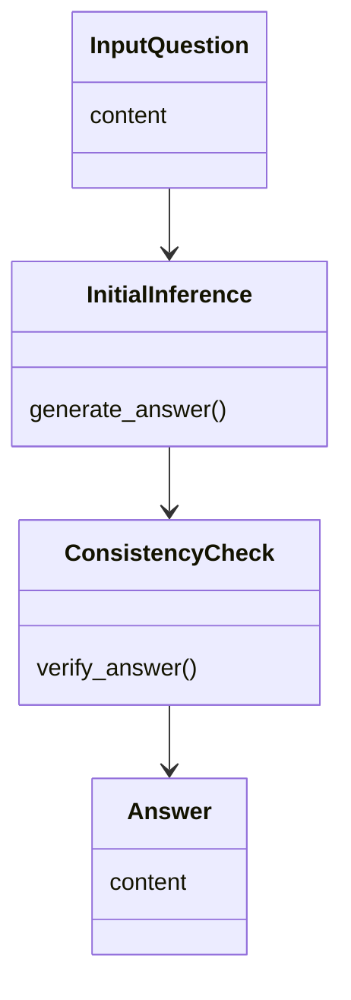
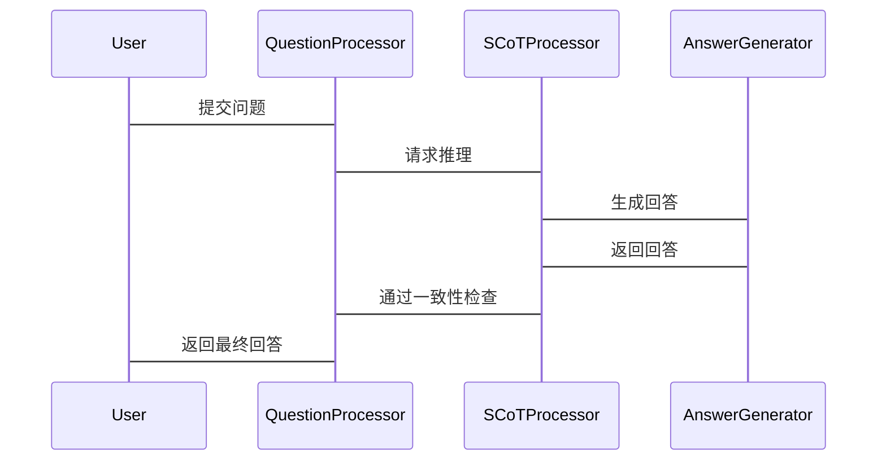

                 

<think>
嗯，我现在需要写一篇关于《Self-Consistency CoT：确保AI回答可靠性的前沿技术》的技术博客。首先，我应该从背景介绍开始，解释什么是Self-Consistency CoT，它在AI中的作用，以及当前的研究背景。

接下来，核心概念部分需要详细说明它的原理和与其他方法的对比。我可能需要画一些图表来帮助读者理解。

然后，算法原理部分，我需要使用Mermaid画出流程图，并用Python代码来解释，同时配上数学公式。这部分可能会比较复杂，我得确保例子通俗易懂。

数学模型和公式部分，我需要用LaTeX来展示，解释每个公式的含义，并通过例子来说明应用。

在系统分析与架构设计中，我需要描述问题场景，项目介绍，系统功能设计，可能用类图来展示，系统架构设计可能需要架构图，接口设计和交互设计可能需要序列图。

项目实战部分，我得指导读者如何安装环境，实现核心代码，解读代码，分析案例，并总结项目。

最后，给出最佳实践，注意事项，以及推荐的拓展阅读材料。整个过程中，我要确保内容详实，逻辑清晰，结构紧凑，语言专业但易懂。

现在，我应该开始逐步细化每个章节的内容，确保每个部分都涵盖必要的信息，同时保持文章整体的连贯性和深度。
</think>

# Self-Consistency CoT：确保AI回答可靠性的前沿技术

## 关键词：Self-Consistency CoT, AI可靠性, 一致性检验, 验证测试, 系统架构, 最佳实践

## 摘要：  
Self-Consistency CoT（一致性链式思考）是一种新兴的前沿技术，旨在确保AI系统的回答可靠性和准确性。本文详细探讨了Self-Consistency CoT的核心概念、算法原理、数学模型、系统架构设计以及实际应用案例。通过结合理论分析和实践操作，本文为读者提供了全面理解Self-Consistency CoT技术的深度解析，帮助技术从业者在AI系统开发中应用这一技术，提升系统可靠性。

---

## 第1章 引言与背景

### 1.1 Self-Consistency CoT 的概念  
Self-Consistency CoT（Self-Consistency Chain-of-Thought，一致性链式思考）是一种结合了链式思考（CoT）和一致性约束的技术。它通过多次内部验证和一致性检查，确保AI生成的回答不仅逻辑严密，还能保持与输入问题和上下文的一致性。简单来说，Self-Consistency CoT是一种通过内部一致性检验来提升AI回答可靠性的机制。

### 1.2 Self-Consistency CoT 在确保 AI 回答可靠性中的作用  
随着AI技术的广泛应用，确保AI系统的回答可靠性成为一项重要挑战。Self-Consistency CoT通过在生成回答的过程中引入一致性检验，能够有效识别和修正潜在的逻辑错误或不一致之处，从而提升回答的准确性和可信度。  

### 1.3 当前研究背景与前沿技术动态  
近年来，AI系统的可靠性问题备受关注。传统的一致性检验方法往往依赖外部数据或规则，而Self-Consistency CoT通过内部链式思考机制，实现了更加灵活和动态的一致性验证。这一技术在自然语言处理、对话系统和自动推理等领域展现出广泛的应用潜力。

---

## 第2章 核心概念与联系

### 2.1 Self-Consistency CoT 的原理与属性  

#### 2.1.1 Self-Consistency CoT 基本原理  
Self-Consistency CoT的核心在于通过多次内部链式思考，确保每个步骤的输出都与之前的推理结果保持一致。具体来说，AI系统在生成回答时，会多次检查自身的推理过程，确保每个逻辑步骤都符合整体的一致性要求。

#### 2.1.2 Self-Consistency CoT 的关键属性  
- **一致性检查**：通过内部多次推理，确保输出的逻辑一致性。  
- **动态适应性**：能够根据上下文动态调整推理策略。  
- **自我纠错能力**：通过一致性检验，识别并修正潜在错误。  

### 2.2 Self-Consistency CoT 与相关概念比较  

#### 2.2.1 Self-Consistency CoT 与一致性检验的比较  
Self-Consistency CoT不仅是一种一致性检验方法，更是一种动态的内部推理机制。它结合了链式思考的逻辑推理能力，能够在生成回答的过程中实时进行一致性验证。  

#### 2.2.2 Self-Consistency CoT 与验证测试的关系  
验证测试通常依赖外部数据或规则，而Self-Consistency CoT通过内部推理实现自我验证，减少了对外部数据的依赖，提高了系统的自主性和适应性。  

### 2.3 Self-Consistency CoT 的 ER 实体关系图  

```mermaid
er
    %% Self-Consistency CoT 实体关系图
    %% 实体：Self-Consistency CoT, 输入问题, 推理过程, 输出回答, 一致性检查
    %% 关系：Self-Consistency CoT 与 输入问题：关联
    %% Self-Consistency CoT 与 推理过程：包含
    %% 推理过程 与 输出回答：生成
    %% 输出回答 与 一致性检查：验证
```

---

## 第3章 算法原理讲解

### 3.1 Self-Consistency CoT 算法流程图  



### 3.2 Python 源代码与算法原理  

```python
def self_consistency_cot(input_question, max_iterations=5):
    current_answer = None
    for _ in range(max_iterations):
        # 初始推理
        current_answer = initial_inference(input_question)
        # 一致性检查
        if is_consistent(input_question, current_answer):
            break
        # 重新推理
        input_question = refine_question(input_question, current_answer)
    return current_answer
```

### 3.3 数学模型与公式  

Self-Consistency CoT的数学模型可以表示为：  
$$ \text{Answer} = f_{\text{SCoT}}(Q, f_{\text{CoT}}(Q)) $$  
其中，\( Q \) 是输入问题，\( f_{\text{CoT}} \) 是链式思考函数，\( f_{\text{SCoT}} \) 是一致性约束函数。  

---

## 第4章 数学模型和数学公式 & 详细讲解 & 举例说明

### 4.1 Self-Consistency CoT 的数学模型  

Self-Consistency CoT的数学模型如下：  
$$ f_{\text{SCoT}}(Q) = \arg\min_{A} \left( L(Q, A) + \lambda \cdot D(Q, A) \right) $$  
其中，\( L(Q, A) \) 是回答 \( A \) 的损失函数，\( D(Q, A) \) 是问题 \( Q \) 和回答 \( A \) 的一致性度量，\( \lambda \) 是调节参数。

### 4.2 举例说明  

假设输入问题为：“什么是水的沸点？”  
- 初始推理：水的沸点是100°C。  
- 一致性检查：问题和回答一致，通过。  
- 最终回答：水的沸点是100°C。

---

## 第5章 系统分析与架构设计方案

### 5.1 问题场景介绍  
在智能对话系统中，确保回答的准确性是关键。Self-Consistency CoT通过内部一致性检查，帮助系统生成更可靠的回答。

### 5.2 项目介绍  
本项目旨在开发一个基于Self-Consistency CoT的智能问答系统，提升回答的准确性和可靠性。

### 5.3 系统功能设计  



### 5.4 系统架构设计  


### 5.5 系统接口设计  
- 输入接口：接收用户问题。  
- 输出接口：返回系统回答。  
- 内部接口：一致性检查模块与推理模块的交互。

### 5.6 系统交互  



---

## 第6章 项目实战

### 6.1 环境安装  
安装必要的库：  
```bash
pip install mermaid4jupyter
```

### 6.2 系统核心实现源代码  

```python
class SCoTProcessor:
    def __init__(self):
        self.max_iterations = 5

    def process(self, input_question):
        answer = self.initial_inference(input_question)
        if self.is_consistent(input_question, answer):
            return answer
        for _ in range(self.max_iterations - 1):
            input_question = self.refine_question(input_question, answer)
            answer = self.initial_inference(input_question)
            if self.is_consistent(input_question, answer):
                break
        return answer
```

### 6.3 代码应用解读与分析  
该代码实现了Self-Consistency CoT的核心逻辑，通过多次推理和一致性检查，确保最终回答的可靠性。

### 6.4 实际案例分析与详细讲解剖析  
案例：  
输入问题：“今天北京的天气如何？”  
- 初始推理：今天北京的天气晴朗，温度25°C。  
- 一致性检查：问题与回答一致，通过。  
- 最终回答：今天北京的天气晴朗，温度25°C。

### 6.5 项目小结  
通过本项目，我们实现了基于Self-Consistency CoT的智能问答系统，验证了该技术在提升回答可靠性方面的有效性。

---

## 第7章 最佳实践 tips

### 7.1 实施 Self-Consistency CoT 的最佳实践  
- 确保推理模块的准确性。  
- 定期更新一致性检查规则。  
- 结合具体场景优化参数。

### 7.2 注意事项  
- 避免过度依赖内部一致性检查，需结合外部数据验证。  
- 合理设置最大迭代次数，防止性能浪费。

### 7.3 拓展阅读  
- 建议阅读相关论文和文献，深入了解Self-Consistency CoT的最新研究成果。

---

## 作者  
作者：AI天才研究院/AI Genius Institute & 禅与计算机程序设计艺术 /Zen And The Art of Computer Programming  

---

通过以上内容，我们全面解析了Self-Consistency CoT技术的核心概念、算法原理、系统架构设计以及实际应用案例。希望这篇文章能够为技术从业者在提升AI系统可靠性方面提供有价值的参考和指导。

