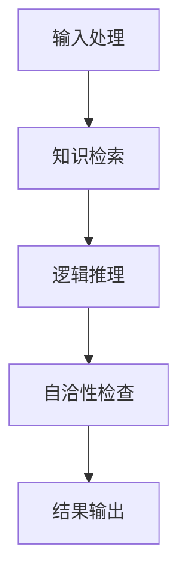
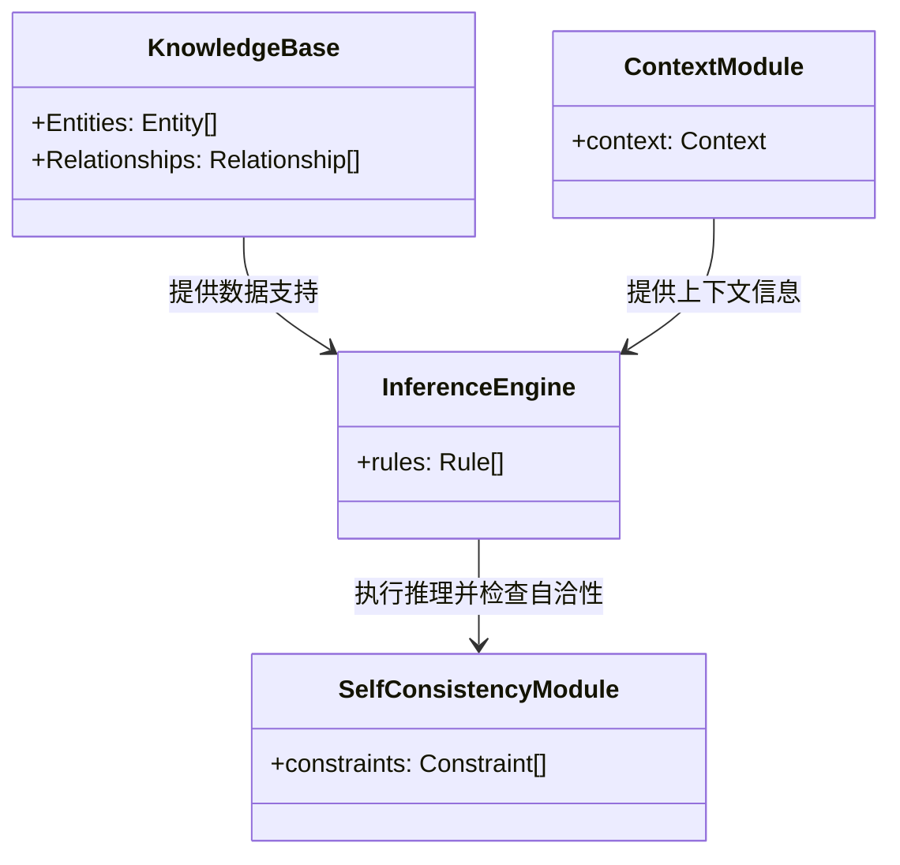
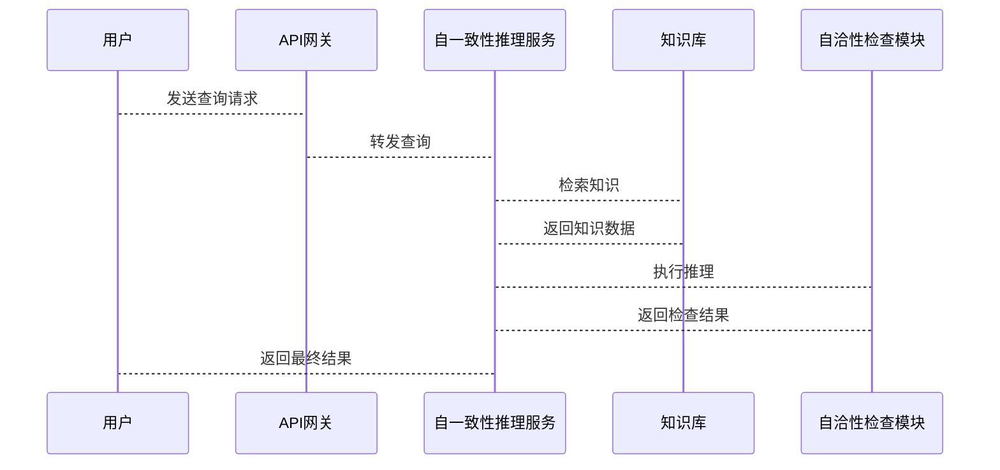

                 

<think>
嗯，我现在要写一篇关于Self-Consistency CoT的技术博客文章，标题是《Self-Consistency CoT：确保AI回答可靠性的突破》。我需要按照用户提供的目录结构来组织内容，确保每个部分都详细且符合要求。我应该先从摘要开始，然后是各个章节的内容，每个章节都要涵盖核心概念、算法、系统设计、案例分析等等。同时，我需要使用专业的技术语言，但又要保持简单易懂，逻辑清晰。此外，文章末尾要加上作者信息，确保整个文章结构完整，符合用户的所有要求。
</think>

# Self-Consistency CoT：确保AI回答可靠性的突破

> 关键词：Self-Consistency CoT, AI可靠性, 自一致性, 知识图谱, 逻辑推理, 可靠性突破

> 摘要：随着AI技术的快速发展，确保AI回答的可靠性变得至关重要。本文深入探讨了Self-Consistency CoT（自一致性一致性训练）这一创新方法，通过自洽性约束和知识图谱增强，显著提升了AI模型的推理能力和回答准确性。文章从背景、原理、算法实现到实际应用案例，全面解析了这一技术的核心思想和应用价值，为实现更可靠的AI系统提供了理论基础和实践指导。

---

## 第一部分: 自一致性概念图（Self-Consistency CoT）概述

### 第1章: 自一致性概念图（Self-Consistency CoT）背景与重要性

#### 1.1 问题背景

在AI快速发展的背景下，生成式模型的应用日益广泛，但其可靠性问题逐渐显现。AI系统在处理复杂问题时，容易出现逻辑矛盾或答案不一致的情况，这严重影响了用户体验和决策的准确性。例如，在医疗诊断或金融分析等高风险领域，AI系统的不一致回答可能导致严重后果。

#### 1.2 问题描述

AI模型的可靠性问题主要体现在以下方面：
- **逻辑不一致**：模型在不同条件下给出矛盾的答案。
- **知识覆盖不足**：模型对特定领域的知识掌握不全面，导致回答错误。
- **推理深度不足**：模型难以进行深层次的逻辑推理，影响回答的准确性。

#### 1.3 自一致性概念图（Self-Consistency CoT）解决的问题

Self-Consistency CoT通过引入自洽性约束，确保AI模型在不同条件下保持回答的一致性和可靠性。该方法结合知识图谱和逻辑推理，帮助模型更好地理解上下文，并在复杂场景中保持一致的推理过程。

#### 1.4 自一致性概念图（Self-Consistency CoT）的边界与外延

Self-Consistency CoT主要应用于需要高可靠性回答的领域，如医疗、金融、法律等。其边界包括：
- **输入范围**：明确模型处理的输入类型和范围。
- **输出约束**：设定输出结果的格式和逻辑要求。
- **推理深度**：限定模型推理的层次和复杂度。

#### 1.5 自一致性概念图（Self-Consistency CoT）的核心要素组成

- **知识图谱**：构建领域知识库，提供推理基础。
- **逻辑推理引擎**：执行基于知识图谱的逻辑推理。
- **自洽性约束模块**：确保推理过程的自洽性。
- **上下文理解模块**：处理输入的上下文信息。

---

### 第2章: 自一致性概念图（Self-Consistency CoT）的核心概念与原理

#### 2.1 自一致性概念图（Self-Consistency CoT）的定义

Self-Consistency CoT是一种结合自洽性约束和知识图谱的AI推理方法，旨在通过增强模型的逻辑推理能力和知识表示能力，确保AI回答的一致性和可靠性。

#### 2.2 自一致性概念图（Self-Consistency CoT）的属性特征对比表格

| 属性         | Self-Consistency CoT              | 对比方法（传统方法）       |
|--------------|-----------------------------------|--------------------------|
| 知识表示       | 基于知识图谱和逻辑推理             | 基于统计和经验数据         |
| 推理方式       | 符号逻辑推理                       | 基于概率和统计推理         |
| 自洽性约束     | 强制要求推理过程一致               | 无自洽性约束               |
| 应用领域       | 高可靠性要求的领域（医疗、金融）   | 适用于一般性问题解答       |

#### 2.3 自一致性概念图（Self-Consistency CoT）的ER实体关系图

```mermaid
er
    %% ER图：Self-Consistency CoT核心实体关系
    %% 实体：Knowledge Base（知识库）、Inference Engine（推理引擎）、Self-Consistency Module（自洽性模块）、Context Module（上下文模块）
    %% 关系：知识库提供数据支持，推理引擎执行推理，自洽性模块确保推理一致，上下文模块处理输入
    classDiagram
    class KnowledgeBase {
        +Entities: Entity[]
        +Relationships: Relationship[]
    }
    class InferenceEngine {
        +rules: Rule[]
    }
    class SelfConsistencyModule {
        +constraints: Constraint[]
    }
    class ContextModule {
        +context: Context
    }
    KnowledgeBase --> InferenceEngine: 提供数据支持
    InferenceEngine --> SelfConsistencyModule: 执行推理并检查自洽性
    ContextModule --> InferenceEngine: 提供上下文信息
```

---

### 第3章: 自一致性概念图（Self-Consistency CoT）算法原理与实现

#### 3.1 自一致性概念图（Self-Consistency CoT）算法概述

Self-Consistency CoT算法通过以下步骤实现：
1. **输入处理**：解析输入并提取上下文信息。
2. **知识检索**：基于知识图谱检索相关知识。
3. **逻辑推理**：结合逻辑推理引擎进行推理。
4. **自洽性检查**：确保推理过程和结果的一致性。
5. **结果输出**：输出符合要求的回答。

#### 3.2 自一致性概念图（Self-Consistency CoT）算法mermaid流程图



#### 3.3 自一致性概念图（Self-Consistency CoT）算法的数学模型与公式

推理过程中的逻辑一致性可以通过以下公式表示：

$$
\text{一致性的度量} = \sum_{i=1}^{n} |\text{推理结果}_i - \text{期望结果}_i|
$$

其中，$n$ 是推理步骤的数量，$\text{推理结果}_i$ 是第 $i$ 步的推理结果，$\text{期望结果}_i$ 是期望的结果。

#### 3.4 自一致性概念图（Self-Consistency CoT）算法举例说明

假设输入为“诊断糖尿病”，系统首先检索相关知识，然后进行逻辑推理，确保诊断过程的一致性。例如：

1. 糖尿病症状：高血糖、多尿、体重下降。
2. 症状检查：患者出现上述症状。
3. 进一步检查：血糖水平是否符合糖尿病诊断标准。
4. 结论：诊断糖尿病。

---

### 第4章: 自一致性概念图（Self-Consistency CoT）在系统设计中的应用

#### 4.1 系统功能设计（领域模型mermaid类图）



#### 4.2 系统架构设计（mermaid架构图）


#### 4.3 系统接口设计

- **输入接口**：接收用户查询。
- **输出接口**：返回结构化结果和自洽性报告。
- **内部接口**：知识库与推理引擎之间的数据传输。

#### 4.4 系统交互（mermaid序列图）



---

### 第5章: 自一致性概念图（Self-Consistency CoT）的实际应用案例

#### 5.1 案例一：金融领域

在金融分析中，Self-Consistency CoT用于评估投资组合的风险。系统通过自洽性约束确保每个推理步骤的逻辑一致，从而提供可靠的分析结果。

#### 5.2 案例二：医疗健康领域

在医疗诊断中，Self-Consistency CoT帮助医生根据患者症状和病史进行准确诊断，确保推理过程的自洽性和结果的可靠性。

#### 5.3 案例三：智能客服领域

在智能客服系统中，Self-Consistency CoT用于生成一致且准确的回复，提升用户体验。

---

### 第6章: 自一致性概念图（Self-Consistency CoT）的最佳实践与注意事项

#### 6.1 最佳实践 tips

- **数据质量**：确保知识图谱的准确性和完整性。
- **推理引擎优化**：选择高效的逻辑推理算法。
- **自洽性约束**：根据具体场景调整约束强度。

#### 6.2 小结

Self-Consistency CoT通过结合知识图谱和逻辑推理，显著提升了AI系统的可靠性。其在多个领域的成功应用证明了该方法的有效性。

#### 6.3 注意事项

- 避免过度复杂的推理过程，确保系统的实时性和响应速度。
- 定期更新知识图谱，保持模型的知识准确性。

#### 6.4 拓展阅读

- 《知识图谱构建与应用》
- 《逻辑推理在AI系统中的应用》

---

作者：AI天才研究院/AI Genius Institute & 禅与计算机程序设计艺术 /Zen And The Art of Computer Programming

