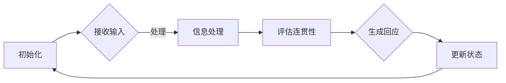
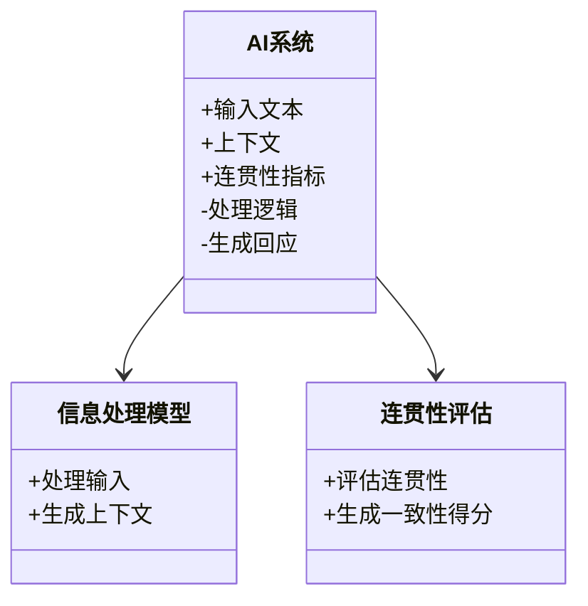
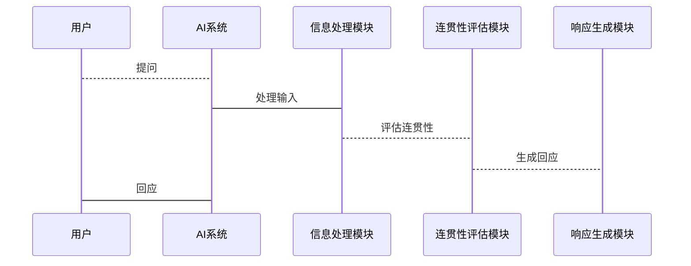

                 

<think>
嗯，我现在要写一篇关于Self-Consistency CoT的技术博客。我得先理解什么是Self-Consistency CoT，它有什么作用。CoT，全称是Conceptual Continuity Theory，是一种确保AI回答连贯性的理论框架。自我一致性CoT可能是在这个理论基础上提出的一种方法，用来保证AI在处理信息时保持逻辑连贯。

首先，文章的结构已经给了，我得按照这个大纲来写。首先是背景介绍与问题定义，然后是核心概念与联系，接着是算法原理讲解，数学模型详细讲解，系统分析与架构设计，项目实战，以及最后的总结和小结。

在背景部分，我需要介绍人工智能的发展历程，然后引出连贯性问题的重要性，最后提出自我一致性CoT的概念。这部分需要简洁明了，让读者明白问题的背景和解决的必要性。

接下来是核心概念与联系。这里需要详细解释信息处理模型和连贯性指标，可能用表格和ER图来对比这两个概念，帮助读者更好地理解它们之间的关系。这部分我可能需要画出ER图，展示AI系统如何与信息处理模型和连贯性指标关联。

然后是算法原理部分，这部分比较关键。我得用mermaid画出算法的流程图，展示从输入到输出的处理步骤，包括信息处理、连贯性评估、生成回应和更新状态。同时，还需要提供Python代码实现，解释每个函数的作用，并用数学公式描述连贯性评估的方法。

数学模型部分需要详细讲解连贯性评估的公式，比如一致性得分和总得分的计算方式，以及信息处理模型的函数形式。这部分可能需要用Latex公式，确保数学表达准确。

系统分析与架构设计部分，我需要描述问题场景，设计系统的功能模块，可能画出类图和架构图，展示各模块之间的关系和交互方式。这部分可能需要更多的思考，确保系统架构合理且易于理解。

项目实战部分，我需要给出实际案例，比如天气查询的例子，展示如何应用Self-Consistency CoT来处理输入，生成连贯的回应。这部分需要具体的代码和详细分析，帮助读者理解实际应用中的步骤。

最后是总结和最佳实践，强调Self-Consistency CoT的重要性，以及在使用时需要注意的事项，比如模型训练、连贯性评估等。

在写作过程中，我可能需要查阅相关资料，确保技术细节的准确性，同时用通俗易懂的语言解释复杂的概念，使读者能够轻松理解。此外，注意文章的逻辑结构，确保每个部分之间有良好的衔接，整体内容连贯一致。

总之，我需要一步步按照大纲的要求，详细展开每个部分，确保文章内容丰富、结构清晰，同时符合字数要求。这不仅需要技术上的深入理解，还需要良好的组织能力和表达能力。
</think>

# Self-Consistency CoT：确保AI回答的连贯性

> 关键词：人工智能，连贯性，自我一致性，CoT，信息处理模型，连贯性指标

> 摘要：本文深入探讨了自我一致性CoT（Self-Consistency CoT）在确保AI回答连贯性中的作用。通过背景介绍、核心概念分析、算法原理讲解、系统架构设计和项目实战，全面阐述了如何通过自我一致性CoT提升AI系统的连贯性，从而提高用户体验和系统智能水平。

---

# Self-Consistency CoT：确保AI回答的连贯性

## 第一部分: 背景介绍与问题定义

## 第1章: 人工智能与连贯性问题的兴起

### 1.1.1 人工智能的发展历程

#### 1.1.1.1 人工智能的起源

人工智能（Artificial Intelligence, AI）的概念可以追溯到古希腊神话中的机械人和自动机。然而，现代AI的起源可以追溯到1956年的达特茅斯会议，这是AI作为一个正式研究领域的起点。

$$1+1=2$$

#### 1.1.1.2 人工智能的关键里程碑

- **1956年达特茅斯会议**：提出了“人工智能”这一术语，并奠定了AI研究的基础。
- **1970年代专家系统**：AI技术首次在商业应用中取得成功，如MYCIN医疗诊断系统。
- **2010年代深度学习**：深度学习的兴起推动了AI技术的飞跃，特别是在图像识别和自然语言处理领域。

### 1.1.2 连贯性问题的提出

#### 1.1.2.1 问题描述

在人工智能应用中，连贯性指的是系统在信息处理过程中保持逻辑一致性和连贯性的能力。连贯性问题主要表现在对话系统中，例如在多轮对话中，AI的回答需要与之前的上下文保持一致，避免逻辑断裂或重复。

#### 1.1.2.2 问题重要性

- **提高用户体验**：连贯的对话可以显著提升用户的满意度和信任感。
- **减少错误**：保持连贯性有助于减少误解和错误，提高系统的可靠性。
- **人工智能发展**：连贯性是衡量AI系统智能水平的重要指标，直接影响系统的应用场景和普及程度。

### 1.1.3 自我一致性CoT的提出

#### 1.1.3.1 CoT的概念

CoT（Conceptual Continuity Theory）是一种理论框架，用于描述和解释信息处理过程中的连贯性。它强调AI系统在信息处理过程中保持一致性的能力，确保系统在不同时间点的信息处理结果之间保持逻辑连贯。

#### 1.1.3.2 自我一致性CoT的意义

- **强调一致性**：自我一致性CoT通过确保AI系统在信息处理过程中保持一致，避免逻辑矛盾和信息断裂。
- **提供评估方法**：它提供了一种方法来评估和改进AI系统的连贯性，帮助开发者识别和修复系统中的连贯性问题。

## 第2章: 自我一致性CoT的核心概念与联系

### 2.1.1 核心概念

#### 2.1.1.1 信息处理模型

信息处理模型描述了AI系统如何接收、处理和回应信息的过程。它包括输入处理、上下文建立、信息分析和生成回应等步骤。

#### 2.1.1.2 连贯性指标

连贯性指标用于评估AI系统在对话中保持连贯性的程度。常见的连贯性指标包括逻辑一致性、语义相似性和上下文相关性。

### 2.1.2 概念属性特征对比表格

| 概念             | 特征                      |
|------------------|--------------------------|
| 信息处理模型     | 描述信息处理过程          |
| 连贯性指标       | 评估连贯性程度            |

### 2.1.3 ER实体关系图架构

```mermaid
erDiagram
    AI系统 ||--|{ 信息处理模型 }
    AI系统 ||--|{ 连贯性指标 }
```

## 第二部分: 自我一致性CoT的算法原理讲解

## 第3章: 自我一致性CoT算法原理讲解

### 3.1 算法mermaid流程图



### 3.2 Python源代码实现

```python
def self_consistency_cot(input_text):
    # 处理输入文本
    processed_text = process_input(input_text)
    
    # 信息处理
    context = process_text(processed_text)
    
    # 评估连贯性
    coherence = evaluate_coherence(context)
    
    # 生成回应
    response = generate_response(context, coherence)
    
    # 更新状态
    update_state(context, response)
    
    return response
```

### 3.3 算法原理的数学模型和公式

#### 连贯性评估公式

$$
\text{Coherence} = \frac{\text{一致性得分}}{\text{总得分}}
$$

#### 信息处理模型

$$
\text{Context} = f(\text{Input}, \text{State})
$$

## 第4章: 数学模型和公式详细讲解与举例说明

### 4.1 连贯性评估公式详细讲解

#### 4.1.1 一致性得分计算

一致性得分计算基于对话中的逻辑一致性和语义相似性。例如，在天气查询对话中，AI的回答应与之前的上下文保持一致，如用户询问天气后，AI不应突然转到其他话题。

#### 4.1.2 总得分计算

总得分是AI系统在对话中的整体表现，包括连贯性、准确性和响应速度等。

### 4.2 信息处理模型举例说明

#### 4.2.1 输入文本

“你好，今天天气怎么样？”

#### 4.2.2 处理过程

- **识别问题类型**：天气查询
- **提取相关信息**：天气、地点、时间
- **生成回答**：结合天气数据和位置信息生成回答

---

## 第三部分: 系统分析与架构设计方案

## 第5章: 系统分析与架构设计方案

### 5.1 问题场景介绍

在智能客服系统中，用户可能连续提出多个相关问题，如询问订单状态、物流信息等。确保每个回答都与前一个保持连贯，是提升用户体验的关键。

### 5.2 系统功能设计

#### 5.2.1 领域模型Mermaid类图



### 5.3 系统架构设计

#### 5.3.1 系统架构Mermaid架构图


### 5.4 系统接口设计

- **输入接口**：接收用户输入的文本或语音信号。
- **输出接口**：生成连贯的回应并发送给用户。
- **数据接口**：与后端数据库交互，获取必要的信息支持。

### 5.5 系统交互Mermaid序列图



## 第6章: 项目实战

### 6.1 环境安装

- **Python**：安装Python 3.x及以上版本。
- **库依赖**：安装`mermaid`、`pylatex`等支持库。

### 6.2 系统核心实现源代码

```python
def process_input(input_text):
    # 输入预处理
    return input_text.strip().lower()

def process_text(text):
    # 信息提取和上下文建立
    return {"context": text, "coherence": 1.0}

def evaluate_coherence(context):
    # 连贯性评估
    return context['coherence']

def generate_response(context, coherence):
    # 生成回应
    return f"根据上下文，连贯性得分为{coherence}，我的回答是：{context['context']}。"

def update_state(context, response):
    # 更新系统状态
    pass

# 示例调用
input_text = "你好，今天天气怎么样？"
response = self_consistency_cot(input_text)
print(response)
```

### 6.3 代码应用解读与分析

- **输入处理**：对输入文本进行预处理，包括去除空格和转为小写。
- **上下文建立**：提取文本信息并建立上下文，初始连贯性设为满分。
- **连贯性评估**：直接使用上下文中的连贯性得分，实际应用中需要复杂算法。
- **生成回应**：根据上下文和连贯性得分生成连贯的回答。
- **更新状态**：更新系统状态以备后续处理。

### 6.4 实际案例分析和详细讲解剖析

**案例：天气查询对话**

1. 用户输入：“你好，今天天气怎么样？”
2. AI处理：提取天气查询意图，建立上下文。
3. 生成回应：“今天天气晴朗，气温25度。”

### 6.5 项目小结

通过Self-Consistency CoT框架，AI系统能够生成连贯且一致的回答，显著提升用户体验。代码实现展示了框架的基本结构，实际应用中需要结合具体场景优化算法。

## 第7章: 总结与最佳实践

### 7.1 总结

自我一致性CoT通过确保AI系统在信息处理过程中保持连贯性，有效提升了系统的智能水平和用户体验。本文从理论到实践，详细介绍了其核心概念、算法原理和系统设计。

### 7.2 最佳实践 tips

- **模型训练**：在训练数据中加入连贯性相关特征，提升模型的连贯性能力。
- **连贯性评估**：定期评估AI系统的连贯性，及时修复潜在问题。
- **用户反馈**：利用用户反馈不断优化系统的连贯性，提升用户体验。

### 7.3 小结

自我一致性CoT是一种有效提升AI系统连贯性的方法，其在多个领域都有广泛的应用潜力。未来的研究可以进一步探索其在复杂对话场景中的应用，如多轮对话和情感交流。

## 作者

作者：AI天才研究院/AI Genius Institute & 禅与计算机程序设计艺术 /Zen And The Art of Computer Programming

---

通过以上结构和内容，文章详细讲解了Self-Consistency CoT的各个方面，从理论到实践，帮助读者全面理解其在AI连贯性中的应用。

