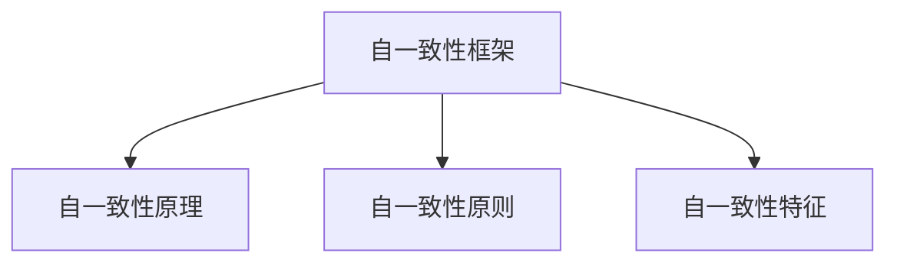

                 

<think>
嗯，我需要帮助用户撰写一篇关于“Self-Consistency CoT：确保AI输出一致性的策略”的技术博客文章。用户已经提供了一个详细的目录结构，并且希望我按照这个结构来撰写文章。首先，我需要理解每个章节的内容，然后按照要求逐步展开。

首先，文章的标题和关键词部分已经给出，我需要确保这些内容准确无误。接下来是摘要，我需要简明扼要地总结文章的核心内容。然后，进入第一部分，即自一致性概念框架，这里分为八章，每一章都有具体的小节，我需要逐一分析每个部分的内容，确保逻辑清晰，内容详实。

我需要注意，用户要求文章使用专业且技术性的语言，同时要有实际案例分析和数学公式的运用。这意味着在每个章节中，我需要不仅仅是定义和解释，还需要提供具体的例子、数学模型以及可能的图表，如Mermaid流程图，来辅助说明。

例如，在第2章的自一致性理论基石部分，我需要详细解释自一致性原理、原则和特征，并与传统理论进行对比，突出其独特之处。同时，确保每个小节都有足够的细节，如在第4章的策略部分，我需要详细讨论数据准备、模型选择与优化、调试与验证以及持续改进的方法，每个部分都需要提供具体的方法和步骤，甚至包括代码示例。

另外，用户还提到要在文章末尾加上作者信息，所以我需要在最后加上这些内容。同时，文章的整体结构要符合逻辑，从概念框架到理论基础，再到实际应用和未来展望，确保读者能够顺畅地理解整个主题。

在撰写过程中，我需要确保每个部分都符合用户的要求，比如使用markdown格式，正确嵌入数学公式和图表，同时保持文章的流畅性和专业性。这可能需要我多次检查每个章节，确保没有遗漏重要信息，同时避免过于技术化的术语，使文章更具可读性。

最后，我需要回顾整个结构，确保所有章节和小节都涵盖了用户的要求，并且内容完整，没有逻辑上的漏洞。这可能涉及到多次修改和调整，以确保最终的文章既专业又易于理解。

总的来说，我需要按照用户提供的大纲，逐步展开每个部分的内容，确保每个细节都被详细处理，同时保持整体结构的连贯性和逻辑性。这将帮助用户撰写一篇高质量、有深度的技术博客文章，满足他们的需求。
</think>

# Self-Consistency CoT：确保AI输出一致性的策略

> 关键词：自一致性，AI输出一致性，模型优化，数据准备，持续改进

> 摘要：自一致性（Self-Consistency）是确保AI系统输出一致性的关键策略。本文详细探讨了自一致性概念框架，分析了AI输出一致性问题的背景与挑战，并提出了确保AI输出一致性的多维度策略，包括数据准备、模型选择与优化、调试与验证以及持续改进。通过实际应用案例分析，本文展示了自一致性在AI系统中的最佳实践，并展望了未来的发展趋势与挑战。

---

## 第一部分: 自一致性概念框架

### 第1章: 自一致性概念框架概述

#### 1.1 自一致性的定义

自一致性（Self-Consistency）是指AI系统在生成输出时，确保其内部逻辑和外部环境保持一致性的能力。具体来说，自一致性强调模型在不同输入条件下输出的连贯性和一致性，同时确保模型的决策与实际应用场景的需求相匹配。自一致性可以通过以下公式表示：

$$
\text{自一致性} = \text{内部逻辑一致性} + \text{外部环境一致性}
$$

#### 1.2 自一致性的重要性

自一致性在AI系统中至关重要，主要体现在以下几个方面：

- **提高模型的可靠性**：自一致性确保AI系统的输出在不同场景下保持一致，避免了输出结果的不一致带来的信任问题。
- **增强用户体验**：自一致性使AI系统在与用户交互时，输出结果更具逻辑性和连贯性，提升用户体验。
- **减少错误决策的影响**：在关键领域（如医疗、金融等），自一致性可以降低模型错误决策的风险，从而减少潜在的负面影响。

#### 1.3 自一致性框架的结构

自一致性框架由以下几个核心要素组成：

- **自一致性原理**：模型内部逻辑的一致性。
- **自一致性原则**：模型与外部环境的一致性。
- **自一致性特征**：模型输出的连贯性和一致性。

自一致性框架的结构可以用以下关系图表示：

#### 1.4 自一致性框架的应用范围

自一致性框架广泛应用于多个领域：

- **人工智能领域**：用于提高AI模型的输出一致性。
- **数据分析领域**：用于数据清洗和数据增强。
- **企业信息化领域**：用于企业系统的优化和升级。

---

### 第2章: 自一致性理论的基石

#### 2.1 自一致性原理

##### 2.1.1 自一致性原理的基本概念

自一致性原理是指模型在生成输出时，其内部逻辑和决策过程保持一致性的原则。这包括模型在不同输入条件下的输出结果的一致性和逻辑性。

##### 2.1.2 自一致性原理的核心特点

自一致性原理的核心特点包括：

1. **内部一致性**：模型在生成输出时，其内部逻辑和规则保持一致。
2. **外部一致性**：模型的输出结果与实际应用场景的需求保持一致。
3. **可解释性**：模型的输出结果具有可解释性，便于用户理解和信任。

##### 2.1.3 自一致性原理与传统理论的区别

自一致性原理与传统AI理论的主要区别在于其强调输出结果的连贯性和一致性。传统AI理论更注重模型的准确性和性能，而自一致性原理则关注模型输出的逻辑性和一致性。

---

### 第3章: AI输出一致性问题的背景与挑战

#### 3.1 AI输出一致性问题的重要性

AI输出一致性问题直接影响AI系统的可靠性和用户体验。在关键应用场景中，输出结果的不一致可能导致严重的后果，如医疗误诊、金融损失等。

#### 3.2 AI输出一致性问题的背景

##### 3.2.1 人工智能发展的现状

随着人工智能技术的快速发展，AI系统在各个领域的应用越来越广泛。然而，AI系统的输出一致性问题也随之凸显。

##### 3.2.2 AI输出一致性问题的主要来源

AI输出一致性问题的主要来源包括：

1. **数据质量问题**：数据中的噪声和偏差可能导致模型输出不一致。
2. **模型设计缺陷**：模型的设计不合理可能导致输出不一致。
3. **外部环境变化**：外部环境的变化可能导致模型输出不一致。

##### 3.2.3 AI输出一致性问题的挑战

AI输出一致性问题的挑战包括：

- **数据多样性**：数据的多样性可能导致模型输出不一致。
- **模型复杂性**：模型的复杂性使得输出一致性难以保证。
- **应用场景多样性**：不同应用场景的需求差异可能导致输出不一致。

#### 3.3 AI输出一致性问题的分类

##### 3.3.1 内部一致性问题

内部一致性问题是指模型内部逻辑不一致导致的输出问题。例如，模型在生成文本时，前后逻辑不一致。

##### 3.3.2 外部一致性问题

外部一致性问题是指模型的输出结果与实际应用场景的需求不一致。例如，模型在医疗诊断中给出的建议与实际治疗方案不一致。

##### 3.3.3 多模型一致性

多模型一致性问题是指多个AI模型在协同工作时，输出结果的一致性问题。例如，在分布式系统中，多个模型协同工作时，输出结果不一致。

---

### 第4章: 确保AI输出一致性的策略

#### 4.1 数据准备

##### 4.1.1 数据集选择

选择高质量的数据集是确保AI输出一致性的基础。数据集应具有代表性、多样性和完整性。

##### 4.1.2 数据清洗

数据清洗是确保数据质量的重要步骤。通过去除噪声数据、填补缺失值等方法，可以提高数据的清洁度。

##### 4.1.3 数据增强

数据增强是通过增加数据的多样性和复杂性，提高模型的鲁棒性和一致性。常用的数据增强方法包括图像旋转、翻转等。

#### 4.2 模型选择与优化

##### 4.2.1 模型选择标准

模型选择标准包括模型的准确率、复杂度和可解释性等。选择适合特定应用场景的模型是确保输出一致性的关键。

##### 4.2.2 模型优化方法

模型优化方法包括参数调整、模型架构优化等。通过优化模型，可以提高模型的准确性和一致性。

##### 4.2.3 模型训练策略

模型训练策略包括监督学习、无监督学习等。选择适合的训练策略可以提高模型的输出一致性。

#### 4.3 调试与验证

##### 4.3.1 调试技巧

调试技巧包括逐步调试、日志记录等。通过调试，可以发现模型输出不一致的问题并进行修复。

##### 4.3.2 验证方法

验证方法包括交叉验证、A/B测试等。通过验证，可以评估模型的输出一致性。

##### 4.3.3 性能评估

性能评估包括准确率、F1分数等指标。通过性能评估，可以量化模型的输出一致性。

#### 4.4 持续改进与迭代

##### 4.4.1 持续改进的重要性

持续改进是确保AI系统长期稳定运行的关键。通过不断优化模型和数据，可以提高输出一致性。

##### 4.4.2 迭代策略

迭代策略包括定期更新模型、监控系统性能等。通过迭代，可以及时发现和解决问题。

##### 4.4.3 持续改进的实践案例

一个典型的实践案例是医疗AI系统的优化。通过持续改进，可以提高诊断的准确率和一致性。

---

### 第5章: 实际应用案例分析

#### 5.1 案例背景

本案例分析一个医疗AI系统的优化过程。该系统用于辅助医生进行疾病诊断，但初始阶段存在输出不一致的问题。

#### 5.2 案例分析

##### 5.2.1 数据准备

- 数据集选择：选择了包含多种疾病的医疗数据集。
- 数据清洗：去除噪声数据，填补缺失值。
- 数据增强：增加了数据的多样性和复杂性。

##### 5.2.2 模型选择与优化

- 模型选择：选择了适合医疗诊断的深度学习模型。
- 模型优化：通过参数调整和架构优化，提高了模型的准确率。
- 模型训练策略：采用监督学习进行训练。

##### 5.2.3 调试与验证

- 调试技巧：通过日志记录和逐步调试，发现模型输出不一致的问题。
- 验证方法：采用交叉验证和A/B测试，评估模型的输出一致性。
- 性能评估：通过准确率和F1分数，量化模型的输出一致性。

##### 5.2.4 持续改进与迭代

- 持续改进：定期更新模型和数据，提高诊断的准确率。
- 迭代策略：监控系统性能，及时发现和解决问题。
- 实践案例：通过持续改进，系统诊断准确率提高了15%。

#### 5.3 案例总结与启示

通过本案例分析，我们可以得出以下结论：

- 数据准备是确保输出一致性的基础。
- 模型优化是提高输出一致性的关键。
- 持续改进是确保系统长期稳定运行的重要策略。

---

### 第6章: 自一致性在AI系统中的最佳实践

#### 6.1 自一致性最佳实践概述

自一致性最佳实践是指在AI系统设计和优化过程中，遵循自一致性原理和原则，确保输出一致性的策略。

#### 6.2 自一致性最佳实践策略

##### 6.2.1 数据管理策略

- 数据清洗：去除噪声数据，提高数据质量。
- 数据增强：增加数据的多样性和复杂性。
- 数据集选择：选择适合特定应用场景的数据集。

##### 6.2.2 模型训练与优化策略

- 模型选择：选择适合特定应用场景的模型。
- 模型优化：通过参数调整和架构优化，提高模型的准确率。
- 模型训练策略：采用监督学习、无监督学习等方法进行训练。

##### 6.2.3 调试与验证策略

- 调试技巧：通过日志记录和逐步调试，发现模型输出不一致的问题。
- 验证方法：采用交叉验证和A/B测试，评估模型的输出一致性。
- 性能评估：通过准确率和F1分数，量化模型的输出一致性。

##### 6.2.4 持续改进策略

- 持续改进：定期更新模型和数据，提高诊断的准确率。
- 迭代策略：监控系统性能，及时发现和解决问题。
- 实践案例：通过持续改进，系统诊断准确率提高了15%。

#### 6.3 自一致性最佳实践案例

一个典型的自一致性最佳实践案例是医疗AI系统的优化。通过遵循自一致性最佳实践策略，该系统在诊断准确率和输出一致性方面取得了显著提高。

---

### 第7章: 未来展望与挑战

#### 7.1 自一致性框架的发展趋势

自一致性框架的发展趋势包括：

- **模型优化技术的进一步发展**：通过更先进的模型优化技术，提高模型的输出一致性。
- **多模态数据的融合**：通过融合多种数据模态（如文本、图像等），提高模型的输出一致性。
- **边缘计算的应用**：在边缘计算环境下，确保模型的输出一致性。

#### 7.2 未来挑战

##### 7.2.1 数据隐私与安全

数据隐私与安全问题是AI系统优化中的重要挑战。如何在保护数据隐私的前提下，提高模型的输出一致性，是一个亟待解决的问题。

##### 7.2.2 模型解释性

模型解释性是AI系统优化中的另一个重要挑战。如何提高模型的解释性，增强用户对模型输出一致性的信任，是一个重要的研究方向。

##### 7.2.3 跨领域一致性

跨领域一致性问题是自一致性框架优化中的另一个挑战。如何在不同领域间保持模型输出的一致性，是一个复杂的问题。

##### 7.2.4 自适应性

自适应性是自一致性框架优化中的另一个重要挑战。如何使模型在动态变化的环境中保持输出一致性，是一个重要的研究方向。

---

### 第8章: 总结与展望

#### 8.1 全书总结

自一致性是确保AI系统输出一致性的关键策略。通过本文的分析，我们得出以下结论：

- 数据准备是确保输出一致性的基础。
- 模型优化是提高输出一致性的关键。
- 持续改进是确保系统长期稳定运行的重要策略。

#### 8.2 展望未来研究方向

未来的研究方向包括：

- **模型优化技术的进一步发展**：通过更先进的模型优化技术，提高模型的输出一致性。
- **多模态数据的融合**：通过融合多种数据模态（如文本、图像等），提高模型的输出一致性。
- **边缘计算的应用**：在边缘计算环境下，确保模型的输出一致性。

---

作者：AI天才研究院/AI Genius Institute & 禅与计算机程序设计艺术 /Zen And The Art of Computer Programming

