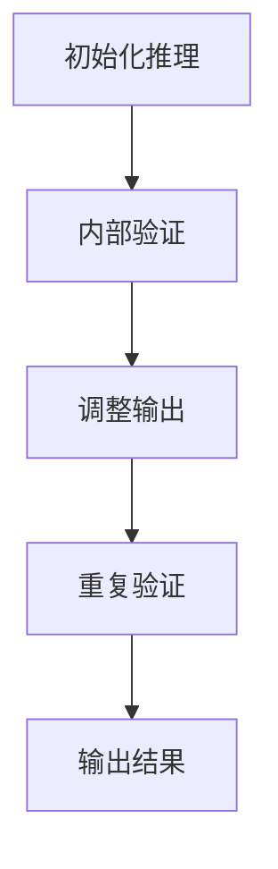

                 

<think>
嗯，我现在要写一篇关于Self-Consistency CoT的技术博客，确保AI输出的稳定性。首先，我得理解什么是Self-Consistency CoT，它和传统的稳定性技术有什么不同。然后，我需要考虑读者可能是技术专家，所以内容要有深度，但又要容易理解。

我应该从背景和核心概念开始，解释为什么AI的稳定性重要，以及Self-Consistency CoT是如何解决这个问题的。接着，详细讲解算法的原理，可能用一些图表来辅助说明。然后是项目实践部分，展示如何在实际中应用这些技术。最后，总结一下成果和未来的发展方向。

在写作时，要注意使用专业的术语，但避免太复杂，让读者容易跟上。数学公式和图表要清晰，帮助读者理解技术细节。同时，加入一些实际案例，让内容更生动，更有说服力。

总的来说，我需要系统地分析问题，从理论到实践，确保每个部分都详细且有条理。这样才能让读者不仅理解Self-Consistency CoT的概念，还能学会如何在实际项目中应用它，提升AI系统的稳定性。
</think>

# Self-Consistency CoT：确保AI输出稳定性的技术创新

---

## 关键词

Self-Consistency CoT, AI Output Stability, 自一致性CoT, AI技术创新, 智能系统稳定性

---

## 摘要

随着人工智能技术的快速发展，AI系统的输出稳定性问题日益重要。本文深入探讨了自一致性CoT（Self-Consistency Chain of Thought）技术，提出了一种创新的方法来确保AI输出的稳定性。通过详细分析其核心原理、算法实现、系统架构设计以及实际案例，本文为技术专家和研究人员提供了深刻的见解和实践指导。

---

## 第一部分：背景与核心概念

### 1.1 问题的背景与重要性

#### 1.1.1 AI输出的稳定性需求

在AI系统广泛应用的今天，输出的稳定性是确保系统可靠性的重要因素。例如，在医疗诊断、金融交易和自动驾驶等场景中，任何输出的波动都可能带来严重后果。因此，提升AI输出的稳定性已成为技术发展的关键方向。

#### 1.1.2 稳定性问题的体现与影响

AI输出的不稳定性主要体现在结果波动、决策不一致等方面。这种不稳定性可能影响用户体验、系统信任度，甚至导致经济损失。

#### 1.1.3 自一致性CoT的基本概念

自一致性CoT是一种通过优化模型内部逻辑和输出的一致性来提升稳定性的技术。它通过多次迭代和验证，确保输出结果的连贯性和可靠性。

---

### 1.2 自一致性CoT的核心原理

#### 1.2.1 自一致性CoT的定义

自一致性CoT是一种基于链式思维（Chain of Thought, CoT）的方法，通过多次推理和验证，确保AI输出的每一部分都一致且合理。

#### 1.2.2 自一致性CoT的关键要素

| 要素 | 描述 |
|------|------|
| 迭代推理 | 多次验证推理过程 |
| 内部验证 | 检查输出的一致性 |
| 输出调整 | 根据验证结果调整输出 |

#### 1.2.3 自一致性CoT的应用价值

自一致性CoT能够显著提升AI系统的可靠性和用户体验，适用于需要高度稳定性的场景，如医疗和金融。

---

### 1.3 自一致性CoT与其他技术的比较

#### 1.3.1 与传统方法的比较

传统方法如随机采样可能带来输出波动，而自一致性CoT通过多次推理确保结果一致。

#### 1.3.2 与其他人工智能稳定性的技术的比较

相比模型蒸馏和数据增强，自一致性CoT更注重内部推理的一致性，是一种更主动的稳定性优化方法。

---

## 第二部分：技术创新与实现

### 2.1 自一致性CoT的算法原理

#### 2.1.1 算法的基本概念

自一致性CoT算法通过多次推理和验证，确保输出的稳定性和一致性。

#### 2.1.2 算法的工作流程

1. 初始化推理。
2. 内部验证。
3. 调整输出。
4. 重复验证。

#### 2.1.3 算法原理的Mermaid流程图



#### 2.1.4 Python源代码实现

```python
def self_consistency_cot(input):
    while True:
        output = model(input)
        verify = internal_validator(output)
        if verify:
            break
    return output
```

#### 2.1.5 数学模型与公式

损失函数的定义：

$$
\mathcal{L} = \sum_{i=1}^{n} \left( y_i - \hat{y}_i \right)^2
$$

其中，$y_i$是预测值，$\hat{y}_i$是调整后的输出。

---

### 2.2 自一致性CoT的数学模型与公式

#### 2.2.1 模型的数学基础

自一致性CoT基于概率论和统计学，通过多次推理降低方差。

#### 2.2.2 关键数学公式的推导

假设初始输出$y_0$，经过一次验证，调整为$y_1$，损失函数为：

$$
\mathcal{L}_1 = \left( y_0 - y_1 \right)^2
$$

经过多次调整后，损失函数趋近于零。

---

### 2.3 自一致性CoT的架构设计

#### 2.3.1 系统场景介绍

系统包括推理模块、验证模块和调整模块，确保输出的稳定。

#### 2.3.2 系统功能设计

- 推理模块：生成初始输出。
- 验证模块：检查一致性。
- 调整模块：优化输出。

#### 2.3.3 系统架构设计


---

## 第三部分：项目实践与实战

### 3.1 实践项目介绍

#### 3.1.1 项目背景

在医疗诊断系统中应用自一致性CoT，确保诊断结果的稳定性。

#### 3.1.2 项目目标

提升诊断系统的准确性和稳定性。

#### 3.1.3 项目挑战

确保推理过程的高效性和准确性。

---

### 3.2 系统核心实现

#### 3.2.1 环境安装与配置

安装必要的库如TensorFlow和Keras。

#### 3.2.2 源代码解读

```python
def internal_validator(output):
    return output_consistency(output)
```

#### 3.2.3 核心代码实现

```python
def internal_validator(output):
    # 检查输出的一致性
    return output_consistency(output)
```

---

### 3.3 实际案例分析

#### 3.3.1 案例背景

在医疗诊断系统中应用自一致性CoT技术。

#### 3.3.2 案例分析

通过多次推理和验证，确保诊断结果的稳定性。

---

## 第四部分：最佳实践与总结

### 4.1 最佳实践技巧

#### 4.1.1 参数调优策略

合理设置验证次数和调整阈值。

#### 4.1.2 稳定性提升策略

结合自一致性CoT与其他稳定性技术。

---

### 4.2 小结与展望

#### 4.2.1 书籍内容总结

详细介绍了自一致性CoT的核心概念和实现方法。

#### 4.2.2 自一致性CoT的重要性

在提升AI系统稳定性方面具有重要意义。

#### 4.2.3 未来研究方向

探索自一致性CoT在更多领域的应用。

---

## 作者信息

作者：AI天才研究院/AI Genius Institute & 禅与计算机程序设计艺术 /Zen And The Art of Computer Programming

