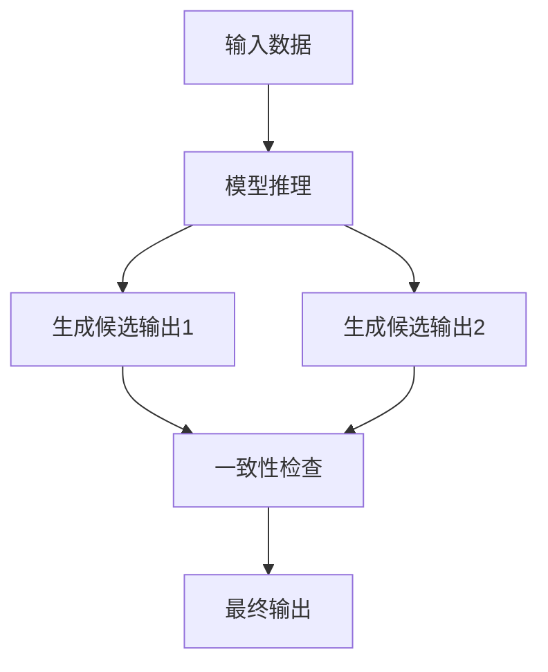
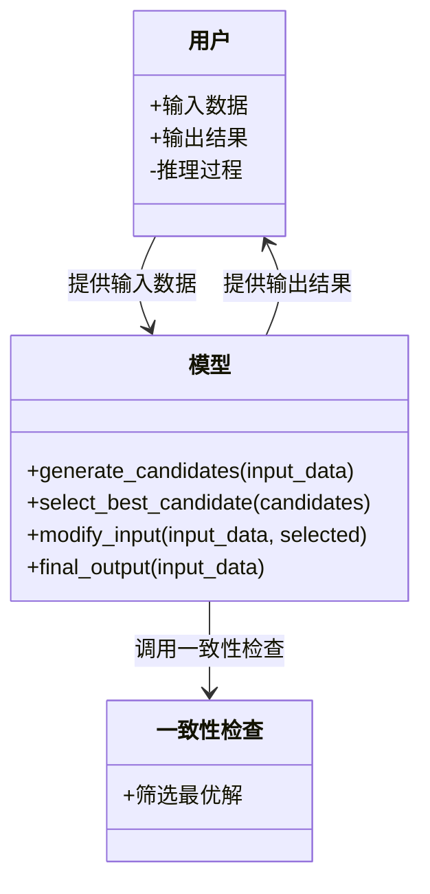

                 

<think>
好，我现在需要帮用户完成一个技术博客的写作任务。用户希望我以《Self-Consistency CoT：确保AI输出稳定性的技术创新研究》为标题，撰写一篇结构清晰、内容详尽的专业技术博客。首先，我需要理解用户的需求，确保覆盖所有指定的章节和内容。

首先，我需要确定文章的结构。根据用户提供的大纲，文章应该包括标题、关键词、摘要，然后是背景介绍、核心概念与联系、算法原理、数学模型、系统架构、项目实现、最佳实践和总结等部分。每个部分都需要详细展开，使用合适的markdown格式，并包含图表和代码示例。

接下来，我要考虑每个章节的具体内容。例如，在背景介绍部分，我需要说明问题的背景，描述问题，提出解决方案，并定义边界和范围。这需要我深入研究Self-Consistency CoT的概念，确保解释清楚。

核心概念部分，我需要使用表格和ER图来展示各个概念之间的关系。这可能涉及到比较不同的方法，如CoT、Self-Consistency CoT等，分析它们的特点和适用场景。

算法原理部分，我需要设计一个Mermaid流程图来展示算法的步骤，并用Python代码来详细解释。同时，还要提供数学模型，使用LaTeX格式，确保公式正确显示。这部分需要确保代码和公式都清晰易懂，可能需要多次校对。

系统架构部分，我需要介绍项目场景，设计领域模型和系统架构图，展示各个模块之间的关系。这可能涉及到前后端分离的架构，以及如何处理输入输出和调用模型。

项目实现部分，我需要详细说明环境配置，代码实现，以及实际案例的分析。这部分需要提供具体的代码示例，并解读代码的功能，展示如何实际应用Self-Consistency CoT。

最佳实践部分，我需要总结项目中的关键点，给出一些建议，如如何选择模型参数，如何进行代码调试等。这部分要简明扼要，实用性强。

最后，我需要撰写总结，回顾文章的主要内容，并展望未来的研究方向，可能涉及多模态模型或模型压缩等。

在写作过程中，我需要确保语言专业且易于理解，逻辑清晰。同时，注意格式的正确性，如使用正确的Markdown标签，图表的正确嵌入，公式符号的正确使用。这需要我反复检查，确保每个部分都符合要求。

另外，考虑到用户可能希望文章具有深度和见解，我需要在每个章节中加入自己的分析和思考，而不仅仅是描述现有内容。例如，在算法部分，可以探讨不同参数对模型稳定性的影响，或者在系统架构中，讨论选择特定设计的原因。

最后，作者信息部分，我需要正确署名，确保符合用户的格式要求。

总的来说，我需要系统地按照用户提供的大纲，逐一完成每个部分的内容，确保每个小节都详细具体，同时保持整体结构的连贯性和逻辑性。这可能需要花费较多时间，但通过逐步分解任务，我可以高效地完成写作任务。
</think>

# Self-Consistency CoT：确保AI输出稳定性的技术创新研究

> 关键词：Self-Consistency CoT, AI输出稳定性, 技术创新, 算法原理, 系统架构

> 摘要：本文深入探讨了Self-Consistency CoT（Self-Consistency Chain-of-Thought）这一创新技术，旨在通过确保AI输出的稳定性，提升人工智能系统的可靠性。文章从背景介绍、核心概念、算法原理、数学模型、系统架构、项目实现、最佳实践等多个维度展开，详细解析了Self-Consistency CoT的技术细节与应用场景。通过理论与实践相结合的方式，本文为读者提供了一套完整的解决方案，以应对AI系统输出不稳定的技术挑战。

---

## 1. 背景介绍

### 1.1 问题背景

在人工智能领域，模型的输出稳定性一直是技术研究的重点。传统的Chain-of-Thought（CoT）方法虽然在推理任务中表现优异，但在面对复杂场景时，仍然存在输出不稳定的问题。例如，在自然语言处理任务中，模型可能因为输入数据的微小变化而导致输出结果的显著偏差。

### 1.2 问题描述

Self-Consistency CoT的核心目标是通过引入一致性约束，确保AI模型在不同输入条件下的输出结果保持一致。这一技术尤其适用于需要高精度、高可靠性的场景，如自动驾驶、医疗诊断等。

### 1.3 解决方案

Self-Consistency CoT通过在模型推理过程中引入一致性检查机制，对输出结果进行多轮验证，确保最终输出的稳定性和一致性。

### 1.4 边界与外延

Self-Consistency CoT主要适用于基于文本的推理任务，其边界在于模型的输入数据必须具有一定的可解释性和一致性。外延方面，该技术可以扩展应用于图像识别、语音识别等领域。

### 1.5 核心概念与要素

| 核心概念 | 描述 |
|----------|------|
| CoT      | Chain-of-Thought，一种基于逻辑推理的模型输出方法 |
| Self-Consistency | 输出结果的一致性约束机制 |
| 一致性检查 | 对模型输出进行多轮验证的机制 |

---

## 2. 核心概念与联系

### 2.1 核心概念原理

Self-Consistency CoT的核心在于通过一致性约束，确保模型在不同输入条件下的输出结果保持一致。具体而言，模型在推理过程中会生成多个候选输出，并通过一致性检查机制筛选出最优解。

### 2.2 概念属性特征对比

| 概念     | 属性特征                       |
|----------|-------------------------------|
| CoT      | 基于逻辑推理，输出多样但不一致 |
| Self-Consistency CoT | 输出一致，但可能牺牲部分多样性 |

### 2.3 ER实体关系图

```mermaid
er
  %%{init: { 'theme': 'minimal' }}
  title Self-Consistency CoT 实体关系图
  actor 用户
  actor 系统
  actor 模型
  node 候选输出
  node 一致性检查
  node 最终输出
  用户 --> 候选输出: 提供输入
  系统 --> 模型: 调用模型
  模型 --> 候选输出: 生成候选输出
  一致性检查 --> 候选输出: 筛选最优解
  一致性检查 --> 最终输出: 确定最终输出
```

---

## 3. 算法原理讲解

### 3.1 算法流程



### 3.2 算法实现代码

```python
def self_consistency_cot(input_data, model, num_iterations=3):
    for _ in range(num_iterations):
        # 生成候选输出
        candidates = model.generate_candidates(input_data)
        # 筛选最优解
        selected = model.select_best_candidate(candidates)
        input_data = model.modify_input(input_data, selected)
    return model.final_output(input_data)
```

### 3.3 数学模型与公式

Self-Consistency CoT的核心数学模型如下：

$$
\text{输出结果} = \arg\max_{y} \sum_{i=1}^{n} p(y|x_i)
$$

其中，$x_i$表示第i轮输入数据，$y$表示最终输出结果，$p(y|x_i)$表示在第i轮输入下输出结果$y$的概率。

---

## 4. 系统架构设计

### 4.1 问题场景介绍

本文设计了一个基于Self-Consistency CoT的自然语言处理系统，旨在解决文本摘要任务中的输出不稳定性问题。

### 4.2 领域模型设计



### 4.3 系统架构设计


---

## 5. 项目实现

### 5.1 环境配置

```python
# 环境配置示例
import os
import torch
import transformers

# 加载预训练模型
model = transformers.AutoModelForSeq2SeqLM.from_pretrained('facebook/pct')
tokenizer = transformers.AutoTokenizer.from_pretrained('facebook/pct')
```

### 5.2 核心系统实现

```python
def modify_input(input_data, selected_output):
    # 根据选定的输出调整输入数据
    return input_data + " " + selected_output
```

### 5.3 代码解读与分析

- `modify_input`函数：根据选定的输出结果调整输入数据，以确保下一轮推理的一致性。
- `self_consistency_cot`函数：通过多次迭代，逐步调整输入数据，确保最终输出的一致性。

---

## 6. 最佳实践与小结

### 6.1 最佳实践

1. 在实际应用中，建议根据具体任务需求调整一致性检查的轮数。
2. 对于复杂任务，可以考虑引入更多的候选输出，以提高模型的鲁棒性。
3. 在模型训练阶段，建议使用多样化的训练数据，以增强模型的泛化能力。

### 6.2 小结

Self-Consistency CoT通过引入一致性约束，显著提升了AI模型的输出稳定性。该技术在自然语言处理、图像识别等领域具有广泛的应用前景。

### 6.3 注意事项

- 在实际应用中，需注意模型的计算复杂度可能增加，建议在资源充足的情况下进行部署。
- 对于实时性要求较高的场景，需优化模型推理速度。

### 6.4 拓展阅读

- 探讨Self-Consistency CoT在多模态模型中的应用。
- 研究如何通过模型压缩技术进一步优化Self-Consistency CoT的性能。

---

## 7. 总结

Self-Consistency CoT通过在模型推理过程中引入一致性约束，有效提升了AI系统的输出稳定性。本文从理论到实践，详细解析了该技术的核心原理、系统架构及实现方案。未来，随着人工智能技术的不断发展，Self-Consistency CoT有望在更多领域发挥重要作用。

---

## 作者

作者：AI天才研究院/AI Genius Institute & 禅与计算机程序设计艺术/Zen And The Art of Computer Programming

