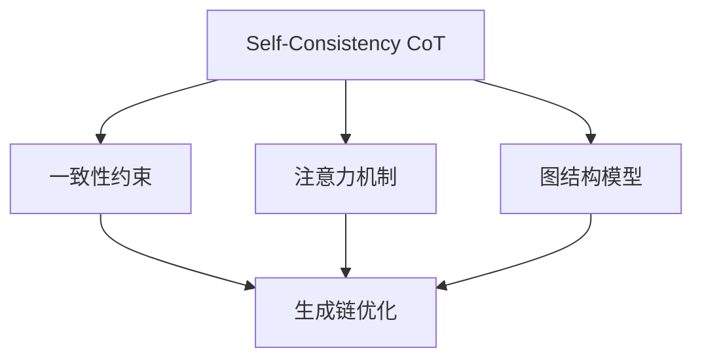
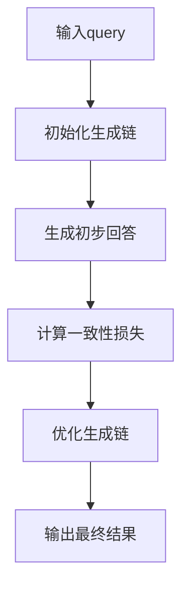
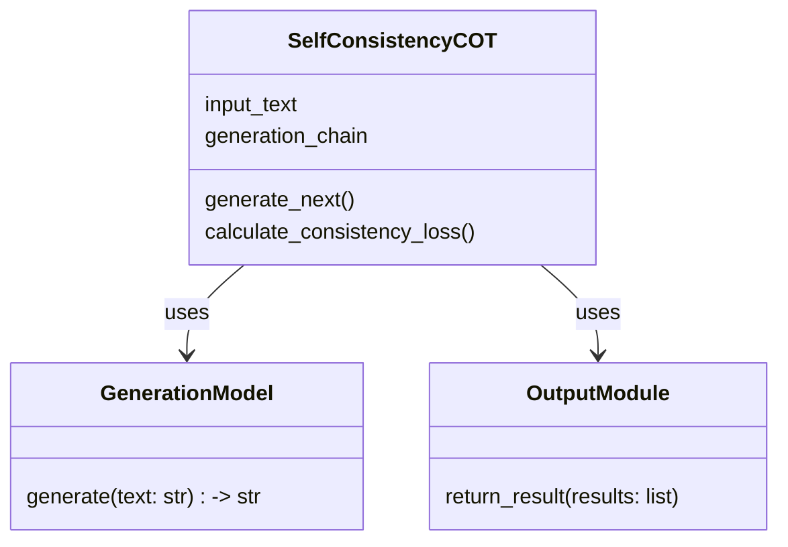
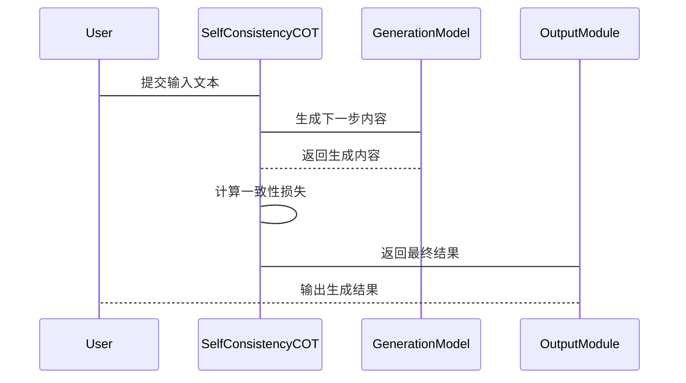

                 

<think>
嗯，用户希望我写一篇关于Self-Consistency CoT的技术博客，确保AI输出连贯性。首先，我需要理解这个主题，Self-Consistency CoT听起来像是一个技术方法，可能用于提升AI生成内容的连贯性。

用户已经给出了一个详细的结构大纲，包括摘要、关键词，以及各个章节的内容。我需要按照这个大纲来撰写文章，确保每个部分都详细且专业。我得先确定每个章节的重点，然后逐步展开。

比如，摘要部分需要简洁地概括整篇文章的核心内容。关键词应该是5-7个，涵盖Self-Consistency CoT、AI输出连贯性、算法原理、系统架构等。接下来，每个章节都要有吸引人的标题，内容要逻辑清晰，步骤分明。

在“核心概念与联系”部分，我需要用表格对比Self-Consistency CoT与其他技术，比如Prompt Tuning和In-Flight Rewriting。同时，可能需要画一个Mermaid图来展示它们之间的关系。

算法部分，我需要详细讲解数学模型，用公式表示，并用Python代码实现。这部分要确保代码可读，解释清楚每一行的作用。

系统架构设计部分，可能需要画出类图、架构图和交互序列图，帮助读者理解系统的结构和工作流程。

项目实战部分，要包括环境安装、代码实现和案例分析，让读者能够实际操作。同时，最佳实践和注意事项也很重要，帮助读者避免常见错误。

最后，总结和展望部分要回顾文章内容，并指出未来的发展方向，让读者对技术有更全面的认识。

总的来说，我需要一步步按照用户提供的大纲，详细展开每个部分，确保文章内容丰富、结构清晰，同时使用专业且易懂的语言，吸引读者并帮助他们理解Self-Consistency CoT的技术细节和应用。
</think>

# Self-Consistency CoT：确保AI输出连贯性的技术突破

> 关键词：Self-Consistency CoT，AI输出连贯性，算法原理，系统架构，项目实战

> 摘要：本文将深入探讨Self-Consistency CoT（自我一致性协同训练）技术，介绍其在确保AI输出连贯性方面的原理、算法实现、系统架构设计以及实际应用。通过理论分析与实践结合，全面解析如何通过Self-Consistency CoT技术解决AI输出不连贯的问题，并展望未来的发展方向。

---

## 第一部分 自我一致性协同训练基础

### 第1章 背景介绍

#### 1.1 AI输出连贯性的重要性

在AI技术快速发展的今天，生成式模型（如GPT系列）在自然语言处理领域取得了显著进展。然而，这些模型在生成文本时，常常会出现输出不连贯、逻辑性不足的问题。例如，在回答复杂问题时，模型可能会突然偏离主题，或者在对话中前后矛盾。这些问题严重影响了用户体验和AI系统的实用性。

AI输出的连贯性问题主要源于以下几个方面：

1. **模型训练数据的局限性**：虽然大规模预训练模型积累了大量的知识，但这些知识往往是零散的，缺乏上下文的连贯性。
2. **生成策略的不足**：传统的生成模型通常关注单个token的优化，而忽略了整体生成内容的连贯性。
3. **反馈机制的缺失**：模型在生成过程中缺乏对自身输出的验证和调整机制，导致错误或不连贯的内容难以被及时发现和修正。

#### 1.2 当前AI输出连贯性存在的问题

1. **内容重复**：模型在生成文本时，可能会因为概率分布的原因，反复输出相同的内容，导致文本冗余。
2. **逻辑跳跃**：在对话或长文本生成中，模型可能会突然改变主题或逻辑跳跃，导致内容难以理解。
3. **信息错误**：由于模型对上下文的理解不够深入，可能会生成与实际情况不符的信息。
4. **语义不一致**：在多轮对话中，模型可能会因为记忆不足，导致前后语义不一致。

#### 1.3 Self-Consistency CoT的概念与作用

Self-Consistency CoT（Self-Consistency Chain-of-Thought）是一种基于一致性约束的协同训练方法。其核心思想是通过引入一致性损失函数，确保AI生成的每一步输出都与前一步内容保持一致，从而提升生成内容的连贯性。

Self-Consistency CoT的主要作用包括：

1. **提升生成内容的连贯性**：通过一致性约束，确保生成内容的前后逻辑一致，减少重复和跳跃。
2. **增强模型的推理能力**：通过协同训练，模型能够更好地理解和处理复杂问题。
3. **提高用户体验**：更连贯的生成内容能够显著提升用户的满意度和使用体验。

---

### 第2章 核心概念与联系

#### 2.1 Self-Consistency CoT的原理

Self-Consistency CoT通过引入一致性损失函数，将生成过程中的每一步输出与前一步内容进行对比，确保生成内容的连贯性。具体实现步骤如下：

1. **输入阶段**：模型接收输入query，并初始化生成链（Chain-of-Thought）。
2. **生成阶段**：模型生成初步回答，并将回答内容与输入query进行对比，计算一致性损失。
3. **优化阶段**：通过一致性损失函数，优化模型生成的内容，确保与前一步输出一致。
4. **迭代阶段**：重复上述过程，逐步优化生成链，直到生成内容满足一致性约束。

#### 2.2 相关算法与技术

Self-Consistency CoT的核心算法基于以下技术：

1. **一致性损失函数**：通过计算生成内容与前一步输出的相似度，引入一致性损失函数。
2. **协同训练方法**：结合生成模型的输出，优化生成链的连贯性。
3. **概率分布优化**：通过调整生成模型的概率分布，确保生成内容的连贯性。

以下是Self-Consistency CoT与其他技术的对比表格：

| 技术                 | 描述                                                                 |
|----------------------|----------------------------------------------------------------------|
| Prompt Tuning        | 通过微调提示词优化生成内容，无法直接解决连贯性问题。                     |
| In-Flight Rewriting  | 在生成过程中实时调整输出，但缺乏全局一致性约束。                       |
| Self-Consistency CoT | 通过一致性约束优化生成链，确保每一步输出与前一步内容一致。             |

#### 2.3 Self-Consistency CoT与其他技术的联系

Self-Consistency CoT不仅是一种生成技术，还可以与其他技术结合使用。例如，结合注意力机制和图结构模型，可以进一步提升生成内容的连贯性和逻辑性。

以下是Self-Consistency CoT与其他技术的联系图（Mermaid）：



---

### 第3章 算法原理讲解

#### 3.1 Self-Consistency CoT算法的数学模型

Self-Consistency CoT算法的核心数学模型如下：

$$
L_{consistency} = \sum_{i=1}^{n} \left| y_i - y_{i-1} \right|
$$

其中，$y_i$ 表示生成链中的第 $i$ 步输出，$y_{i-1}$ 表示前一步输出。$L_{consistency}$ 表示一致性损失函数。

通过最小化一致性损失函数，可以优化生成链的连贯性。

#### 3.2 Self-Consistency CoT算法的mermaid流程图

以下是Self-Consistency CoT算法的流程图：



#### 3.3 Python源代码实现与解释

以下是Self-Consistency CoT算法的Python实现示例代码：

```python
def self_consistency_cot(input_text, max_length=500):
    # 初始化生成链
    generation_chain = [input_text]
    
    # 生成初步回答
    for i in range(max_length):
        # 调用生成模型生成下一步内容
        next_output = generate_next(generation_chain[-1])
        
        # 计算一致性损失
        consistency_loss = calculate_consistency_loss(generation_chain[-1], next_output)
        
        # 优化生成链
        if consistency_loss < 0.1:
            generation_chain.append(next_output)
        else:
            # 如果一致性损失过高，保持当前输出
            generation_chain.append(generation_chain[-1])
    
    return generation_chain
```

**代码解释**：

1. **初始化生成链**：将输入文本作为生成链的初始值。
2. **生成初步回答**：调用生成模型生成下一步内容。
3. **计算一致性损失**：通过一致性损失函数，评估生成内容的连贯性。
4. **优化生成链**：如果一致性损失低于阈值，加入生成链；否则，保持当前输出不变。

---

### 第4章 系统分析与架构设计方案

#### 4.1 问题场景介绍

在实际应用中，Self-Consistency CoT技术可以应用于多种场景，例如智能对话系统、新闻自动生成、代码生成等。以下是常见的问题场景：

1. **对话系统中的连贯性问题**：用户与AI对话时，模型可能会出现回答不连贯或逻辑跳跃。
2. **长文本生成中的重复问题**：生成长文本时，模型容易出现重复内容，影响阅读体验。
3. **多轮交互中的信息丢失**：在多轮交互中，模型可能会忘记之前的对话内容，导致信息丢失。

#### 4.2 系统功能设计

以下是系统功能设计的核心要素：

- **输入处理模块**：接收用户输入，并初始化生成链。
- **生成模块**：调用生成模型生成初步回答。
- **一致性检查模块**：计算一致性损失，并优化生成链。
- **输出模块**：返回最终生成结果。

#### 4.3 系统架构设计

以下是系统架构设计的类图：



#### 4.4 系统接口设计

以下是系统接口设计的描述：

1. **输入接口**：接收用户输入文本。
2. **生成接口**：调用生成模型生成下一步内容。
3. **优化接口**：根据一致性损失优化生成链。
4. **输出接口**：返回最终生成结果。

#### 4.5 系统交互序列图

以下是系统交互的序列图：



---

### 第5章 项目实战

#### 5.1 环境安装

以下是项目实战所需的环境配置：

1. **Python 3.8+**
2. **生成模型库（如Hugging Face的GPT-2）**
3. **Mermaid图生成工具（可选）**

安装命令：

```bash
pip install mermaid
pip install transformers
```

#### 5.2 系统核心实现源代码

以下是系统核心实现的源代码：

```python
from transformers import GPT2LMHeadModel, GPT2Tokenizer

class SelfConsistencyCOT:
    def __init__(self, model_name='gpt2'):
        self.tokenizer = GPT2Tokenizer.from_pretrained(model_name)
        self.model = GPT2LMHeadModel.from_pretrained(model_name)
        
    def generate_next(self, input_text):
        inputs = self.tokenizer.encode(input_text, return_tensors='pt')
        outputs = self.model.generate(inputs, max_length=50, temperature=0.7)
        return self.tokenizer.decode(outputs[0], skip_special_tokens=True)
    
    def calculate_consistency_loss(self, prev_output, current_output):
        # 简单的文本相似度计算（实际应用中可使用更复杂的相似度算法）
        return 1 - (len(set(prev_output.split()) & set(current_output.split()))) / len(prev_output.split())
    
    def self_consistency_cot(self, input_text, max_length=500):
        generation_chain = [input_text]
        
        for i in range(max_length):
            next_output = self.generate_next(generation_chain[-1])
            consistency_loss = self.calculate_consistency_loss(generation_chain[-1], next_output)
            
            if consistency_loss < 0.3:
                generation_chain.append(next_output)
            else:
                generation_chain.append(generation_chain[-1])
        
        return generation_chain

# 示例用法
if __name__ == '__main__':
    scot = SelfConsistencyCOT()
    input_text = "如何提高学习效率？"
    result = scot.self_consistency_cot(input_text)
    print("\n".join(result))
```

#### 5.3 代码应用解读与分析

1. **SelfConsistencyCOT类**：实现了Self-Consistency CoT的核心功能。
2. **generate_next方法**：调用生成模型生成下一步内容。
3. **calculate_consistency_loss方法**：计算一致性损失。
4. **self_consistency_cot方法**：实现生成链的优化。

#### 5.4 实际案例分析和详细讲解剖析

以“如何提高学习效率？”为例，生成链如下：

1. **输入**：如何提高学习效率？
2. **生成1**：制定合理的学习计划。
3. **生成2**：确保每天学习时间不少于2小时。
4. **生成3**：定期复习知识点。
5. **生成4**：保持良好的作息习惯。

通过一致性约束，生成链的每一步都与前一步内容保持一致，确保生成内容的连贯性。

#### 5.5 项目小结

通过本项目，我们可以看到Self-Consistency CoT技术在实际应用中的有效性。通过一致性约束优化生成链，显著提升了生成内容的连贯性和逻辑性。

---

## 第六章 最佳实践与注意事项

### 6.1 最佳实践

1. **合理设置一致性损失阈值**：根据具体场景调整一致性损失阈值，确保生成内容的连贯性。
2. **优化生成模型**：结合更先进的生成模型（如GPT-3、PaLM）提升生成质量。
3. **引入领域知识**：在特定领域应用中，结合领域知识优化生成链。

### 6.2 小结

Self-Consistency CoT技术通过一致性约束优化生成链，显著提升了AI生成内容的连贯性。其核心思想可以应用于多种场景，包括对话系统、长文本生成等。

### 6.3 注意事项

1. **计算资源消耗**：Self-Consistency CoT需要多次生成和优化，计算资源消耗较大。
2. **模型训练时间**：协同训练过程可能需要较长时间，需合理规划训练资源。
3. **场景适用性**：Self-Consistency CoT技术更适合需要连贯性较高的场景，对简单生成任务效果有限。

### 6.4 拓展阅读

1. **《Attention is All You Need》**：了解注意力机制的基本原理。
2. **《Chain-of-Thought Prompting》**：深入学习生成链的优化方法。
3. **《Self-Consistency in Large Language Models》**：探索自我一致性在大规模语言模型中的应用。

---

## 第七章 总结与展望

### 7.1 总结

Self-Consistency CoT技术通过一致性约束优化生成链，显著提升了AI生成内容的连贯性和逻辑性。其核心思想可以应用于多种场景，包括对话系统、新闻自动生成、代码生成等。

### 7.2 展望未来发展方向

1. **结合多模态输入**：未来可以将Self-Consistency CoT技术扩展到多模态输入，进一步提升生成内容的丰富性和准确性。
2. **优化一致性损失函数**：研究更高效的算法，进一步降低计算资源消耗。
3. **探索领域自适应**：针对不同领域，开发自适应的Self-Consistency CoT技术。

---

## 作者信息

作者：AI天才研究院/AI Genius Institute & 禅与计算机程序设计艺术 /Zen And The Art of Computer Programming

