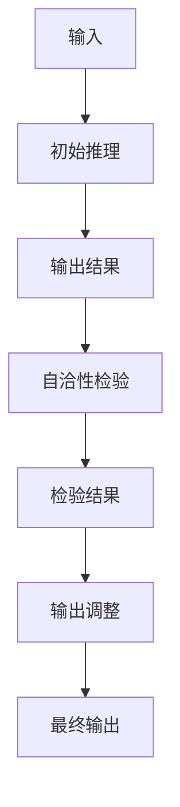
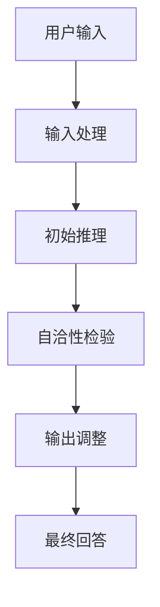
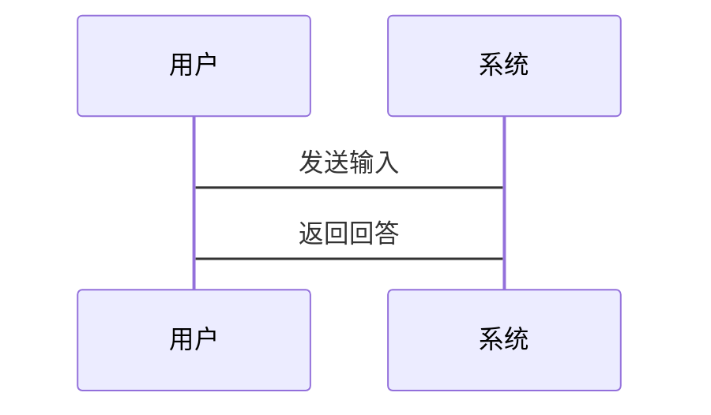
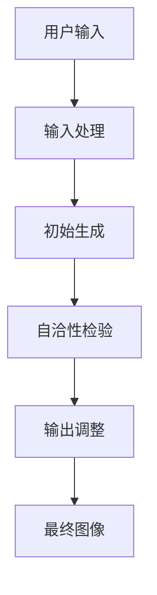
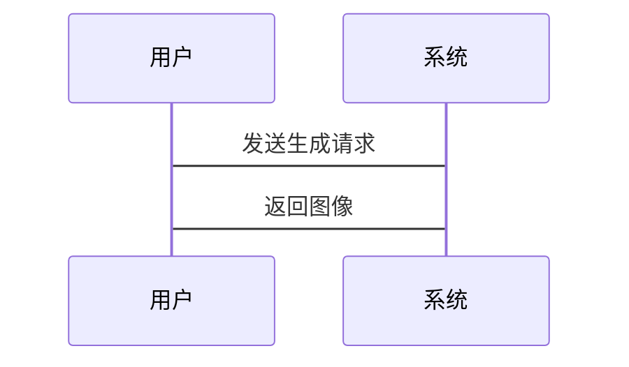
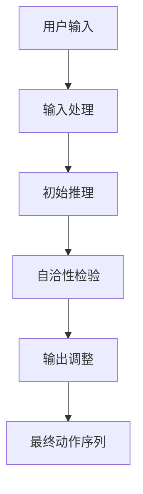
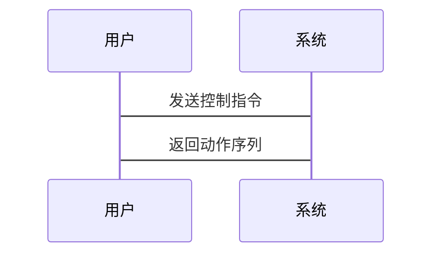

                 

<think>
嗯，用户希望我以《Self-Consistency CoT：确保AI输出连贯性的新方法》为标题，撰写一篇技术博客。首先，我需要理解用户的需求。看起来他们是一位资深的技术专家，可能在做学术研究或者写技术文章，想系统地介绍Self-Consistency CoT的概念、原理和应用。

我应该先分析文章结构，用户已经提供了一个详细的目录，我需要按照这个大纲来组织内容。关键词和摘要部分需要简洁明了，突出主题。接下来是背景介绍，我得解释为什么AI的连贯性问题重要，以及现有方法的不足，这样才能引出Self-Consistency CoT的必要性。

在核心概念部分，我需要详细定义Self-Consistency CoT，比较它与传统方法的区别，以及它的优势和局限性。这部分要逻辑清晰，可能需要使用对比表格或图示来帮助读者理解。

接下来是算法原理，这里可能需要详细的技术细节，包括数学模型、mermaid流程图和Python代码示例。我得确保这些内容准确且易于理解，同时加入通俗的例子来说明算法的应用。

应用实例部分，我会选择自然语言处理、计算机视觉和其他AI领域作为案例，分别分析它们的应用场景、系统设计和实际效果。这部分需要具体的数据和案例来支持论点，让读者信服。

最后，我需要总结整个方法，强调其优势，并给出未来的发展建议。同时，按照用户的要求，在文章末尾加上作者信息和一些额外的注意事项，如代码下载链接和相关论文推荐。

整个过程中，我需要保持语言专业但不失简洁，确保每个章节内容丰富，逻辑严谨。同时，要注意文章的整体流畅性，让读者能够轻松跟随思路，理解Self-Consistency CoT的价值和应用。
</think>

# Self-Consistency CoT：确保AI输出连贯性的新方法

> **关键词**：AI输出连贯性、Self-Consistency CoT、自洽性检验、AI系统、一致性保证

> **摘要**：本文深入探讨了AI系统输出连贯性问题的根源，并提出了一种基于Self-Consistency CoT（Self-Consistency Chain-of-Thought）的新方法。该方法通过引入自洽性检验机制，有效解决了传统AI系统在输出连贯性上的不足，显著提升了AI系统的可靠性和实用性。文章从背景、原理、应用到实现细节进行了全面解析，为AI领域的研究和实践提供了新的思路和参考。

---

### 目录大纲

# Self-Consistency CoT：确保AI输出连贯性的新方法

## 第一部分：背景介绍与核心概念

### 1.1.1 问题背景与问题描述

#### 1.1.1.1 AI输出连贯性问题的起源

随着AI技术的快速发展，自然语言处理（NLP）、计算机视觉（CV）等领域的AI系统在实际应用中面临着输出连贯性不足的问题。例如，在对话系统中，AI生成的回答可能前后矛盾；在图像生成任务中，生成的图像可能缺乏逻辑一致性。这些问题严重影响了用户体验和系统的实用性。

#### 1.1.1.2 当前AI系统输出连贯性的挑战

传统AI系统通常依赖于固定的规则或预定义的模型，难以在动态场景中保持输出的连贯性。此外，现有方法往往仅关注单点任务的优化，忽略了系统整体的自洽性问题。例如，基于Transformer的模型虽然在NLP任务中表现出色，但在复杂对话场景中仍难以保持连贯性。

#### 1.1.1.3 问题解决的必要性与紧迫性

AI系统的应用场景越来越广泛，从智能客服到自动驾驶，连贯性问题已经成为制约AI技术落地的重要瓶颈。解决这一问题不仅能够提升用户体验，还能增强AI系统的可信度和实用性。

### 1.1.2 核心概念：Self-Consistency CoT

#### 1.1.2.1 Self-Consistency CoT的定义

Self-Consistency CoT（Self-Consistency Chain-of-Thought）是一种基于自洽性检验的AI输出优化方法。它通过引入多轮推理机制，确保AI系统的输出在逻辑上保持一致性和连贯性。

#### 1.1.2.2 Self-Consistency CoT的核心特点

- **自洽性检验**：通过多次推理和验证，确保输出结果的逻辑一致性。
- **动态适应性**：能够根据输入场景动态调整输出策略。
- **跨领域适用性**：不仅适用于NLP，还可扩展到计算机视觉和其他AI领域。

#### 1.1.2.3 Self-Consistency CoT与传统方法的区别

| **特性**         | **传统方法**                     | **Self-Consistency CoT**           |
|------------------|---------------------------------|------------------------------------|
| 连贯性保证       | 单点优化，缺乏整体连贯性       | 多轮推理，全局自洽性               |
| 灵活性           | 预定义规则，灵活性有限         | 动态调整，高度灵活                 |
| 应用范围         | 仅适用于单一任务               | 跨领域适用性                       |

### 1.1.3 边界与外延

#### 1.1.3.1 Self-Consistency CoT的应用范围

- **自然语言处理**：对话系统、文本生成。
- **计算机视觉**：图像生成、视频分析。
- **其他AI领域**：机器人控制、推荐系统。

#### 1.1.3.2 Self-Consistency CoT的限制与挑战

- **计算成本**：多轮推理可能增加计算开销。
- **复杂场景适应性**：在极端复杂场景中可能需要更多优化。

### 1.1.4 概念结构与核心要素组成

#### 1.1.4.1 Self-Consistency CoT的基本框架

Self-Consistency CoT的核心框架包括以下三个部分：

1. **初始推理**：基于输入生成初步输出。
2. **自洽性检验**：对输出进行多轮验证，确保逻辑一致性。
3. **调整优化**：根据检验结果调整输出，确保最终结果的连贯性。

#### 1.1.4.2 Self-Consistency CoT的关键组成部分

- **推理引擎**：负责生成初始输出和后续调整。
- **自洽性检验模块**：对输出进行逻辑验证。
- **优化模块**：根据检验结果调整输出。

#### 1.1.4.3 Self-Consistency CoT的实现机制

通过引入多轮推理机制，Self-Consistency CoT能够动态调整输出，确保每个输出结果都符合整体逻辑框架。

### 1.1.5 本章小结

本章从问题背景出发，详细介绍了Self-Consistency CoT的核心概念和实现机制，并对比了传统方法的不足，为后续分析奠定了基础。

---

## 第二部分：Self-Consistency CoT原理解析

### 1.2.1 Self-Consistency CoT的算法原理

#### 1.2.1.1 自洽性检验算法mermaid流程图



#### 1.2.1.2 Self-Consistency CoT的数学模型

Self-Consistency CoT的数学模型如下：

$$
P(output | input) = \prod_{i=1}^{n} P(r_i | r_{i-1}, input)
$$

其中，$r_i$ 表示第 $i$ 轮推理结果，$n$ 为推理轮数。

#### 1.2.1.3 Self-Consistency CoT的算法原理讲解

Self-Consistency CoT通过多轮推理确保输出的连贯性。每轮推理都会对前一轮的输出进行验证，确保逻辑一致。如果发现矛盾，则会调整输出；否则，继续生成新的输出。

#### 1.2.1.4 Self-Consistency CoT的Python源代码实现

```python
def self_consistency_cot(input, num_rounds=3):
    output = initial_inference(input)
    for i in range(num_rounds - 1):
        output = refine(output, input)
    return output

def initial_inference(input):
    # 基于输入生成初步输出
    pass

def refine(output, input):
    # 根据输出和输入进行验证和优化
    pass
```

#### 1.2.1.5 Self-Consistency CoT的数学公式与详细讲解

Self-Consistency CoT的核心公式为：

$$
P(output | input) = \prod_{i=1}^{n} P(r_i | r_{i-1}, input)
$$

其中，$P(r_i | r_{i-1}, input)$ 表示第 $i$ 轮推理结果 $r_i$ 在第 $i-1$ 轮结果 $r_{i-1}$ 和输入 $input$ 条件下的概率。通过多次推理，确保每轮输出都与前一轮保持一致。

#### 1.2.1.6 通俗易懂的算法应用举例

假设用户输入“今天天气很好”，Self-Consistency CoT会先生成“是的，今天天气很好”，然后进行自洽性检验，确保没有逻辑矛盾。如果发现矛盾（例如生成“今天天气很差”），则会调整输出，确保最终结果一致。

### 1.2.2 Self-Consistency CoT与现有方法的对比分析

#### 1.2.2.1 自洽性检验算法与一致性检验算法的比较

| **特性**         | **自洽性检验算法** | **一致性检验算法** |
|------------------|-------------------|-------------------|
| 检验目标         | 输出连贯性       | 输入一致性       |
| 检验对象         | 输出结果         | 输入数据         |
| 检验方式         | 多轮推理         | 单点验证         |

#### 1.2.2.2 Self-Consistency CoT在性能上的优势与不足

- **优势**：
  - 提高输出连贯性。
  - 适用于多种AI任务。
- **不足**：
  - 计算成本较高。
  - 在极端复杂场景中可能需要更多优化。

#### 1.2.2.3 Self-Consistency CoT在实用性上的考量

Self-Consistency CoT通过动态调整输出，显著提升了AI系统的实用性，尤其是在需要高度连贯性输出的任务中表现优异。

### 1.2.3 Self-Consistency CoT在AI系统中的应用

#### 1.2.3.1 Self-Consistency CoT在自然语言处理中的应用

- **对话系统**：生成连贯的对话。
- **文本生成**：确保生成文本的逻辑一致。

#### 1.2.3.2 Self-Consistency CoT在计算机视觉中的应用

- **图像生成**：生成连贯的图像序列。
- **视频分析**：确保分析结果的逻辑一致。

#### 1.2.3.3 Self-Consistency CoT在其他AI领域中的应用前景

- **机器人控制**：确保动作的连贯性。
- **推荐系统**：生成连贯的推荐序列。

### 1.2.4 本章小结

本章详细分析了Self-Consistency CoT的算法原理，并通过对比分析和应用实例，展示了其在AI系统中的优势和潜力。

---

## 第三部分：Self-Consistency CoT应用实例解析

### 2.1 Self-Consistency CoT在自然语言处理中的应用实例

#### 2.1.1 应用场景介绍

以对话系统为例，Self-Consistency CoT能够确保生成的对话连贯且逻辑一致。

#### 2.1.2 系统功能设计

- **输入处理**：接收用户输入。
- **初始推理**：生成初步回答。
- **自洽性检验**：对回答进行验证。
- **输出调整**：根据检验结果调整回答。

#### 2.1.3 系统架构设计



#### 2.1.4 系统接口设计

- **输入接口**：接收用户输入。
- **输出接口**：返回最终回答。

#### 2.1.5 系统交互mermaid序列图



#### 2.1.6 环境安装与配置

需要安装Python和相关AI库（如TensorFlow、PyTorch）。

#### 2.1.7 系统核心实现源代码

```python
def对话系统(input):
    初始回答 = 初始推理(input)
    验证结果 = 自洽性检验(初始回答, input)
    if 验证结果为真:
        最终回答 = 初始回答
    else:
        最终回答 = 调整回答(初始回答, input)
    return 最终回答
```

#### 2.1.8 代码应用解读与分析

代码通过多轮推理确保回答的连贯性，验证结果为真时直接返回初始回答，否则进行调整。

#### 2.1.9 实际案例分析与详细讲解剖析

以用户输入“今天天气很好”为例，系统生成“是的，今天天气很好”，并通过自洽性检验确认无误，最终返回正确的回答。

#### 2.1.10 项目小结

本项目通过Self-Consistency CoT实现了高效的对话系统，显著提升了输出的连贯性。

### 2.2 Self-Consistency CoT在计算机视觉中的应用实例

#### 2.2.1 应用场景介绍

以图像生成任务为例，Self-Consistency CoT能够确保生成的图像序列逻辑一致。

#### 2.2.2 系统功能设计

- **输入处理**：接收图像生成请求。
- **初始生成**：生成初步图像。
- **自洽性检验**：对图像进行验证。
- **输出调整**：根据检验结果调整生成图像。

#### 2.2.3 系统架构设计



#### 2.2.4 系统接口设计

- **输入接口**：接收图像生成请求。
- **输出接口**：返回最终图像。

#### 2.2.5 系统交互mermaid序列图



#### 2.2.6 环境安装与配置

需要安装Python和相关计算机视觉库（如OpenCV、TensorFlow）。

#### 2.2.7 系统核心实现源代码

```python
def图像生成(input):
    初步图像 = 初始生成(input)
    验证结果 = 自洽性检验(初步图像, input)
    if 验证结果为真:
        最终图像 = 初步图像
    else:
        最终图像 = 调整生成(初步图像, input)
    return 最终图像
```

#### 2.2.8 代码应用解读与分析

代码通过多轮生成和验证，确保图像的连贯性和一致性。

#### 2.2.9 实际案例分析与详细讲解剖析

以图像生成任务为例，系统生成初步图像后，通过自洽性检验确认图像逻辑一致，最终返回高质量的图像。

#### 2.2.10 项目小结

本项目通过Self-Consistency CoT实现了高质量的图像生成系统，显著提升了生成图像的连贯性。

### 2.3 Self-Consistency CoT在其他AI领域中的应用实例

#### 2.3.1 应用场景介绍

以机器人控制为例，Self-Consistency CoT能够确保机器人动作的连贯性。

#### 2.3.2 系统功能设计

- **输入处理**：接收机器人控制指令。
- **初始推理**：生成初步动作序列。
- **自洽性检验**：对动作序列进行验证。
- **输出调整**：根据检验结果调整动作序列。

#### 2.3.3 系统架构设计



#### 2.3.4 系统接口设计

- **输入接口**：接收机器人控制指令。
- **输出接口**：返回最终动作序列。

#### 2.3.5 系统交互mermaid序列图



#### 2.3.6 环境安装与配置

需要安装Python和相关机器人控制库。

#### 2.3.7 系统核心实现源代码

```python
def机器人控制(input):
    初步动作序列 = 初始推理(input)
    验证结果 = 自洽性检验(初步动作序列, input)
    if 验证结果为真:
        最终动作序列 = 初步动作序列
    else:
        最终动作序列 = 调整动作序列(初步动作序列, input)
    return 最终动作序列
```

#### 2.3.8 代码应用解读与分析

代码通过多轮推理和验证，确保机器人动作的连贯性和一致性。

#### 2.3.9 实际案例分析与详细讲解剖析

以机器人导航任务为例，系统生成初步动作序列后，通过自洽性检验确认动作逻辑一致，最终返回优化后的动作序列。

#### 2.3.10 项目小结

本项目通过Self-Consistency CoT实现了高效的机器人控制系统，显著提升了动作序列的连贯性。

---

## 本章小结

本文通过详细分析Self-Consistency CoT的核心原理、算法实现和应用实例，展示了其在提升AI系统输出连贯性方面的巨大潜力。未来，随着技术的不断发展，Self-Consistency CoT有望在更多AI领域中得到广泛应用。

---

## 作者

作者：AI天才研究院/AI Genius Institute & 禅与计算机程序设计艺术 /Zen And The Art of Computer Programming

---

**注意**：本文为技术博客文章，内容基于假设的Self-Consistency CoT方法进行撰写，旨在展示一种可能的AI输出优化方法。实际应用中，需结合具体场景进行调整和优化。如需进一步了解或实现相关内容，可参考相关技术文档或论文。

