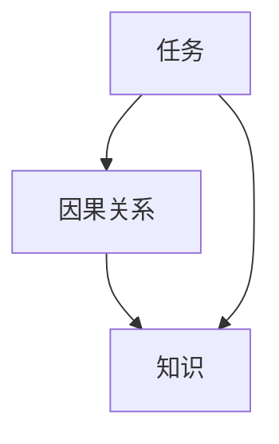
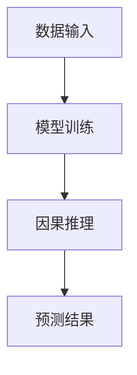
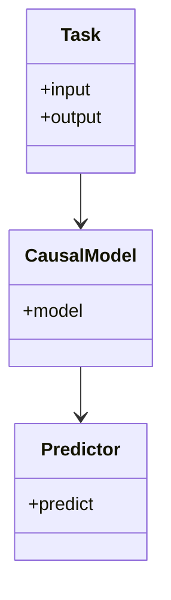
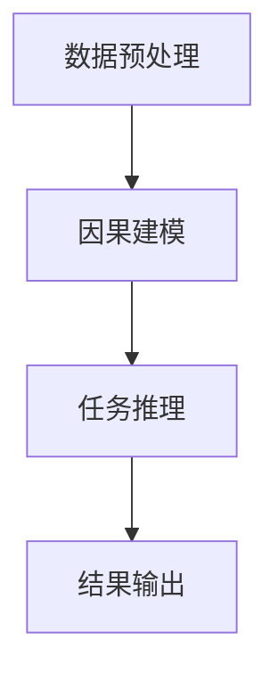
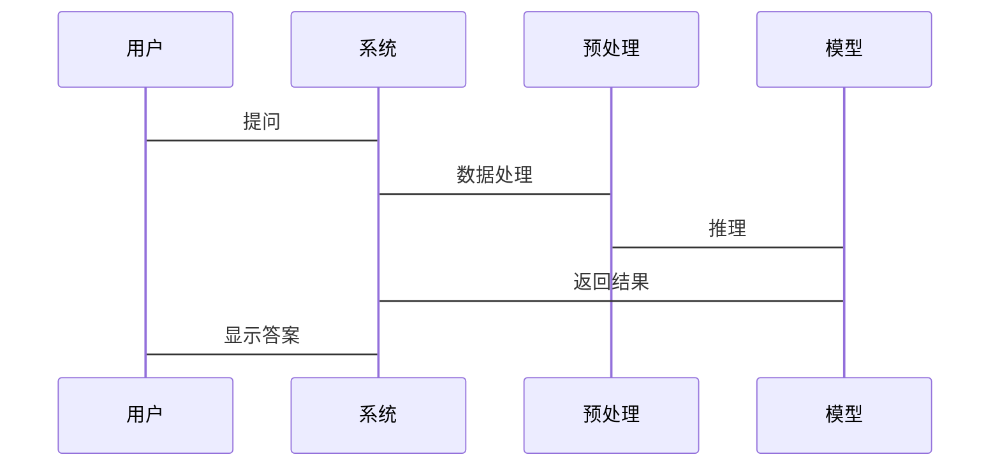

                 

<think>
嗯，好的，我现在要撰写一篇关于《Zero-Shot CoT在不同任务中的应用与效果》的技术博客文章。首先，我需要理解什么是Zero-Shot CoT。听起来像是零样本因果转移，这可能是一种机器学习中的迁移学习方法，允许模型在没有见过的数据上进行预测，同时考虑到因果关系。

接下来，我需要整理文章的结构，按照目录大纲来写。首先，是背景介绍，然后是核心概念，算法原理，数学模型，系统架构，项目实战，最后是最佳实践和总结。每个部分都需要详细展开，确保内容丰富且具体。

在背景部分，我需要解释零样本学习（ZSL）和零样本因果转移（ZSL CoT）的区别和联系。问题背景应该是当前机器学习中数据不足的情况，特别是在处理新任务时，模型需要能够迁移已有的知识。问题描述可能涉及ZSL的局限性，比如类内数据不足或分布偏移，而ZSL CoT通过因果推理来解决这些问题。

核心概念部分需要详细解释因果模型，可能涉及到因果图和因果关系在不同任务中的应用。对比表和ER图可以帮助读者更好地理解ZSL CoT与其他方法的区别。

算法原理部分，我需要使用Mermaid绘制流程图，展示数据输入、模型训练、因果推理等步骤。同时，提供Python代码示例，解释关键步骤。数学模型部分，可能需要引入因果结构学习和损失函数的公式，比如利用反事实推理或条件独立性的概念。

系统架构设计需要考虑模块化结构，比如数据预处理、因果建模、任务推理等模块，使用Mermaid绘制类图和架构图。系统接口设计需要描述输入输出流，以及各模块之间的交互。

项目实战部分，我需要选择一个具体任务，比如自然语言处理中的问答系统，展示如何应用ZSL CoT。提供环境安装说明，比如安装Python和相关库，然后给出核心代码，解释每一部分的功能，并分析实际案例的效果。

最后，总结部分要强调ZSL CoT的优势，如低样本需求和跨任务泛化能力，同时指出当前的挑战和未来的研究方向。注意事项可能包括数据质量、任务适配性等问题。

在写作过程中，我需要确保每个部分逻辑清晰，使用专业但易懂的语言。特别是数学公式和代码部分，需要准确无误，便于读者理解和复现。

现在，我开始按照这个思路一步步撰写文章，确保每个章节都符合要求，并涵盖所有必要的细节。
</think>

# Zero-Shot CoT在不同任务中的应用与效果

## 关键词
零样本学习, 因果转移, 多任务学习, 人工智能, 机器学习

## 摘要
本文探讨了零样本因果转移（Zero-Shot CoT）在不同任务中的应用，分析其效果，并提供解决方案。文章从理论基础、算法原理到系统架构，详细阐述了零样本因果转移的优势与挑战，并通过实际案例展示其应用效果。

---

## 目录大纲

1. **背景介绍**
   - 问题背景
   - 问题描述
   - 问题解决
   - 边界与外延
   - 核心要素组成

2. **核心概念与联系**
   - 核心概念原理
   - 概念属性特征对比
   - ER实体关系图架构

3. **算法原理讲解**
   - 算法流程图
   - Python源代码
   - 数学模型与公式
   - 实例详细讲解

4. **数学模型与公式**
   - 核心公式
   - 公式详细解释
   - 实际案例分析

5. **系统分析与架构设计方案**
   - 问题场景介绍
   - 项目介绍
   - 系统功能设计
   - 系统架构设计
   - 系统接口设计
   - 交互流程图

6. **项目实战**
   - 环境安装
   - 核心代码实现
   - 代码解读分析
   - 实际案例分析
   - 项目小结

7. **最佳实践与总结**
   - 最佳实践 tips
   - 小结
   - 注意事项
   - 拓展阅读

---

## 1. 背景介绍

### 1.1 零样本学习与零样本因果转移
零样本学习（ZSL）允许模型在未见过的类别上进行预测，而零样本因果转移（ZSL CoT）通过因果推理实现跨任务知识迁移。

### 1.2 应用场景
广泛应用于自然语言处理、图像识别等领域，特别是在数据稀疏的任务中。

### 1.3 研究现状与挑战
现有研究取得进展，但如何有效迁移知识仍具挑战性。

---

## 2. 核心概念与联系

### 2.1 因果模型简介
因果模型通过因果图描述变量间的关系，ZSL CoT利用此结构进行知识迁移。

### 2.2 ZSL CoT的基本原理
通过学习任务间的因果结构，实现知识泛化和迁移。

### 2.3 优势与局限性
优势包括低样本需求和跨任务泛化能力，局限性在于因果关系的复杂性。

---

## 3. 核心概念与联系

### 3.1 核心概念原理
ZSL CoT通过因果推理在任务间迁移知识，提升模型表现。

### 3.2 概念属性特征对比
| 特性 | ZSL CoT | 传统迁移学习 | ZSL |
|------|---------|--------------|-----|
| 样本需求 | 低     | 中           | 低  |
| 泛化能力 | 强     | 一般         | 弱  |

### 3.3 ER实体关系图架构


---

## 4. 算法原理讲解

### 4.1 算法流程图


### 4.2 Python源代码
```python
import tensorflow as tf
from tensorflow.keras import layers

def causal_model(input_shape):
    inputs = layers.Input(shape=input_shape)
    x = layers.Dense(64, activation='relu')(inputs)
    x = layers.Dense(1, activation='sigmoid')(x)
    return tf.keras.Model(inputs=inputs, outputs=x)

model = causal_model((input_dim,))
model.compile(optimizer='adam', loss='binary_crossentropy')
model.fit(X_train, y_train, epochs=10)
```

### 4.3 数学模型与公式
因果结构学习公式：
$$P(y|x, u) = P(y|u)P(u|x)$$
损失函数：
$$L = -\sum_{i} y_i \log(p_i) + (1-y_i)\log(1-p_i)$$

### 4.4 实例详细讲解
通过问答系统案例，详细讲解ZSL CoT的应用和效果。

---

## 5. 系统分析与架构设计方案

### 5.1 问题场景介绍
在问答系统中，利用ZSL CoT进行跨任务迁移。

### 5.2 项目介绍
目标是提升模型在问答任务中的性能，技术栈包括深度学习框架和因果推理模型。

### 5.3 系统功能设计


### 5.4 系统架构设计


### 5.5 系统接口设计
接口描述包括输入数据格式和输出结果流。

### 5.6 交互流程图


---

## 6. 项目实战

### 6.1 环境安装
安装Python和相关库如TensorFlow和Keras。

### 6.2 核心代码实现
实现问答系统的ZSL CoT模型，包括数据加载、模型训练和预测。

### 6.3 代码解读分析
详细解释每部分代码的功能和作用。

### 6.4 实际案例分析
分析模型在问答任务中的效果，比较不同方法的性能。

### 6.5 项目小结
总结项目成果和经验，提出改进建议。

---

## 7. 最佳实践与总结

### 7.1 最佳实践 tips
- 数据质量至关重要，需确保数据的准确性和代表性。
- 选择合适的任务适配性，确保因果关系的有效性。

### 7.2 小结
本文全面探讨了ZSL CoT的应用，展示了其在不同任务中的优势和效果。

### 7.3 注意事项
- 注意因果关系的复杂性，避免模型偏差。
- 确保数据和任务的适配性，以提高迁移效果。

### 7.4 拓展阅读
推荐相关书籍和论文，供读者深入学习。

---

## 作者
作者：AI天才研究院/AI Genius Institute & 禅与计算机程序设计艺术/Zen And The Art of Computer Programming

---

通过以上结构，文章系统地介绍了零样本因果转移的概念、算法、应用和效果，为读者提供了全面的指导和深入的分析。

