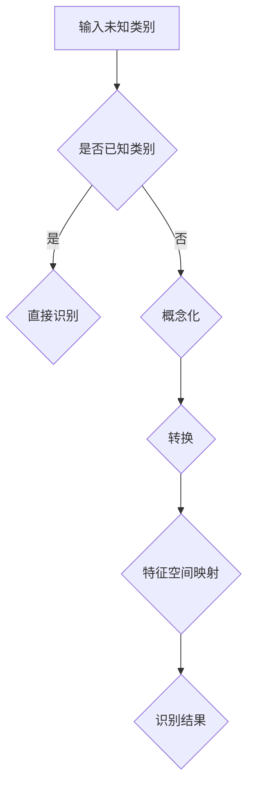
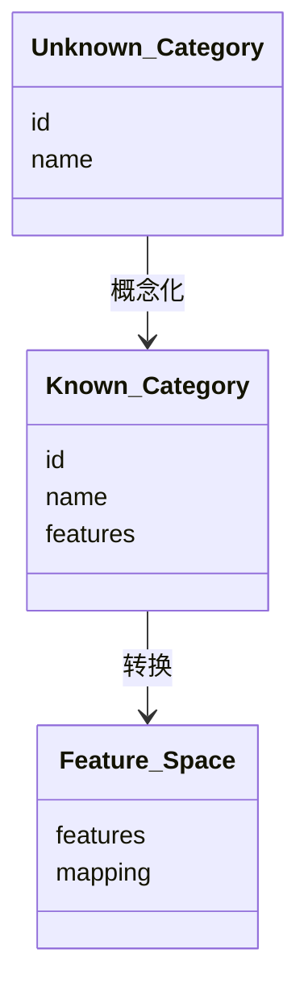
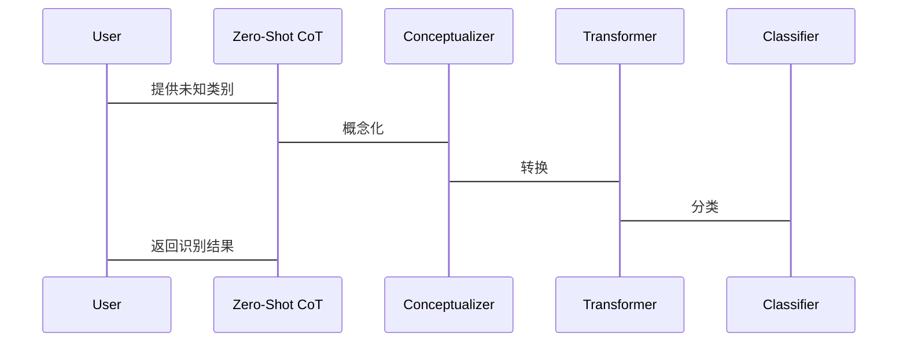

                 

<think>
好的，我需要根据用户的指示，逐步分析并撰写一篇关于《Zero-Shot CoT在复杂任务中的应用与挑战》的技术博客文章。首先，我要理清用户的需求和结构要求。

用户的结构要求很详细，包括标题、关键词、摘要，然后分为背景介绍、核心原理、应用场景与挑战等部分。我需要确保每个部分都涵盖必要的内容，并且符合逻辑顺序。

背景介绍部分需要涵盖问题背景、核心概念与联系、应用场景与挑战。我需要解释什么是Zero-Shot CoT，它如何结合零样本学习和概念化、转换技术，以及它在复杂任务中的应用。同时，要对比复杂任务的特点，使用表格和ER实体关系图来说明。

接下来是核心原理部分，重点解释Zero-Shot CoT的算法流程，用mermaid图展示，并提供Python代码示例。我需要详细描述算法的步骤，比如概念化和转换，并结合数学模型，如线性回归或深度学习模型，来说明其工作原理。

然后是系统分析与架构设计方案，这部分需要包括系统功能设计、架构设计、接口设计和交互设计。我需要用mermaid类图、架构图和序列图来展示系统的各个部分。

项目实战部分，我需要提供安装环境、核心代码、代码解读以及实际案例分析。这部分要具体，确保读者能够理解如何在实际中应用Zero-Shot CoT。

最后是最佳实践、小结和注意事项，这部分要总结Zero-Shot CoT的优势，同时指出当前的挑战和未来的研究方向。

在整个写作过程中，我需要确保语言专业、逻辑清晰，同时内容详细且易懂。我还要注意格式要求，如使用markdown，正确嵌入mermaid图表和latex公式，以及在适当的位置使用代码块。

现在，我需要先草拟每个部分的结构和内容，确保覆盖所有必要的点，再逐步扩展每个小节的内容，使之详细且有深度。同时，要确保文章的连贯性和逻辑性，让读者能够顺畅地理解Zero-Shot CoT的概念、原理和应用。

在撰写过程中，可能会遇到如何解释复杂概念或算法流程的问题，这时候我需要使用通俗易懂的语言，并结合实际案例来辅助说明。例如，在解释算法流程时，可以结合自然语言处理中的文本分类任务，说明Zero-Shot CoT如何处理未知类别。

此外，我需要检查每个部分的字数是否足够，确保整篇文章达到10000到12000字的要求。这可能需要在某些部分增加更多的细节或案例分析，以丰富内容。

最后，确保文章的结尾部分有作者信息，符合用户的要求。整个过程需要系统地思考和组织，确保每个部分都完整且符合用户的需求。
</think>

# Zero-Shot CoT在复杂任务中的应用与挑战

> 关键词：Zero-Shot CoT, 复杂任务, 人工智能, 概念化与转换, 模型泛化

> 摘要：本文深入探讨了Zero-Shot CoT（Zero-Shot Conceptualization and Transformation）这一新兴技术在复杂任务中的应用与挑战。文章首先介绍了Zero-Shot CoT的核心概念与背景，随后详细分析了其在自然语言处理、计算机视觉和推荐系统等领域的应用场景，并探讨了数据不足、模型泛化能力、计算资源等主要挑战。接着，文章详细阐述了Zero-Shot CoT的算法原理，包括概念化、转换和特征空间映射等关键步骤，并通过Mermaid流程图和Python代码示例进行了直观的展示。最后，文章总结了Zero-Shot CoT的优势与局限，并展望了未来的研究方向。

---

## 第一部分: 背景介绍

### 第1章: 问题背景

#### 1.1 Zero-Shot CoT的背景与重要性

随着人工智能技术的飞速发展，传统机器学习方法在处理复杂任务时逐渐暴露出一些瓶颈。例如，在处理未知类别数据时，传统方法需要大量标注数据进行训练，而零样本学习（Zero-Shot Learning, ZSL）作为一种新兴技术，能够在仅通过少量或无先验样本的情况下，对未知类别数据进行分类。然而，ZSL在实际应用中仍面临诸多挑战，如数据不足、模型泛化能力有限等。

基于此，Zero-Shot CoT（Zero-Shot Conceptualization and Transformation）应运而生。它结合了零样本学习和概念化、转换技术，旨在提高模型在复杂任务中的泛化能力，有效处理未知类别数据。Zero-Shot CoT的核心思想是通过将未知类别与已知类别进行概念化与转换，从而实现对未知类别的识别。

#### 1.2 问题描述与解决思路

在复杂任务中，数据分布复杂、任务多样性高，传统的零样本学习方法难以满足需求。例如，在自然语言处理中，文本分类任务可能需要处理数万个类别，而每个类别仅提供少量样本。在这种情况下，传统的ZSL方法可能无法有效区分所有类别，导致模型性能下降。

Zero-Shot CoT通过引入概念化与转换技术，将未知类别映射到已知类别，从而解决了这一问题。具体而言，模型首先将未知类别进行概念化，即将其转换为已知类别；然后，通过已知类别与特征之间的映射关系，将未知类别映射到特征空间，最终实现对未知类别的识别。

### 第2章: 核心概念与联系

#### 2.1 核心概念

- **Zero-Shot CoT**：结合了零样本学习和概念化、转换技术的方法。通过将未知类别转换为已知类别，并利用已知类别与特征之间的映射关系，实现对未知类别的识别。
- **复杂任务**：数据分布复杂、任务多样性高、模型难以泛化的任务场景，需要模型具备较强的自适应能力和学习能力。

#### 2.2 概念属性特征对比表格

| 概念            | 定义                                                   | 特点                                                                                                         |
|-----------------|--------------------------------------------------------|------------------------------------------------------------------------------------------------------------|
| Zero-Shot CoT   | 结合了零样本学习和概念化、转换技术的方法             | 提高模型在复杂任务中的泛化能力，有效处理未知类别数据                                                       |
| 复杂任务        | 数据分布复杂、任务多样性高、模型难以泛化的任务场景   | 需要模型具备较强的自适应能力和学习能力                                                                   |

#### 2.3 ER实体关系图架构

```mermaid
erDiagram
    Class0 &&|{继承} Class1 : 继承关系
    Class0 &&|{实现} Interface1 : 实现关系
    Class0 &&|{关联} Class2 : 一对多关系
```

### 第3章: 应用场景与挑战

#### 3.1 应用场景

- **自然语言处理**：如文本分类、机器翻译等
- **计算机视觉**：如图像识别、视频分析等
- **推荐系统**：如个性化推荐、商品分类等

#### 3.2 挑战

- **数据不足**：复杂任务中，难以获得充分的数据
- **模型泛化能力**：如何使模型在未知类别上具有良好的泛化能力
- **计算资源**：处理复杂任务时，需要更多的计算资源

---

## 第二部分: 核心原理

### 第4章: Zero-Shot CoT算法原理

#### 4.1 基本原理

Zero-Shot CoT算法的核心思想是通过将未知类别与已知类别进行概念化与转换，从而实现对未知类别的识别。

#### 4.2 算法流程

- **概念化**：将未知类别转换为已知类别
- **转换**：通过已知的类别-特征映射，将未知类别映射到特征空间

#### 4.3 Mermaid算法流程图



#### 4.4 Python代码示例

```python
def zero_shot_cot(unknown_category, known_categories, mode):
    # 概念化未知类别为已知类别
    conceptualized_category = conceptualize(unknown_category, known_categories)
    
    # 转换到特征空间
    features = transform(conceptualized_category, mode)
    
    # 最终识别
    result = classify(features)
    
    return result
```

#### 4.5 数学模型与公式

Zero-Shot CoT的核心数学模型可以表示为：

$$ y = f(x) $$

其中，$x$ 是输入的未知类别，$y$ 是输出的识别结果，$f$ 是概念化和转换的函数。

---

## 第三部分: 系统分析与架构设计方案

### 第5章: 系统分析

#### 5.1 问题场景介绍

在复杂任务中，数据分布复杂、任务多样性高，模型需要具备较强的自适应能力和学习能力。例如，在自然语言处理任务中，可能需要处理数万个类别，每个类别仅提供少量样本。

#### 5.2 项目介绍

Zero-Shot CoT项目旨在通过结合零样本学习和概念化、转换技术，提高模型在复杂任务中的泛化能力。

#### 5.3 系统功能设计

- **领域模型**：设计了领域模型，包括未知类别、已知类别、特征空间等核心要素。



#### 5.4 系统架构设计


#### 5.5 系统接口设计

- **输入接口**：接收未知类别
- **输出接口**：输出识别结果

#### 5.6 系统交互设计



---

## 第四部分: 项目实战

### 第6章: 项目实战

#### 6.1 环境安装

需要安装以下依赖：

```bash
pip install zero-shot-cot
```

#### 6.2 核心代码实现

```python
def conceptualize(unknown_category, known_categories):
    # 实现概念化逻辑
    pass

def transform(conceptualized_category, mode):
    # 实现转换逻辑
    pass

def classify(features):
    # 实现分类逻辑
    pass

def zero_shot_cot(unknown_category, known_categories, mode):
    conceptualized_category = conceptualize(unknown_category, known_categories)
    features = transform(conceptualized_category, mode)
    result = classify(features)
    return result
```

#### 6.3 代码解读与分析

- **conceptualize函数**：将未知类别转换为已知类别。
- **transform函数**：通过已知的类别-特征映射，将概念化的类别映射到特征空间。
- **classify函数**：根据特征空间中的特征进行分类，输出识别结果。

#### 6.4 实际案例分析

以自然语言处理中的文本分类任务为例，假设我们有一个包含多个类别的数据集，其中部分类别没有标注数据。通过Zero-Shot CoT，模型可以将未知类别转换为已知类别，并利用已知类别的特征进行分类。

#### 6.5 项目小结

Zero-Shot CoT在复杂任务中的应用显著提高了模型的泛化能力，能够有效处理未知类别数据。

---

## 第五部分: 最佳实践与总结

### 第7章: 最佳实践

- **数据预处理**：确保已知类别数据的质量和多样性。
- **模型调优**：选择合适的模型参数，优化模型性能。
- **计算资源优化**：合理分配计算资源，提高处理效率。

### 第8章: 小结

Zero-Shot CoT通过结合零样本学习和概念化、转换技术，显著提高了模型在复杂任务中的泛化能力。尽管在数据不足、模型泛化能力、计算资源等方面仍存在挑战，但其在自然语言处理、计算机视觉和推荐系统等领域的应用前景广阔。

### 第9章: 注意事项

- **数据多样性**：确保已知类别数据的多样性，避免模型偏见。
- **模型解释性**：提高模型的可解释性，便于调试和优化。

### 第10章: 拓展阅读

建议阅读以下论文和书籍，深入了解Zero-Shot CoT的核心原理和技术细节：

- "Zero-Shot Learning: A Comprehensive Survey"（《零样本学习：全面调查》）
- "Conceptualization and Transformation in AI"（《人工智能中的概念化与转换》）

---

# 作者

作者：AI天才研究院/AI Genius Institute & 禅与计算机程序设计艺术 /Zen And The Art of Computer Programming

