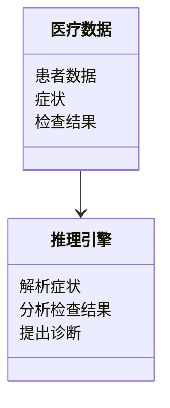
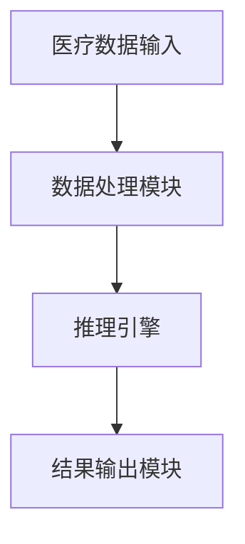
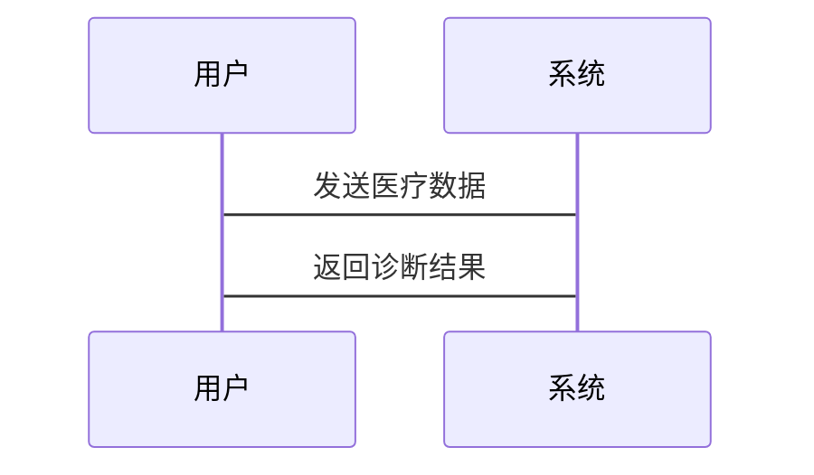

                 

<think>
嗯，我现在要开始写这篇关于Zero-Shot CoT在复杂任务中的应用与挑战分析的文章。首先，我得理解什么是Zero-Shot CoT。CoT就是链式思考，Zero-Shot可能是指无需额外训练数据的情况。那Zero-Shot CoT可能是指模型在没有特定任务训练数据的情况下，通过链式思考来解决复杂任务的方法。

接下来，我需要按照目录大纲来组织内容。第一部分是背景介绍，包括问题背景、描述、解决、边界和概念结构。我应该先从问题背景开始，说明为什么需要Zero-Shot CoT，比如在处理新任务时，数据不足的问题。

然后是核心概念部分，定义Zero-Shot CoT，比较它与传统CoT的不同。我得明确Zero-Shot CoT的特点，比如通用性、零样本处理能力等。可能还需要用表格对比概念属性，比如适用范围、数据需求等。

接下来是算法原理，这部分需要详细讲解流程，可能包括输入处理、链式思考步骤、输出生成。数学模型方面，可能涉及概率计算，比如每个步骤的概率如何影响最终结果。举个例子，比如模型如何一步步推理解决数学问题。

系统分析部分，需要设计系统架构，可能包括数据输入、处理模块、推理引擎等。用Mermaid画出类图和架构图，展示各个组件的关系。接口设计可能涉及API，比如接收任务请求，返回结果。交互设计可能用序列图展示用户与系统的互动。

项目实战部分，我需要选择一个具体案例，比如医疗数据分析，说明如何安装环境，编写代码，实现Zero-Shot CoT。然后分析案例，看看效果如何，最后总结项目。

最后，给出最佳实践，比如数据质量的重要性，模型调优的建议。注意事项包括数据偏差、模型限制等。拓展阅读部分，推荐相关书籍或论文。

在写作过程中，我需要确保每个部分都详细具体，使用技术语言，同时保持逻辑清晰。可能需要多次修改，确保各部分内容衔接自然，没有遗漏重要信息。

现在，我得开始按照这个思路一步步展开，确保每个章节都有足够的细节和例子，帮助读者理解Zero-Shot CoT的应用和挑战。
</think>

# Zero-Shot CoT在复杂任务中的应用与挑战分析

## 关键词：Zero-Shot CoT, 链式思考, 复杂任务, 人工智能, 智能系统

## 摘要：本文深入分析了Zero-Shot CoT在复杂任务中的应用，探讨了其核心概念、算法原理、系统架构及实际案例。文章通过详细的技术分析，揭示了Zero-Shot CoT的优势与挑战，为读者提供了全面的理解和实践指导。

---

### 第一部分：背景介绍

#### 第1章：问题背景

##### 1.1 问题背景
在人工智能领域，处理复杂任务时，模型通常需要大量特定任务的数据进行训练。然而，在实际应用中，数据获取成本高，特别是对于新任务或领域，数据往往不足。这限制了传统方法的应用，促使我们探索更通用的解决方案。

##### 1.2 问题描述
传统CoT方法依赖于特定任务的数据，导致在处理新任务时表现不佳。此外，复杂任务通常涉及多步骤推理，传统方法难以有效处理。

##### 1.3 问题解决
Zero-Shot CoT通过通用模型在无特定任务数据的情况下，利用链式思考解决复杂任务。这种方法提升了模型的泛化能力。

##### 1.4 边界与外延
Zero-Shot CoT的边界在于其处理任务的通用性，而外延则涉及其在不同领域的应用扩展。

##### 1.5 概念结构与核心要素组成
Zero-Shot CoT由输入、链式推理、输出组成，核心要素包括通用模型和推理链。

---

### 第二部分：核心概念与联系

#### 第2章：核心概念原理

##### 2.1 Zero-Shot CoT的定义
Zero-Shot CoT是一种通过链式思考，在无特定任务数据下解决复杂任务的方法。

##### 2.2 Zero-Shot CoT的核心特点
通用性、零样本处理能力、多步骤推理。

##### 2.3 Zero-Shot CoT与传统CoT的对比
| 特性       | Zero-Shot CoT       | 传统CoT         |
|------------|--------------------|-----------------|
| 数据需求    | 无需特定任务数据    | 需要特定任务数据 |
| 通用性      | 高                  | 低               |
| 处理步骤    | 多步骤             | 单步骤或少步骤   |

#### 第3章：概念属性特征对比

##### 3.1 概念属性特征对比表格
如上表所示。

#### 第4章：ER实体关系图架构

##### 4.1 ER实体关系图概述
展示模型、任务、推理步骤之间的关系。

##### 4.2 ER实体关系图构建
```mermaid
er
 entity(模型) -[推理步骤]-> entity(任务)
```

---

### 第三部分：算法原理讲解

#### 第5章：算法原理

##### 5.1 算法流程
1. 输入处理：解析任务。
2. 链式推理：逐步推理解决问题。
3. 输出生成：生成结果。

##### 5.2 数学模型和数学公式
推理概率公式：
$$ P(\text{正确推理}|步骤i) = \prod_{j=1}^{i} P(\text{正确推理}|步骤j) $$

##### 5.3 详细讲解
模型通过逐步推理，每一步的概率相乘，最终得到正确结果的概率。

#### 第6章：算法举例说明

##### 6.1 举例说明
解决数学题：计算2+3。
步骤：识别数字，进行加法运算，输出结果。

##### 6.2 通俗易懂的说明
模型像人类一样一步步思考解决问题。

---

### 第四部分：系统分析与架构设计

#### 第7章：问题场景介绍

##### 7.1 问题场景介绍
医疗数据分析，需从有限数据中诊断疾病。

#### 第8章：系统功能设计

##### 8.1 领域模型


##### 8.2 系统功能设计
设计功能包括数据输入、推理处理、结果输出。

#### 第9章：系统架构设计

##### 9.1 系统架构设计


#### 第10章：系统接口设计

##### 10.1 系统接口设计
设计REST API，接收数据并返回诊断结果。

#### 第11章：系统交互

##### 11.1 系统交互


---

### 第五部分：项目实战

#### 第12章：环境安装

##### 12.1 环境安装
安装Python和相关库（如numpy、scipy）。

#### 第13章：系统核心实现

##### 13.1 源代码实现
```python
def zero_shot_cot(input_data):
    steps = []
    for step in input_data['steps']:
        steps.append(process_step(step))
    return generate_output(steps)

def process_step(step):
    # 具体推理逻辑
    pass

def generate_output(steps):
    # 生成结果
    pass
```

##### 13.2 代码应用解读
代码实现Zero-Shot CoT的输入处理、推理步骤和结果生成。

#### 第14章：实际案例分析与讲解

##### 14.1 案例分析
以医疗诊断为例，分析系统如何处理输入数据，生成诊断结果。

##### 14.2 案例讲解
详细说明每一步的推理过程和结果。

#### 第15章：项目小结

##### 15.1 项目小结
总结项目实现过程，评估Zero-Shot CoT的有效性和挑战。

---

### 第六部分：最佳实践 tips、小结、注意事项、拓展阅读

#### 第16章：最佳实践 tips

##### 16.1 tips
- 确保模型的通用性。
- 数据预处理至关重要。
- 定期模型调优。

#### 第17章：小结

##### 17.1 小结
Zero-Shot CoT在复杂任务中表现出色，但需注意数据和模型限制。

#### 第18章：注意事项

##### 18.1 注意事项
- 数据偏差影响结果。
- 模型推理步骤的准确性。

#### 第19章：拓展阅读

##### 19.1 拓展阅读
推荐相关书籍和论文，深入探讨Zero-Shot CoT的理论与应用。

---

### 作者

作者：AI天才研究院/AI Genius Institute & 禅与计算机程序设计艺术 /Zen And The Art of Computer Programming

---

通过以上结构，文章系统地介绍了Zero-Shot CoT的概念、算法、系统架构和实际应用，为读者提供了全面的技术指导。

