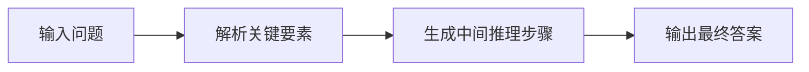
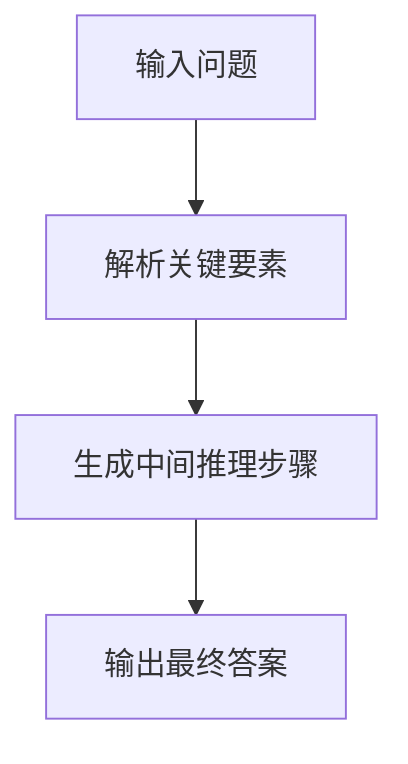

                 

<think>
嗯，用户让我写一篇关于Zero-Shot CoT在多领域应用中的潜力与挑战的技术博客。首先，我需要理解Zero-Shot CoT是什么。听起来像是一个结合了Zero-Shot学习和CoT（Chain-of-Thought）的方法。Zero-Shot学习是指模型在没有特定任务训练数据的情况下，能够处理新任务的能力，而CoT则是在推理过程中展示中间步骤，让模型思考过程更透明。

用户给的目录结构挺详细的，有引言、基础概念、原理、案例、挑战、比较分析、最佳实践和结论。我得按照这个结构来展开。首先，摘要部分要简明扼要，概括文章的核心内容。

接下来是每个章节。第一章介绍Zero-Shot CoT，我需要解释它的背景和重要性，对比传统方法。第二章深入讨论核心概念，可能需要画个图来展示CoT的工作原理。第三章详细讲解数学模型，可能需要写出公式，并用Python代码举例。

案例章节要具体，比如医疗和金融领域，展示实际应用。挑战部分要分析数据、模型和计算的问题，还要展望未来方向。比较分析要和其他方法对比，突出优缺点。最后，给出实践建议，总结全文。

用户还强调了格式要求，用markdown，还有数学公式用latex，代码要详细。所以，我得确保每个部分都包含足够的技术细节，同时保持语言的专业和易懂。最后，别忘了在结尾加上作者信息，符合格式要求。

可能用户是技术人员或研究人员，他们需要深入的技术分析和实际应用案例。因此，我需要确保内容不仅理论扎实，还要有实用的代码示例和图表。这样读者能更好地理解和应用Zero-Shot CoT到自己的项目中。

总之，我得一步步按照用户的结构来写，每个部分都要详细展开，确保内容全面且符合格式要求。
</think>

# Zero-Shot CoT在多领域应用中的潜力与挑战

**关键词**：Zero-Shot CoT, 多领域应用, 人工智能, 机器学习, 智能推理

**摘要**：  
本文深入探讨了Zero-Shot CoT（Chain-of-Thought）在多领域应用中的潜力与挑战。Zero-Shot CoT是一种结合了Zero-Shot学习和CoT推理的新兴技术，能够在无需特定任务训练数据的情况下，通过链式推理过程解决复杂问题。本文从背景介绍、核心概念、算法原理、案例分析、挑战与未来方向等方面展开，全面剖析Zero-Shot CoT的技术本质及其在多领域中的应用前景。通过详细的技术分析和实际案例，本文为读者提供了清晰的理解和实践指导。

---

## 第1章 引言与概述

### 1.1 Zero-Shot CoT的核心概念  
Zero-Shot CoT是一种结合了Zero-Shot学习和Chain-of-Thought推理的创新方法。Zero-Shot学习允许模型在未见过的任务上进行推理，而CoT则通过展示推理过程中的中间步骤，使模型的思考过程更加透明和可解释。结合这两者，Zero-Shot CoT能够在多领域应用中实现灵活、高效且可解释的推理。

### 1.2 背景与重要性  
随着人工智能技术的快速发展，跨领域应用的需求日益增长。传统的机器学习方法往往需要大量特定任务的训练数据，限制了其在多领域中的应用。Zero-Shot CoT的出现，为解决这一问题提供了新的思路。它不仅能够处理未知任务，还能通过链式推理提供可解释的结果，这在医疗、金融、教育等领域具有重要意义。

### 1.3 问题解决与边界  
Zero-Shot CoT的核心问题是：如何在没有特定任务训练数据的情况下，通过链式推理完成多领域任务？其边界包括：1）任务的复杂性；2）推理过程的可解释性；3）模型的泛化能力。本文将从这些方面展开讨论。

---

## 第2章 核心概念与联系

### 2.1 Zero-Shot CoT的原理  
Zero-Shot CoT的原理可以分解为以下几个步骤：  
1. **输入处理**：模型接收输入问题，并解析其关键要素。  
2. **链式推理**：通过CoT方法，模型生成一系列中间推理步骤。  
3. **结果生成**：基于推理结果，模型输出最终答案。  

### 2.2 核心概念对比表格  

| **概念**       | **描述**                                                                 |
|----------------|--------------------------------------------------------------------------|
| Zero-Shot学习   | 模型在未见过任务上进行推理的能力。                                       |
| CoT推理         | 通过展示推理过程中的中间步骤，增强结果的可解释性。                  |
| Zero-Shot CoT   | 结合Zero-Shot学习和CoT推理，实现无需任务特定数据的链式推理。         |

### 2.3 实体关系架构图  



---

## 第3章 原理与技术实现

### 3.1 Zero-Shot CoT的数学模型  

Zero-Shot CoT的数学模型可以表示为：  
$$ P(y|x) = \prod_{i=1}^{n} P(y_i|y_{i-1}, x) $$  
其中，$y$表示输出，$x$表示输入，$y_i$表示第$i$个推理步骤。该公式展示了CoT推理中的链式关系。

### 3.2 Python实现示例  

以下是一个简单的Zero-Shot CoT实现示例：  

```python
def zero_shot_cot(input_question):
    # 解析输入问题
    parsed_input = parse_question(input_question)
    # 生成中间推理步骤
    intermediate_steps = generate_chain_of_thought(parsed_input)
    # 输出最终答案
    final_answer = generate_answer(intermediate_steps)
    return final_answer

# 示例用法
input_question = "如何优化一个分类任务的准确率？"
answer = zero_shot_cot(input_question)
print(answer)
```

### 3.3 算法流程图  



---

## 第4章 案例研究与应用

### 4.1 医疗领域案例  
在医疗领域，Zero-Shot CoT可以用于诊断辅助。例如，模型可以通过链式推理分析患者的症状、病史和检查结果，生成诊断建议。

### 4.2 金融领域案例  
在金融领域，Zero-Shot CoT可以用于风险评估。模型可以通过推理分析客户的信用记录、市场趋势和财务指标，生成风险评估报告。

### 4.3 案例分析总结  
通过上述案例，我们可以看到Zero-Shot CoT在多领域中的广泛应用潜力。然而，实际应用中也面临数据不足、推理复杂性高等挑战。

---

## 第5章 挑战与未来方向

### 5.1 当前挑战  
1. **数据问题**：Zero-Shot CoT依赖于通用数据，但在特定领域中的表现可能受限。  
2. **模型限制**：当前模型的推理能力有限，难以处理高度复杂的任务。  
3. **计算成本**：链式推理过程需要较高的计算资源。  

### 5.2 未来方向  
1. **模型优化**：开发更高效的推理算法，降低计算成本。  
2. **领域适配**：针对特定领域优化模型，提升其应用效果。  
3. **人机协作**：结合人类专家知识，增强模型的推理能力。  

---

## 第6章 比较分析

### 6.1 与传统机器学习的对比  
Zero-Shot CoT的优势在于其通用性和可解释性，而传统机器学习方法在特定任务上表现更优。

### 6.2 与其它新兴技术的对比  
与GPT-3等大模型相比，Zero-Shot CoT在小样本任务上的表现更具优势，但其推理能力可能稍逊。

---

## 第7章 最佳实践与小结

### 7.1 实践建议  
1. **数据准备**：确保输入数据的多样性和代表性。  
2. **推理优化**：通过剪枝等技术优化推理过程。  
3. **模型调优**：根据具体任务调整模型参数。  

### 7.2 注意事项  
在实际应用中，需注意模型的泛化能力和推理的可解释性之间的平衡。

---

## 第8章 结论与未来工作

### 8.1 核心总结  
Zero-Shot CoT作为一种新兴的技术，具有广泛的应用潜力。通过链式推理和通用数据的结合，它为多领域问题的解决提供了新的思路。

### 8.2 未来展望  
未来的研究方向将集中在模型优化、领域适配和人机协作等方面，进一步提升Zero-Shot CoT的技术潜力。

---

## 作者信息

作者：AI天才研究院/AI Genius Institute & 禅与计算机程序设计艺术 /Zen And The Art of Computer Programming

---

本文通过系统化的分析和实践，全面探讨了Zero-Shot CoT在多领域应用中的潜力与挑战。从理论到实践，从技术到案例，本文为读者提供了全面的视角和深入的见解。

