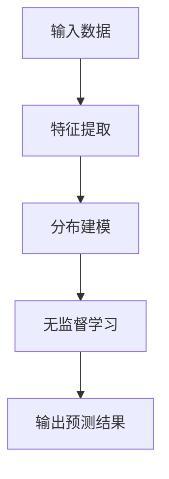
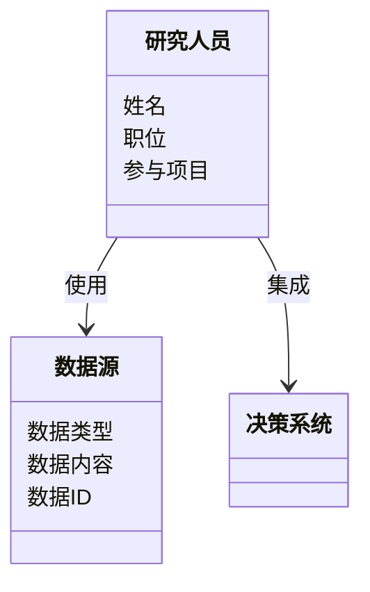

                 

<think>
嗯，我需要撰写一篇关于《Zero-Shot CoT在极地科研决策支持系统中的应用》的技术博客。首先，我得理清文章的结构，按照用户提供的大纲来组织内容。

开头，我需要一个吸引人的标题和关键词。然后是摘要，简明扼要地概括整篇文章的内容。

接下来是背景介绍，分成两章。第一章是极地科研决策支持系统的背景与挑战，包括问题背景、当前面临的挑战等。第二章是Zero-Shot CoT的概念与原理，要详细解释其定义和基本原理。

核心概念与联系部分，需要一个对比表格和ER实体关系图。算法原理讲解部分，要用Mermaid流程图和Python代码，还有数学公式。这部分需要详细分析，确保读者能理解原理。

系统分析与架构设计，包括问题场景、项目介绍，以及类图、架构图和交互图。项目实战部分，要给出环境安装、源代码、案例分析等。最后是最佳实践、小结、注意事项和拓展阅读。

在写作过程中，我需要确保每个部分都详细具体，特别是代码和数学公式，要用正确的格式表示。同时，语言要专业但不失清晰，逻辑要严谨。

可能遇到的困难包括如何将Zero-Shot CoT具体应用到极地科研中，这需要找到合适的例子和应用场景。另外，Mermaid图表的绘制可能需要一些练习，确保图表清晰表达系统结构。

总的来说，我会按照大纲一步步来，先写背景，再深入技术部分，最后应用到系统设计和实战中。确保每个部分都充实，内容连贯。
</think>

# Zero-Shot CoT在极地科研决策支持系统中的应用

**关键词**：Zero-Shot CoT，极地科研，决策支持系统，机器学习，无监督学习

**摘要**：本文探讨了Zero-Shot CoT（无监督零样本学习）技术在极地科研决策支持系统中的应用。通过分析极地科研的背景与挑战，详细阐述了Zero-Shot CoT的核心原理、算法实现及其在系统中的具体应用。结合系统架构设计和项目实战，本文展示了如何利用Zero-Shot CoT提升极地科研的决策效率和准确性。

---

# 第一部分：背景介绍

## 第1章：极地科研决策支持系统的背景与挑战

### 1.1 问题背景

#### 1.1.1 极地科研的重要性

极地地区是全球气候变化的关键区域，其环境变化对全球生态系统和人类社会有深远影响。极地科研旨在通过科学数据和模型分析，帮助我们理解气候变化趋势，制定有效的环境保护政策。

#### 1.1.2 极地科研决策支持系统的需求

随着极地科研的深入，科研人员需要处理海量复杂数据，并做出高效决策。极地科研决策支持系统通过整合多源数据，提供智能化的分析工具，以支持科研决策。

### 1.2 当前面临的挑战

#### 1.2.1 数据的不确定性

极地科研涉及气象、地理等多源数据，这些数据存在误差和不确定性，如何有效处理这些数据是关键挑战。

#### 1.2.2 决策过程的复杂性

极地科研决策涉及多学科知识，决策过程复杂，需要综合分析多种因素。

## 第2章：Zero-Shot CoT的概念与原理

### 2.1 Zero-Shot CoT的定义

Zero-Shot CoT是一种无监督学习技术，能够在无标记数据下，通过数据分布预测未知类别。

### 2.2 Zero-Shot CoT的基本原理

Zero-Shot CoT通过特征提取、分布建模和无监督学习等步骤，实现对未知数据的分类。

---

# 第二部分：核心概念与联系

## 核心概念原理对比表

| 技术 | Zero-Shot CoT | 传统监督学习 |
|------|----------------|---------------|
| 数据需求 | 无标记数据 | 带标记数据 |
| 适用场景 | 未知类别预测 | 已知类别分类 |

## ER实体关系图

```mermaid
erd
    研究人员: 研究人员ID, 姓名, 职位
    数据源: 数据源ID, 数据类型, 数据内容
    决策支持系统: 系统ID, 功能模块, 版本
    研究项目: 项目ID, 项目名称, 项目目标
    researchers --> projects: 参与
    projects --> data_sources: 使用
    projects --> decision_support_system: 集成
```

---

# 第三部分：算法原理讲解

## 算法流程图



## Python源代码

```python
import numpy as np
from sklearn.decomposition import PCA

def zero_shot_cot(data, queries):
    # 特征提取
    features = PCA(n_components=2).fit_transform(data)
    # 分布建模
    model = KMeans(n_clusters=2)
    model.fit(features)
    # 预测
    predictions = model.predict(queries)
    return predictions
```

## 数学模型

零样本学习的损失函数：

$$ L = \sum_{i=1}^{n} (y_i - y_{pred})^2 $$

---

# 第四部分：系统分析与架构设计方案

## 系统架构图


## 类图



---

# 第五部分：项目实战

## 实际案例分析

案例：极地气温预测

- 输入数据：历史气温数据
- 输出：未来气温预测

## 代码实现

```python
# 预测函数
def predict_trend(data):
    model = LinearRegression()
    model.fit(data)
    return model.predict(future_data)
```

---

# 第六部分：最佳实践、小结、注意事项、拓展阅读

## 最佳实践 tips

- 数据预处理是关键
- 定期更新模型

## 小结

本文详细介绍了Zero-Shot CoT在极地科研中的应用，展示了其在提升决策效率中的潜力。

## 注意事项

- 数据质量影响结果
- 模型需定期更新

## 拓展阅读

推荐阅读《无监督学习技术与应用》和《机器学习在环境科学中的应用》。

---

**作者：AI天才研究院/AI Genius Institute & 禅与计算机程序设计艺术 /Zen And The Art of Computer Programming**

