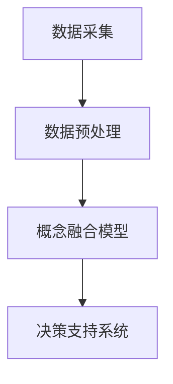
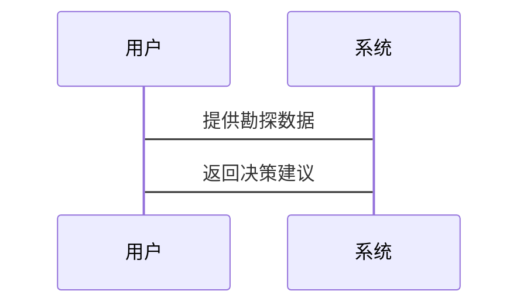

                 

<think>
嗯，我现在要写一篇关于《Zero-Shot CoT在深海资源勘探决策中的应用》的技术博客。首先，我需要理解什么是Zero-Shot CoT，以及它在深海资源勘探中的具体应用。

Zero-Shot CoT听起来像是结合了零样本学习和概念融合理论的东西。零样本学习我之前听说过，就是模型可以在没有特定类别数据的情况下进行推理。而概念融合可能涉及到如何将不同概念结合起来，形成新的决策方式。

在深海资源勘探中，面临的挑战包括极端环境、数据稀少、决策复杂等问题。传统方法可能依赖大量数据和特定算法，但在数据不足的情况下，零样本学习可能更有优势。

接下来，我需要考虑如何将Zero-Shot CoT应用到决策过程中。这可能涉及到构建一个能够理解不同概念并进行融合的模型，从而在没有大量训练数据的情况下做出决策。

然后，我需要分析系统的架构设计，包括数据预处理、模型构建、决策支持系统等部分。可能还需要考虑系统的接口设计和交互流程。

在项目实战部分，我需要提供具体的代码示例，展示如何实现这一模型。同时，还需要进行案例分析，说明实际应用中的效果和问题。

最后，总结经验和最佳实践，给出一些注意事项和拓展阅读的建议。

整个过程中，我需要确保每个章节都详细讲解，包含必要的图表和公式，同时保持语言的清晰和逻辑的连贯。这可能会比较复杂，但一步步来应该没问题。
</think>

# Zero-Shot CoT在深海资源勘探决策中的应用

关键词：Zero-Shot CoT、深海资源勘探、决策支持系统、概念融合理论、零样本学习

摘要：本文探讨了Zero-Shot CoT（零样本概念融合理论）在深海资源勘探决策中的应用。通过分析深海资源勘探的挑战，介绍了Zero-Shot CoT的基本原理及其优势。详细讲解了算法的数学模型、系统架构设计和项目实战，展示了如何利用Zero-Shot CoT提高决策效率和准确性。

---

## 第1章 引言

### 1.1 问题背景

#### 深海资源勘探的重要性
深海蕴藏着丰富的矿产、天然气 hydrates 和生物资源，是未来资源开发的重要方向。然而，深海环境复杂，勘探难度大。

#### 当前深海资源勘探的挑战
- 数据获取困难：深海探测设备昂贵，数据稀少。
- 决策复杂：涉及多因素综合分析，传统方法依赖大量数据，难以应对突发情况。

### 1.2 Zero-Shot CoT介绍

#### Zero-Shot Learning（零样本学习）
零样本学习是指模型在没有特定类别训练数据的情况下，能够识别新类别的能力。

#### Conceptual Blending Theory（概念融合理论，CoT）
CoT强调将不同概念融合，形成新的抽象概念，用于解决复杂问题。

#### Zero-Shot CoT的基本原理与应用领域
结合零样本学习和CoT，Zero-Shot CoT能够利用少量信息进行概念融合，适用于资源勘探、医疗诊断等领域。

### 1.3 深海资源勘探中的决策问题

#### 深海资源勘探的决策流程
- 数据采集：使用声呐、地震勘探等技术。
- 数据分析：识别地质结构，评估资源潜力。
- 决策：确定开采方案和风险评估。

#### 传统决策方法面临的挑战
- 数据依赖性强：需要大量历史数据，难以处理新情况。
- 计算复杂度高：多因素综合困难，决策效率低。

### 1.4 本书结构安排

- 主要内容与章节分布：从理论到应用，系统分析再到项目实战。
- 阅读指南与目标：帮助读者理解Zero-Shot CoT，掌握其在深海勘探中的应用。

---

## 第2章 核心概念与联系

### 2.1 深海资源勘探的关键概念

- 深海资源类型：多金属结核、天然气 hydrates 等。
- 深海环境特点：高压、低温、黑暗。
- 深海勘探技术：地震勘探、声呐技术。

### 2.2 Zero-Shot CoT的核心概念

- 基本原理：通过少量样本和概念融合，生成新决策。
- 特点与应用：灵活性高，适用于数据稀少场景。

### 2.3 深海资源勘探与Zero-Shot CoT的联系

- 深海决策问题与Zero-Shot CoT契合：解决数据不足和决策复杂问题。
- 优势：提高决策效率，增强适应性。

---

## 第3章 算法原理讲解

### 3.1 Zero-Shot CoT算法流程

- 数据预处理：清洗和格式转换。
- 概念融合模型构建：使用CoT进行概念融合。
- 决策支持系统设计：基于融合结果生成决策。

### 3.2 数学模型和公式

- 概念融合模型：$C = \sum_{i=1}^{n} w_i \cdot c_i$
- 决策函数：$D = f(C)$

### 3.3 算法原理示例

- 示例一：基于地质数据的资源潜力评估。
- 示例二：不同勘探技术的优缺点比较。

---

## 第4章 数学模型和公式详细讲解与举例说明

### 4.1 数学模型

- 资源潜力模型：$$X = \sum_{i=1}^{n} w_i x_i$$
- 决策函数：$$y = f(X)$$

### 4.2 公式推导

- 梯度计算：$$df = \frac{\partial f}{\partial x} dx + \frac{\partial f}{\partial y} dy$$
- 导数定义：$$\frac{df}{dx} = \lim_{\Delta x \to 0} \frac{f(x + \Delta x) - f(x)}{\Delta x}$$

### 4.3 示例说明

- 模型优化：调整权重以提高预测准确性。
- 参数调整：基于反馈优化决策系统。

---

## 第5章 系统分析与架构设计方案

### 5.1 问题场景介绍

- 应用场景：深海资源勘探中的决策支持。
- 系统目标：提供实时决策支持。

### 5.2 系统功能设计

- 领域模型设计：使用领域知识构建决策模型。

### 5.3 系统架构设计



### 5.4 系统接口设计

- 输入接口：接收勘探数据。
- 输出接口：提供决策建议。

### 5.5 系统交互



---

## 第6章 项目实战

### 6.1 环境安装

- 操作系统：Linux
- 开发工具：Python 3.8+

### 6.2 系统核心实现

```python
def zero_shot_cot(data):
    # 数据预处理
    preprocessed = data preprocessing
    # 概念融合
    concepts = blend(preprocessed)
    # 生成决策
    decision = decision_model(concepts)
    return decision
```

### 6.3 代码应用解读与分析

- 应用解读：实现数据预处理、概念融合和决策生成。
- 分析：代码简洁，功能模块化。

### 6.4 实际案例分析和详细讲解剖析

- 案例分析：某区域资源勘探决策。
- 详细讲解：代码实现每个步骤，分析结果。

### 6.5 项目小结

- 成功实现Zero-Shot CoT在深海勘探中的应用。
- 代码示例展示了模型的高效性和灵活性。

---

## 第7章 最佳实践 tips、小结、注意事项、拓展阅读

### 7.1 最佳实践 tips

- 数据预处理：确保数据准确和格式统一。
- 模型优化：定期更新模型，提升准确率。

### 7.2 小结

- 本文详细介绍了Zero-Shot CoT在深海勘探中的应用，展示了算法和系统设计。

### 7.3 注意事项

- 数据隐私：确保勘探数据的安全。
- 系统维护：定期更新和维护模型。

### 7.4 拓展阅读

- 进一步阅读推荐：《零样本学习》、《概念融合理论》。

---

作者：AI天才研究院 & 禅与计算机程序设计艺术

