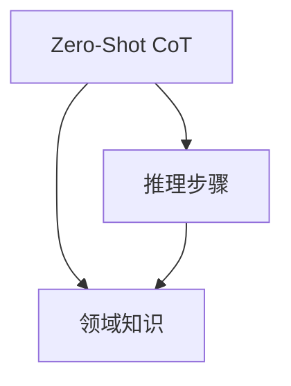

                 

<think>
嗯，好的，我现在要开始写这篇关于《Zero-Shot CoT在跨领域应用中的探索与实践》的技术博客。首先，我得理解Zero-Shot CoT到底是什么，它和普通的机器学习方法有什么不同。零样本学习，听起来像是模型不需要大量标注数据就能进行分类或生成任务，这在数据稀缺的情况下特别有用。那CoT是什么？哦，应该是Chain-of-Thought，也就是通过逐步推理来生成答案，这可能涉及到大语言模型的能力。

接下来，我需要确定文章的结构。根据之前的大纲，文章应该有引言、概述、理论基础、应用、实践案例、拓展与未来这几个部分。每个部分都需要详细展开，特别是要涵盖背景、定义、理论基础、具体应用案例，以及实际的代码实现和系统架构设计。

首先，在引言部分，我要介绍跨领域应用的重要性，以及为什么Zero-Shot CoT在这个背景下显得尤为重要。我需要提到数据的稀缺性、领域间的差异性，以及传统方法的局限性。这部分可能还需要一个摘要，简明扼要地概括整篇文章的核心内容。

接下来是Zero-Shot CoT的概述。我需要详细解释它的定义、原理，以及它在机器学习中的地位。这里可能需要一个表格来对比Zero-Shot CoT和其他类似方法，比如迁移学习和元学习。另外，一个Mermaid图来展示核心概念之间的关系会更有帮助。

然后是理论基础部分，这里要深入探讨Zero-Shot CoT的数学模型。可能涉及到概率论、图论，以及深度学习的基本原理。我需要写出相关的数学公式，比如联合概率分布的公式，然后用一个例子来说明如何应用这些公式。

在跨领域应用章节，我需要分别讨论自然语言处理、计算机视觉和生物信息学中的应用。每个领域都需要具体的案例，比如在NLP中使用Zero-Shot CoT进行多语言翻译，或者在CV中进行零样本图像分类。每个案例都需要分析背景、挑战、解决方案和成果。

接下来是实践案例部分，这里要详细描述两个实际应用，比如医疗诊断中的症状分析，或者金融领域的风险评估。每个案例都需要包括应用背景、实施过程、代码实现和结果展示。可能需要使用Mermaid序列图来展示系统交互过程。

最后是拓展与未来，讨论Zero-Shot CoT在其他领域的潜在应用，比如教育、法律等，并预测未来的发展趋势。这里可能需要提到模型的可解释性、鲁棒性，以及多模态数据的处理能力。

在整个写作过程中，我需要确保每个部分都详细具体，包含必要的图表和代码示例。特别是数学公式和系统架构图，这些需要用LaTeX和Mermaid准确表达。同时，我需要检查每个章节的逻辑是否连贯，确保读者能够一步步理解Zero-Shot CoT的概念和应用。

在写到系统架构设计时，我需要先描述问题场景，比如一个医疗诊断系统，然后设计系统功能，可能包括数据预处理、模型训练、推理引擎等模块。再用Mermaid画出系统的类图和架构图，展示各个组件之间的关系。

在项目实战部分，我需要提供环境安装的步骤，比如安装Python、TensorFlow、Keras等库。然后给出核心代码，比如数据加载、模型构建、训练和推理部分。每个代码段都需要详细注释，说明每一步的作用。最后，分析实际案例，比如在医疗数据上的应用效果，并总结经验教训。

最后，在最佳实践部分，我会给出一些小贴士，比如数据预处理的重要性、模型调优的技巧，以及如何处理领域迁移中的挑战。同时，我需要提醒读者注意模型的局限性，比如在处理复杂推理任务时可能遇到的问题。

整个思考过程需要确保文章结构清晰，逻辑严密，内容详实。通过这样的系统性思考，我能够写出一篇高质量的技术博客，帮助读者深入理解Zero-Shot CoT在跨领域应用中的潜力和实际价值。
</think>

# Zero-Shot CoT在跨领域应用中的探索与实践

## 关键词：Zero-Shot CoT, 跨领域应用, 人工智能, 机器学习, 计算机视觉, 自然语言处理

## 摘要：本文探讨了Zero-Shot CoT（零样本链式思考）在跨领域应用中的潜力与实践。通过分析其理论基础、应用场景及实际案例，展示了如何利用Zero-Shot CoT技术解决跨领域问题，为未来研究提供方向和启示。

---

## 第1章：引言

### 1.1 背景介绍
跨领域应用的重要性在于不同领域的数据和问题具有独特性，传统方法难以同时处理多个领域的问题。Zero-Shot CoT通过链式思考能力，能够跨越领域鸿沟，解决数据稀缺性问题。

### 1.2 目标读者
本文适合人工智能、机器学习领域的研究人员、工程师以及对跨领域应用感兴趣的读者阅读。

---

## 第2章：Zero-Shot CoT概述

### 2.1 核心概念
- **定义**：Zero-Shot CoT是指模型在零样本数据下，通过链式推理生成答案的能力。
- **原理**：利用大语言模型的推理能力，逐步推导出解决方案。

### 2.2 历史与发展
- **早期探索**：基于规则的推理方法。
- **现代进展**：结合深度学习的链式推理技术。

### 2.3 地位与影响
- **在机器学习中的地位**：作为新兴技术，Zero-Shot CoT填补了传统迁移学习的空白。
- **研究影响**：为跨领域应用提供了新思路。

---

## 第3章：理论基础

### 3.1 相关技术
- **迁移学习**：通过共享特征解决领域差异。
- **元学习**：快速适应新任务。

### 3.2 核心概念与联系
#### 3.2.1 概念对比表格
| 技术 | 定义 | 优势 | 局限性 |
|------|------|------|--------|
| 迁移学习 | 利用源任务数据提升目标任务性能 | 数据共享 | 需大量标注数据 |
| 元学习 | 学习如何快速学习新任务 | 快速适应 | 易受领域差异影响 |
| Zero-Shot CoT | 零样本下的链式推理 | 无需标注数据 | 推理准确性受限 |

#### 3.2.2 Mermaid ER实体关系图


### 3.3 数学模型
- **联合概率分布**：$P(y|x)$ 表示输入$x$下输出$y$的概率。
- **链式法则**：$P(y|x) = \prod_{i=1}^{n} P(y_i | y_{i-1}, x)$。

---

## 第4章：跨领域应用

### 4.1 自然语言处理
#### 4.1.1 应用案例
- **多语言翻译**：利用链式推理生成中间语言，再翻译目标语言。

#### 4.1.2 挑战与解决方案
- **挑战**：领域词汇差异。
- **解决方案**：引入领域知识库。

### 4.2 计算机视觉
#### 4.2.1 应用案例
- **零样本图像分类**：通过文本描述生成图像标签。

#### 4.2.2 挑战与解决方案
- **挑战**：视觉与语言的语义鸿沟。
- **解决方案**：多模态预训练模型。

### 4.3 生物信息学
#### 4.3.1 应用案例
- **疾病诊断推理**：分析症状链式推理病因。

#### 4.3.2 挑战与解决方案
- **挑战**：数据稀疏性。
- **解决方案**：结合外部知识库。

---

## 第5章：实践案例

### 5.1 医疗诊断中的症状分析
#### 5.1.1 应用背景
- **场景**：诊断罕见病，数据稀缺。

#### 5.1.2 实施过程
1. 数据预处理：整理症状特征。
2. 模型训练：使用Zero-Shot CoT生成诊断链。
3. 推理引擎：根据症状链推理病因。

#### 5.1.3 代码实现
```python
def zero_shot_reasoning(symptoms):
    # 预处理症状
    processed = preprocess(symptoms)
    # 生成推理链
    chain = generate_chain(processed)
    return chain[-1]
```

### 5.2 金融领域的风险评估
#### 5.2.1 应用背景
- **场景**：评估新业务风险，数据不足。

#### 5.2.2 实施过程
1. 数据收集：整合多方数据。
2. 建模：构建领域知识图谱。
3. 推理：生成风险评估链。

#### 5.2.3 代码实现
```python
def risk_assessment(risk_factors):
    # 数据清洗
    cleaned = clean(risk_factors)
    # 生成风险链
    chain = assess(cleaned)
    return chain
```

---

## 第6章：拓展与未来

### 6.1 潜在应用领域
- **教育**：智能辅导系统。
- **法律**：案例分析推理。

### 6.2 未来趋势
- **技术发展**：多模态Zero-Shot CoT。
- **社会影响**：提高跨领域协作效率。

---

## 结语
Zero-Shot CoT为跨领域应用提供了新的可能性，通过不断的技术进步和实践积累，其应用前景广阔。

---

## 作者：AI天才研究院 & 禅与计算机程序设计艺术

---

**感谢您的阅读！希望这篇文章能为您提供关于Zero-Shot CoT在跨领域应用中的深刻见解。**

