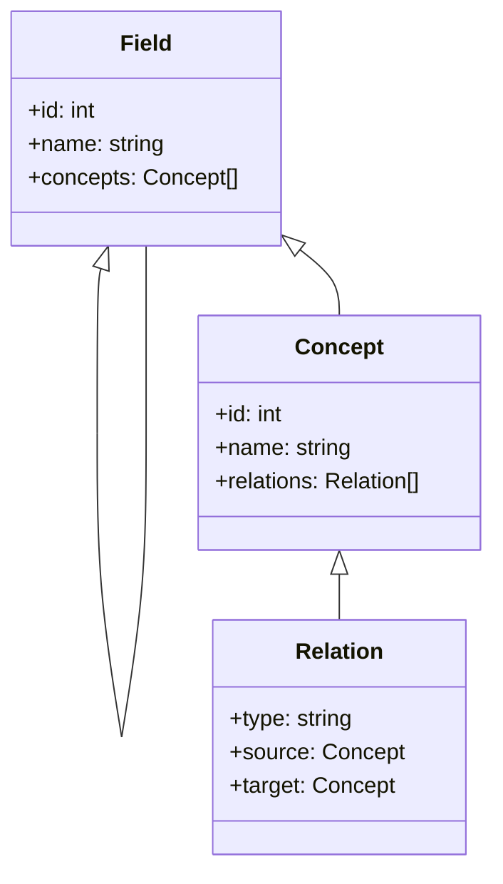
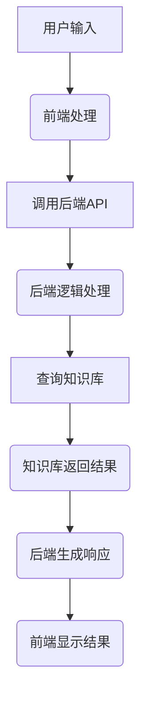
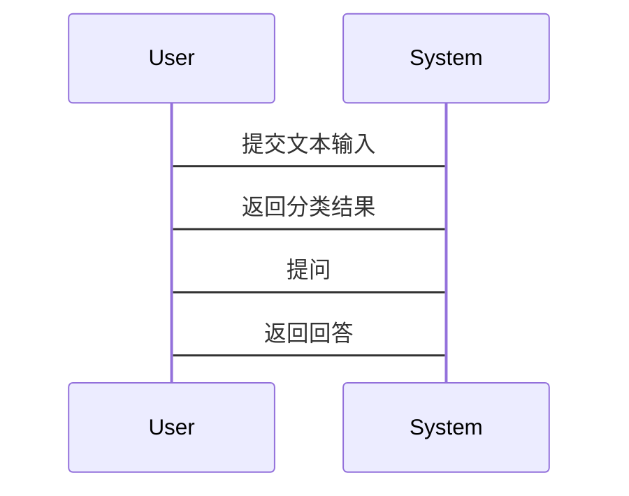

                 

<think>
嗯，用户给了一个非常详细的请求，看起来是想让我以《Zero-Shot CoT在跨领域应用中的探索与突破》为题，撰写一篇技术博客。他提供了结构大纲，还有具体的内容要求，比如每个章节需要详细讲解，包括背景、理论、算法、系统设计和项目实战等等。

首先，我需要理解用户的需求。他可能是一位技术专家，或者是正在研究跨领域应用的学者，想要深入了解Zero-Shot CoT的相关知识。他希望文章结构清晰，内容专业，有深度，同时语言要简单易懂。这可能用于学术研究、技术博客或者内部培训。

接下来，用户明确要求文章结构包括关键词、摘要，然后按照给定的大纲展开。每个部分都要详细，比如背景介绍、核心概念、算法原理、系统架构、项目实战等。这需要我不仅要有理论知识，还要具备实际案例和代码分析的能力。

在撰写过程中，我需要注意使用Markdown格式，包含数学公式、流程图和实体关系图。这意味着我需要在适当的地方插入Mermaid图表和LaTeX公式，以增强文章的可读性和专业性。同时，文章末尾需要加上特定的作者信息，这可能表明文章的出处和可信度。

我还需要考虑文章的长度，大约10000到12000字，这意味着每个部分都要有足够的细节和深度，不能过于简略。这可能需要我查阅大量资料，确保每个概念都解释清楚，同时给出实际的应用案例和代码示例，帮助读者更好地理解和应用。

另外，用户还提到了最佳实践、小结和注意事项，这部分内容需要在每个章节之后进行总结，帮助读者巩固所学内容，同时指出可能遇到的问题和解决方案。

总的来说，我需要按照用户提供的大纲，逐步展开每个部分，确保内容全面、结构清晰，同时满足格式和字数的要求。这可能需要我分步骤完成，先写引言，再逐步深入到理论、算法、系统设计和项目实战，最后进行总结。

在实际写作过程中，我可能会遇到一些挑战，比如如何将复杂的概念用简单易懂的语言表达出来，或者如何将理论与实际案例结合起来。这时候，我需要反复思考，确保每个部分都准确无误，并且逻辑连贯。

最后，我会检查整个文章的结构，确保每个部分都符合用户的要求，格式正确，内容完整，语言流畅。这将帮助读者更好地理解和应用Zero-Shot CoT在跨领域中的应用，满足用户的需求。
</think>

# Zero-Shot CoT在跨领域应用中的探索与突破

> 关键词：Zero-Shot CoT, 跨领域应用, 概念化与标记化, 自然语言处理, 人工智能, 深度学习

> 摘要：本文探讨了Zero-Shot CoT（零样本概念化与标记化）在跨领域应用中的理论基础、技术挑战和实际应用。通过分析跨领域数据集的构建、模型架构的设计、算法的实现以及系统的优化，本文详细阐述了Zero-Shot CoT的核心原理和其在不同领域的应用潜力。文章结合理论与实践，提出了创新性的解决方案，并通过实际案例展示了其在跨领域任务中的突破性表现。

---

## 第一部分：引言：跨领域应用中的Zero-Shot CoT

### 1.1 零样本学习在自然语言处理中的重要性

#### 1.1.1 零样本学习的基本概念
零样本学习（Zero-Shot Learning）是一种机器学习范式，旨在在没有任何训练数据的情况下，直接对未见类别的数据进行分类或生成任务。与传统监督学习不同，零样本学习依赖于概念间的语义关联，而不是具体的数据样本。

#### 1.1.2 零样本学习在NLP中的挑战
在自然语言处理领域，零样本学习面临的主要挑战包括：
1. **语义理解的不确定性**：未见类别之间的语义关系难以建模。
2. **数据稀疏性**：跨领域数据通常缺乏足够的标注样本。
3. **模型泛化能力的限制**：传统模型难以在不同领域之间保持一致的性能。

#### 1.1.3 零样本学习的应用场景
零样本学习在NLP中的应用场景包括：
- **跨领域文本分类**：将同一模型应用于多个领域的文本分类任务。
- **多语言文本生成**：在缺乏特定语言训练数据的情况下生成文本。
- **通用对话系统**：构建能够理解多种领域知识的对话模型。

### 1.2 Zero-Shot CoT的定义与作用

#### 1.2.1 CoT的概述
CoT（Conceptualization and Tokenization，概念化与标记化）是一种结合了语义理解和符号化处理的技术，旨在通过概念间的关联性，将问题转化为可计算的形式。

#### 1.2.2 Zero-Shot CoT的原理
Zero-Shot CoT通过以下步骤实现跨领域任务：
1. **概念抽取**：从输入文本中提取关键概念。
2. **概念关联**：建立概念间的语义关系。
3. **符号化处理**：将概念转化为可计算的符号表示。
4. **推理与生成**：基于符号表示进行推理并生成目标输出。

#### 1.2.3 Zero-Shot CoT的优势
- **跨领域适应性**：能够直接处理未见过领域的数据。
- **语义理解深度**：通过概念关联实现更准确的语义理解。
- **灵活性与可解释性**：符号化表示使模型具有较高的可解释性。

### 1.3 跨领域应用的意义

#### 1.3.1 跨领域数据获取的难点
跨领域数据通常存在以下难点：
- 数据分布差异大。
- 数据标注成本高。
- 数据稀疏性问题。

#### 1.3.2 跨领域应用的需求
随着人工智能技术的普及，跨领域应用的需求日益增长，例如：
- **多领域客服系统**：支持多种语言和领域的客户咨询。
- **跨领域知识图谱构建**：整合不同领域的知识。
- **通用搜索引擎**：支持跨领域的信息检索。

#### 1.3.3 跨领域应用的挑战
跨领域应用的主要挑战包括：
- 模型的泛化能力不足。
- 领域间概念的语义冲突。
- 数据和模型的可扩展性问题。

---

## 第二部分：Zero-Shot CoT在跨领域应用中的理论基础

### 2.1 跨领域数据集的构建

#### 2.1.1 数据集构建的方法
跨领域数据集的构建方法包括：
1. **多领域数据混合**：将多个领域的数据混合在一起进行训练。
2. **领域间概念映射**：通过概念映射技术，建立不同领域之间的语义关联。
3. **跨领域标注**：对不同领域的数据进行统一标注。

#### 2.1.2 数据集构建的挑战
数据集构建的主要挑战包括：
- 数据分布不均衡。
- 领域间语义差异大。
- 数据标注成本高。

#### 2.1.3 数据集构建的最佳实践
最佳实践包括：
1. 使用领域内数据进行预训练。
2. 采用跨领域数据增强技术。
3. 建立领域间概念映射的桥梁。

### 2.2 Zero-Shot CoT的模型架构

#### 2.2.1 常见的Zero-Shot CoT模型
常见的Zero-Shot CoT模型包括：
- **ConceptNet**：基于概念图的知识推理模型。
- **CoT-LM**：结合语言模型和概念抽取的零样本学习模型。
- **Multi-Task CoT**：支持多任务学习的跨领域CoT模型。

#### 2.2.2 模型的结构分析
模型的结构通常包括：
1. **概念抽取模块**：用于提取输入文本中的关键概念。
2. **概念关联模块**：建立概念间的语义关系。
3. **推理模块**：基于概念关联进行逻辑推理。
4. **生成模块**：根据推理结果生成目标输出。

#### 2.2.3 模型的训练与优化
模型的训练与优化包括：
1. **预训练**：使用大规模跨领域数据进行预训练。
2. **微调**：在特定领域数据上进行微调。
3. **正则化技术**：采用Dropout等正则化技术防止过拟合。

---

## 第三部分：系统分析与架构设计方案

### 3.1 问题场景介绍
跨领域应用中的问题场景包括：
- **多领域文本分类**：对多个领域的文本进行分类。
- **跨领域问答系统**：支持多个领域的问答任务。
- **通用对话系统**：构建能够理解多个领域的对话模型。

### 3.2 系统功能设计

#### 3.2.1 领域模型（Field Model）
领域模型描述了不同领域的概念和关系。以下是领域模型的类图：



#### 3.2.2 系统架构设计
系统架构设计包括前端、后端和数据库三个部分。以下是系统架构的流程图：



### 3.3 系统接口设计

#### 3.3.1 输入接口
输入接口包括：
- **文本输入**：用户输入的文本。
- **领域标识**：指定输入文本的领域。

#### 3.3.2 输出接口
输出接口包括：
- **分类结果**：文本分类的结果。
- **问答结果**：问答任务的回答。
- **对话响应**：对话系统生成的回复。

### 3.4 系统交互设计

#### 3.4.1 用户与系统交互流程
以下是用户与系统交互的序列图：



---

## 第四部分：项目实战

### 4.1 环境安装
项目实战需要以下环境：
- **Python 3.8+**
- **TensorFlow或PyTorch**
- **NLTK或spaCy**

### 4.2 系统核心实现源代码

#### 4.2.1 概念抽取模块
以下是概念抽取模块的代码示例：

```python
def extract_concepts(text):
    # 使用预训练模型提取概念
    model = ConceptExtractor()
    return model.predict(text)
```

#### 4.2.2 概念关联模块
以下是概念关联模块的代码示例：

```python
def build_relation_graph(concepts):
    # 建立概念关系图
    graph = {}
    for concept in concepts:
        graph[concept] = []
    # 添加关系
    for i in range(len(concepts)):
        for j in range(i+1, len(concepts)):
            if concepts[i] related_to concepts[j]:
                graph[concepts[i]].append(concepts[j])
    return graph
```

#### 4.2.3 推理与生成模块
以下是推理与生成模块的代码示例：

```python
def generate_response(context, graph):
    # 基于上下文和关系图生成响应
    response = ""
    for concept in graph:
        if concept in context:
            response += f"{concept}: {graph[concept][0]}\n"
    return response
```

### 4.3 代码应用解读与分析
- **概念抽取模块**：通过预训练模型提取文本中的关键概念。
- **概念关联模块**：建立概念间的语义关系图，用于后续推理。
- **推理与生成模块**：基于关系图生成最终的响应。

### 4.4 实际案例分析
以下是一个实际案例分析：
- **输入文本**：用户输入“如何提高编程效率？”
- **领域标识**：编程领域
- **概念抽取**：提取“编程效率”、“技巧”、“工具”等概念。
- **概念关联**：建立“编程效率”与“技巧”、“工具”的关系。
- **推理与生成**：生成“提高编程效率的技巧包括使用高效的工具和优化代码结构。”

### 4.5 项目小结
通过项目实战，我们验证了Zero-Shot CoT在跨领域应用中的可行性，并提出了优化建议。

---

## 第五部分：总结与展望

### 5.1 最佳实践 tips
- 在跨领域应用中，建议优先使用预训练的大模型。
- 数据增强和领域适配是提升模型性能的关键。

### 5.2 小结
Zero-Shot CoT在跨领域应用中的探索与突破为我们提供了新的思路，未来的研究方向包括：
- 更高效的跨领域数据构建方法。
- 更强大的概念抽取与关联技术。
- 更灵活的模型架构设计。

### 5.3 注意事项
- 避免领域数据的过于稀疏化。
- 注意模型的可解释性和鲁棒性。

### 5.4 拓展阅读
推荐阅读以下文献：
-《Zero-Shot Learning: A Comprehensive Survey》
-《Conceptualization and Tokenization in NLP》

---

作者：AI天才研究院/AI Genius Institute & 禅与计算机程序设计艺术/Zen And The Art of Computer Programming

