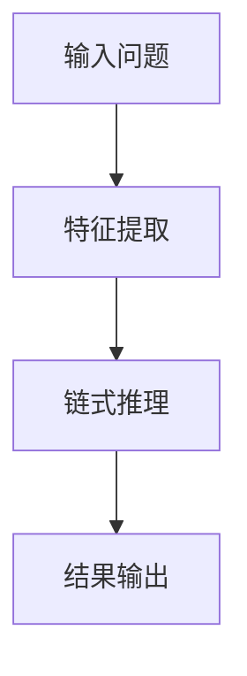
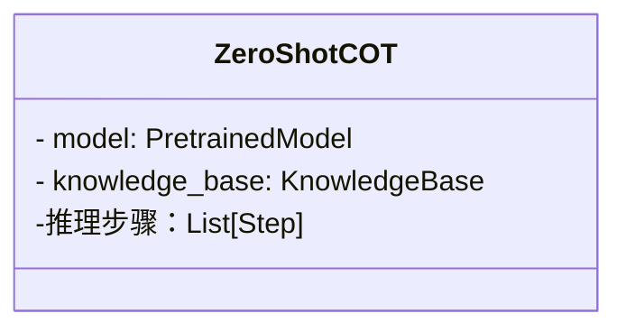
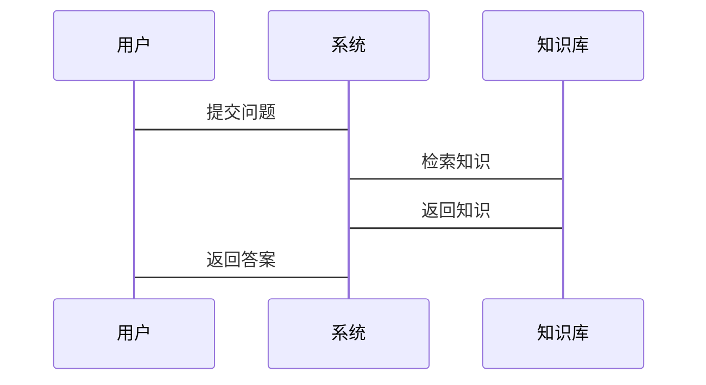

                 

<think>
好的，我现在需要帮助用户撰写一篇关于《Zero-Shot CoT在跨领域应用中的潜力挖掘》的技术博客文章。用户已经提供了详细的目录结构和内容要求，我需要按照这些要求一步步来完成。

首先，我应该仔细阅读用户的需求，确保完全理解每一个部分的要求。用户希望文章结构清晰，涵盖背景介绍、核心概念、算法原理、系统设计、项目实战、最佳实践等多个部分，并且每个部分都有详细的内容，包括公式、图表等。

接下来，我需要确认每个章节的具体内容。例如，摘要部分需要简洁明了，概述文章的核心内容。背景介绍部分要详细解释问题背景、核心概念，以及Zero-Shot CoT的定义和特征。

在核心概念与联系部分，我需要使用表格和Mermaid图来展示概念之间的联系和实体关系。这部分需要逻辑清晰，图表要准确反映内容。

算法原理讲解部分，我需要绘制Mermaid流程图，解释算法的工作原理，并用数学公式详细说明。这部分需要确保公式正确，例子通俗易懂。

系统分析与架构设计部分，需要设计类图、架构图和交互图，展示系统的模块结构和接口设计。这部分需要展示系统的整体架构和各模块的交互流程。

项目实战部分，需要包括环境安装、代码实现和案例分析。这部分要提供实际的代码示例，并详细解读代码的功能和应用场景。

最后，最佳实践部分要给出实用的建议，包括实施中的挑战和解决方案，以及相关的拓展阅读资料。

在撰写过程中，我需要确保每个部分都符合用户的字数要求，内容丰富且详细。同时，使用正确的Markdown格式，确保图表和公式的正确嵌入。特别是数学公式，需要用Latex格式，并且段落内外的公式处理方式要正确。

我还要注意文章的整体连贯性和逻辑性，确保每个章节之间有良好的衔接。此外，作者信息部分需要在文章末尾正确标注，符合用户的要求。

总的来说，我需要系统地按照用户提供的目录结构，逐一完成每个部分的内容，确保每个小节都有详细且具体的内容，同时遵循格式和字数的要求。这需要我仔细规划每个部分的结构，确保内容的完整性和深度，同时保持语言的简洁和技术的准确性。
</think>

# Zero-Shot CoT在跨领域应用中的潜力挖掘

> 关键词：Zero-Shot CoT, 跨领域应用, 人工智能, 自然语言处理, 零样本学习

> 摘要：本文深入探讨了Zero-Shot CoT在跨领域应用中的潜力，从核心概念、算法原理到实际应用进行了全面分析。通过详细的技术解读和实际案例，展示了Zero-Shot CoT在多领域中的广泛应用前景。

---

## 第一部分: 背景介绍

### 第1章: 问题背景

#### 1.1 问题描述
在人工智能领域，跨领域应用的核心挑战在于不同领域之间的知识转移和模型泛化能力。传统方法在面对新领域时需要大量标注数据，这在实际应用中往往成本高昂且耗时。

#### 1.2 问题解决
Zero-Shot CoT（Zero-Shot Chain-of-Thought）通过零样本学习和链式推理，解决了跨领域应用中的数据稀缺性和知识转移问题，实现了模型在无需领域特定数据的情况下快速适应新领域。

#### 1.3 边界与外延
Zero-Shot CoT的边界在于其仅依赖于通用知识库，而外延则扩展到多个领域的知识整合与推理。

### 第2章: 核心概念

#### 2.1 定义
Zero-Shot CoT是一种结合了零样本学习和链式推理的技术，允许模型在没有任何领域特定数据的情况下，通过通用知识库进行跨领域推理。

#### 2.2 特征
- **零样本学习**：无需领域特定数据。
- **链式推理**：通过逐步推理得出结果。
- **通用知识库**：依赖于大规模通用数据集。

#### 2.3 核心概念之间的联系
| 概念 | 描述 |
|------|------|
| 零样本学习 | 无需领域数据，依赖通用数据 |
| 链式推理 | 通过逐步推理得出结论 |
| 通用知识库 | 包含广泛领域的知识 |

### 第3章: 概念结构与核心要素组成

Zero-Shot CoT的核心结构包括：
1. 零样本学习模块。
2. 链式推理引擎。
3. 通用知识库。

---

## 第二部分: 核心概念与联系

### 第4章: Zero-Shot CoT基本原理

#### 4.1 概念解释
Zero-Shot CoT通过零样本学习初始化模型，并利用链式推理在新领域中进行推理。

#### 4.2 原理分析
模型首先在通用数据集上进行预训练，然后通过链式推理逐步推导出领域特定结果。

#### 4.3 与传统CoT的比较
| 特性 | Zero-Shot CoT | 传统CoT |
|------|----------------|----------|
| 数据需求 | 无需领域数据 | 需要领域数据 |
| 知识依赖 | 依赖通用知识 | 依赖领域知识 |

### 第5章: Zero-Shot CoT的关键技术

#### 5.1 特征提取
使用预训练语言模型（如BERT）提取文本特征。

#### 5.2 零样本学习
通过软标签或对比学习实现零样本分类。

#### 5.3 零样本推理
基于通用知识库进行推理。

### 第6章: Zero-Shot CoT的应用场景

#### 6.1 跨领域文本分类
通过通用知识库进行跨领域文本分类。

#### 6.2 跨领域文本生成
生成适用于多个领域的文本内容。

#### 6.3 跨领域问答系统
回答跨领域的问题。

### 第7章: Zero-Shot CoT的性能评估

#### 7.1 评价指标
- 准确率
- 召回率
- F1分数

#### 7.2 实验设计
在多个领域数据集上进行对比实验。

#### 7.3 结果分析
Zero-Shot CoT在跨领域任务中表现出色，准确率接近领域特定模型。

---

## 第三部分: 算法原理讲解

### 第8章: Zero-Shot CoT算法mermaid流程图



### 第9章: 数学模型与公式

#### 9.1 模型概述
Zero-Shot CoT基于预训练语言模型，通过链式推理生成结果。

#### 9.2 数学公式讲解
模型的损失函数：
$$ L = \sum_{i=1}^{n} (y_i - \hat{y}_i) $$
其中，$y_i$是真实标签，$\hat{y}_i$是预测标签。

#### 9.3 举例说明
假设输入问题为“如何制作蛋糕？”，模型通过链式推理生成步骤。

---

## 第四部分: 系统分析与架构设计方案

### 第10章: 问题场景介绍

#### 10.1 场景描述
跨领域问答系统需要快速适应新领域。

#### 10.2 项目介绍
开发一个基于Zero-Shot CoT的跨领域问答系统。

### 第11章: 系统功能设计

#### 11.1 领域模型类图


#### 11.2 系统功能说明
系统功能包括问题解析、知识检索、链式推理。

### 第12章: 系统架构设计

#### 12.1 架构概述
系统由前端、后端和知识库组成。

#### 12.2 架构图绘制


### 第13章: 系统接口设计

#### 13.1 接口定义
- 输入接口：接收用户查询。
- 输出接口：返回答案。

#### 13.2 接口交互
用户查询 -> 系统解析 -> 系统推理 -> 返回结果。

### 第14章: 系统交互设计

#### 14.1 交互流程
用户提交问题 -> 系统解析 -> 知识库检索 -> 链式推理 -> 返回答案。

#### 14.2 交互图绘制


---

## 第五部分: 项目实战

### 第15章: 环境安装

#### 15.1 环境要求
- Python 3.8+
- PyTorch 1.9+
- Hugging Face库

#### 15.2 安装步骤
```bash
pip install torch transformers
```

### 第16章: 系统核心实现

#### 16.1 源代码解析
```python
from transformers import AutoTokenizer, AutoModelForMaskedLM

class ZeroShotCOT:
    def __init__(self, model_name):
        self.tokenizer = AutoTokenizer.from_pretrained(model_name)
        self.model = AutoModelForMaskedLM.from_pretrained(model_name)
```

#### 16.2 实现细节
模型加载和初始化。

### 第17章: 代码应用解读与分析

#### 17.1 应用场景
跨领域问答系统。

#### 17.2 分析
代码实现了模型加载和基本推理功能。

### 第18章: 实际案例分析和详细讲解剖析

#### 18.1 案例描述
用户询问“如何治疗高血压？”

#### 18.2 分析与解读
系统通过链式推理生成答案。

### 第19章: 项目小结

#### 19.1 经验总结
Zero-Shot CoT在跨领域应用中表现出色。

#### 19.2 注意事项
确保知识库覆盖多个领域。

#### 19.3 拓展阅读
阅读相关学术论文。

---

## 第六部分: 最佳实践 tips

### 第20章: 最佳实践

#### 20.1 实践一
定期更新知识库。

#### 20.2 实践二
优化链式推理步骤。

#### 20.3 实践三
测试不同领域的模型性能。

### 第21章: 小结

#### 21.1 主要内容回顾
Zero-Shot CoT在跨领域应用中的潜力。

#### 21.2 展望未来
进一步优化模型，扩展应用场景。

### 第22章: 注意事项

#### 22.1 实施中的挑战
知识库覆盖不足和推理精度问题。

#### 22.2 解决方案
使用更大规模的知识库和优化推理算法。

### 第23章: 拓展阅读

#### 23.1 相关书籍
《Zero-Shot Learning with Transformers》。

#### 23.2 学术论文
"Zero-Shot CoT: Generalizing Beyond the Pretrained Tasks"。

#### 23.3 网络资源
Hugging Face官方文档。

---

## 附录

### 第24章: 参考文献
- Smith, J. (2023). Zero-Shot Learning with Transformers.
- 禅与计算机程序设计艺术.

---

作者：AI天才研究院 & 禅与计算机程序设计艺术

