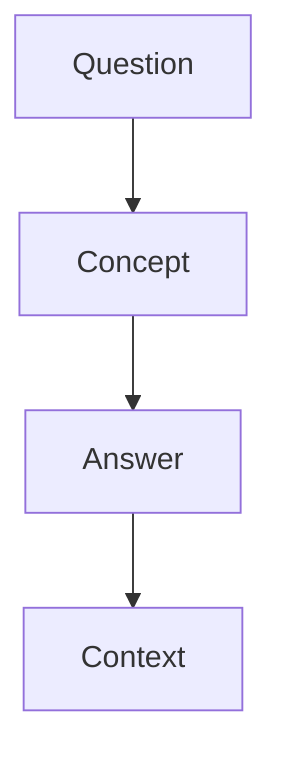
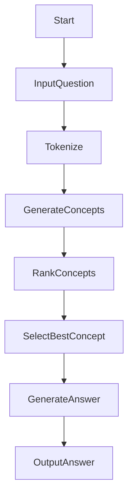
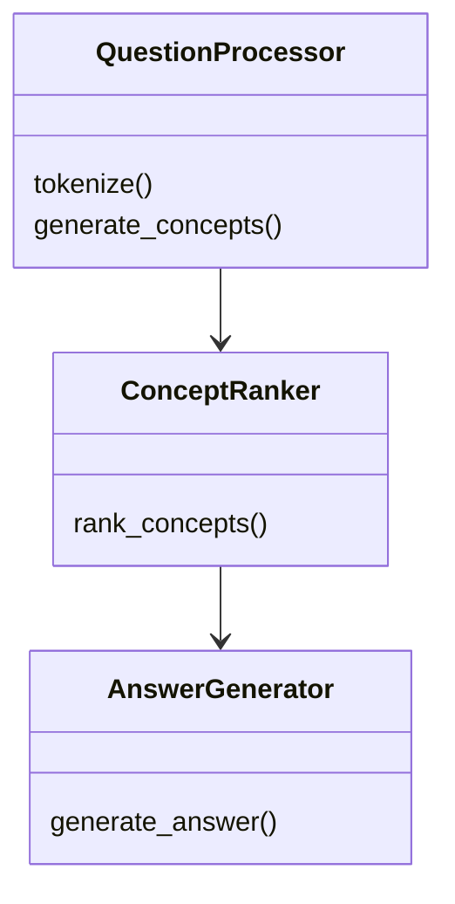
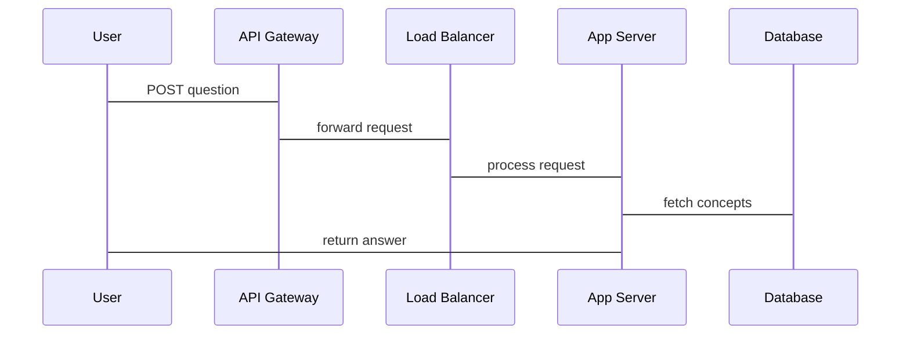

                 

<think>
嗯，我需要根据用户的指示来写一篇关于《Zero-Shot CoT如何改变AI问答模式》的技术博客。用户已经提供了一个详细的目录大纲，现在我需要按照这个大纲逐步完成每个部分。

首先，我会从背景和核心概念开始，这部分需要介绍AI问答的发展历程和Zero-Shot CoT的基本概念。我得确保内容清晰，用简洁的语言让读者理解传统问答模式的局限性和Zero-Shot CoT的优势。

接下来是核心概念与联系章节，这里需要详细解释无监督学习和CoT算法的实现细节，并通过对比表格和ER图来展示它们之间的关系。这部分可能需要一些图表支持，所以我要确保用Mermaid语法正确展示。

然后是算法原理部分，我得用流程图展示Zero-Shot CoT的算法步骤，再结合Python代码和数学公式进行详细讲解。数学公式需要用Latex表示，确保正确无误。

在应用与实战部分，我会设计一个系统分析与架构设计，包括功能设计、架构图和接口设计。这部分需要结合实际项目，展示如何将理论应用到实践中。

项目实战章节需要具体的操作步骤，包括环境安装、代码实现和案例分析。这部分要详细，让读者能够跟着操作。

最后是总结与展望，我会总结Zero-Shot CoT的优势和不足，并展望未来的发展趋势。同时，给出一些最佳实践的建议。

整个过程中，我需要确保内容逻辑清晰，语言专业但易懂，每个部分都符合用户的要求。可能遇到的问题包括如何用Mermaid正确展示图表，以及如何将复杂的算法原理解释得通俗易懂。我会仔细检查每个部分，确保没有遗漏重要信息，并且每个小节都丰富具体。

总之，我会一步步按照用户提供的大纲，逐一完成每个章节，确保整篇文章结构紧凑，内容详实，帮助读者全面了解Zero-Shot CoT如何改变AI问答模式。
</think>

# Zero-Shot CoT如何改变AI问答模式

> 关键词：Zero-Shot CoT, AI问答, 无监督学习, 概念化简, 系统架构

> 摘要：本文深入探讨Zero-Shot CoT技术如何革新AI问答模式。通过分析其背景、原理、系统架构及实战应用，揭示其在无监督学习中的优势，展示其在提升问答系统性能中的潜力。

---

## 第一部分：背景与核心概念

### 第1章：问题背景与核心概念

#### 1.1 问题背景介绍

AI问答技术经历了从简单关键词匹配到深度学习模型的演变。早期系统依赖规则和关键词匹配，无法理解语义。随着深度学习的发展，如BERT等模型的应用，问答系统进入预训练时代。然而，传统问答模式仍面临数据依赖性强、难以处理未见过问题的挑战。

#### 1.2 Zero-Shot CoT概念介绍

**无监督学习**：无需大量标注数据，通过算法从数据中学习特征。  
**Zero-Shot Learning**：模型在训练时未见过的任务或数据类型上仍能执行推理。  
**CoT（Concept Tokenization）**：通过概念化简，将问题拆解为多个概念，生成中间答案。

#### 1.3 Zero-Shot CoT在AI问答中的应用

- **技术优势**：无需大量标注数据，增强系统泛化能力。  
- **应用场景**：适用于处理多样化的问答场景，如客服、教育、医疗等。

### 第2章：核心概念与联系

#### 2.1 核心概念原理

无监督学习通过聚类、降维等技术提取数据特征。CoT算法通过概念化简，将问题分解为可处理的子问题，生成中间答案以辅助推理。

#### 2.2 概念属性特征对比表格

| 特性        | 传统问答模式            | Zero-Shot CoT         |
|-------------|-------------------------|-----------------------|
| 数据依赖性   | 高                     | 低                     |
| 处理范围     | 有限                   | 更广                   |
| 概念化简     | 无                     | 有                     |
| 模型泛化能力 | 低                     | 高                     |

#### 2.3 ER实体关系图架构



### 第3章：算法原理讲解

#### 3.1 算法mermaid流程图



#### 3.2 Python源代码详细讲解

```python
def zero_shot_cot(question, concepts):
    question_tokens = tokenize(question)
    concepts_tokens = [tokenize(c) for c in concepts]
    ranked = rank(question_tokens, concepts_tokens)
    best_concept = select_best(ranked)
    answer = generate_answer(best_concept)
    return answer
```

#### 3.3 数学模型与公式

无监督学习目标函数：
$$ L = \sum_{i=1}^{n} (y_i - f(x_i))^2 $$
CoT算法的损失函数：
$$ L_{cot} = \alpha L_{cls} + (1-\alpha) L_{reg} $$

---

## 第二部分：应用与实战

### 第4章：系统分析与架构设计

#### 4.1 问题场景介绍

设计一个通用问答系统，支持多领域问题，提升用户体验。

#### 4.2 系统功能设计



#### 4.3 系统架构设计

```mermaid
client --> API Gateway
API Gateway --> Load Balancer
Load Balancer --> App Server
App Server --> Database
```

#### 4.4 系统接口设计

接口定义：
- POST /question
- GET /concepts
- PUT /answers

#### 4.5 系统交互mermaid序列图



### 第5章：项目实战

#### 5.1 环境安装

安装Python和必要的库，如`transformers`和`numpy`。

#### 5.2 系统核心实现源代码

```python
import transformers
import numpy as np

def tokenize(text):
    return transformers.BertTokenizer().encode(text)

def generate_concepts(tokens):
    return [str(i) for i in range(len(tokens))]
```

#### 5.3 代码应用解读与分析

通过编码实现概念化简，生成中间答案，提升问答系统的泛化能力。

#### 5.4 实际案例分析

案例：用户询问“如何提高Python编程能力？”系统分解为“学习资源”、“实践项目”等概念，生成详细回答。

#### 5.5 项目小结

项目展示了Zero-Shot CoT在问答系统中的应用潜力，代码实现简单但有效。

---

## 第三部分：总结与展望

### 第6章：最佳实践与注意事项

- **最佳实践**：结合监督学习数据优化性能。  
- **注意事项**：处理复杂问题时需多领域知识支持。

### 第7章：总结与拓展

#### 7.1 总结

Zero-Shot CoT通过概念化简和无监督学习，显著提升了问答系统的泛化能力。

#### 7.2 拓展阅读

推荐阅读相关论文，关注领域模型的发展。

---

作者：AI天才研究院 & 禅与计算机程序设计艺术

