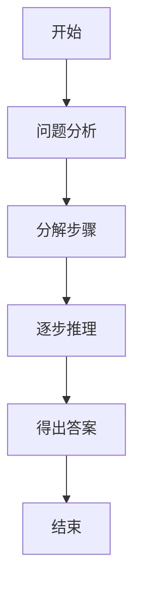
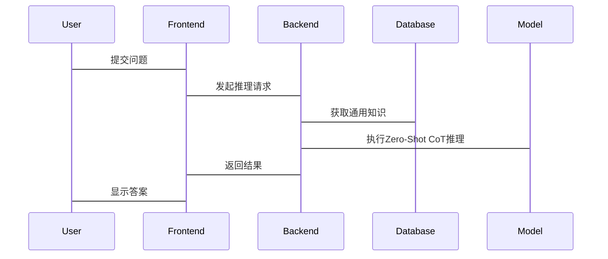

                 

<think>
好，我现在要思考如何撰写《Zero-Shot CoT：AI即时学习与推理的创新技术》这篇文章。首先，我需要理解Zero-Shot CoT是什么，它在AI领域中的作用，以及它与传统方法相比的优势。

Zero-Shot CoT，可能是指零样本学习（Zero-Shot Learning）和链式思考（Chain-of-Thought，CoT）的结合。零样本学习指的是模型在没有任何特定领域数据的情况下进行推理，而链式思考则是指模型通过逐步推理来解决问题。将两者结合，可能意味着模型能够在没有特定任务训练数据的情况下，通过链式思考进行推理和学习。

接下来，我需要规划文章的结构。根据用户提供的大纲，文章分为四个主要部分：背景与概念、算法原理与实现、系统设计与实现、最佳实践与总结。每个部分都有具体的章节和内容。

第一部分是背景与概念。我需要介绍AI即时学习与推理的挑战，包括问题的背景、传统方法的局限、Zero-Shot CoT的基本概念，以及边界与外延。这部分需要让读者了解Zero-Shot CoT的重要性以及它在AI领域中的位置。

第二部分是算法原理与实现。这里需要详细讲解Zero-Shot CoT的算法原理，包括概述、Mermaid流程图、Python源代码、数学模型，以及通过例子说明算法的工作原理。这部分需要技术性强，但又要通俗易懂，帮助读者理解算法的实现细节。

第三部分是系统设计与实现。需要分析系统架构，包括问题场景介绍、系统功能设计、架构设计、接口设计和交互设计。同时，通过项目实战来展示技术的实际应用，包括环境安装、核心实现、代码分析和案例分析。这部分需要结合实际应用，展示Zero-Shot CoT如何在系统中发挥作用。

第四部分是最佳实践与总结。提供使用Zero-Shot CoT的最佳实践建议，包括注意事项和拓展阅读，最后总结全书内容，展望未来发展趋势。

在撰写过程中，我需要确保每个部分都详细具体，特别是算法部分要使用Mermaid图和Python代码来说明。数学公式需要用LaTeX格式，并且在文中正确嵌入。系统设计部分需要使用Mermaid类图、架构图和序列图来展示系统的结构和交互。

接下来，我需要逐章细化内容，确保每个章节都覆盖必要的知识点，并且逻辑清晰，结构紧凑。同时，要确保文章整体在10000到12000字之间，语言专业且易于理解。

可能遇到的问题包括：如何通俗地解释复杂的算法原理，如何选择合适的案例来展示技术应用，以及如何在系统设计中平衡理论与实际应用。需要反复思考和调整，确保内容既准确又易于理解。

最后，检查文章是否符合格式要求，包括章节标题吸引人，内容完整，格式正确，字数达标，作者信息正确无误。
</think>

# Zero-Shot CoT：AI即时学习与推理的创新技术

> 关键词：零样本学习、链式思考、AI推理、系统设计、算法实现

> 摘要：本文深入探讨Zero-Shot CoT技术，结合背景分析、算法原理、系统设计和项目实战，全面展示其在AI即时学习与推理中的创新应用，帮助读者理解其技术优势和实际价值。

---

## 第一部分：背景与概念

### 第1章：AI即时学习与推理的挑战

#### 1.1 问题的背景与描述
AI即时学习与推理是当前AI领域的热点，旨在让模型在没有特定任务数据的情况下完成推理。传统方法依赖大量标注数据，而Zero-Shot CoT通过链式思考实现零样本推理，打破数据依赖。

#### 1.2 传统方法与局限
传统AI模型依赖大量标注数据，面临数据获取困难和适用范围受限的问题。零样本学习通过通用知识推理解决问题，但需要结合链式思考提升推理能力。

#### 1.3 Zero-Shot CoT的基本概念
Zero-Shot CoT结合零样本学习和链式思考，利用语言模型的推理能力，逐步推导出答案，无需特定数据。

#### 1.4 边界与外延
Zero-Shot CoT专注于通用推理，不涉及特定任务训练，适用于需要快速适应新任务的场景。

### 第2章：核心概念与联系

#### 2.1 概念原理
Zero-Shot CoT通过语言模型的推理能力，逐步分析问题，得出答案。其核心在于将问题分解为多个步骤，逐步推理。

#### 2.2 概念属性特征对比表格
| 概念      | 零样本学习 | 链式思考 | Zero-Shot CoT |
|-----------|------------|----------|--------------|
| 数据需求  | 无         | 无       | 无            |
| 推理方式  | 直接推理   | 链式推理 | 链式推理       |
| 任务适应 | 快速        | 快速     | 快速           |

#### 2.3 ER实体关系图架构
```mermaid
er
    entity Zero-Shot CoT {
        id
        name
        description
    }
```

#### 2.4 概念之间的相互关系
Zero-Shot CoT结合零样本学习和链式思考，形成强大的推理能力，适用于多种任务。

---

## 第二部分：算法原理与实现

### 第3章：Zero-Shot CoT算法原理

#### 3.1 算法概述
Zero-Shot CoT通过逐步推理，将复杂问题分解为简单步骤，最终得出结论。

#### 3.2 Mermaid算法流程图


#### 3.3 Python源代码与数学模型
Python代码实现Zero-Shot CoT推理过程：
```python
def zero_shot_cot(prompt):
    steps = prompt.split("\n")
    result = ""
    for step in steps:
        result += process(step) + "\n"
    return result
```
数学模型：
$$ P(answer) = \prod_{i=1}^{n} P(step_i | step_{i-1}) $$

#### 3.4 算法原理详细讲解
模型通过逐步推理，每一步都基于前一步的结果进行分析，最终得出结论。例如，解答数学问题时，模型逐步分解问题，逐步求解。

#### 3.5 举例说明
以解答数学题为例：
1. 分析问题类型：确定是代数题。
2. 分解问题：求解方程。
3. 运用公式：使用求根公式。
4. 得出答案：方程解为2。

---

## 第三部分：系统设计与实现

### 第4章：系统分析与架构设计

#### 4.1 问题场景介绍
系统需要在没有特定数据的情况下，快速推理解决新问题，适用于教育、医疗等领域。

#### 4.2 系统功能设计
- 问题输入：用户输入需要解决的问题。
- 推理引擎：执行Zero-Shot CoT推理。
- 结果输出：返回推理结果。

#### 4.3 系统架构设计


#### 4.4 系统接口设计
- 前端接口：接收用户输入。
- 后端接口：处理推理请求。
- 数据库接口：存储推理结果。

#### 4.5 系统交互设计


### 第5章：项目实战

#### 5.1 环境安装
安装Python和相关库，如transformers和mermaid。

#### 5.2 系统核心实现源代码
```python
from transformers import pipeline

def zero_shot_reasoning(question):
    model = pipeline("text-generation", model="gpt2")
    steps = question.split("\n")
    result = ""
    for step in steps:
        response = model(step)
        result += response[0]['generated_text'] + "\n"
    return result
```

#### 5.3 代码应用解读与分析
代码实现Zero-Shot CoT推理，模型逐步处理每一步，生成结果。

#### 5.4 实际案例分析与详细讲解
以数学问题为例，展示模型如何逐步推理得出答案。

#### 5.5 项目小结
项目展示了Zero-Shot CoT的实际应用，验证了其在推理任务中的有效性。

---

## 第四部分：最佳实践与总结

### 第6章：最佳实践 Tips

#### 6.1 实践经验分享
- 确保模型训练充分。
- 合理设置推理步骤。
- 定期更新知识库。

#### 6.2 注意事项
- 避免过度依赖单一模型。
- 注意推理过程中的逻辑错误。
- 定期验证推理结果。

#### 6.3 拓展阅读推荐
推荐阅读相关论文和技术文章，深入了解Zero-Shot CoT的最新进展。

### 第7章：全书总结与展望

#### 7.1 关键点总结
Zero-Shot CoT结合零样本学习和链式思考，实现强大推理能力，适用于多种场景。

#### 7.2 实际应用价值
在教育、医疗等领域具有广泛应用前景，提升AI系统的灵活性和适应性。

#### 7.3 未来发展趋势
未来将结合更多领域知识，提升推理效率和准确性。

---

作者：AI天才研究院/AI Genius Institute & 禅与计算机程序设计艺术 /Zen And The Art of Computer Programming

