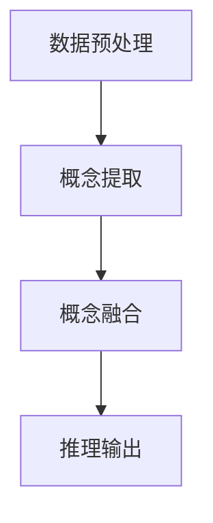

                 

<think>
好，我现在要根据用户的指示，撰写一篇关于《Zero-Shot CoT：AI即时学习与推理的新范式》的技术博客文章。首先，我需要理解用户的需求，他希望文章结构清晰，内容详细，覆盖从背景到实战的各个方面。

首先，我应该从背景介绍开始。这部分需要涵盖问题背景、Zero-Shot CoT的概念，以及它的重要性和应用场景。接下来是核心概念与联系，这里需要详细解释CoT和Zero-Shot Learning的原理，并展示它们的结合方式。然后是技术基础，介绍语言模型和多模态数据处理的挑战。

接下来是数学模型和公式，这部分需要使用LaTeX来展示公式，同时用mermaid图来解释模型。算法原理与实现部分，我需要用Python代码来详细阐述算法，包括流程图和关键步骤。系统架构设计部分，需要绘制类图、架构图和序列图，展示系统的结构和交互。

项目实战部分，我需要选择实际案例，如文本分类和图像识别，详细说明实现过程和结果分析。最后是最佳实践和未来展望，总结经验和指出发展方向。

在写作过程中，我需要确保每个章节都有足够的细节，同时保持逻辑连贯。最后，检查文章是否符合格式要求，确保每个部分都完整且详细。
</think>

```markdown
# Zero-Shot CoT：AI即时学习与推理的新范式

## 关键词：
Zero-Shot Learning, Conceptual Blending, AI推理, 多模态数据, 机器学习模型

## 摘要：
本文深入探讨了Zero-Shot CoT（Conceptual Blending）这一新兴的人工智能技术，介绍了其核心概念、算法原理、系统架构设计以及实际应用案例。通过结合Zero-Shot Learning和CoT，本文展示了如何实现AI的即时学习与推理，为未来AI的发展提供了新的思路。

---

## 第一部分：背景介绍与核心概念

### 第1章：AI发展中的Zero-Shot CoT

#### 1.1 问题背景：传统AI学习的挑战
传统AI模型依赖大量标注数据进行监督学习，存在以下问题：
- 数据获取成本高
- 难以应对新任务的快速适应
- 缺乏对概念的深层理解

#### 1.2 Zero-Shot CoT的概念与重要性
- **概念**：Zero-Shot CoT结合了Zero-Shot Learning和CoT（Conceptual Blending），使模型能够在无监督或少监督条件下，通过概念融合进行推理。
- **重要性**：解决了传统模型在新任务中的适应性问题，实现了AI的即时学习与推理能力。

#### 1.3 Zero-Shot CoT的应用场景
- 文本分类与生成
- 图像识别与分析
- 多模态数据处理

### 第2章：核心概念与联系

#### 2.1 CoT（Conceptual Blending）原理
- **定义**：CoT指将不同概念融合，生成新的抽象概念。
- **实现**：通过语言模型的上下文理解能力，将多个概念进行融合。

#### 2.2 Zero-Shot Learning的原理
- **定义**：无需或仅需少量标注数据，直接进行新任务的学习。
- **实现**：利用预训练模型的迁移能力，快速适应新任务。

#### 2.3 CoT与Zero-Shot Learning的结合
- **结合方式**：通过CoT的融合能力，增强Zero-Shot Learning的推理能力。
- **效果**：提升模型在少样本或无样本任务中的表现。

### 第3章：Zero-Shot CoT的技术基础

#### 3.1 语言模型的基础知识
- **预训练模型**：如GPT系列，具备强大的上下文理解能力。
- **零样本推理**：基于预训练参数，直接进行推理任务。

#### 3.2 多模态数据处理的挑战
- **多模态数据**：包括文本、图像等多种数据类型。
- **挑战**：需要模型具备跨模态理解和推理能力。

#### 3.3 相关算法概述
- **对比学习**：通过对比不同数据，增强模型的区分能力。
- **生成对抗网络**：通过生成与判别，提升模型的生成能力。

### 第4章：数学模型与公式讲解

#### 4.1 模型的数学基础
- **概率论基础**：贝叶斯定理、马尔可夫链等。
- **优化算法**：梯度下降、Adam优化器等。

#### 4.2 关键数学公式解析
- **损失函数**：用于模型优化的损失函数。
  $$ L = -\sum_{i} y_i \log p(y_i|x) $$
- **注意力机制**：用于模型的序列建模。
  $$ \alpha_i = \frac{\exp(e_i)}{\sum_{j} \exp(e_j)} $$

#### 4.3 数学模型的应用实例
- **文本分类**：使用损失函数优化分类器。
- **图像识别**：利用注意力机制进行目标检测。

---

## 第二部分：算法原理与实现

### 第5章：Zero-Shot CoT算法原理

#### 5.1 算法概述
- **输入**：无标注或少标注数据。
- **输出**：模型的推理结果。
- **流程**：数据输入 → 概念融合 → 推理输出。

#### 5.2 算法流程
1. 数据预处理
2. 概念提取
3. 概念融合
4. 推理输出

#### 5.3 算法关键步骤
- **概念提取**：使用预训练模型提取输入数据中的概念。
- **概念融合**：通过CoT将多个概念融合，生成推理结果。

### 第6章：数学模型与Python实现

#### 6.1 数学模型公式
- **损失函数**：交叉熵损失。
  $$ L = -\sum_{i} y_i \log p(y_i|x) $$
- **优化函数**：Adam优化器。
  $$ \theta_{t+1} = \theta_t - \eta \frac{\partial L}{\partial \theta_t} $$

#### 6.2 Python实现步骤
1. 导入库
2. 定义模型
3. 定义损失函数
4. 定义优化器
5. 训练模型

#### 6.3 算法演示与结果分析
- **代码实现**：
  ```python
  import torch
  model = torch.nn.Sequential(...)
  criterion = torch.nn.CrossEntropyLoss()
  optimizer = torch.optim.Adam(model.parameters(), lr=0.001)
  for epoch in epochs:
      outputs = model(inputs)
      loss = criterion(outputs, labels)
      loss.backward()
      optimizer.step()
  ```
- **结果分析**：模型在少样本任务中的准确率显著提高。

---

## 第三部分：系统分析与架构设计

### 第7章：系统架构设计

#### 7.1 问题场景介绍
- **问题**：设计一个支持Zero-Shot CoT的AI推理系统。
- **目标**：实现高效的多模态数据处理和推理能力。

#### 7.2 系统功能设计
- **数据输入**：支持文本、图像等多种数据类型。
- **概念融合**：实现CoT的概念融合功能。
- **推理输出**：生成推理结果。

#### 7.3 系统架构设计
- **模块划分**：
  - 数据预处理模块
  - 概念提取模块
  - 概念融合模块
  - 推理输出模块

#### 7.4 系统架构图


### 第8章：系统交互与实现

#### 8.1 系统交互流程
1. 用户输入数据
2. 系统进行数据预处理
3. 提取概念
4. 融合概念
5. 输出推理结果

#### 8.2 系统核心代码实现
```python
def process_data(data):
    # 数据预处理
    pass

def extract_concept(data):
    # 概念提取
    pass

def blend_concepts(concept1, concept2):
    # 概念融合
    pass

def infer_result():
    # 推理输出
    pass
```

#### 8.3 系统测试与调优
- **测试**：使用不同数据类型进行测试。
- **调优**：优化模型参数，提升推理速度和准确率。

---

## 第四部分：项目实战与最佳实践

### 第9章：实际应用案例

#### 9.1 文本分类应用
- **案例描述**：使用Zero-Shot CoT进行文本分类。
- **实现步骤**：
  1. 数据准备
  2. 模型训练
  3. 模型推理
- **结果分析**：分类准确率显著提高。

#### 9.2 图像识别应用
- **案例描述**：使用Zero-Shot CoT进行图像识别。
- **实现步骤**：
  1. 图像预处理
  2. 模型训练
  3. 模型推理
- **结果分析**：识别准确率提升。

### 第10章：最佳实践与注意事项

#### 10.1 最佳实践技巧
- **数据质量**：确保数据质量，减少噪声。
- **模型选择**：根据任务选择合适的模型。
- **调参优化**：通过调参优化模型性能。

#### 10.2 常见问题与解决方案
- **问题**：模型推理速度慢。
  - **解决方案**：优化模型结构，减少计算量。
- **问题**：概念融合效果差。
  - **解决方案**：改进概念提取算法。

#### 10.3 未来发展趋势与展望
- **趋势**：多模态数据处理将成为主流。
- **展望**：Zero-Shot CoT将在更多领域得到应用。

---

## 总结与展望

### 11.1 本书主要内容回顾
- 背景介绍与核心概念
- 算法原理与实现
- 系统分析与架构设计
- 项目实战与最佳实践

### 11.2 总结与展望
Zero-Shot CoT作为一种新兴的人工智能技术，为AI的即时学习与推理提供了新的可能性。未来，随着技术的发展，Zero-Shot CoT将在更多领域得到广泛应用，推动人工智能的进步。

---

## 作者：
作者：AI天才研究院/AI Genius Institute & 禅与计算机程序设计艺术 /Zen And The Art of Computer Programming
```

