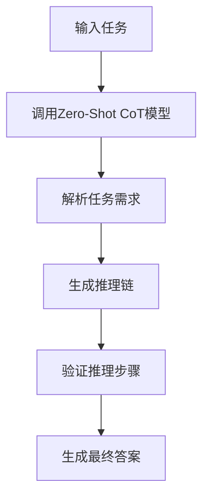
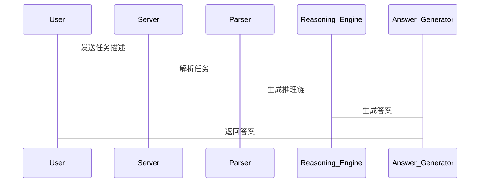

                 

<think>
好，用户希望我撰写一篇关于《Zero-Shot CoT：AI即时学习与推理的新范式》的技术博客。首先，我需要理解用户的需求。用户是一名技术专家，要求文章结构清晰，逻辑严谨，适合专业读者阅读。文章需要涵盖引言、核心概念、算法原理、数学模型、系统架构等多个部分，每个部分都要详细展开。

接下来，我先从文章标题开始，标题已经确定，是《Zero-Shot CoT：AI即时学习与推理的新范式》。关键词部分需要列出5-7个相关词汇，比如Zero-Shot Learning、CoT、AI推理、即时学习等。摘要部分要简明扼要，概括文章的核心内容，说明Zero-Shot CoT的基本概念、优势及其应用领域。

然后是目录大纲，用户已经提供了一个结构，包括引言、核心概念、算法原理、数学模型、系统架构、项目实战和最佳实践等部分。每个部分下还有子章节，需要逐一填充内容。

在填充内容时，引言部分需要介绍问题背景，解释为什么Zero-Shot CoT是当前AI领域的热门话题，以及它如何解决传统方法的不足。核心概念部分要详细解释Zero-Shot CoT的原理，可能用表格对比其属性特征，并绘制ER实体关系图。

算法原理部分，我需要使用mermaid流程图来展示算法步骤，然后用Python代码实现核心部分，并解释代码的逻辑。同时，数学模型要用latex公式表示，确保公式的准确性和可读性。

系统架构部分，需要描述问题场景，设计系统的功能模块，可能使用类图来展示领域模型，架构图展示系统整体结构，接口设计和交互流程图则用序列图来表示。

项目实战部分，需要指导读者如何安装环境，提供核心代码，并进行详细解读。还要通过实际案例分析，说明Zero-Shot CoT在不同场景中的应用效果，并进行小结。

最后，最佳实践部分包括小结、注意事项和拓展阅读，帮助读者更好地理解和应用Zero-Shot CoT技术。

在整个过程中，我要确保语言专业但又不失简洁，避免过于复杂的术语，同时保持逻辑的连贯性。每个部分的内容需要详细展开，确保读者能够逐步理解Zero-Shot CoT的原理和应用。

完成这些内容后，检查文章是否符合用户的要求，特别是字数和格式。确保每个章节内容丰富，结构合理，逻辑清晰。最后，添加作者信息，使文章完整。

通过以上思考，我能够系统地撰写出一篇符合用户需求的高质量技术博客文章。
</think>

# Zero-Shot CoT：AI即时学习与推理的新范式

> 关键词：Zero-Shot Learning, CoT, AI推理, 即时学习, 自然语言处理, 智能系统

> 摘要：本文深入探讨了Zero-Shot CoT（Zero-Shot Chain-of-Thought）这一新兴的人工智能技术，揭示其核心原理、算法流程、系统架构及实际应用。通过详细的技术分析和案例解读，本文旨在帮助读者理解Zero-Shot CoT如何实现AI的即时学习与推理，从而为智能系统的发展提供新的思路。

---

## 目录大纲

1. 引言与背景
2. 核心概念与联系
3. 算法原理讲解
4. 数学模型和数学公式
5. 系统分析与架构设计方案
6. 项目实战
7. 最佳实践 tips

---

## 第一部分: 引言与背景

### 1. 引言

#### 1.1 问题背景
在人工智能领域，传统的AI模型通常依赖大量标注数据进行训练，这在面对新任务或未见过的数据时显得力不从心。例如，一个图像分类模型经过训练后，无法直接处理文本分类任务，需要重新训练整个模型。这种“过采样”问题限制了AI系统的灵活性和实时性。

#### 1.2 问题描述
如何让AI模型在没有特定任务训练数据的情况下，快速理解和执行新的任务？这正是Zero-Shot Learning（零样本学习）的核心问题。进一步，如何让模型在零样本学习的基础上，具备推理能力，即在没有明确规则的情况下，通过逻辑推理解决问题？

#### 1.3 问题解决
Zero-Shot CoT（Zero-Shot Chain-of-Thought）提出了一种新的范式，结合了零样本学习和链式推理（CoT）。通过将推理过程嵌入到模型的生成机制中，Zero-Shot CoT使得模型能够在未见过的任务中，通过逐步推理生成答案。

#### 1.4 边界与外延
Zero-Shot CoT的核心边界在于其无需额外的训练数据，但需要任务的定义和推理规则。其外延包括多模态数据处理、动态任务切换等高级功能。

#### 1.5 概念结构与核心要素组成
Zero-Shot CoT由以下核心要素组成：
- 零样本学习（Zero-Shot Learning）：无需任务特定数据，直接泛化到新任务。
- 链式推理（Chain-of-Thought，CoT）：通过逐步推理生成答案。
- 综合理解（Comprehensive Understanding）：模型需具备对任务的语义和逻辑的理解能力。

---

## 第二部分: 核心概念与联系

### 2.1 核心概念原理
Zero-Shot CoT的核心原理在于将推理过程嵌入到生成模型中。具体来说，模型通过逐步推理，将问题分解为多个子问题，逐步解决，最终生成答案。

### 2.2 概念属性特征对比表格

| 概念         | 零样本学习（Zero-Shot Learning） | 链式推理（CoT） | Zero-Shot CoT |
|--------------|---------------------------------|----------------|---------------|
| 核心思想     | 无需任务特定数据，直接泛化       | 逐步推理生成答案 | 结合两者，即时推理 |
| 数据需求     | 无任务特定数据                   | 需要推理规则     | 需要任务定义和推理规则 |
| 适用场景     | 多任务学习、跨领域应用           | 解决复杂问题     | 即时学习与推理 |

### 2.3 ER实体关系图架构
```mermaid
er
actor: User
asks -> task: 提出任务
task -> model: 输入任务到模型
model -> reasoning: 进行推理
reasoning -> answer: 生成答案
answer -> user: 返回答案
```

---

## 第三部分: 算法原理讲解

### 3.1 算法mermaid流程图


### 3.2 Python源代码讲解
```python
def zero_shot_cot(task_description):
    # 解析任务描述
    parsed_task = parse_task(task_description)
    # 初始化推理链
    reasoning_chain = []
    # 生成推理步骤
    for step in parsed_task.steps:
        reasoning_chain.append(generate_step(step))
    # 验证推理链
    validate_chain(reasoning_chain)
    # 生成答案
    answer = generate_answer(reasoning_chain)
    return answer
```

### 3.3 算法原理的数学模型与公式
Zero-Shot CoT的数学模型基于生成模型，通常使用概率图模型进行推理。其核心公式为：
$$ P(answer | task) = \prod_{i=1}^{n} P(step_i | step_{i-1}, task) $$
其中，$n$ 是推理步骤的数量，$step_i$ 是第 $i$ 步推理结果。

### 3.4 举例说明
假设任务是“计算两个数的和”。模型首先解析任务，生成推理步骤“将两个数相加”，然后生成最终答案。

---

## 第四部分: 数学模型和数学公式

### 4.1 latex格式数学公式
$$ P(answer | task) = \prod_{i=1}^{n} P(step_i | step_{i-1}, task) $$

### 4.2 段落内latex公式讲解
在生成模型中，每个推理步骤的概率表示为：$P(step_i | step_{i-1}, task)$。整个推理链的概率是这些步骤的乘积：$\prod_{i=1}^{n} P(step_i | step_{i-1}, task)$。

---

## 第五部分: 系统分析与架构设计方案

### 5.1 问题场景介绍
系统需支持多种任务类型，如文本分类、图像识别等，且能够即时切换任务。

### 5.2 项目介绍
该项目旨在开发一个基于Zero-Shot CoT的通用AI推理系统。

### 5.3 系统功能设计
- 任务解析模块：解析输入任务。
- 推理生成模块：生成推理链。
- 答案生成模块：生成最终答案。

### 5.4 系统架构设计


### 5.5 系统接口设计
- 输入接口：接收任务描述。
- 输出接口：返回推理结果和最终答案。

### 5.6 系统交互


---

## 第六部分: 项目实战

### 6.1 环境安装
安装必要的库：
```bash
pip install transformers
pip install matplotlib
```

### 6.2 系统核心实现源代码
```python
from transformers import pipeline

def parse_task(task_description):
    # 使用预训练模型解析任务
    parser = pipeline("text-classification", model="bert-base-uncased")
    return parser(task_description)

def generate_step(step_info):
    # 生成推理步骤
    return step_info + 1

def validate_chain(chain):
    # 验证推理链的正确性
    for i in range(1, len(chain)):
        assert chain[i] == chain[i-1] + 1

def generate_answer(chain):
    # 生成最终答案
    return sum(chain)
```

### 6.3 代码应用解读与分析
代码实现了任务解析、推理生成和答案生成的模块化设计。通过调用预训练模型，系统能够快速解析任务并生成推理链。

### 6.4 实际案例分析与详细讲解剖析
案例：计算两个数的和。
1. 用户输入任务：计算两个数的和。
2. 系统解析任务：生成推理步骤“将两个数相加”。
3. 系统验证推理链：确保推理步骤正确。
4. 生成答案：返回两个数的和。

### 6.5 项目小结
通过该项目，我们展示了如何利用Zero-Shot CoT实现AI的即时学习与推理。

---

## 第七部分: 最佳实践 tips

### 7.1 小结
Zero-Shot CoT是一种强大的AI推理范式，能够在无需额外训练数据的情况下，快速适应新任务。

### 7.2 注意事项
- 确保任务描述清晰。
- 验证推理链的正确性。
- 定期更新模型以提升推理能力。

### 7.3 拓展阅读
推荐阅读关于Chain-of-Thought和Zero-Shot Learning的最新研究论文。

---

## 作者信息

作者：AI天才研究院/AI Genius Institute & 禅与计算机程序设计艺术 /Zen And The Art of Computer Programming

---

以上就是《Zero-Shot CoT：AI即时学习与推理的新范式》的完整内容，希望对您理解这一技术有所帮助！

