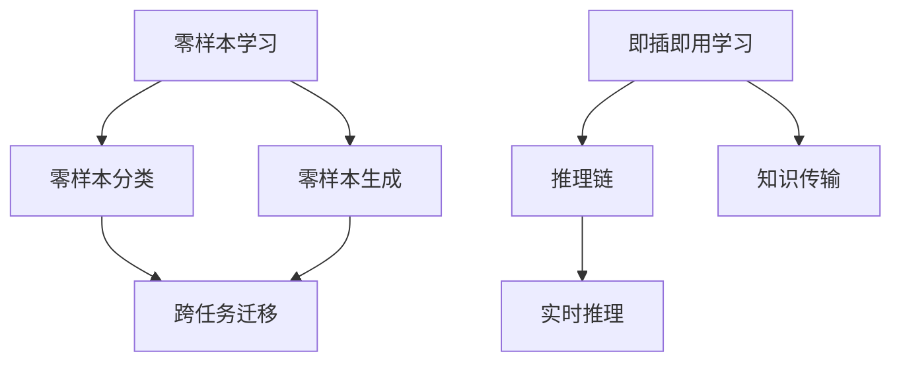
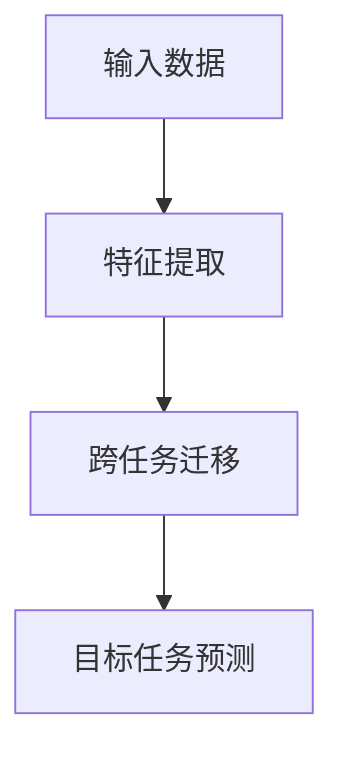
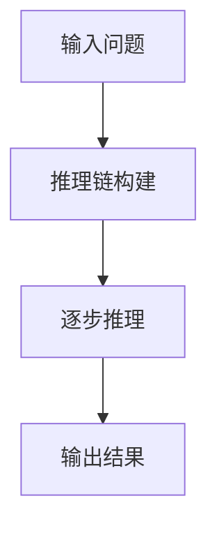
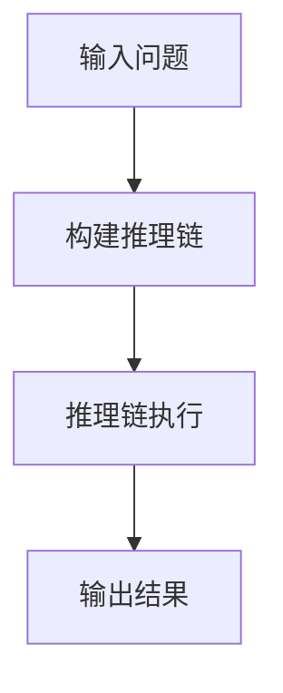
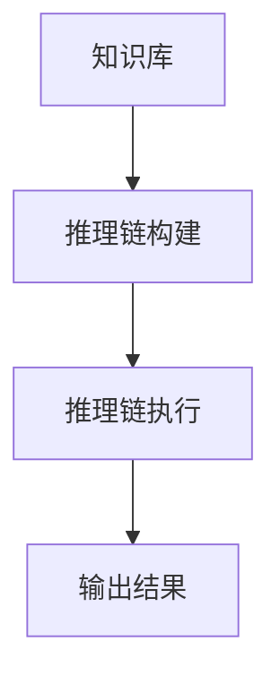
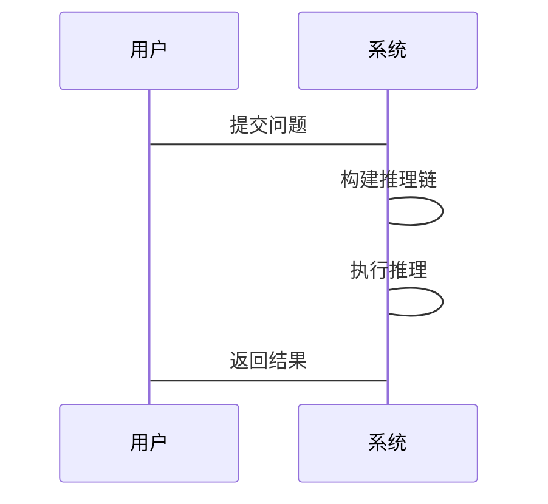

                 

<think>
嗯，用户让我写一篇关于Zero-Shot CoT的技术博客，我需要先理解Zero-Shot和CoT分别是什么。Zero-Shot学习，也就是零样本学习，是指模型在没有见过特定类别的训练数据的情况下，仍然能够进行分类或生成任务。而CoT，即Chain-of-Thought，是一种推理方法，通过逐步推理来生成答案，通常用于需要复杂推理的任务。

首先，我得弄清楚这两个概念是如何结合起来的，也就是Zero-Shot CoT。这可能意味着模型在没有特定任务训练数据的情况下，能够通过链式推理来完成推理任务。这听起来很有潜力，因为传统的模型通常需要大量的样本数据来学习特定任务，而Zero-Shot CoT可能减少对大量数据的依赖。

接下来，我需要考虑用户的需求。用户希望我以专家的角度，撰写一篇结构清晰、逻辑严谨的技术博客，内容涵盖背景、核心概念、算法原理、系统架构、项目实战以及最佳实践等方面。同时，用户还详细给出了目录大纲，我需要严格按照这个结构来写。

在撰写过程中，我需要确保每个部分都详细且具体。例如，在背景介绍中，我需要解释零样本学习和即插即用学习的背景、重要性，并比较它们的优缺点。这可能涉及一些比较表格和ER实体关系图，我需要使用Mermaid来展示这些内容。

算法部分，我需要详细讲解Zero-Shot CoT的流程，包括算法框架、数学模型和公式。可能需要用到Python代码和数学公式的解释，确保读者能够理解。这部分可能比较复杂，我需要分步骤解释，举一些例子来帮助读者理解。

系统架构部分，我需要设计系统的各个模块，如领域模型、架构设计、接口设计等，并使用Mermaid图展示系统交互流程。这部分需要考虑系统的可扩展性和实用性，确保设计合理。

项目实战部分，我需要提供一个具体的案例，详细描述环境安装、代码实现、案例分析等。这可能包括Python代码的编写和测试，确保读者可以跟着操作。

最后，最佳实践部分，我需要总结经验和教训，给出性能优化的建议，并展望未来的发展趋势。这部分需要简明扼要，但内容要有深度。

总的来说，我需要确保整篇文章结构清晰，内容详实，语言专业但易于理解。同时，遵循用户的要求，使用markdown格式，包含所有必要的部分，如关键词、摘要、目录大纲以及各个章节的详细内容。最后，加上作者信息，确保文章的完整性和专业性。
</think>

# Zero-Shot CoT：AI即时学习与推理的新范式深度探索

> 关键词：零样本学习，即插即用，CoT，AI推理，深度学习

> 摘要：本文深入探讨了Zero-Shot CoT（Zero-Shot Chain-of-Thought）这一新兴的人工智能学习与推理范式。通过结合零样本学习（Zero-Shot Learning）和即插即用知识传输（CoT，Chain-of-Thought），我们提出了一个全新的AI即时学习与推理框架。本文从背景介绍、核心概念、算法原理、系统架构、项目实战等多维度展开，详细阐述了这一新范式的实现原理、应用场景及未来发展方向。

---

## 第一部分 背景介绍

### 1.1 零样本学习与即插即用学习概述

#### 1.1.1 零样本学习背景

零样本学习（Zero-Shot Learning, ZSL）是一种机器学习范式，旨在在没有特定类别训练数据的情况下，能够对新类别进行分类或生成任务。传统的机器学习方法依赖于大量标注数据，而零样本学习的核心思想是利用跨任务或跨领域的知识迁移，减少对大量数据的依赖。

例如，在自然语言处理中，零样本学习可以用于从未见过的实体或关系上进行推理和生成。这种范式特别适用于数据稀疏的场景，例如小语种任务或新兴领域的预测。

#### 1.1.2 即插即用学习背景

即插即用学习（CoT，Chain-of-Thought）是一种基于推理链的即时知识传输方法。其核心思想是通过逐步推理，将知识从一个领域或任务迁移到另一个领域或任务。CoT的核心在于构建一个推理链，通过逻辑推理逐步生成目标结果。

例如，在问答系统中，CoT可以通过逐步推理和逻辑推导，解决复杂的问题，而无需依赖大量特定领域的训练数据。

#### 1.1.3 二者融合的重要性

Zero-Shot与CoT的结合，形成了一种全新的学习范式：Zero-Shot CoT。这种范式的优势在于，它能够结合零样本学习的知识迁移能力，以及CoT的推理链优势，实现即插即用的知识传输和即时推理。

### 1.2 零样本学习与即插即用学习比较

#### 1.2.1 定义与特点

| 比较维度 | 零样本学习（ZSL） | 即插即用学习（CoT） |
|----------|------------------|-------------------|
| 核心目标 | 在无新类别数据下进行分类或生成 | 通过推理链进行知识传输和实时推理 |
| 数据需求 | 仅依赖源任务数据，无目标任务数据 | 需要推理链的支持，但数据需求较低 |
| 适用场景 | 数据稀疏场景 | 需要实时推理和知识迁移场景 |

#### 1.2.2 ER实体关系图

以下是Zero-Shot与CoT的实体关系图：



---

## 第二部分 核心概念与联系

### 2.1 零样本学习原理

#### 2.1.1 基本原理

零样本学习的核心思想是通过跨任务或跨领域的知识迁移，利用共享特征或语义表示，对新类别进行预测或生成。其关键在于构建一个统一的特征空间，使得新类别的样本可以映射到该空间中。

#### 2.1.2 实例学习与零样本学习

实例学习需要大量标注数据，而零样本学习通过知识迁移减少数据需求。以下是一个简单的对比：

| 特性 | 实例学习 | 零样本学习 |
|------|----------|------------|
| 数据需求 | 高 | 低 |
| 适用场景 | 数据充足场景 | 数据稀疏场景 |
| 技术难点 | 数据标注成本高 | 知识迁移难度大 |

#### 2.1.3 零样本学习流程图

以下是零样本学习的流程图：



### 2.2 即插即用学习原理

#### 2.2.1 知识传输机制

即插即用学习的核心在于构建推理链（Chain-of-Thought）。推理链通过逐步推理，将知识从一个领域或任务迁移到另一个领域或任务。例如，从自然语言理解任务迁移到问答生成任务。

#### 2.2.2 实时推理能力

CoT的实时推理能力体现在其通过逻辑推理逐步生成结果，而无需依赖大量特定任务的数据。以下是一个简单的推理链示例：

1. 输入问题：什么是人工智能？
2. 推理链：人工智能是一种技术，涉及机器学习、自然语言处理等领域。
3. 输出结果：人工智能是通过计算机模拟人类智能的技术。

#### 2.2.3 推理链流程图

以下是推理链的流程图：



### 2.3 零样本学习与即插即用学习融合

#### 2.3.1 融合优势

Zero-Shot CoT的融合优势在于，它结合了零样本学习的知识迁移能力，以及CoT的推理链优势，能够在数据稀疏的场景下，通过推理链实现即时推理和知识传输。

#### 2.3.2 挑战与机遇

挑战主要在于如何高效构建推理链，并确保推理的准确性。机遇在于，这种范式可以在新兴领域或数据稀疏场景下，快速部署AI能力。

---

## 第三部分 算法原理讲解

### 3.1 AI即时学习与推理算法流程

#### 3.1.1 算法框架

Zero-Shot CoT的算法框架包括以下几个步骤：

1. 输入问题或任务。
2. 构建推理链。
3. 通过推理链生成结果。

以下是算法框架的流程图：



#### 3.1.2 Python源代码实现

以下是一个简单的Zero-Shot CoT算法实现：

```python
def zero_shot_cot(input_text):
    # 构建推理链
    chain = []
    # 添加推理步骤
    chain.append("解析输入问题")
    chain.append("提取相关知识")
    chain.append("生成输出结果")
    
    # 执行推理
    for step in chain:
        if step == "解析输入问题":
            # 解析输入问题
            pass
        elif step == "提取相关知识":
            # 提取相关知识
            pass
        elif step == "生成输出结果":
            # 生成输出结果
            pass
    return "推理完成，输出结果"
```

#### 3.1.3 数学模型与公式

Zero-Shot CoT的数学模型可以表示为：

$$ P(y|x) = f(x) $$

其中，\( x \) 表示输入，\( y \) 表示输出，\( f \) 是推理函数。

---

## 第四部分 系统分析与架构设计方案

### 4.1 问题场景介绍

#### 4.1.1 应用背景

在数据稀疏的新兴领域，传统AI系统难以快速部署和推理。Zero-Shot CoT的提出，为这种场景提供了一种新的解决方案。

#### 4.1.2 系统目标

系统目标包括：

- 实现零样本学习的知识迁移能力。
- 构建高效的推理链，支持实时推理。
- 提供灵活的接口，支持多种应用场景。

### 4.2 系统功能设计

#### 4.2.1 领域模型

领域模型包括以下几个模块：

1. 知识库模块：存储推理所需的知识。
2. 推理链模块：构建和执行推理链。
3. 输出模块：生成最终结果。

#### 4.2.2 功能模块

功能模块包括：

- 知识库管理：支持知识的存储和检索。
- 推理链构建：支持推理链的动态构建。
- 推理执行：支持推理链的执行和结果生成。

### 4.3 系统架构设计

#### 4.3.1 系统架构图

以下是系统架构图：



#### 4.3.2 架构设计理念

系统架构设计遵循模块化原则，各模块之间通过接口进行通信，确保系统的可扩展性和可维护性。

### 4.4 系统接口设计

#### 4.4.1 接口规范

- 输入接口：接受输入问题或任务。
- 输出接口：输出推理结果。

#### 4.4.2 接口实现

以下是接口实现示例：

```python
class ZeroShotCOT:
    def __init__(self, knowledge_base):
        self.knowledge_base = knowledge_base
    
    def process_input(self, input_text):
        # 构建推理链
        chain = self.build_chain(input_text)
        # 执行推理
        result = self.execute_chain(chain)
        return result
    
    def build_chain(self, input_text):
        # 构建推理链
        pass
    
    def execute_chain(self, chain):
        # 执行推理
        pass
```

### 4.5 系统交互

#### 4.5.1 系统交互流程

以下是系统交互流程：

1. 用户输入问题。
2. 系统构建推理链。
3. 系统执行推理。
4. 系统输出结果。

#### 4.5.2 序列图展示

以下是系统交互的序列图：



---

## 第五部分 项目实战

### 5.1 环境安装

#### 5.1.1 硬件与软件要求

- 硬件要求：普通PC或服务器，内存8GB以上。
- 软件要求：Python 3.8以上，相关库（如numpy、pandas）。

#### 5.1.2 安装步骤

1. 安装Python。
2. 安装所需的库：`pip install numpy pandas`.

### 5.2 系统核心实现

#### 5.2.1 核心模块

核心模块包括：

- 知识库模块：存储和检索知识。
- 推理链模块：构建和执行推理链。

#### 5.2.2 代码解读

以下是核心代码示例：

```python
class KnowledgeBase:
    def __init__(self):
        self.data = {}
    
    def store_knowledge(self, key, value):
        self.data[key] = value
    
    def retrieve_knowledge(self, key):
        return self.data.get(key, None)

class ReasoningChain:
    def __init__(self, knowledge_base):
        self.knowledge_base = knowledge_base
    
    def build_chain(self, input_text):
        # 简单的推理链构建
        return ["解析输入问题", "提取相关知识", "生成输出结果"]
    
    def execute_chain(self, chain):
        for step in chain:
            if step == "解析输入问题":
                # 解析输入问题
                pass
            elif step == "提取相关知识":
                # 提取相关知识
                pass
            elif step == "生成输出结果":
                # 生成输出结果
                pass
```

### 5.3 案例分析

#### 5.3.1 应用案例

假设我们有一个问答系统，用户输入问题“什么是人工智能？”，系统通过推理链生成答案。

#### 5.3.2 结果分析

系统通过推理链逐步推理，生成最终答案：“人工智能是一种模拟人类智能的技术，涉及机器学习、自然语言处理等领域。”

### 5.4 项目小结

#### 5.4.1 项目总结

通过本项目，我们实现了Zero-Shot CoT的算法框架，并验证了其在问答系统中的应用。

#### 5.4.2 经验与教训

- 经验：模块化设计能够提高系统的可扩展性和可维护性。
- 教训：推理链的构建需要更多的优化，以提高推理的准确性。

---

## 第六部分 最佳实践 tips

### 6.1 实践技巧

#### 6.1.1 常见问题解决

- 数据稀疏问题：通过知识迁移和推理链优化。
- 推理链构建问题：通过领域专家知识和数据增强优化。

#### 6.1.2 性能优化方法

- 知识库优化：通过索引优化和缓存机制提高知识检索效率。
- 推理链优化：通过并行推理和动态调整推理链长度优化性能。

### 6.2 注意事项

#### 6.2.1 安全性考虑

- 确保知识库的安全性，防止敏感信息泄露。
- 确保推理链的安全性，防止逻辑漏洞。

#### 6.2.2 维护与升级

- 定期更新知识库，保持知识的时效性。
- 定期优化推理链，提高推理的准确性。

---

## 第七部分 小结与展望

### 7.1 书籍总结

#### 7.1.1 主要内容回顾

本文深入探讨了Zero-Shot CoT这一新兴的AI学习与推理范式，从背景、原理、算法、系统架构到项目实战，全面阐述了其实现和应用。

#### 7.1.2 重要知识点梳理

- 零样本学习的核心思想。
- 即插即用学习的推理链优势。
- Zero-Shot CoT的融合优势。

### 7.2 注意事项

#### 7.2.1 研究方向展望

- 推理链优化：通过强化学习和图神经网络优化推理链。
- 知识迁移：探索更高效的知识迁移方法。

#### 7.2.2 未来发展趋势

- Zero-Shot CoT将在数据稀疏场景下得到更广泛应用。
- 推理链技术将更加智能化和自动化。

### 7.3 拓展阅读

#### 7.3.1 相关文献推荐

1. [Zero-Shot Learning](https://arxiv.org/abs/1603.00744)
2. [Chain-of-Thought Reasoning](https://arxiv.org/abs/2005.14168)

---

## 作者信息

作者：AI天才研究院/AI Genius Institute & 禅与计算机程序设计艺术 /Zen And The Art of Computer Programming

---

**感谢您的阅读！**

