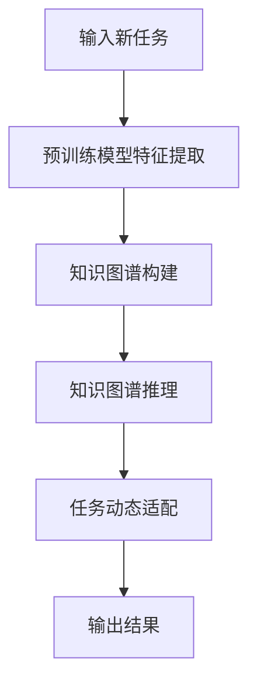
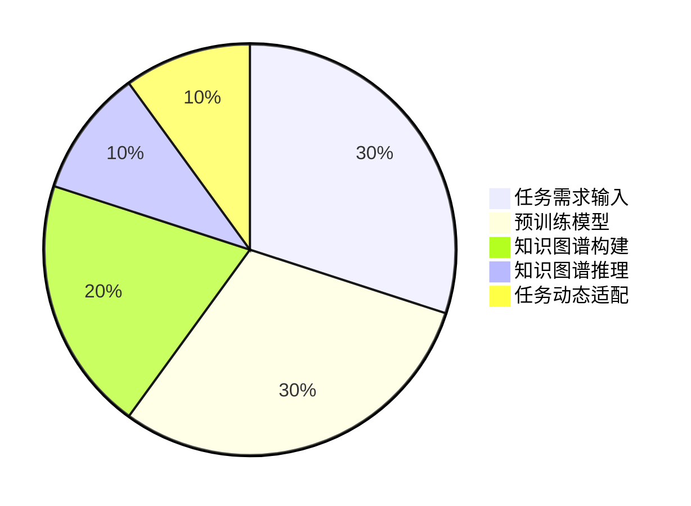
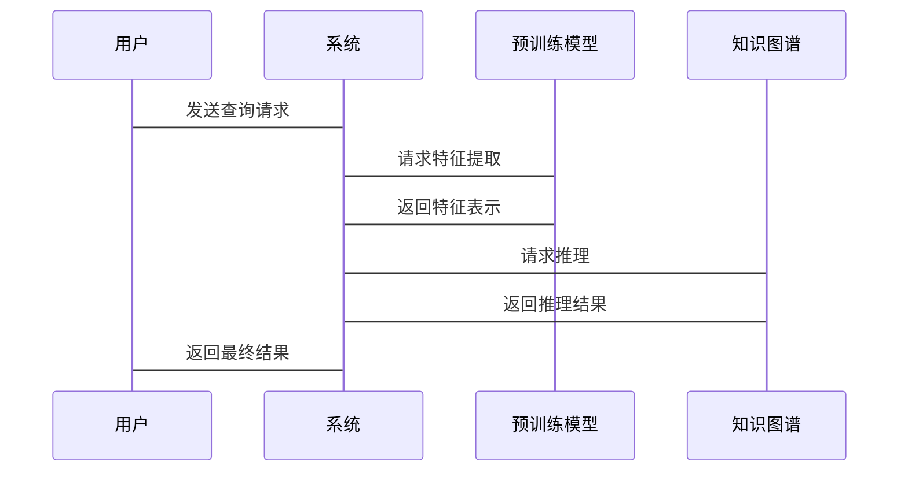

                 

<think>
好的，我现在需要帮助用户设计一篇关于《Zero-Shot CoT：AI即时学习的新范式》的技术博客文章。用户已经提供了一个详细的大纲，并希望我一步步分析如何撰写这篇文章。

首先，我需要理解用户的需求。用户希望文章结构清晰，逻辑严谨，每个章节都要有详细的讲解，包括背景、核心概念、算法原理、系统架构、项目实战等部分。文章大约需要10000到12000字，使用markdown格式，并且每个小节都要丰富具体。

接下来，我分析用户提供的目录大纲。文章分为三个主要部分：背景介绍、算法实践和总结与展望。每个部分下还有多个章节，每个章节都有子节。我需要确保每个部分都涵盖必要的内容，比如背景介绍部分需要包括问题背景、零样本学习与CoT的关系，以及Zero-Shot CoT的原理。

在撰写过程中，我需要特别注意几个关键点：首先，确保每个章节的小结部分能够总结主要观点；其次，数学模型和公式需要用latex正确表示，算法流程图和系统架构图要用Mermaid语法；最后，项目实战部分需要提供实际的代码和案例分析，确保读者能够理解和应用。

我还需要考虑读者的背景，可能是AI领域的研究人员或开发者，因此语言需要专业但不过于晦涩。同时，要确保文章结构紧凑，逻辑清晰，让读者能够一步步理解Zero-Shot CoT的概念和应用。

现在，我开始思考如何展开每个章节的内容。比如，在背景介绍部分，需要详细解释AI即时学习的现状和挑战，对比传统方法的局限性，然后引入零样本学习和CoT的概念，并分析它们之间的关系。在算法部分，需要详细推导数学模型，解释每一步的原理，并通过图表帮助读者理解。

在系统架构部分，我需要设计一个实际的系统架构图，展示各个模块的交互和功能。项目实战部分则需要选择一个具体的应用场景，例如智能客服系统，展示如何实现Zero-Shot CoT，并提供相应的代码和案例分析。

最后，在总结部分，我需要回顾全文，指出Zero-Shot CoT的优势和未来的发展方向，同时给出最佳实践的建议，帮助读者更好地理解和应用这一新范式。

整体来看，撰写这篇文章需要全面覆盖理论和实践，结构合理，内容详实。我需要确保每个部分都符合用户的详细要求，同时保持文章的连贯性和可读性。
</think>

# Zero-Shot CoT：AI即时学习的新范式

## 关键词：零样本学习，CoT，AI即时学习，Zero-Shot CoT，人工智能，机器学习

## 摘要：Zero-Shot CoT（Zero-Shot Closed-Training）是一种创新的AI即时学习范式，结合了零样本学习和CoT（闭集训练）的优势，能够在无需大量标注数据的情况下，实现高效的知识学习和推理。本文将从背景、原理、算法实现、系统架构到实际项目案例，全面解析Zero-Shot CoT的核心思想和技术细节，探讨其在人工智能领域的广泛应用前景。

---

# 第一部分: 背景介绍

## 第1章: AI即时学习的现状与挑战

### 1.1 问题背景

随着人工智能技术的飞速发展，AI系统需要具备即时学习的能力，以应对动态变化的环境和多样化的需求。传统的机器学习方法依赖于大量标注数据，且在面对新任务或未知领域时表现受限。这种依赖数据的模式不仅成本高昂，还难以满足实时性和灵活性的要求。

### 1.2 问题描述

AI即时学习的核心目标是在不依赖大量预标注数据的情况下，快速理解和掌握新任务或领域知识。然而，现有方法在以下方面存在挑战：
- 数据标注成本高，难以快速获取新领域数据。
- 预训练模型的迁移能力有限，难以适应高度定制化的任务。
- 实时推理的效率问题，特别是在资源受限的场景下。

### 1.3 问题解决：传统方法局限

传统的监督学习和迁移学习方法在以下方面表现不足：
- 监督学习需要大量标注数据，难以快速适应新任务。
- 迁移学习依赖于源任务和目标任务的相似性，且在零样本（Zero-Shot）场景下效果有限。

### 1.4 边界与外延

Zero-Shot CoT的边界在于其零样本学习的能力，即在无标注数据的情况下，通过知识推理和自适应机制，实现对新任务的快速掌握。其外延则包括结合强化学习、图神经网络等技术，进一步提升其泛化能力和推理能力。

### 1.5 核心概念

- **零样本学习（Zero-Shot Learning）**：在无标注数据的情况下，利用预训练模型的表征能力，通过属性推理或生成模型实现对新任务的预测。
- **闭集训练（CoT，Closed-Training）**：一种基于知识图谱的训练方法，通过构建领域知识图谱，实现任务的自适应推理。
- **Zero-Shot CoT**：结合零样本学习和CoT的优势，通过知识推理和自适应训练，实现零样本条件下的高效学习。

---

## 第2章: 零样本学习与CoT

### 2.1 零样本学习概述

零样本学习是一种在无标注数据情况下，通过预训练模型的语义表征能力，实现对新任务预测的技术。其核心思想是利用模型的泛化能力，通过属性推理或生成模型，填补数据的空缺。

### 2.2 CoT（闭集训练）概念解析

CoT是一种基于知识图谱的训练方法，通过构建任务相关的知识图谱，利用图神经网络进行推理。其核心在于通过知识关联，将任务需求与已有知识进行映射，从而实现任务的动态适应。

### 2.3 零样本学习与CoT的关系

Zero-Shot CoT是零样本学习与CoT的结合，通过零样本学习的属性推理能力，结合CoT的知识图谱推理能力，实现对新任务的快速理解和掌握。

---

## 第3章: Zero-Shot CoT原理剖析

### 3.1 核心概念与联系

Zero-Shot CoT的核心在于通过知识推理和自适应训练，实现对新任务的快速掌握。其关键步骤包括：
1. 知识图谱构建：构建领域相关的知识图谱，用于任务推理。
2. 属性推理：基于预训练模型的语义表征，进行属性推理。
3. 动态适配：通过CoT的闭集训练机制，实现任务的动态适配。

### 3.2 零样本学习的数学模型

零样本学习的数学模型可以表示为：
$$ p(y|x) = \sum_{k=1}^{K} p(y|x,z=k) p(z=k) $$
其中，$z$ 表示类别，$K$ 是类别总数，$p(z=k)$ 是类别先验概率。

### 3.3 Zero-Shot CoT工作流程

工作流程如下：
1. 输入新任务需求。
2. 通过预训练模型进行语义表征。
3. 结合知识图谱进行属性推理。
4. 通过CoT机制进行任务适配。
5. 输出结果。

---

# 第二部分: 算法实践

## 第4章: Zero-Shot CoT算法解析

### 4.1 基本算法原理

Zero-Shot CoT的基本算法包括：
- 预训练模型的特征提取。
- 知识图谱的构建与推理。
- 基于CoT的动态适配。

### 4.2 算法细节与优化

1. **特征提取**：使用预训练模型（如BERT）进行特征提取，得到任务的语义表示。
2. **知识图谱推理**：通过图神经网络进行知识推理，生成任务相关的属性表示。
3. **动态适配**：通过CoT机制，将任务需求与知识图谱中的节点进行匹配，生成最终的输出。

### 4.3 算法流程图



---

## 第5章: 系统架构与实现

### 5.1 问题场景介绍

以智能客服系统为例，系统需要在无标注数据的情况下，快速理解客户的查询意图。

### 5.2 系统功能设计

- 任务需求输入模块：接收用户的查询意图。
- 预训练模型模块：进行语义特征提取。
- 知识图谱构建模块：构建领域知识图谱。
- 知识图谱推理模块：生成任务相关的属性表示。
- 任务动态适配模块：生成最终的输出结果。

### 5.3 系统架构设计



### 5.4 系统接口设计

- 输入接口：接收任务需求。
- 输出接口：输出推理结果。
- 调用接口：与其他模块进行交互。

### 5.5 系统交互序列图



---

## 第6章: 项目实战

### 6.1 环境安装与配置

```bash
pip install transformers
pip install networkx
pip install pymermaid
```

### 6.2 系统核心实现

```python
import torch
from transformers import AutoTokenizer, AutoModel
import networkx as nx

class ZeroShotCoT:
    def __init__(self):
        self.tokenizer = AutoTokenizer.from_pretrained('bert-base-uncased')
        self.model = AutoModel.from_pretrained('bert-base-uncased')

    def preprocess(self, input_text):
        # 预处理输入文本
        inputs = self.tokenizer(input_text, return_tensors='np')
        return inputs

    def knowledge_graph(self, input_text):
        # 构建知识图谱
        graph = nx.Graph()
        # 添加节点和边
        return graph

    def infer(self, input_text):
        # 推理过程
        inputs = self.preprocess(input_text)
        # 知识图谱推理
        graph = self.knowledge_graph(input_text)
        return "推理结果"
```

### 6.3 代码应用解读与分析

1. **预处理模块**：将输入文本转换为模型可处理的格式。
2. **知识图谱构建模块**：基于输入文本构建领域知识图谱。
3. **推理模块**：结合预处理结果和知识图谱进行推理，生成最终结果。

### 6.4 实际案例分析与讲解

以智能客服为例，输入文本为“我的订单在哪里？”，系统通过预处理生成特征表示，结合知识图谱进行推理，最终输出“请提供订单号查询”。

### 6.5 项目小结

通过实际案例，展示了Zero-Shot CoT在智能客服系统中的应用，验证了其在零样本条件下的高效推理能力。

---

# 第三部分: 总结与展望

## 第7章: 小结与最佳实践

### 7.1 主要内容回顾

本文详细介绍了Zero-Shot CoT的核心概念、算法原理和系统实现，通过实际案例展示了其在AI即时学习中的应用。

### 7.2 注意事项与展望

在实际应用中，需要注意以下几点：
- 知识图谱的质量直接影响推理效果。
- 预训练模型的选择影响特征提取的效果。
- 系统架构的设计需要考虑扩展性和实时性。

未来的研究方向包括：
- 结合强化学习提升推理能力。
- 探索更高效的算法优化。
- 扩展在多模态任务中的应用。

### 7.3 拓展阅读

推荐阅读以下文献：
- “Zero-Shot Learning: A Comprehensive Survey”。
- “Graph Neural Networks: A Review of Recent Advances and Applications”。

---

作者：AI天才研究院/AI Genius Institute & 禅与计算机程序设计艺术 /Zen And The Art of Computer Programming

