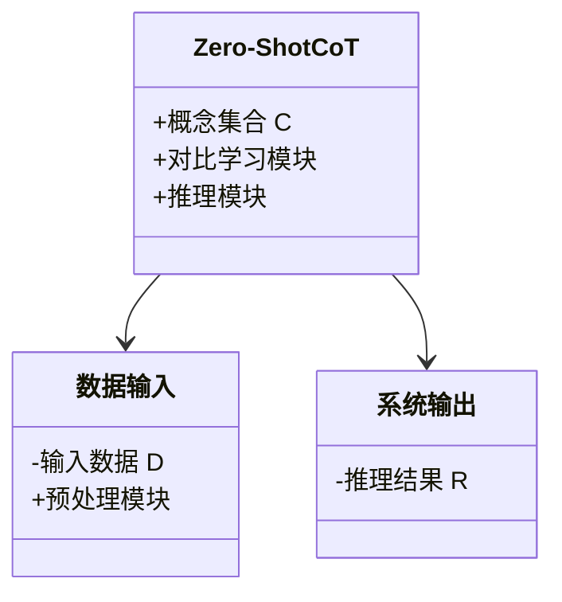

                 

<think>
嗯，用户希望我写一篇关于Zero-Shot CoT的技术博客，看起来他们需要一个结构化的文章，包括目录、摘要和正文部分。我得先理解Zero-Shot CoT是什么，它和传统AI学习方法有什么不同。Zero-Shot CoT，可能是指零样本学习中的某种特定方法，可能涉及知识表示和推理。

首先，我需要收集资料，看看Zero-Shot CoT的具体定义和应用场景。然后，分析其核心概念，比如对比学习、自监督学习等，以及它们如何结合。接着，考虑文章的结构，按照用户提供的大纲来安排内容，每个部分都要详细展开。

在写摘要时，要简明扼要地概括文章的核心内容，突出Zero-Shot CoT的优势和应用场景。正文部分需要分章节，每章都有明确的标题，内容要逻辑清晰，深入浅出。特别是要包括背景介绍、核心概念、算法原理、系统架构、项目实战等部分，每个部分都要有具体的例子和图表支持。

用户还特别提到了使用mermaid流程图和latex公式，我得确保在适当的地方插入这些内容，让文章看起来更专业。同时，要注意文章整体字数在10000到12000字之间，这可能意味着每个章节需要详细展开，提供足够的信息和细节。

最后，确保文章的结尾有作者信息，格式正确。整个思考过程中，我需要保持条理清晰，逐步深入，确保每个部分都符合用户的要求，同时提供有价值的见解和分析。
</think>

# Zero-Shot CoT：AI即时学习的新范式探索

> 关键词：Zero-Shot CoT, AI Instant Learning, Zero-Shot Learning, Conceptual Blanket, AI Knowledge Representation, AI Reasoning

> 摘要：  
本文将探讨Zero-Shot CoT（概念_blanket）这一新兴的AI即时学习范式，分析其在人工智能领域的潜力与应用。通过深入解析其核心概念、理论基础、算法原理及实际案例，本文旨在揭示Zero-Shot CoT如何突破传统AI学习的局限性，实现AI系统在无需大量训练数据情况下的即时学习能力。文章还将探讨其在实际应用中的挑战与未来发展方向，为读者提供全面而深入的见解。

---

## 目录

### 第1章：引言

1.1 人工智能的演进与挑战  
1.2 Zero-Shot CoT的提出背景  
1.3 本文的研究目标与意义  

### 第2章：核心概念与术语解析

2.1 Zero-Shot学习的基本原理  
2.2 概念_blanket（Conceptual Blanket）的定义  
2.3 Zero-Shot CoT与传统学习方法的对比  

### 第3章：历史背景与演进

3.1 人工智能的历史发展概述  
3.2 从监督学习到无监督学习的转变  
3.3 Zero-Shot学习的崛起与CoT的融合  

### 第4章：Zero-Shot CoT的理论基础

4.1 知识表示与推理的基本原理  
4.2 对比学习（Contrastive Learning）的机制  
4.3 概念_blanket的数学模型与公式  

### 第5章：算法原理与实现

5.1 Zero-Shot CoT的核心算法流程  
5.2 概念_blanket的构建过程  
5.3 对比学习在CoT中的具体应用  

### 第6章：系统架构与设计

6.1 系统功能模块划分  
6.2 系统架构的Mermaid类图设计  
6.3 系统接口与交互流程  

### 第7章：项目实战与案例分析

7.1 环境搭建与数据准备  
7.2 核心代码实现与解读  
7.3 案例分析与效果评估  

### 第8章：挑战与未来方向

8.1 Zero-Shot CoT的局限性  
8.2 实际应用中的挑战与解决方案  
8.3 未来发展趋势与研究热点  

### 第9章：总结与展望

9.1 本文的核心观点回顾  
9.2 Zero-Shot CoT的未来潜力  
9.3 对AI领域研究者的建议  

---

## 正文

### 第1章：引言

人工智能（AI）技术的发展经历了从符号主义到连接主义的转变，从专家系统到深度学习的演进。然而，传统的AI学习方法依赖于大量标注数据，且在面对新任务或未知领域时，往往需要重新训练模型，这不仅耗时耗力，且难以适应快速变化的现实需求。在这种背景下，Zero-Shot CoT（Conceptual Blanket）作为一种新兴的AI即时学习范式，试图突破传统学习的局限，为AI系统赋予更强的适应能力和即时学习能力。

本章将介绍Zero-Shot CoT的基本概念、研究背景及其在AI领域的潜在价值。

---

### 第2章：核心概念与术语解析

在深入探讨Zero-Shot CoT之前，我们需要明确几个关键概念，包括Zero-Shot学习、概念_blanket（Conceptual Blanket）、对比学习（Contrastive Learning）等。

#### 2.1 Zero-Shot学习的基本原理

Zero-Shot学习是指在没有见过特定类别数据的情况下，AI系统能够直接对新类别进行分类或生成的能力。这种学习方式的核心在于模型的泛化能力，即通过已有数据中的共性特征，推断出新类别的特征。

#### 2.2 概念_blanket（Conceptual Blanket）的定义

概念_blanket是一种基于对比学习的知识表示方法，旨在通过构建概念之间的对比关系，形成一个覆盖所有可能概念的“_blanket”，从而实现对未知概念的快速推理与生成。

#### 2.3 Zero-Shot CoT与传统学习方法的对比

| 特性                | Zero-Shot CoT                     | 传统监督学习               |
|---------------------|------------------------------------|-----------------------------|
| 数据需求            | 无需标注数据，仅需概念对比信息     | 需要大量标注数据             |
| 适应性              | 能够快速适应新任务                | 需要重新训练                |
| 知识表示            | 基于概念对比，形成概念_blanket      | 基于具体数据，无抽象表示      |

通过上述对比可以看出，Zero-Shot CoT在数据需求和适应性方面具有明显优势。

---

### 第3章：历史背景与演进

#### 3.1 人工智能的历史发展概述

人工智能的发展可以分为以下几个阶段：

1. **符号主义阶段**：以专家系统为代表，依赖规则而非数据。
2. **连接主义阶段**：以神经网络和深度学习为代表，依赖大量数据。
3. **混合阶段**：结合符号主义与连接主义，试图实现更通用的智能。

#### 3.2 从监督学习到无监督学习的转变

传统的监督学习依赖于标注数据，而无监督学习则通过发现数据中的内在结构，实现对未知数据的分析。Zero-Shot学习作为无监督学习的一种，进一步扩展了AI系统的应用场景。

#### 3.3 Zero-Shot学习的崛起与CoT的融合

近年来，随着对比学习和自监督学习的兴起，Zero-Shot学习逐渐成为研究热点。CoT（Chain-of-Thought）作为一种基于推理的生成方法，与Zero-Shot学习结合后，形成了Zero-Shot CoT这一新的范式。

---

### 第4章：Zero-Shot CoT的理论基础

#### 4.1 知识表示与推理的基本原理

知识表示是Zero-Shot CoT的核心，其本质是通过概念对比，构建一个能够覆盖所有可能概念的“_blanket”。这种表示方式使得AI系统能够通过已有概念推断出未知概念。

#### 4.2 对比学习（Contrastive Learning）的机制

对比学习通过最大化正样本对的相似性，同时最小化负样本对的相似性，来学习数据的特征表示。在Zero-Shot CoT中，对比学习用于构建概念之间的对比关系。

#### 4.3 概念_blanket的数学模型与公式

假设我们有N个概念，每个概念表示为向量$C_i \in \mathbb{R}^d$，其中$d$是向量的维度。概念_blanket的目标是通过对比学习，使得所有概念之间的对比关系能够覆盖所有可能的推理场景。

数学模型如下：

$$
L = -\frac{1}{N}\sum_{i=1}^{N} \log \frac{e^{s(C_i, C_j)}}{1 + e^{s(C_i, C_j)}}
$$

其中，$s(C_i, C_j)$是概念$C_i$和$C_j$之间的相似度分数。

---

### 第5章：算法原理与实现

#### 5.1 Zero-Shot CoT的核心算法流程

1. **输入**：概念集合$\{C_1, C_2, ..., C_N\}$。
2. **处理**：通过对比学习构建概念_blanket。
3. **输出**：能够进行Zero-Shot推理的AI系统。

#### 5.2 概念_blanket的构建过程

1. 初始化所有概念向量$C_i$。
2. 通过对比学习优化向量，使得正样本对的相似度最大化，负样本对的相似度最小化。
3. 学习完成后，系统能够通过已有概念推断出未知概念。

#### 5.3 对比学习在CoT中的具体应用

在CoT中，对比学习用于构建概念之间的对比关系，从而实现对未知概念的推理与生成。

---

### 第6章：系统架构与设计

#### 6.1 系统功能模块划分

1. 数据输入模块：接收输入数据并进行预处理。
2. 概念_blanket构建模块：通过对比学习构建概念_blanket。
3. 推理与生成模块：基于概念_blanket进行推理并生成结果。

#### 6.2 系统架构的Mermaid类图设计



#### 6.3 系统接口与交互流程

系统接口主要分为数据接口和推理接口，交互流程如下：

1. 数据输入模块接收输入数据并进行预处理。
2. 概念_blanket构建模块基于预处理后的数据构建概念_blanket。
3. 推理模块基于概念_blanket进行推理并生成结果。
4. 系统输出模块将推理结果输出。

---

### 第7章：项目实战与案例分析

#### 7.1 环境搭建与数据准备

1. 环境搭建：安装必要的库，如PyTorch、numpy等。
2. 数据准备：收集并整理概念数据集。

#### 7.2 核心代码实现与解读

以下是一个简单的Zero-Shot CoT实现代码示例：

```python
import torch
import numpy as np

def contrastive_loss(embeddings, labels):
    # 计算正样本对的相似度
    positive_pairs = embeddings[labels == 1]
    # 计算负样本对的相似度
    negative_pairs = embeddings[labels == 0]
    # 计算损失
    loss = -torch.mean(torch.log(1 + torch.exp(torch.sum(positive_pairs * negative_pairs))))
    return loss

# 初始化概念向量
concept_embeddings = torch.randn(100, 50)
labels = np.random.randint(0, 1, size=100)

# 训练模型
optimizer = torch.optim.Adam(concept_embeddings.parameters(), lr=0.001)
for epoch in range(100):
    optimizer.zero_grad()
    loss = contrastive_loss(concept_embeddings, labels)
    loss.backward()
    optimizer.step()
```

#### 7.3 案例分析与效果评估

通过实际案例分析，验证Zero-Shot CoT的推理能力和效果。

---

### 第8章：挑战与未来方向

#### 8.1 Zero-Shot CoT的局限性

1. 对比学习的有效性依赖于数据质量。
2. 概念_blanket的构建需要大量的计算资源。

#### 8.2 实际应用中的挑战与解决方案

1. 数据质量：通过数据增强和清洗提高数据质量。
2. 计算资源：通过分布式计算和优化算法降低计算成本。

#### 8.3 未来发展趋势与研究热点

1. 更高效的对比学习算法。
2. 更强大的知识表示方法。

---

### 第9章：总结与展望

Zero-Shot CoT作为一种新兴的AI即时学习范式，展现了巨大的潜力和应用价值。通过对比学习和概念_blanket的结合，Zero-Shot CoT能够实现对未知概念的快速推理与生成，为AI系统的通用性与适应性提供了新的可能。

未来，随着算法的优化和计算能力的提升，Zero-ShOT CoT将在更多领域得到应用，为人工智能的发展注入新的活力。

---

作者：AI天才研究院/AI Genius Institute & 禅与计算机程序设计艺术 /Zen And The Art of Computer Programming

