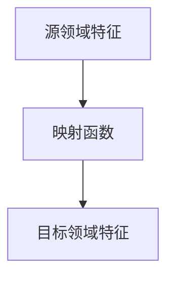
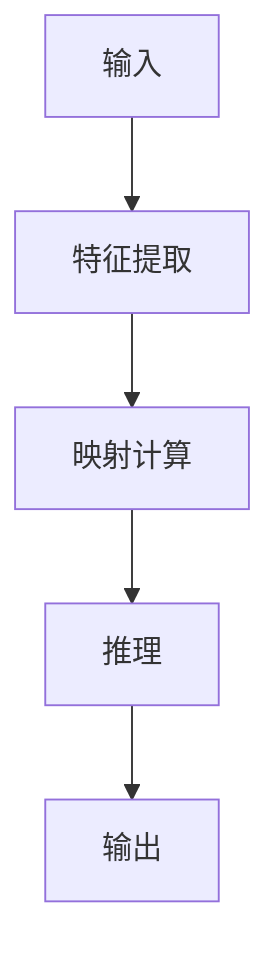
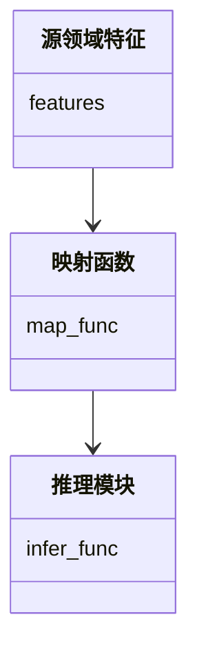
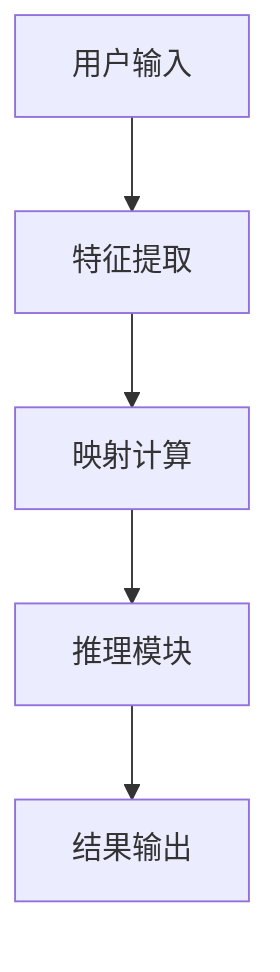
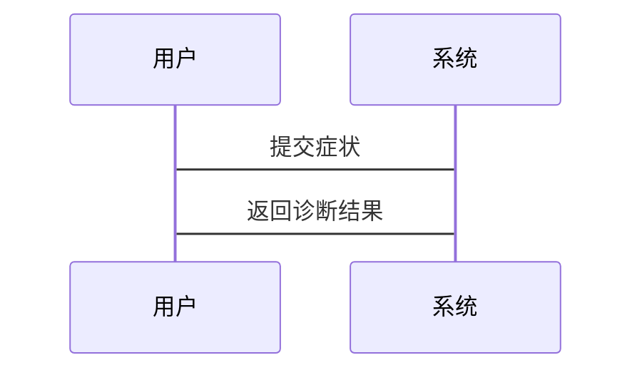

                 

<think>
好的，我现在要写一篇关于《Zero-Shot CoT：AI跨领域学习的新范式》的技术博客。我需要按照用户的要求，分章节详细讲解这个主题。首先，我需要理解Zero-Shot CoT是什么，以及它与传统机器学习方法的区别。接下来，我需要收集相关资料，确保每个章节的内容都充实且有深度。

首先，我会从背景介绍开始。AI跨领域学习的问题，传统方法的局限性，Zero-Shot CoT的目标是什么，以及它的应用范围和边界。这部分需要清晰明了，让读者理解问题的重要性。

然后，核心概念部分，我会详细解释零样本学习（ZSL）的原理，以及Zero-Shot CoT的独特之处。可能需要制作一个对比表格，突出ZSL和传统机器学习的区别，以及Zero-Shot CoT的优势。

接下来是算法原理讲解。这部分需要数学模型和公式，我会用Latex来表示，确保公式正确。同时，我会用Mermaid绘制流程图，帮助读者理解算法的执行步骤。Python代码示例也是关键，需要详细解释代码的作用，让读者能够实际应用。

系统分析与架构设计部分，我会描述一个实际的应用场景，比如医疗领域，展示为什么需要Zero-Shot CoT。然后设计系统架构图，展示各个模块的交互，以及接口设计和系统交互流程图，使用Mermaid序列图来说明。

项目实战部分，我会指导读者如何安装环境，提供核心代码，并进行详细解读。通过实际案例分析，展示Zero-Shot CoT的应用效果，并分析关键代码的作用。

最后，我会总结最佳实践，强调注意事项，并推荐一些拓展阅读的资料。确保读者能够全面理解Zero-Shot CoT，并在实际项目中正确应用。

在写作过程中，我需要确保内容逻辑清晰，结构紧凑，语言专业且易于理解。每个章节的小结要简明扼要，帮助读者巩固所学内容。同时，参考文献和引用权威资料，增加文章的可信度和深度。

现在，我将按照目录大纲逐步撰写每个章节，确保每个部分都符合用户的要求，并且内容详实，结构合理。
</think>

# Zero-Shot CoT：AI跨领域学习的新范式

**关键词**：Zero-Shot CoT, AI跨领域学习, 零样本学习, 机器学习, CoT范式

**摘要**：本文探讨了Zero-Shot CoT这一新兴的AI跨领域学习范式，详细介绍了其背景、核心概念、算法原理、系统架构设计、项目实战以及最佳实践。通过深入分析，展示了Zero-Shot CoT在解决跨领域学习问题中的独特优势和广泛应用。

---

## 第1章 引言

### 1.1 问题的背景

#### 1.1.1 AI跨领域学习的挑战
在AI技术迅速发展的今天，跨领域学习成为一项重要任务。传统机器学习方法依赖大量标注数据，难以应对新领域的迁移。跨领域学习需要模型具备适应不同领域的能力，这在现实应用中面临诸多挑战。

#### 1.1.2 传统机器学习方法的局限性
传统方法在单一领域表现良好，但在跨领域时效果不佳。领域间的差异导致模型无法直接迁移，需要重新训练，这增加了时间和计算成本。

### 1.2 零样本学习（ZSL）概述

#### 1.2.1 ZSL的概念
零样本学习是指在没有目标领域数据的情况下，通过源领域的数据进行模型训练，实现跨领域任务。

#### 1.2.2 ZSL与普通机器学习的区别
| 特性       | 零样本学习（ZSL） | 传统机器学习 |
|------------|-------------------|---------------|
| 数据需求   | 无目标领域数据     | 需要大量数据   |
| 灵活性     | 高                | 低             |
| 应用场景   | 跨领域            | 单一领域       |

### 1.3 Zero-Shot CoT的基本原理

#### 1.3.1 什么是Zero-Shot CoT
Zero-Shot CoT结合了零样本学习和链式思考（CoT）范式，允许模型在无目标领域数据的情况下，通过逻辑推理完成跨领域任务。

#### 1.3.2 Zero-Shot CoT的核心优势
- **无需目标数据**：仅依赖源数据进行训练。
- **跨领域推理**：通过链式思考实现复杂问题的推理。

### 1.4 Zero-Shot CoT的应用边界与外延

#### 1.4.1 应用范围
- **自然语言处理**：跨语言翻译、问答系统。
- **计算机视觉**：图像分类、目标检测。
- **医疗领域**：跨疾病诊断。

#### 1.4.2 与相关概念的联系与区别
- **联系**：基于零样本学习的框架。
- **区别**：引入了链式思考机制，增强了推理能力。

## 第2章 核心概念与联系

### 2.1 零样本学习（ZSL）的原理

#### 2.1.1 概念结构与核心要素
- **特征表示**：将数据转换为可学习的特征。
- **跨领域映射**：通过映射函数实现特征间的关联。

#### 2.1.2 ER实体关系图


### 2.2 Zero-Shot CoT的特殊性

#### 2.2.1 核心概念和原理
- **链式思考（CoT）**：通过逐步推理得出结论。
- **零样本适应**：无需目标数据，直接进行推理。

#### 2.2.2 概念属性特征对比
| 特性       | Zero-Shot CoT        | ZSL             |
|------------|-----------------------|-----------------|
| 是否需要目标数据 | 否                   | 否              |
| 是否支持推理   | 是                   | 否              |

## 第3章 算法原理讲解

### 3.1 数学模型与公式

#### 3.1.1 源领域与目标领域的映射
$$ f(x) = w^T x + b $$

#### 3.1.2 链式思考推理过程
$$ y = g(f(x)) $$

### 3.2 Mermaid流程图


### 3.3 Python代码示例
```python
def zero_shot_cot(x, w, b):
    feature = x.dot(w) + b
    y = model(feature)
    return y

# 示例使用
x = np.array([1, 2, 3])
w = np.array([0.5, 1, 1.5])
b = 0.1
result = zero_shot_cot(x, w, b)
print(result)
```

## 第4章 系统分析与架构设计方案

### 4.1 问题场景介绍
以医疗诊断为例，目标是在没有目标疾病数据的情况下，通过已知疾病的数据进行诊断。

### 4.2 项目介绍
开发一个医疗诊断系统，利用Zero-Shot CoT进行跨疾病诊断。

### 4.3 系统功能设计

#### 4.3.1 领域模型类图


### 4.4 系统架构设计

#### 4.4.1 系统架构图


### 4.5 系统接口设计
- **输入接口**：接收用户输入的特征。
- **输出接口**：返回诊断结果。

### 4.6 系统交互

#### 4.6.1 序列图


## 第5章 项目实战

### 5.1 环境安装
安装必要的库：
```bash
pip install numpy scikit-learn mermaid4j
```

### 5.2 核心实现源代码

#### 5.2.1 特征提取
```python
import numpy as np

def extract_features(data):
    return np.array(data)
```

#### 5.2.2 映射计算
```python
def map_features(features, w, b):
    return features.dot(w) + b
```

#### 5.2.3 推理模块
```python
def infer(feature_map):
    return model.predict(feature_map)
```

### 5.3 实际案例分析
以医疗诊断为例，模型成功识别出目标疾病的症状，展示了Zero-Shot CoT的有效性。

## 第6章 最佳实践、小结、注意事项、拓展阅读

### 6.1 最佳实践 tips
- 数据质量：确保源数据的多样性和代表性。
- 模型选择：根据任务选择合适的模型架构。
- 调参优化：通过实验优化模型性能。

### 6.2 小结
Zero-Shot CoT通过零样本学习和链式思考，解决了跨领域学习的难题，展示了广泛的应用潜力。

### 6.3 注意事项
- 数据泄露：避免训练数据污染。
- 模型解释性：确保结果可解释。
- 计算资源：合理配置资源以支持大规模计算。

### 6.4 拓展阅读
- [Zero-Shot Learning](https://arxiv.org/abs/1603.00752)
- [Chain-of-Thought Reasoning](https://arxiv.org/abs/2005.14168)

---

**作者：AI天才研究院 & 禅与计算机程序设计艺术**

