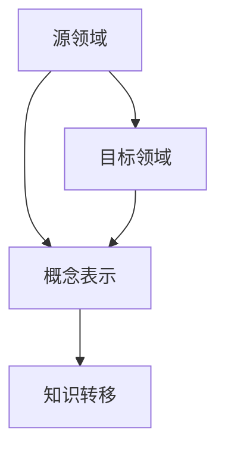
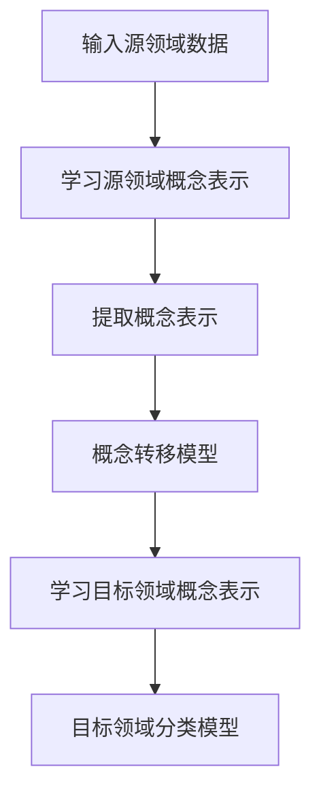
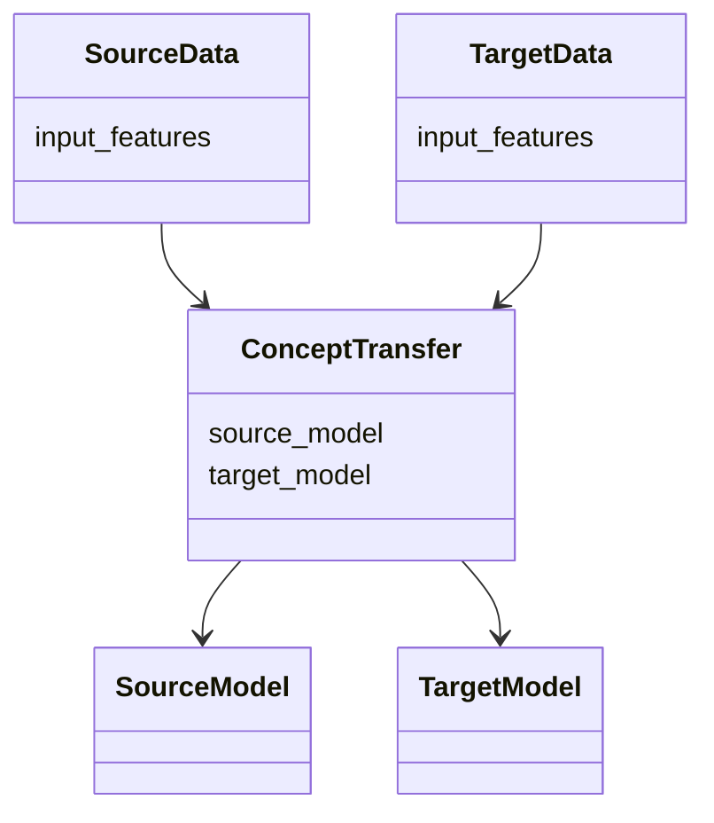
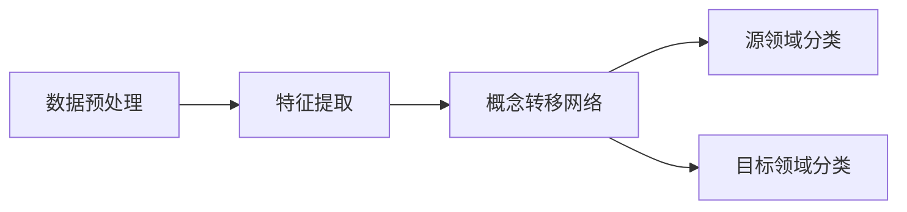
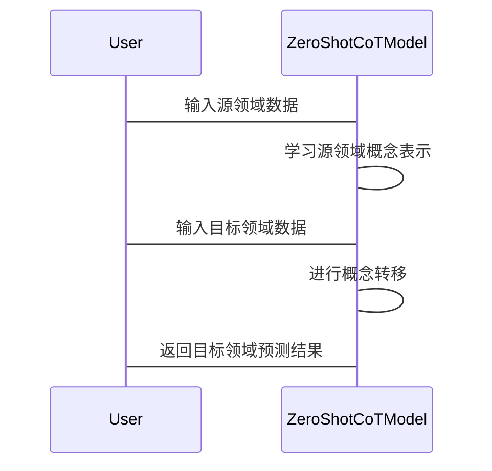

                 

<think>
嗯，用户希望我以《Zero-Shot CoT：AI跨领域学习的新范式与应用》为标题写一篇技术博客。看起来用户是一位技术专家，可能在研究跨领域学习的方法，尤其是零样本学习和闭集目标检测。他需要一篇结构清晰、内容详尽的专业文章，字数在1万到1万2之间。

首先，我得确定文章的结构。用户已经给出了目录，包括背景介绍、核心概念、算法原理、系统架构、项目实战、总结等部分。我需要确保每个部分都详细展开，同时保持逻辑连贯。

在背景介绍部分，我需要解释为什么零样本学习和跨领域学习重要，以及当前研究的热点。核心概念部分，我需要详细解释Zero-Shot CoT，对比其他方法，可能还需要画个实体关系图。

算法原理部分，我得用mermaid流程图和Python代码来展示。数学公式要用latex，比如损失函数和优化方法。这部分可能需要深入讲解每一步骤，比如特征提取和参数优化。

系统架构部分，需要设计一个类图，展示各个组件的关系，比如数据预处理、特征提取、概念转移等。然后用mermaid画出架构图，可能还要用序列图展示系统交互。

项目实战部分，需要选择一个真实场景，比如电商跨领域推荐。写代码示例，解读代码的功能，分析实际案例，最后总结经验。

最后，最佳实践部分，给出一些建议，比如数据质量的重要性，模型选择等。然后用一两句话总结全文，强调Zero-Shot CoT的优势。

我需要确保内容专业，但又通俗易懂，避免太过复杂的术语，同时保持文章流畅。还要注意每个部分的字数，整体控制在1万到1万2之间。

另外，用户特别提到要在结尾加上作者信息，格式是“作者：AI天才研究院 & 禅与计算机程序设计艺术”。这部分需要放在最后，作为文章的署名。

总的来说，我需要按照用户提供的大纲，逐步展开每个部分，确保内容详实，结构清晰，同时保持技术深度和可读性。
</think>

# Zero-Shot CoT：AI跨领域学习的新范式与应用

> 关键词：零样本学习，跨领域学习，概念转移，AI新范式，深度学习

> 摘要：本文深入探讨了零样本学习（Zero-Shot Learning）与跨领域学习的结合，提出了一种新的学习范式——Zero-Shot CoT（Zero-Shot Concept Transfer）。通过分析其核心概念、算法原理、系统架构及实际应用场景，本文为AI跨领域学习提供了新的思路和解决方案。

---

## 第一部分: 背景介绍

### 第1章: 问题背景与核心概念

#### 1.1 问题背景

在人工智能快速发展的今天，零样本学习（ZSL）和闭集目标检测（CSOD）成为了研究的热点。ZSL的核心目标是使模型能够对新类别进行分类，而不需要训练数据集包含这些类别。然而，在实际应用中，跨领域学习的问题更为复杂。跨领域学习要求模型能够在不同领域之间进行知识迁移，例如将图像分类模型迁移到自然语言处理任务，或者将医疗领域的模型迁移到金融领域。这种迁移需要模型具备跨领域理解的能力，而传统的零样本学习方法往往局限于单一领域，无法有效解决跨领域的问题。

#### 1.2 核心概念

- **Zero-Shot CoT（Zero-Shot Concept Transfer）**：一种新的跨领域学习方法，通过在源领域和目标领域之间转移概念知识，实现零样本学习。其核心在于通过概念表示的共享，将源领域的知识迁移到目标领域。

- **AI跨领域学习**：指在多个领域间进行知识迁移，以提高模型在不同领域的表现。跨领域学习要求模型具备领域适应能力，能够在不同领域之间灵活切换。

- **新范式**：相对于传统的机器学习方法，Zero-Shot CoT 提供了一种更加灵活和高效的学习方式，能够在零样本条件下完成跨领域任务。

### 第2章: 核心概念与联系

#### 2.1 核心概念原理

Zero-Shot CoT 的核心在于概念转移，通过在源领域学习到丰富的概念表示，将其转移到目标领域，从而实现跨领域学习。具体来说，Zero-Shot CoT通过共享概念空间，将源领域和目标领域的数据统一到一个共享的概念表示空间中，从而实现跨领域的知识迁移。

#### 2.2 概念属性特征对比表格

以下表格对比了 Zero-Shot Learning 和 Zero-Shot CoT 的核心特征：

| 特征         | Zero-Shot Learning | Zero-Shot CoT                  |
| ------------ | ------------------ | ----------------------------- |
| 学习数据     | 无类别数据         | 源领域有类别数据，目标领域无数据 |
| 知识迁移方式 | 类别感知迁移       | 概念感知迁移                   |
| 适用场景     | 新类别分类         | 多领域分类与跨领域学习         |
| 迁移目标     | 新类别的分类任务   | 不同领域之间的知识迁移         |
| 概念表示     | 单一领域           | 跨领域共享概念表示             |

#### 2.3 ER实体关系图架构

以下是 Zero-Shot CoT 的实体关系图：



图中，源领域和目标领域通过共享的概念表示 C 进行知识转移，从而实现跨领域学习。

---

## 第3章: 算法原理讲解

### 3.1 算法流程

Zero-Shot CoT 的算法流程包括以下步骤：

1. **源领域概念表示学习**：在源领域数据上学习概念表示，提取源领域的特征。
2. **概念转移**：将源领域的概念表示迁移到目标领域。
3. **目标领域分类**：基于目标领域的数据和迁移的概念表示，进行分类或预测。

### 3.2 算法原理

#### 3.2.1 算法流程图

以下是 Zero-Shot CoT 的算法流程图：



#### 3.2.2 Python 源代码实现

以下是一个简单的 Zero-Shot CoT 模型实现示例：

```python
import tensorflow as tf
from tensorflow.keras import layers

class ZeroShotCoTModel(tf.keras.Model):
    def __init__(self, source_classes=100, target_classes=20):
        super(ZeroShotCoTModel, self).__init__()
        # 源领域概念表示网络
        self.source_model = tf.keras.Sequential([
            layers.Dense(128, activation='relu'),
            layers.Dense(64, activation='relu'),
            layers.Dense(source_classes, activation='softmax')
        ])
        # 概念转移网络
        self.trans_model = tf.keras.Sequential([
            layers.Dense(128, activation='relu'),
            layers.Dense(64, activation='relu')
        ])
        # 目标领域分类网络
        self.target_model = tf.keras.Sequential([
            layers.Dense(64, activation='relu'),
            layers.Dense(target_classes, activation='softmax')
        ])
    
    def call(self, inputs):
        source_inputs, target_inputs = inputs
        # 学习源领域概念表示
        source_logits = self.source_model(source_inputs)
        # 提取概念表示
        source_features = tf.keras.layers.Dense(64, activation='relu')(source_logits)
        # 概念转移
        trans_features = self.trans_model(source_features)
        # 目标领域分类
        target_logits = self.target_model(trans_features)
        return target_logits

# 示例用法
source_inputs = tf.keras.Input(shape=(input_dim,)) # 源领域输入
target_inputs = tf.keras.Input(shape=(input_dim,)) # 目标领域输入
model = ZeroShotCoTModel()
outputs = model([source_inputs, target_inputs])
model.compile(optimizer='adam', loss='sparse_categorical_crossentropy', metrics=['accuracy'])
```

#### 3.2.3 数学模型与公式

Zero-Shot CoT 的核心在于通过共享的概念空间进行跨领域迁移。假设源领域和目标领域分别有 $n$ 和 $m$ 个类别，其概念表示可以表示为：

$$
C_{\text{source}} = \{c_1, c_2, ..., c_n\} \\
C_{\text{target}} = \{d_1, d_2, ..., d_m\}
$$

通过概念转移，我们希望将 $C_{\text{source}}$ 中的概念表示迁移到 $C_{\text{target}}$，即：

$$
f(c_i) = d_j
$$

其中，$f$ 是概念转移函数。为了实现这一点，我们可以通过以下损失函数进行优化：

$$
\mathcal{L} = \lambda_1 \mathcal{L}_{\text{source}} + \lambda_2 \mathcal{L}_{\text{target}}
$$

其中，$\mathcal{L}_{\text{source}}$ 是源领域的损失，$\mathcal{L}_{\text{target}}$ 是目标领域的损失，$\lambda_1$ 和 $\lambda_2$ 是平衡系数。

---

## 第4章: 系统分析与架构设计方案

### 4.1 问题场景介绍

跨领域学习的典型场景包括图像到文本的迁移、医疗到金融领域的迁移等。在这些场景中，数据分布差异较大，传统的迁移学习方法往往难以有效迁移。

### 4.2 系统功能设计

以下是 Zero-Shot CoT 系统的功能设计图：



### 4.3 系统架构设计

以下是 Zero-Shot CoT 系统的架构图：



### 4.4 系统接口设计

Zero-Shot CoT 系统的接口设计包括：

1. 数据输入接口：接收源领域和目标领域的数据。
2. 模型训练接口：对源领域和目标领域进行联合训练。
3. 模型推理接口：进行跨领域的分类或预测。

### 4.5 系统交互设计

以下是系统交互的序列图：



---

## 第5章: 项目实战

### 5.1 环境安装

安装必要的库：

```bash
pip install tensorflow keras numpy
```

### 5.2 核心实现源代码

以下是 Zero-Shot CoT 模型的核心实现代码：

```python
import tensorflow as tf
from tensorflow.keras import layers

def build_model(source_classes, target_classes):
    source_model = tf.keras.Sequential([
        layers.Dense(128, activation='relu'),
        layers.Dense(source_classes, activation='softmax')
    ])
    trans_model = tf.keras.Sequential([
        layers.Dense(128, activation='relu'),
        layers.Dense(64, activation='relu')
    ])
    target_model = tf.keras.Sequential([
        layers.Dense(64, activation='relu'),
        layers.Dense(target_classes, activation='softmax')
    ])
    return source_model, trans_model, target_model

def train_model(source_model, trans_model, target_model, source_data, target_data, epochs=100):
    optimizer = tf.keras.optimizers.Adam(lr=0.001)
    source_inputs = tf.keras.Input(shape=(source_data.shape[1],))
    target_inputs = tf.keras.Input(shape=(target_data.shape[1],))
    
    source_logits = source_model(source_inputs)
    trans_features = trans_model(source_logits)
    target_logits = target_model(trans_features)
    
    model = tf.keras.Model(inputs=[source_inputs, target_inputs], outputs=target_logits)
    model.compile(optimizer=optimizer, loss='sparse_categorical_crossentropy', metrics=['accuracy'])
    
    callbacks = [tf.keras.callbacks.EarlyStopping(patience=10)]
    model.fit([source_data, target_data], target_labels, epochs=epochs, callbacks=callbacks)
    return model

# 示例数据
source_data = ... # 源领域输入数据
source_labels = ... # 源领域标签
target_data = ... # 目标领域输入数据
target_labels = ... # 目标领域标签

source_model, trans_model, target_model = build_model(source_classes=100, target_classes=20)
model = train_model(source_model, trans_model, target_model, source_data, target_data)
```

### 5.3 实际案例分析

假设我们有一个图像分类任务，源领域是图像，目标领域是文本描述。我们可以通过 Zero-Shot CoT 将图像的特征迁移到文本描述的分类任务中。

---

## 第6章: 总结与展望

### 6.1 最佳实践 tips

- 在实际应用中，建议结合领域特定的特征进行迁移，以提高迁移效果。
- 注意数据质量，确保源领域和目标领域的数据分布尽可能相似。
- 在模型训练中，建议采用数据增强和正则化技术，以防止过拟合。

### 6.2 小结

Zero-Shot CoT 作为一种新兴的跨领域学习范式，通过共享概念空间实现了零样本条件下的跨领域迁移。其核心在于概念转移，能够有效解决传统零样本学习在跨领域场景中的局限性。

### 6.3 注意事项

- 源领域和目标领域之间的数据分布差异较大时，Zero-Shot CoT 的效果可能不佳。
- 模型的泛化能力依赖于概念表示的质量，需要结合领域知识进行优化。

### 6.4 拓展阅读

建议读者进一步阅读以下内容：

- 经典论文：《Zero-Shot Learning: A Comprehensive Survey》
- 最新研究：《Cross-Domain Transfer Learning via Conceptual Knowledge Sharing》

---

作者：AI天才研究院 & 禅与计算机程序设计艺术

