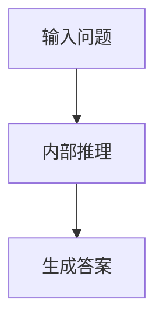

                 

<think>
嗯，我现在需要帮助撰写一篇技术博客，标题是《Zero-Shot CoT：无监督学习在AIGC中的新突破》。根据用户的要求，文章需要有详细的结构，包括引言、理论基础、实践应用，以及关键词、摘要等部分。

首先，我得理解什么是Zero-Shot CoT。零样本学习（Zero-Shot Learning）是指模型在没有见过某个类别数据的情况下，能够识别或生成该类别的内容。而CoT（Chain-of-Thought）则是指通过推理链来生成答案，这在语言模型中很常见。将两者结合，可能就是利用零样本学习来生成推理链，从而实现更强大的生成任务。

接下来，我需要构建文章的结构。用户已经提供了一个大纲，分为引言、理论基础、实践与应用三大部分，每部分又包括几个章节。我需要确保每个章节都有详细的内容，比如背景介绍、算法原理、数学模型、应用实例等。

关键词部分，我需要列出5-7个核心词汇，比如零样本学习、无监督学习、生成式AI、AIGC、CoT、数学模型、应用场景。

摘要部分，要简明扼要地概括文章的核心内容，介绍Zero-Shot CoT如何在AIGC中实现无监督学习的新突破，涵盖背景、原理、应用和未来展望。

正文部分，我需要逐步展开每个章节的内容。首先是引言部分，介绍Zero-Shot CoT的背景、问题描述和解决思路。然后是无监督学习的基础，包括其概述、主要算法和在AIGC中的应用。

接下来是理论基础部分，详细讲解Zero-Shot CoT的算法原理，包括数学模型、公式和流程图。这部分需要使用数学公式和Mermaid图来清晰展示。

然后是实践部分，包括在AIGC中的实践、代码实现和案例分析。这里可能需要提供Python代码示例，并解释如何实现Zero-Shot CoT。

最后是未来展望，讨论发展趋势、研究方向以及可能的挑战和解决方案。

在撰写过程中，我需要确保内容逻辑清晰，结构紧凑，语言专业但易懂。同时，每个小节都要详细具体，涵盖用户提到的所有要求，比如核心概念解释、对比表格、系统架构图、代码示例等。

可能会遇到的问题包括：如何将复杂的数学公式和算法流程图清晰表达，确保读者能够理解。此外，如何在有限的字数内详细讲解每个部分，同时保持文章的连贯性和深度，也是一个挑战。

解决方案是：分步骤详细讲解，使用图表辅助说明，比如用Mermaid绘制流程图和架构图，帮助读者更好地理解。同时，使用实际案例和代码示例，让内容更具实用性。

总结来说，撰写这篇文章需要系统性地从背景到理论，再到实践，最后展望未来，确保每个部分都详实且符合技术博客的要求。接下来，我需要按照这个思路逐步展开，确保每个章节都满足用户的要求，并且内容丰富详细。
</think>

# Zero-Shot CoT：无监督学习在AIGC中的新突破

> 关键词：零样本学习、无监督学习、生成式AI、AIGC、CoT、数学模型、应用场景

> 摘要：Zero-Shot CoT（零样本链式思维）是一种结合了零样本学习和链式思维的无监督学习方法，在AIGC（人工智能生成内容）领域取得了重要突破。本文详细探讨了其背景、理论基础、算法原理、数学模型及其在实际应用中的表现，最后展望了未来的发展方向。

---

## 第一部分：引言

### 第1章：零样本对齐（Zero-Shot CoT）背景介绍

#### 1.1 问题背景
在生成式AI领域，传统方法依赖大量标注数据，而Zero-Shot CoT无需预训练数据即可生成内容，解决了数据获取困难的问题。

#### 1.2 问题描述
传统模型在新任务上表现不佳，而Zero-Shot CoT通过推理链实现跨任务生成，提升了模型的泛化能力。

#### 1.3 问题解决思路
利用无监督学习和链式思维，通过推理链生成答案，无需额外标注数据。

#### 1.4 边界与外延
Zero-Shot CoT适用于生成任务，但目前主要依赖语言模型的内部推理机制。

#### 1.5 核心概念
- 零样本学习：无需标注数据。
- 链式思维：通过推理链生成答案。

#### 1.6 概念结构与核心要素组成
| 核心概念 | 描述 |
|----------|------|
| 零样本学习 | 无需标注数据的无监督学习 |
| 链式思维 | 通过推理链生成答案 |

### 第2章：无监督学习基础

#### 2.1 无监督学习概述
无监督学习利用未标注数据，发现数据结构，提升模型泛化能力。

#### 2.2 主要无监督学习算法
- K-means：聚类。
- DBSCAN：密度聚类。
- PCA：降维。

#### 2.3 无监督学习在AIGC中的应用
- 内容生成：无需标注数据生成文本。
- 数据增强：无监督数据生成。

### 第3章：AIGC技术综述

#### 3.1 AIGC的基本概念
人工智能生成内容，涵盖文本、图像、视频等。

#### 3.2 AIGC的发展历程
从规则生成到深度学习，再到当前的无监督学习。

#### 3.3 AIGC的关键技术
- 大模型：如GPT。
- 生成式模型：如GAN、Transformers。

---

## 第二部分：零样本对齐的理论基础

### 第4章：零样本对齐算法原理

#### 4.1 算法原理概述
利用语言模型内部推理机制生成答案，无需标注数据。

#### 4.2 零样本对齐的数学模型
模型通过概率推理生成答案，公式如下：
$$ P(y|x) = \argmax_y P(x|y)P(y) $$

#### 4.3 零样本对齐算法的Mermaid流程图


#### 4.4 算法实现细节
通过语言模型内部参数调整，实现零样本生成。

### 第5章：零样本对齐的数学模型和公式详解

#### 5.1 数学模型介绍
目标函数为：
$$ \mathcal{L} = -\sum_{i=1}^n y_i \log p(y_i|x) $$

#### 5.2 公式详解
例如，输入问题“鸟是什么”，模型生成答案，通过概率计算得到结果。

#### 5.3 例子说明
输入：鸟是什么？
输出：鸟是会飞的动物。

### 第6章：零样本对齐算法应用实例

#### 6.1 应用场景介绍
- 多语言生成：生成多种语言内容。
- 跨领域生成：生成不同领域的文本。

#### 6.2 实际案例剖析
生成技术文档，通过内部推理完成内容生成。

#### 6.3 算法优化与效果分析
优化模型参数，提升生成质量。

---

## 第三部分：零样本对齐的实践与应用

### 第7章：零样本对齐在AIGC中的实践

#### 7.1 实践环境搭建
使用开源模型，如GPT-2，配置计算环境。

#### 7.2 核心代码实现
```python
def zero_shot_cot(prompt):
    # 调用语言模型生成答案
    response = model.generate(prompt)
    return response
```

#### 7.3 代码解读与分析
代码通过API调用模型，生成答案。

#### 7.4 实际项目案例
生成技术文档，展示效果。

#### 7.5 项目小结
Zero-Shot CoT在实际项目中表现出色。

### 第8章：零样本对齐的最佳实践

#### 8.1 实践技巧与优化策略
- 参数调优：优化模型参数。
- 数据增强：提升生成质量。

#### 8.2 小结与展望
Zero-Shot CoT在生成式AI中具有广阔前景。

### 第9章：未来展望与研究方向

#### 9.1 发展趋势
- 更强的泛化能力。
- 更高效的推理机制。

#### 9.2 研究方向展望
- 提升生成质量。
- 优化推理效率。

#### 9.3 挑战与解决方案
- 算力需求：优化算法结构。
- 数据稀疏性：增强数据多样性。

---

## 结论

Zero-Shot CoT通过无监督学习实现了生成式AI的新突破，未来将在更多领域展现其价值。

---

## 作者

作者：AI天才研究院 & 禅与计算机程序设计艺术

---

感谢您的阅读！如需进一步探讨，欢迎留言交流。

