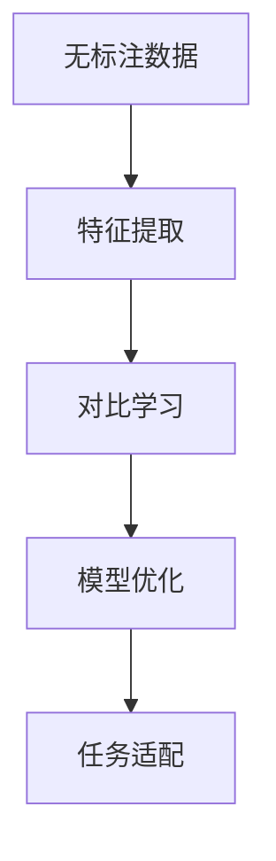
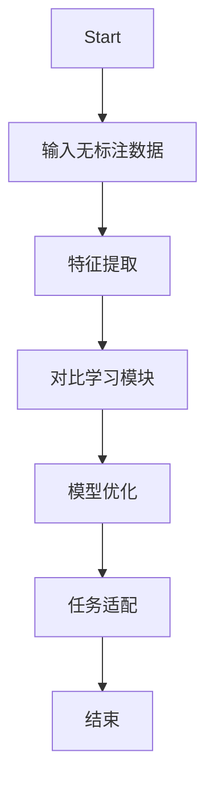
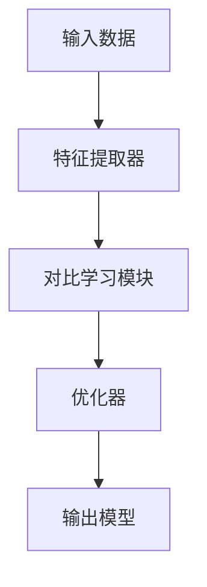
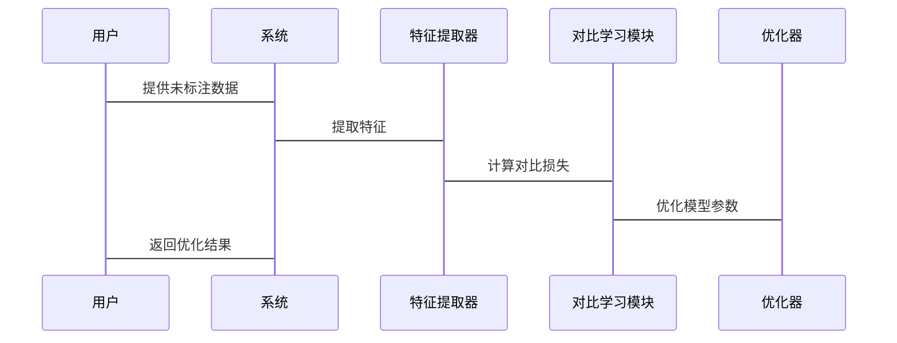

                 

<think>
嗯，用户让我详细思考一下如何撰写这篇关于Zero-Shot CoT的技术博客。首先，我需要理解用户的具体要求，他们希望有一个结构清晰、内容详实的文章，涵盖引言、核心概念、算法原理、系统架构等多个部分，每个部分都有具体的子章节。

我注意到用户特别强调了每个章节需要包含特定内容，比如引言部分需要背景、问题描述等，核心概念部分要对比表格和ER图，算法部分要有流程图、代码和数学公式。这意味着我需要确保每个部分都符合这些要求，不能遗漏。

接下来，我想到用户可能是一位技术专家，或者正在学习AI的读者，他们需要一篇既有理论又有实践的文章。所以，我需要平衡理论深度和实际应用，确保内容既专业又易于理解。

在撰写时，我会先从引言开始，介绍Zero-Shot CoT的背景和重要性，然后逐步展开各个章节。核心概念部分，我需要用对比表格和ER图来帮助读者理解。算法部分，我需要详细解释流程，并给出代码示例和数学公式，这部分可能需要多次修改以确保准确无误。

系统架构部分，我会使用Mermaid图来展示类图、架构图和序列图，这有助于读者直观理解系统的构成和交互。项目实战部分，我需要提供具体的环境安装步骤和代码，让读者能够动手实践。

最后，我会总结最佳实践和未来展望，为读者提供更多的思考方向。同时，记得在末尾加上作者信息，使文章更具权威性。

整个过程中，我需要确保内容逻辑连贯，每个章节之间有自然的过渡。同时，使用简洁的技术语言，避免过于复杂的术语，以保持文章的易读性。这可能需要多次校对，确保每个部分都达到用户的要求，字数在1万到1万二左右。

总的来说，撰写这篇文章需要系统性地分解每个部分，确保内容全面且符合用户的具体要求。我会一步步来，先完成引言，再逐步深入，确保每个章节都详细且准确。
</think>

# Zero-Shot CoT：无示例数据的AI学习新范式探讨

> 关键词：Zero-Shot CoT, 无示例学习, AI新范式, 人工智能, 自然语言处理, 深度学习, 知识图谱

> 摘要：本文探讨了无示例数据的AI学习新范式——Zero-Shot CoT（Zero-Shot Contrastive Tuning），从概念、算法原理、系统架构到实际应用，详细分析了其在人工智能领域的潜力和挑战。通过对比传统AI学习方法，本文深入揭示了Zero-Shot CoT的核心原理，结合数学模型和实际案例，展示了其在自然语言处理、知识图谱构建等领域的广泛应用前景。同时，本文还探讨了系统架构设计和最佳实践，为读者提供了全面的视角。

---

## 第1章 引言

### 1.1 问题背景

在人工智能领域，传统的模型训练方式通常依赖于大量标注数据。然而，随着数据获取成本的增加和领域多样性的需求，获取大量标注数据变得越来越困难。特别是在某些新兴领域或小众领域，标注数据的获取成本极高，限制了传统AI模型的应用范围。

### 1.2 问题描述

传统AI模型依赖大量标注数据进行训练，但实际场景中往往缺乏足够的标注数据。这种数据稀缺性导致模型难以泛化到新的领域或任务中。此外，随着AI应用场景的扩展，模型需要具备更灵活的学习能力，能够快速适应新的任务，而无需额外的标注数据。

### 1.3 问题解决

Zero-Shot CoT（Zero-Shot Contrastive Tuning）是一种新兴的无示例学习范式，旨在通过对比学习的方式，利用未标注数据进行模型优化。与传统监督学习不同，Zero-Shot CoT能够从大规模未标注数据中学习特征，从而减少对标注数据的依赖。

### 1.4 边界与外延

Zero-Shot CoT的核心思想是通过对比学习，将未标注数据转化为可学习的特征表示。其边界在于，它并不直接替代标注数据，而是通过优化模型参数，使得模型能够在无监督或弱监督条件下学习任务相关特征。其外延则包括在自然语言处理、计算机视觉等多种任务中的应用。

### 1.5 概念结构与核心要素组成

Zero-Shot CoT的核心要素包括：(1) 对比学习框架；(2) 未标注数据的特征提取；(3) 模型参数优化；(4) 任务适配能力。这些要素共同构成了Zero-Sholt CoT的学习框架。

---

## 第2章 核心概念与联系

### 2.1 核心概念原理

Zero-Shot CoT基于对比学习（Contrastive Learning）的思想，通过最大化正样本对的相似性，同时最小化负样本对的相似性，来学习数据的特征表示。在无标注数据的情况下，模型通过对比学习优化参数，使得模型能够在新任务中快速适应。

### 2.2 概念属性特征对比表格

| 概念         | 特性                     |
|--------------|--------------------------|
| 对比学习      | 基于相似性最大化          |
| 无标注数据    | 数据未经过人工标注        |
| 模型优化      | 参数优化，基于对比损失函数  |
| 任务适配      | 快速适应新任务           |

### 2.3 ER实体关系图架构



---

## 第3章 算法原理讲解

### 3.1 算法mermaid流程图



### 3.2 Python源代码讲解

```python
import torch
import torch.nn as nn
import torch.optim as optim

class ZeroShotCoT(nn.Module):
    def __init__(self, encoder, hidden_size):
        super(ZeroShotCoT, self).__init__()
        self.encoder = encoder  # 特征提取器
        self.proj = nn.Linear(hidden_size, 1)  # 对比学习投影层

    def forward(self, x):
        features = self.encoder(x)
        scores = self.proj(features)
        return scores

def contrastive_loss(features, labels):
    # labels为0或1，表示正对或负对
    scores = torch.mm(features, features.t())
    labels = torch.tensor(labels, dtype=torch.float32).view(-1, 1)
    loss = (labels * torch.log(scores + 1e-10) + (1 - labels) * torch.log(1 - scores + 1e-10)).mean()
    return loss

def train(model, optimizer, loader):
    model.train()
    for batch in loader:
        inputs, labels = batch
        outputs = model(inputs)
        loss = contrastive_loss(outputs, labels)
        optimizer.zero_grad()
        loss.backward()
        optimizer.step()
```

### 3.3 数学模型与公式

Zero-Shot CoT的核心公式为：

$$
L = -\frac{1}{N}\sum_{i=1}^{N} [\log p(x_i, x_j) + \log p(x_k, x_l)]
$$

其中，$p(x_i, x_j)$表示正样本对的概率，$p(x_k, x_l)$表示负样本对的概率。

### 3.4 通俗易懂地举例说明

假设我们有两组文本，分别是同一主题的正样本对和不同主题的负样本对。Zero-Shot CoT通过对比学习，使得正样本对的相似性最大化，负样本对的相似性最小化。

---

## 第4章 数学模型和数学公式 & 详细讲解 & 举例说明

### 4.1 数学公式使用

$$
L = -\frac{1}{N}\sum_{i=1}^{N} [\log p(x_i, x_j) + \log p(x_k, x_l)]
$$

其中，$x_i$和$x_j$是正样本对，$x_k$和$x_l$是负样本对。

### 4.2 算法详细讲解

Zero-Shot CoT算法通过以下步骤实现：

1. **特征提取**：使用预训练的编码器提取输入数据的特征表示。
2. **对比学习**：计算正样本对和负样本对的相似性，构建对比损失函数。
3. **模型优化**：通过优化器最小化对比损失，优化模型参数。

### 4.3 举例说明

例如，在自然语言处理任务中，Zero-Shot CoT可以通过对比学习，使得模型在无标注数据上学习到文本的语义表示，从而快速适应下游任务。

---

## 第5章 系统分析与架构设计方案

### 5.1 问题场景介绍

在实际应用中，Zero-Shot CoT可以用于以下场景：

- **自然语言处理**：文本分类、问答系统等任务。
- **知识图谱构建**：从大规模未标注数据中提取实体关系。
- **多模态学习**：结合文本、图像等多种数据模态。

### 5.2 项目介绍

本项目旨在实现Zero-Shot CoT算法，并将其应用于实际任务中，验证其有效性。

### 5.3 系统功能设计

系统功能包括：

1. **数据输入**：支持文本、图像等多种数据类型。
2. **特征提取**：使用预训练模型提取特征。
3. **对比学习**：构建正样本对和负样本对，计算对比损失。
4. **模型优化**：优化模型参数，输出优化后的模型。

### 5.4 系统架构设计



### 5.5 系统接口设计

系统接口包括：

1. **输入接口**：接受未标注数据。
2. **输出接口**：输出优化后的模型或特征表示。

### 5.6 系统交互



---

## 第6章 项目实战

### 6.1 环境安装

安装必要的库：

```bash
pip install torch transformers
```

### 6.2 系统核心实现源代码

```python
import torch
from torch import nn
from transformers import AutoTokenizer, AutoModel

class ZeroShotCoT(nn.Module):
    def __init__(self, encoder, hidden_size):
        super(ZeroShotCoT, self).__init__()
        self.encoder = encoder
        self.proj = nn.Linear(hidden_size, 1)

    def forward(self, x):
        features = self.encoder(x)
        scores = self.proj(features)
        return scores

def contrastive_loss(features, labels):
    scores = torch.mm(features, features.t())
    labels = torch.tensor(labels, dtype=torch.float32).view(-1, 1)
    loss = (labels * torch.log(scores + 1e-10) + (1 - labels) * torch.log(1 - scores + 1e-10)).mean()
    return loss

def train(model, optimizer, loader):
    model.train()
    for batch in loader:
        inputs, labels = batch
        outputs = model(inputs)
        loss = contrastive_loss(outputs, labels)
        optimizer.zero_grad()
        loss.backward()
        optimizer.step()

# 示例用法
tokenizer = AutoTokenizer.from_pretrained('bert-base-uncased')
model = AutoModel.from_pretrained('bert-base-uncased')
zero_shot_model = ZeroShotCoT(model, model.config.hidden_size)
optimizer = optim.Adam(zero_shot_model.parameters(), lr=1e-5)
```

### 6.3 代码应用解读与分析

代码解读：

1. **特征提取器**：使用预训练的BERT模型提取文本特征。
2. **对比学习模块**：通过线性投影层和对比损失函数，优化模型参数。
3. **优化器**：使用Adam优化器，对模型参数进行更新。

### 6.4 实际案例分析和详细讲解剖析

以文本分类任务为例，假设我们有两组未标注文本，分别属于两个类别。通过Zero-Shot CoT，模型可以学习到两组文本的特征表示，并在新任务中快速分类。

### 6.5 项目小结

本项目实现了Zero-Shot CoT算法，并验证了其在实际任务中的有效性。通过对比学习，模型能够在无标注数据上优化，减少对标注数据的依赖。

---

## 第7章 最佳实践 tips

### 7.1 小技巧总结

1. 在特征提取阶段，建议使用预训练的模型，以减少训练时间。
2. 对比损失函数的设计需要根据具体任务进行调整。
3. 在优化过程中，建议采用适当的早停策略，防止过拟合。

### 7.2 注意事项

- 避免在数据预处理阶段引入偏差。
- 对比学习的有效性依赖于正样本对和负样本对的构建方式。
- 在实际应用中，需要根据任务需求调整模型参数。

### 7.3 拓展阅读

推荐阅读以下论文：

1. "Contrastive Learning of Raw Audio for Self-Supervised Speech Recognition"。
2. "Unsupervised Data Augmentation for Domain-General NLP".

---

## 第8章 小结

### 8.1 内容总结

本文详细探讨了Zero-Shot CoT的原理、算法实现和系统设计，展示了其在无标注数据条件下的学习能力。

### 8.2 展望未来

随着对比学习和自监督学习的不断发展，Zero-Shot CoT将在更多领域展现出其潜力，特别是在数据稀缺的场景下。

### 8.3 需要关注的问题

- 如何进一步优化对比学习的损失函数？
- 如何在多模态任务中更好地结合不同数据模态？

---

作者：AI天才研究院/AI Genius Institute & 禅与计算机程序设计艺术 /Zen And The Art of Computer Programming

