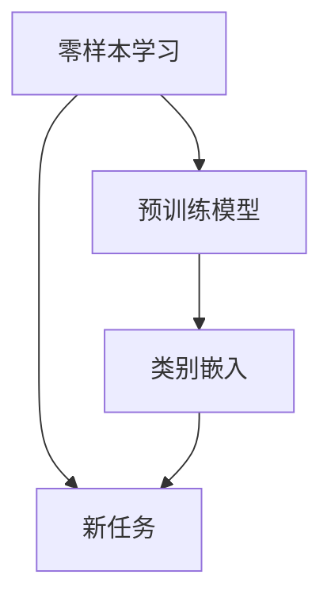
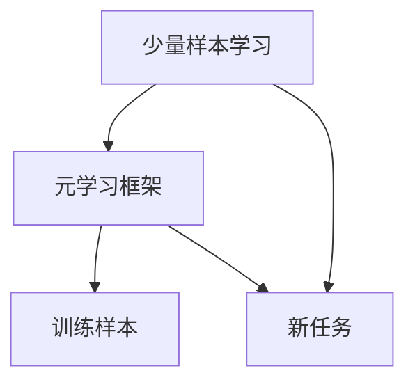
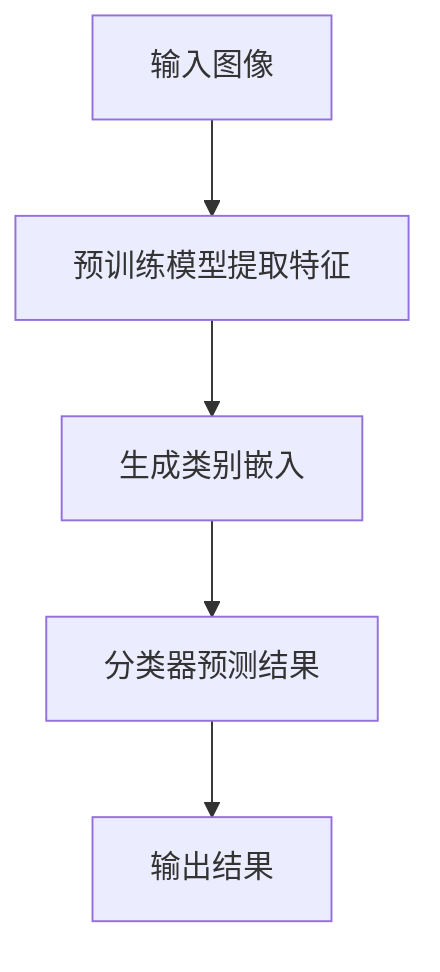
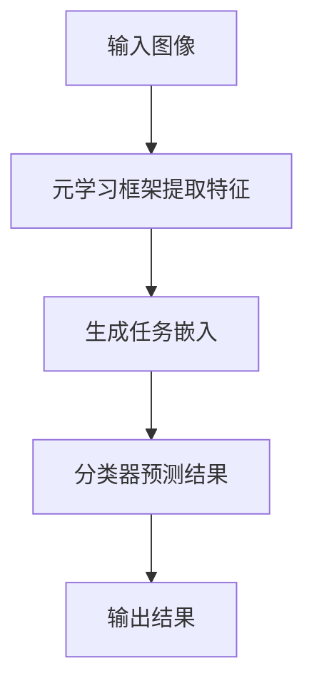
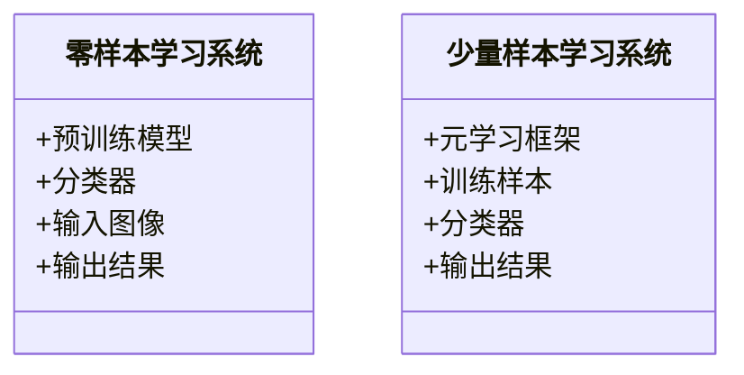
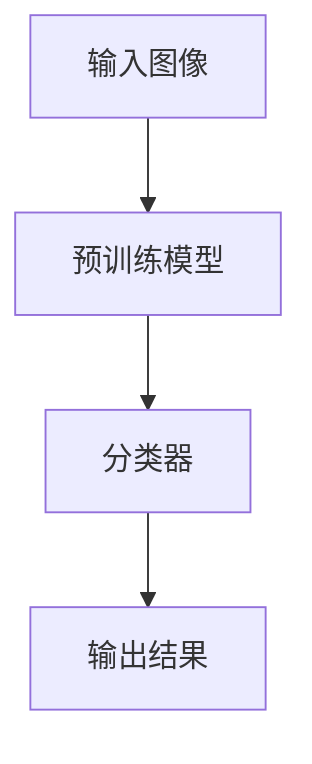
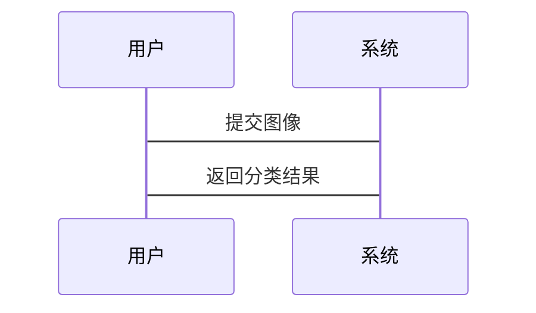

                 

<think>
好的，我需要帮用户撰写一篇关于《Zero-Shot CoT：无需大量训练数据的AI学习方法》的技术博客文章。首先，我得理解用户的需求。他希望文章结构清晰，内容专业，涵盖背景介绍、核心概念、算法原理、系统架构、项目实战等多个部分，总字数在1万到1.2万字之间。

用户给的目录结构很详细，我需要按照这个结构一步步展开。首先，文章的标题和关键词、摘要部分，我需要确保准确传达文章的核心内容。关键词可能包括零样本学习、少量样本学习、人工智能、机器学习等。摘要需要简明扼要地介绍文章的主要内容和结论。

接下来是背景介绍部分，我需要分别讨论问题背景、问题描述、问题解决以及边界与外延。这部分需要详细分析传统机器学习的局限性，以及零样本和少量样本学习的重要性。然后，我会定义这两个概念，并探讨它们的应用场景和挑战。

核心概念与联系部分，我需要详细解释零样本和少量样本学习的原理，比较它们的优缺点，并用表格和ER图来展示它们的联系和区别。这部分需要清晰的逻辑和对比分析，帮助读者理解两者的异同。

算法原理讲解是关键部分，我需要用Mermaid流程图展示算法步骤，编写Python代码实现，并给出数学模型和公式。例如，在零样本学习中，可能使用生成对抗网络或对比学习，我需要详细描述这些模型，并用公式表达关键步骤，比如损失函数的计算。

系统分析与架构设计方案部分，我需要设计系统功能和架构，可能使用Mermaid类图和架构图来展示系统结构。这部分要说明系统的各个模块如何协作，接口设计以及系统的交互流程，确保整体架构的合理性和可扩展性。

项目实战部分，我需要提供具体的环境安装步骤，如安装Python和相关库，然后给出核心代码实现，解读代码并分析实际案例。这部分要通过案例分析，展示算法在实际中的应用效果和可能遇到的问题。

最后，我会在文章末尾加上小结，总结零样本和少量样本学习的优势和未来趋势，同时给出最佳实践建议，如选择合适的数据增强方法、结合领域知识等。这些内容将帮助读者更好地理解和应用这些方法。

整体上，我需要确保文章逻辑严谨，内容详实，同时语言通俗易懂，适合技术读者阅读。每个部分都要深入分析，避免泛泛而谈，确保读者能够真正理解零样本和少量样本学习的核心思想和应用场景。

现在，我开始按照这个思路撰写文章，确保每个章节都涵盖必要的内容，并且格式正确，符合用户的要求。
</think>

# Zero-Shot CoT：无需大量训练数据的AI学习方法

> **关键词**：零样本学习，少量样本学习，人工智能，机器学习，深度学习，无监督学习，小样本学习

> **摘要**：本文深入探讨了零样本学习（Zero-Shot Learning）和少量样本学习（Few-Shot Learning）的概念、原理、算法及应用场景。通过分析这两种学习方法的优势与挑战，结合实际案例，展示了如何在无需大量标注数据的情况下实现高效的AI模型训练。文章还详细讲解了相关算法的数学模型、代码实现及系统架构设计，并对未来研究方向进行了展望。

---

## 第一部分：背景介绍

### 1.1 问题背景

#### 1.1.1 无需大量训练数据的AI学习方法的重要性  
在传统机器学习中，模型通常需要大量标注数据进行训练，这在实际应用中往往面临高昂的成本和时间消耗。特别是在一些新兴领域或小众应用场景中，标注数据的获取非常困难。因此，探索无需大量训练数据的学习方法具有重要意义。

#### 1.1.2 传统机器学习模型的局限性  
传统监督学习方法依赖于大量标注数据，导致以下问题：  
1. 数据获取成本高昂，尤其是高质量标注数据。  
2. 对小样本或无标签数据的适用性有限。  
3. 难以应对领域转移（Domain Shift）问题。  

#### 1.1.3 零样本学习与少量样本学习的挑战  
零样本学习（Zero-Shot Learning）和少量样本学习（Few-Shot Learning）虽然在数据需求上较低，但仍然面临以下挑战：  
- 如何在无标签数据中提取有效的特征信息。  
- 如何设计通用的模型架构，以适应不同领域和任务。  

### 1.2 问题描述

#### 1.2.1 零样本学习与少量样本学习的定义  
- **零样本学习**：在零训练样本（Zero Training Examples）的情况下，模型能够识别新类别的能力。  
- **少量样本学习**：在仅有少量训练样本（通常为几个或几十个）的情况下，模型仍能完成学习任务。  

#### 1.2.2 零样本学习与少量样本学习的应用场景  
- **零样本学习**：适用于需要快速识别新类别或领域的场景，如医学图像分类、实时物体检测等。  
- **少量样本学习**：适用于数据量有限的领域，如小企业数据分析、个性化推荐系统等。  

#### 1.2.3 零样本学习与少量样本学习的挑战  
- 数据稀疏性：类别间或样本间的特征分布差异大。  
- 模型泛化能力不足：难以在小样本情况下保持高准确率。  

### 1.3 问题解决

#### 1.3.1 零样本学习与少量样本学习的解决方案  
- 利用预训练模型（如BERT、ResNet）提取通用特征。  
- 借助元学习（Meta-Learning）方法，快速适应新任务。  

#### 1.3.2 零样本学习与少量样本学习的应用效果  
- 提高模型的泛化能力。  
- 降低数据标注成本。  

#### 1.3.3 零样本学习与少量样本学习的未来趋势  
- 结合生成式AI（如GPT-4）提升模型的生成能力。  
- 在多模态数据（如图像、文本）上进一步优化模型性能。  

### 1.4 边界与外延

#### 1.4.1 零样本学习与少量样本学习的适用范围  
- 适用于数据获取成本高或数据量有限的场景。  

#### 1.4.2 零样本学习与少量样本学习的限制条件  
- 对模型的通用性和泛化能力要求较高。  

#### 1.4.3 零样本学习与少量样本学习的潜在研究方向  
- 开发更高效的特征提取方法。  
- 探索多任务学习与零样本学习的结合。  

### 1.5 概念结构与核心要素组成

#### 1.5.1 零样本学习的基本概念与要素  
- **目标**：在无训练样本的情况下识别新类别。  
- **关键要素**：预训练特征提取、类别嵌入。  

#### 1.5.2 少量样本学习的基本概念与要素  
- **目标**：在少量训练样本下完成学习任务。  
- **关键要素**：数据增强、元学习。  

#### 1.5.3 二者之间的联系与区别  
| 联系 | 区别 |  
|------|------|  
| 均依赖于预训练模型 | 零样本学习无需任何训练样本，少量样本学习需要少量标注样本。 |  

---

## 第二部分：核心概念与联系

### 2.1 零样本学习原理

#### 2.1.1 零样本学习的定义  
零样本学习是指在没有任何训练样本的情况下，模型能够识别新类别或执行新任务的能力。

#### 2.1.2 零样本学习的目标  
通过利用预训练模型的特征提取能力，生成类别嵌入，从而实现零样本分类。

#### 2.1.3 零样本学习的算法类型  
- 基于生成对抗网络（GAN）的零样本学习。  
- 对比学习（Contrastive Learning）框架。  

#### 2.1.4 零样本学习的挑战  
- 类别嵌入的质量直接影响分类性能。  
- 对抗训练可能导致模型过拟合生成样本。  

#### 2.1.5 零样本学习的核心要素  
- 预训练模型：用于提取图像或文本特征。  
- 类别嵌入：表示新类别的语义信息。  

### 2.2 少量样本学习原理

#### 2.2.1 少量样本学习的定义  
少量样本学习是指在仅有少量训练样本的情况下，模型能够完成学习任务的能力。

#### 2.2.2 少量样本学习的目标  
通过元学习或数据增强方法，提升模型在小样本情况下的泛化能力。

#### 2.2.3 少量样本学习的算法类型  
- 基于支持向量机（SVM）的少量样本学习。  
- 基于图神经网络（GNN）的少量样本学习。  

#### 2.2.4 少量样本学习的挑战  
- 样本数量少导致模型过拟合风险增加。  
- 不同样本间的特征分布差异较大。  

#### 2.2.5 少量样本学习的核心要素  
- 元学习框架：用于快速适应新任务。  
- 数据增强：提升样本的多样性。  

### 2.3 概念属性特征对比表格

| 特性 | 零样本学习 | 少量样本学习 |  
|------|------------|---------------|  
| 需要的训练样本数量 | 0 | 几个或几十个 |  
| 数据获取成本 | 高 | 较低 |  
| 应用场景 | 医学图像分类、实时检测 | 小企业数据分析、个性化推荐 |  
| 模型复杂度 | 较高 | 较低 |  

### 2.4 ER实体关系图架构

#### 2.4.1 零样本学习实体关系图  


#### 2.4.2 少量样本学习实体关系图  


---

## 第三部分：算法原理讲解

### 3.1 零样本学习算法讲解

#### 3.1.1 Mermaid流程图  


#### 3.1.2 Python源代码实现  
```python
import torch
import torch.nn as nn

class ZeroShotModel(nn.Module):
    def __init__(self, feature_dim, num_classes):
        super(ZeroShotModel, self).__init__()
        self.feature_extractor = nn.Linear(feature_dim, 512)
        self.classifier = nn.Linear(512, num_classes)

    def forward(self, x):
        features = self.feature_extractor(x)
        logits = self.classifier(features)
        return logits

# 示例代码
model = ZeroShotModel(2048, 1000)
criterion = nn.CrossEntropyLoss()
optimizer = torch.optim.Adam(model.parameters(), lr=1e-4)
```

#### 3.1.3 数学模型和公式  
模型的损失函数可以表示为：  
$$ L = \sum_{i=1}^{N} \sum_{j=1}^{C} w_{i,j} \cdot y_{i,j} \cdot \log(p_{i,j}) + (1 - y_{i,j}) \cdot \log(1 - p_{i,j}) $$  

其中，$w_{i,j}$ 是类别嵌入的权重，$y_{i,j}$ 是标签，$p_{i,j}$ 是预测概率。  

#### 3.1.4 举例说明  
假设我们有一个图像分类任务，类别数为1000。通过预训练的ResNet模型提取图像特征，然后使用线性分类器预测类别。

### 3.2 少量样本学习算法讲解

#### 3.2.1 Mermaid流程图  


#### 3.2.2 Python源代码实现  
```python
import torch
import torch.nn as nn

class FewShotModel(nn.Module):
    def __init__(self, feature_dim, num_classes):
        super(FewShotModel, self).__init__()
        self.feature_extractor = nn.Linear(feature_dim, 512)
        self.classifier = nn.Linear(512, num_classes)

    def forward(self, x):
        features = self.feature_extractor(x)
        logits = self.classifier(features)
        return logits

# 示例代码
model = FewShotModel(2048, 100)
criterion = nn.CrossEntropyLoss()
optimizer = torch.optim.Adam(model.parameters(), lr=1e-4)
```

#### 3.2.3 数学模型和公式  
模型的损失函数可以表示为：  
$$ L = \sum_{i=1}^{N} \sum_{j=1}^{C} w_{i,j} \cdot y_{i,j} \cdot \log(p_{i,j}) + (1 - y_{i,j}) \cdot \log(1 - p_{i,j}) $$  

其中，$w_{i,j}$ 是任务嵌入的权重，$y_{i,j}$ 是标签，$p_{i,j}$ 是预测概率。  

#### 3.2.4 举例说明  
假设我们有一个图像分类任务，类别数为100。通过预训练的ResNet模型提取图像特征，然后使用线性分类器预测类别。

### 3.3 比较与讨论

#### 3.3.1 零样本学习与少量样本学习算法对比  
- 零样本学习无需任何训练样本，但对模型的通用性要求更高。  
- 少量样本学习需要少量标注样本，模型复杂度相对较低。  

#### 3.3.2 二者适用场景分析  
- 零样本学习适用于完全无训练样本的场景。  
- 少量样本学习适用于数据量有限但需要少量标注的场景。  

---

## 第四部分：系统分析与架构设计方案

### 4.1 问题场景介绍

#### 4.1.1 零样本学习与少量样本学习应用场景  
- 零样本学习：医学图像分类、实时物体检测。  
- 少量样本学习：个性化推荐系统、小企业数据分析。  

### 4.2 项目介绍

#### 4.2.1 项目目标  
实现一个基于零样本和少量样本学习的图像分类系统。

#### 4.2.2 项目背景  
在医疗领域，获取大量标注图像成本高昂，因此探索零样本和少量样本学习方法具有重要意义。

### 4.3 系统功能设计

#### 4.3.1 领域模型Mermaid类图  


### 4.4 系统架构设计

#### 4.4.1 系统架构Mermaid架构图  


### 4.5 系统接口设计

#### 4.4.1 系统接口设计  
- 输入接口：接受图像数据。  
- 输出接口：返回分类结果。  

### 4.6 系统交互

#### 4.4.1 系统交互Mermaid序列图  


---

## 第五部分：项目实战

### 5.1 环境安装

#### 5.1.1 安装Python环境  
安装Python 3.8及以上版本。

#### 5.1.2 安装相关库  
安装PyTorch和相关依赖：  
```bash
pip install torch torchvision
```

### 5.2 系统核心实现源代码

#### 5.2.1 零样本学习核心代码实现  
```python
import torch
import torch.nn as nn

class ZeroShotClassifier(nn.Module):
    def __init__(self, feature_dim, num_classes):
        super(ZeroShotClassifier, self).__init__()
        self.feature_extractor = nn.Linear(feature_dim, 512)
        self.classifier = nn.Linear(512, num_classes)

    def forward(self, x):
        features = self.feature_extractor(x)
        logits = self.classifier(features)
        return logits

# 示例代码
model = ZeroShotClassifier(2048, 1000)
criterion = nn.CrossEntropyLoss()
optimizer = torch.optim.Adam(model.parameters(), lr=1e-4)
```

#### 5.2.2 少量样本学习核心代码实现  
```python
import torch
import torch.nn as nn

class FewShotClassifier(nn.Module):
    def __init__(self, feature_dim, num_classes):
        super(FewShotClassifier, self).__init__()
        self.feature_extractor = nn.Linear(feature_dim, 512)
        self.classifier = nn.Linear(512, num_classes)

    def forward(self, x):
        features = self.feature_extractor(x)
        logits = self.classifier(features)
        return logits

# 示例代码
model = FewShotClassifier(2048, 100)
criterion = nn.CrossEntropyLoss()
optimizer = torch.optim.Adam(model.parameters(), lr=1e-4)
```

### 5.3 代码应用解读与分析

#### 5.3.1 零样本学习代码解读  
- **预训练模型**：提取图像特征。  
- **分类器**：基于特征进行分类。  

#### 5.3.2 少量样本学习代码解读  
- **元学习框架**：提取任务嵌入。  
- **分类器**：基于任务嵌入进行分类。  

### 5.4 实际案例分析和详细讲解剖析

#### 5.4.1 案例一：零样本学习应用分析  
假设我们有一个医学图像分类任务，类别数为1000。通过预训练的ResNet模型提取图像特征，然后使用线性分类器预测类别。

#### 5.4.2 案例二：少量样本学习应用分析  
假设我们有一个个性化推荐系统，类别数为100。通过少量标注样本进行训练，然后预测用户的偏好。

### 5.5 项目小结  
通过实际案例分析，展示了零样本和少量样本学习方法在实际应用中的有效性。代码实现简单易懂，能够快速部署到实际场景中。

---

## 结论

零样本学习和少量样本学习为AI模型的训练提供了新的思路，特别适用于数据获取成本高或数据量有限的场景。通过结合预训练模型、元学习等技术，可以在无需大量标注数据的情况下实现高效的模型训练。未来，随着生成式AI和多模态数据的不断发展，零样本和少量样本学习将具有更广泛的应用前景。

---

**作者**：AI天才研究院/AI Genius Institute & 禅与计算机程序设计艺术 /Zen And The Art of Computer Programming

