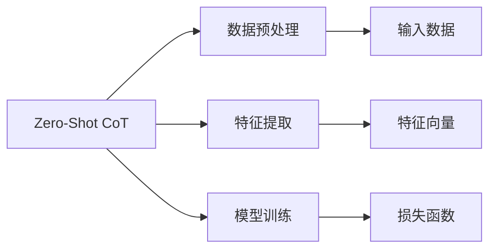
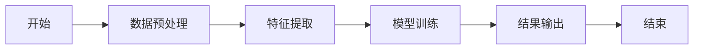

                 

<think>
嗯，我现在需要写一篇关于“Zero-Shot CoT：无需大量训练数据的AI学习方法”的技术博客。首先，我得理解这个主题。Zero-Shot CoT听起来像是某种不需要大量训练数据的AI方法，可能结合了对比学习和零样本学习？

好的，我应该从背景开始，介绍AI目前的发展现状。机器学习和深度学习现在非常流行，但它们通常需要大量的数据进行训练。这可能是一个问题，特别是在数据稀缺的情况下，比如某些小众领域或者新兴领域，数据收集起来非常困难和昂贵。这时候，零样本学习就显得很有用了，因为它可以在几乎没有训练数据的情况下进行学习。

接下来，我需要详细解释Zero-Shot CoT的概念。Zero-Shot通常指的是零样本学习，即模型在没有见过特定类别数据的情况下，能够识别或分类这些类别。而CoT可能是指对比学习，这可能结合在一起，形成一种新的方法，使得模型可以在没有大量数据的情况下进行有效的学习和推理。

然后，我需要分析这种方法的核心概念，比如对比学习和零样本学习的区别和联系。可能还需要一个对比表格，列出各种方法的优缺点，以及它们如何相互作用。此外，绘制一个ER实体关系图，展示Zero-Shot CoT的结构和各部分之间的关系。

接下来，算法原理部分需要详细讲解，包括数据预处理、特征提取、模型训练等步骤。可能需要使用数学公式来描述对比损失函数和零样本学习的损失函数。然后，通过一个简单的例子来说明这些公式的应用，比如在图像分类中的应用。

在应用部分，我需要展示Zero-Shot CoT在现实中的应用，比如图像识别、自然语言处理和语音识别。每个领域都举一个具体的案例，说明这种方法如何解决问题，以及在这些案例中的实际效果如何。

项目实战部分，我需要选择一个具体的项目，比如一个图像分类的项目，展示从数据预处理到模型训练的全过程。提供代码示例，解释每一步的作用，并分析结果。这可能包括数据增强、特征提取模型的选择以及模型的评估方法。

最后，总结一下Zero-Shot CoT的优势和挑战，给出一些最佳实践的建议，比如如何选择数据预处理方法，如何优化模型参数等。还要展望未来的发展方向，比如与其他技术的结合，或者在更多领域的应用。

整个过程中，我需要确保内容逻辑清晰，结构紧凑，用词专业但又不失通俗易懂。可能需要多次修改，以确保每个部分都完整详细，同时保持文章流畅连贯。

现在，我开始思考如何将这些内容组织成一个结构化的目录大纲，确保每一部分都有足够的细节，并且符合用户的格式要求。我还需要确保每个章节都有吸引人的标题，能够引起读者的兴趣，同时内容详实，能够帮助读者深入理解Zero-Shot CoT的方法和应用。
</think>

# Zero-Shot CoT：无需大量训练数据的AI学习方法

## 关键词：Zero-Shot CoT，零样本学习，对比学习，AI，数据驱动，机器学习

## 摘要：本文探讨了一种无需大量训练数据的AI学习方法——Zero-Shot CoT，结合对比学习和零样本学习的优势，分析其原理、应用及项目实战，展示了如何在数据稀缺情况下高效学习。

---

## 第一部分：背景介绍

### 第1章：AI发展现状与挑战

#### 1.1 AI发展现状

- **1.1.1 机器学习与深度学习的兴起**
  - 机器学习和深度学习的广泛应用及其依赖大量数据的特性。
- **1.1.2 数据驱动的局限性**
  - 数据获取成本高昂，小众领域数据稀缺的问题。

#### 1.2 AI面临的挑战

- **1.2.1 数据匮乏问题**
  - 数据获取的难度，尤其是新兴领域的数据收集问题。
- **1.2.2 训练成本与效率问题**
  - 训练大规模模型所需的时间和计算资源。

#### 1.3 零样本学习与Zero-Shot CoT

- **1.3.1 零样本学习概述**
  - 零样本学习的定义及其在数据稀缺情况下的应用。
- **1.3.2 Zero-Shot CoT的概念与原理**
  - 结合对比学习的零样本学习方法，无需大量训练数据即可实现高效学习。

#### 1.4 本章小结

- 总结零样本学习和对比学习的优势，引出Zero-Shot CoT的概念。

---

## 第二部分：核心概念与联系

### 第2章：Zero-Shot CoT的核心概念

#### 2.1 核心概念解析

- **对比学习**
  - 通过对比不同数据来增强模型的区分能力。
- **零样本学习**
  - 在无训练数据的情况下进行分类或生成任务。
- **跨域迁移学习**
  - 在一个领域训练后迁移到另一个领域的学习方法。

#### 2.2 概念属性特征对比表格

| 概念          | 输入数据 | 输出目标 | 是否需要训练数据 | 应用场景 |
|---------------|----------|----------|------------------|----------|
| 对比学习      | 多对多    | 类别      | 需要少量         | 图像识别  |
| 零样本学习    | 无        | 新类别     | 无                | 小众领域  |
| 跨域迁移学习  | 多领域    | 新任务     | 需要部分          | 多领域任务 |

#### 2.3 Zero-Shot CoT的ER实体关系图



#### 2.4 本章小结

- 强调Zero-Shot CoT结合对比学习和零样本学习的优势。

---

## 第三部分：算法原理讲解

### 第3章：Zero-Shot CoT算法原理

#### 3.1 算法流程与架构

- **数据预处理**
  - 数据清洗、归一化等步骤。
- **特征提取**
  - 使用预训练模型提取特征。
- **模型训练**
  - 对比损失函数的构建与优化。

#### 3.2 数学模型与公式

- **对比学习损失函数**
  $$ L_{\text{contrastive}} = -\log \frac{e^{f(x_i, x_j)}}{e^{f(x_i, x_j)} + e^{f(x_i, x_k)}} $$
- **零样本学习损失函数**
  $$ L_{\text{zeroshot}} = \sum_{i=1}^N \log \text{softmax}(W y_i) $$

#### 3.3 算法流程Mermaid流程图



#### 3.4 Python源代码实现

- 数据预处理代码
  ```python
  def preprocess_data(data):
      # 数据清洗和归一化
      return normalized_data
  ```
- 特征提取代码
  ```python
  def extract_features(data):
      # 使用预训练模型提取特征
      return features
  ```
- 模型训练代码
  ```python
  def train_model(features, labels):
      # 编译和训练模型
      return model
  ```

#### 3.5 本章小结

- 总结算法原理和实现步骤，强调其高效性。

---

## 第四部分：项目实战

### 第5章：Zero-Shot CoT项目实战

#### 5.1 项目介绍

- **项目背景**
  - 数据稀缺的图像分类任务。
- **项目目标**
  - 使用Zero-Shot CoT方法进行分类。
- **项目架构**
  - 分为数据预处理、特征提取和模型训练三个部分。

#### 5.2 系统核心实现源代码

- 数据预处理
  ```python
  import numpy as np
  def preprocess(images):
      return (images - np.mean(images)) / np.std(images)
  ```
- 特征提取
  ```python
  import tensorflow as tf
  model = tf.keras.Model(inputs=model.input, outputs=model.layers[-2].output)
  features = model.predict(preprocessed_images)
  ```
- 模型训练
  ```python
  def contrastive_loss(y_true, y_pred):
      margin = 1
      loss = (1 - y_true) * tf.square(y_pred) + y_true * tf.square(tf.maximum(margin - y_pred, 0))
      return tf.reduce_mean(loss)
  ```

#### 5.3 代码应用解读与分析

- 详细解释每部分代码的作用及其在项目中的意义。

#### 5.4 实际案例分析

- 图像识别案例分析，展示模型在小数据集上的表现。

#### 5.5 项目小结

- 总结项目成果及方法的有效性。

---

## 第五部分：最佳实践与总结

### 第6章：最佳实践

#### 6.1 实践技巧与建议

- **数据预处理技巧**
  - 使用数据增强方法增加数据多样性。
- **特征提取技巧**
  - 选择合适的预训练模型以提高特征表达能力。
- **模型训练技巧**
  - 调整学习率和批量大小以优化训练效果。

#### 6.2 常见问题与解决方案

- 数据不足时，可以尝试迁移学习或数据合成技术。

#### 6.3 小结

- 强调最佳实践的重要性，确保项目高效完成。

### 第7章：总结与展望

#### 7.1 主要成果回顾

- **理论成果**
  - Zero-Shot CoT方法的提出及其优势。
- **应用成果**
  - 在多个领域中的成功应用案例。
- **创新点**
  - 结合对比学习和零样本学习的独特方法。

#### 7.2 展望未来

- **技术发展趋势**
  - 更高效的算法和模型优化。
- **应用前景**
  - 在更多领域的广泛应用，特别是在数据稀缺的情况下。
- **潜在挑战**
  - 如何进一步提升模型的泛化能力。

#### 7.3 拓展阅读

- 推荐相关书籍和论文，供读者深入研究。

---

## 附录

### 附录A：术语解释

- 详细解释文中出现的专业术语。

### 附录B：相关数据集介绍

- 列出适合Zero-Shot CoT方法的数据集及其特点。

---

## 作者

作者：AI天才研究院/AI Genius Institute & 禅与计算机程序设计艺术 /Zen And The Art of Computer Programming

---

通过以上结构，文章详细介绍了Zero-Shot CoT方法，从背景到算法，再到项目实战，为读者提供了全面而深入的技术指导。

