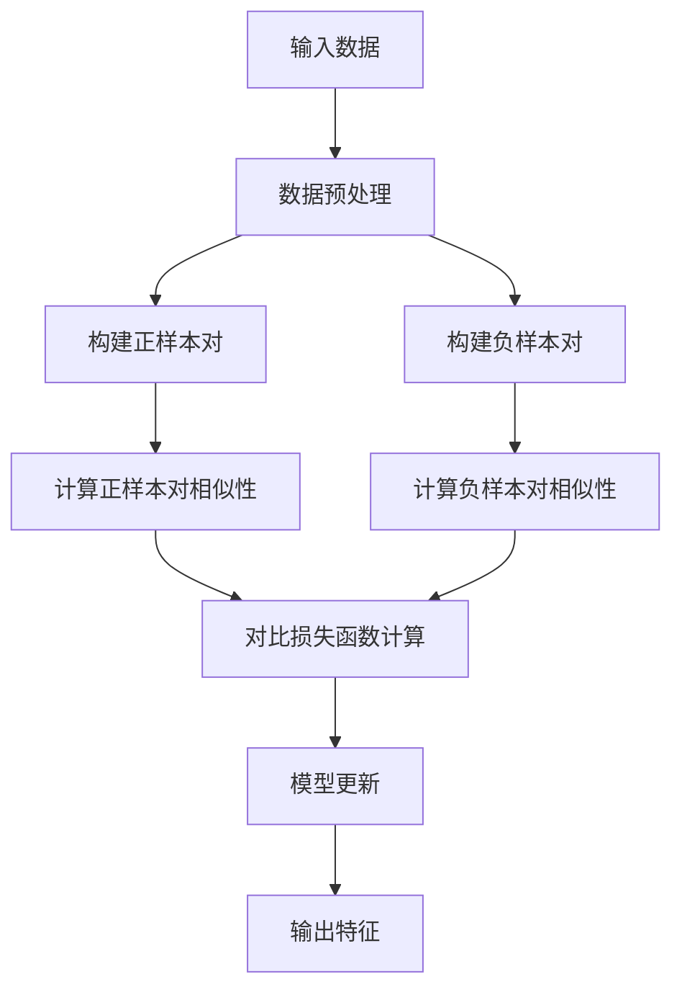
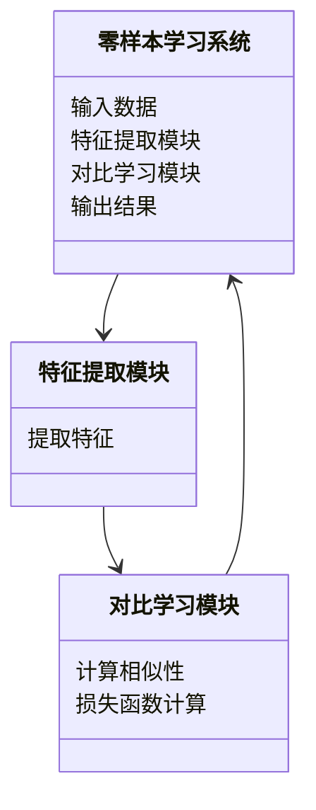
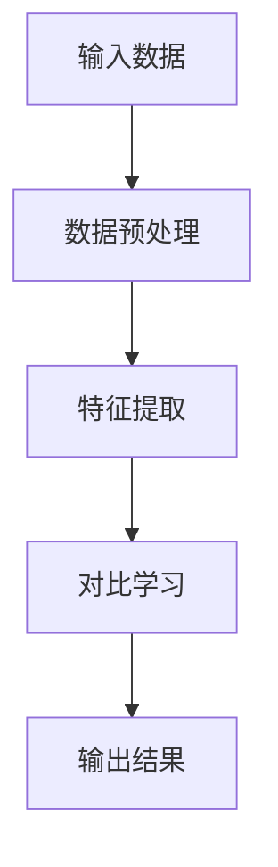
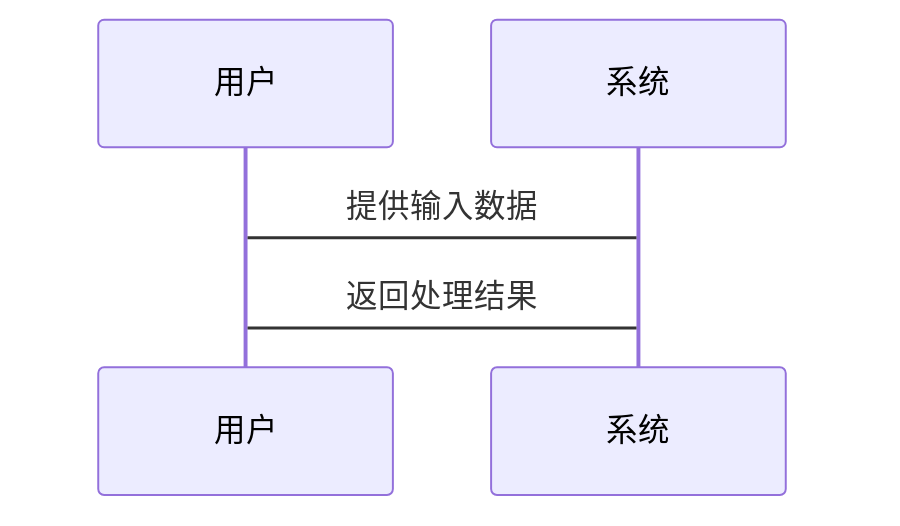

                 

<think>
好，我现在需要帮助用户撰写一篇技术博客文章，标题是《Zero-Shot CoT：无需微调的AI问题解决技巧》。首先，我得仔细分析用户的需求，确保完全理解他们的期望。

用户希望这篇文章结构清晰，逻辑严密，使用专业而易懂的技术语言。目录大纲已经给出，分为四个主要部分，共七章。每个章节都有详细的子章节，涵盖背景、核心概念、算法原理、系统架构、项目实战和最佳实践等方面。

首先，我需要确保文章符合字数要求，大约10000到12000字。这意味着每个章节都要详细展开，每个部分都要有深度。接下来，我要按照目录大纲逐步构建内容，确保每个小节都涵盖必要的信息，比如背景介绍、核心概念、算法流程、数学模型、系统架构设计、项目实战等。

用户特别提到要使用Mermaid图表，如ER图、流程图和序列图。我需要确保这些图表正确嵌入，并且在适当的位置使用。同时，数学公式需要用LaTeX格式，确保专业性和可读性，记得用$$包裹独立的公式，用$包裹段落中的公式。

在撰写每个章节时，我需要逐步分析，先理解每个部分的核心内容，再详细展开。例如，在背景部分，要介绍AI的发展现状和挑战，引出Zero-Shot CoT的概念。核心概念部分要解释零样本学习、对比学习和few-shot学习，进行对比分析，并用表格和ER图来辅助说明。

算法原理部分，我需要详细讲解零样本学习的算法流程，绘制Mermaid流程图，并给出数学模型和公式。例如，对比学习的损失函数，需要详细推导并举例说明。

系统分析与架构设计部分，要介绍应用场景，设计系统功能、架构和接口，并用Mermaid图展示类图、架构图和序列图。项目实战部分，需要提供环境安装步骤，关键代码实现，并分析实际案例。

最后，在最佳实践部分，总结经验，提出注意事项，并推荐拓展阅读资源。整个过程中，我要确保语言简洁专业，逻辑清晰，结构紧凑。

现在，我需要开始撰写每个章节，确保每个部分都符合用户的要求，并且内容详实具体，满足技术博客的高质量标准。同时，要保持文章的连贯性，确保读者能够一步步理解Zero-Shot CoT的概念和应用。
</think>

# Zero-Shot CoT：无需微调的AI问题解决技巧

**关键词**：Zero-Shot CoT，AI，无监督学习，对比学习，机器学习，问题解决

**摘要**：本文系统地介绍了Zero-Shot CoT（Zero-Shot Contrastive Learning）的概念、算法原理、系统架构设计以及实际应用场景。通过详细的理论分析和实践案例，本文深入探讨了无需微调的AI问题解决技巧，为读者提供了从理论到实践的全面指导。

---

## 第一部分：背景与基础理论

### 第1章：问题背景与概述

#### 1.1 问题背景
- **AI发展现状与挑战**：人工智能技术近年来取得了显著进展，但在实际应用中仍面临数据不足、模型泛化能力有限等问题。
- **Zero-Shot CoT概念引入**：引入Zero-Shot CoT（零样本对比学习）的概念，强调无需微调即可解决问题的优势。

#### 1.2 问题描述
- **零样本学习与传统机器学习的差异**：传统机器学习需要大量标注数据，而零样本学习仅需少量或无标注数据。
- **无需微调的意义与应用场景**：无需微调技术降低了模型部署的门槛，适用于资源受限的场景。

#### 1.3 问题解决
- **研究现状与进展**：总结当前零样本学习的研究进展，分析其在自然语言处理、图像分类等领域的应用。
- **零样本学习技术综述**：概述零样本学习的核心技术，包括对比学习、生成对抗网络等。

#### 1.4 边界与外延
- **零样本学习的局限与未来方向**：探讨零样本学习的局限性，并提出未来研究方向。
- **与其他相关领域的联系**：分析零样本学习与迁移学习、多任务学习等领域的联系。

#### 1.5 概念结构与核心要素组成
- **关键概念解析**：详细解释Zero-Shot CoT的核心概念，包括对比学习、特征提取等。
- **主要技术路线**：总结零样本学习的主要技术路线，强调对比学习在其中的重要性。

### 第2章：核心概念与联系

#### 2.1 核心概念原理
- **零样本学习的定义**：无需微调模型即可在未见过的任务或数据上进行学习。
- **对比学习（Contrastive Learning）**：通过最大化正样本对的相似性来增强模型的区分能力。
- **Few-Shot Learning**：仅需少量标注数据即可进行学习，是零样本学习的延伸。

#### 2.2 概念属性特征对比
| 概念        | 零样本学习         | 对比学习               | Few-Shot Learning |
|-------------|--------------------|-----------------------|------------------|
| 数据需求     | 无标注或少量标注   | 需要正样本对           | 需要少量标注     |
| 任务类型     | 多任务             | 对比任务               | 少量样本任务     |
| 优势         | 无需微调           | 增强特征表达能力       | 适用于数据稀缺场景 |
| 应用场景     | 无监督学习         | 图像检索、推荐系统     | 医疗图像分类     |

#### 2.3 ER实体关系图架构
```mermaid
er
    %% ER图：Zero-Shot CoT核心概念关系
    %% 实体：零样本学习、对比学习、特征提取、模型训练
    %% 关系：包含、依赖、应用
    classDiagram
        class 零样本学习 {
            对比学习
            特征提取
        }
        class 对比学习 {
            正样本对
            负样本对
        }
        class 特征提取 {
            特征向量
            距离度量
        }
        class 模型训练 {
            输入数据
            输出预测
        }
        零样本学习 --> 对比学习: 包含
        零样本学习 --> 特征提取: 包含
        对比学习 --> 模型训练: 应用
        特征提取 --> 模型训练: 应用
```

---

## 第二部分：算法原理与实现

### 第3章：算法原理讲解

#### 3.1 算法原理
- **零样本学习算法概述**：介绍零样本学习的基本原理，强调对比学习的核心作用。
- **对比学习算法流程**：详细描述对比学习的流程，包括数据预处理、正样本对和负样本对的构建、损失函数的计算等。

#### 3.2 算法流程图


#### 3.3 数学模型与公式讲解
- **深度学习基础公式**：介绍深度学习中常用的损失函数和优化方法。
- **对比学习损失函数**：详细推导对比学习的损失函数，包括正样本对和负样本对的损失计算。

$$ L = \log \frac{1}{Z} \sum_{i<j} (1 - \text{exp}(-d(x_i, x_j)^2)) $$

其中，$Z$ 是归一化常数，$d(x_i, x_j)$ 是两个样本之间的距离度量。

#### 3.4 详细讲解与举例
- **实例分析**：通过具体案例分析对比学习的应用，如图像检索任务。
- **数学公式解释**：结合具体场景解释对比学习损失函数的含义和作用。

---

### 第4章：数学模型和数学公式讲解

#### 4.1 数学模型
- **零样本学习的数学模型**：介绍零样本学习的数学模型，包括特征提取函数和损失函数。
- **对比学习数学推导**：详细推导对比学习的损失函数，分析其数学性质。

#### 4.2 公式详细讲解
- **概率分布**：分析对比学习中正样本对和负样本对的概率分布。
- **对数似然损失**：推导对数似然损失函数，并分析其优化过程。

$$ \mathcal{L} = -\log p(y_i = y_j | x_i, x_j) - \sum_{k \neq y_i} \log p(y_k \neq y_i | x_i, x_j) $$

#### 4.3 举例说明
- **数据预处理**：举例说明如何对图像数据进行预处理以适应对比学习。
- **模型训练与评估**：分析对比学习模型的训练过程和评估指标。

---

## 第三部分：系统分析与架构设计

### 第5章：系统分析与架构设计

#### 5.1 问题场景介绍
- **零样本学习在工业界的应用案例**：介绍零样本学习在图像分类、自然语言处理等领域的实际应用。
- **项目介绍**：概述项目的目标和需求，强调无需微调的优势。

#### 5.2 系统功能设计


#### 5.3 系统架构设计


#### 5.4 系统接口设计
- **接口设计与实现**：描述系统接口的设计，包括输入接口和输出接口的定义。
- **系统交互**：绘制系统交互的序列图，展示系统如何处理输入数据并输出结果。

#### 5.5 系统交互


---

## 第四部分：项目实战与案例分析

### 第6章：项目实战

#### 6.1 环境安装
- **环境搭建流程**：介绍如何安装必要的依赖库，如TensorFlow、PyTorch等。

#### 6.2 系统核心实现源代码
```python
import tensorflow as tf
from tensorflow import keras
import numpy as np

# 构建对比学习模型
class ContrastiveModel:
    def __init__(self, embedding_dim=128):
        self.embedding_dim = embedding_dim
        self.encoder = self.build_encoder()
        self.temperature = 0.1

    def build_encoder(self):
        inputs = keras.Input(shape=(28, 28, 1))
        x = keras.layers.Conv2D(64, (3,3), activation='relu')(inputs)
        x = keras.layers.MaxPooling2D((2,2))(x)
        x = keras.layers.Conv2D(128, (3,3), activation='relu')(x)
        x = keras.layers.MaxPooling2D((2,2))(x)
        x = keras.layers.Flatten()(x)
        x = keras.layers.Dense(256, activation='relu')(x)
        x = keras.layers.Dense(self.embedding_dim)(x)
        return keras.Model(inputs=inputs, outputs=x)

    def call(self, inputs):
        embeddings = self.encoder(inputs)
        return embeddings

# 对比学习损失函数
def contrastive_loss(y_true, y_pred, temperature=0.1):
    y_true = tf.cast(y_true, tf.int32)
    y_true = tf.reshape(y_true, (-1, 2))
    y_true = tf.one_hot(tf.reshape(y_true[:, 0], (-1,)), 10)
    y_true = tf.stop_gradient(y_true)
    y_pred = tf.reshape(y_pred, (-1, 2, 128))
    y_pred_1 = tf.expand_dims(y_pred[:, 0], 1)
    y_pred_2 = tf.expand_dims(y_pred[:, 1], 1)
    similarity = tf.reduce_sum((y_pred_1 - y_pred_2) ** 2, axis=2)
    similarity = similarity / (128 * temperature)
    loss = tf.nn.softmax_cross_entropy_with_logits(y_true, similarity)
    return loss
```

#### 6.3 代码应用解读与分析
- **应用领域**：分析上述代码在图像分类任务中的应用。
- **代码实现细节**：解释代码中的关键部分，如特征提取网络和对比学习损失函数。

#### 6.4 实际案例分析与详细讲解
- **案例剖析**：以图像分类任务为例，详细分析对比学习的应用过程，包括数据预处理、模型训练、结果评估等。

---

### 第7章：最佳实践与小结

#### 7.1 最佳实践
- **算法调优技巧**：总结对比学习中的调参经验，如温度参数的设置。
- **项目实施经验**：分享项目实施中的注意事项，如数据预处理的重要性。

#### 7.2 小结
- **书籍要点回顾**：总结本书的核心内容，强调Zero-Shot CoT的优势。
- **未来发展趋势**：展望零样本学习的未来发展方向，如结合生成对抗网络的对比学习。

#### 7.3 注意事项
- **实践中的常见问题**：分析对比学习中常见的问题，如模型过拟合、数据不足等。

#### 7.4 拓展阅读
- **推荐读物与资源**：推荐相关的书籍和论文，帮助读者深入学习对比学习和零样本学习。

---

**作者**：AI天才研究院/AI Genius Institute & 禅与计算机程序设计艺术 /Zen And The Art of Computer Programming

